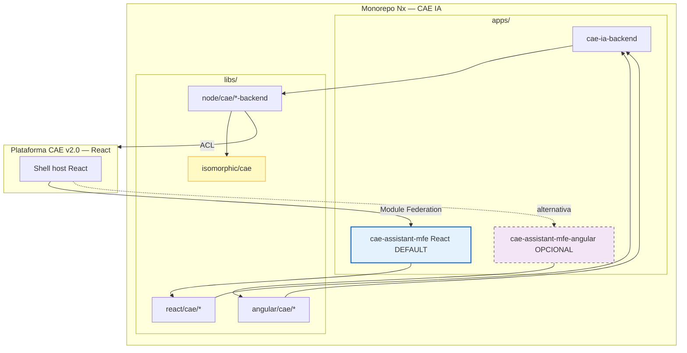
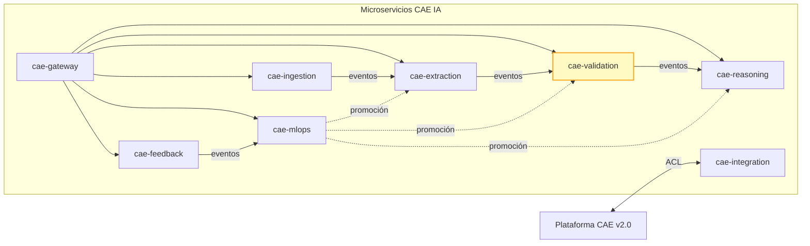
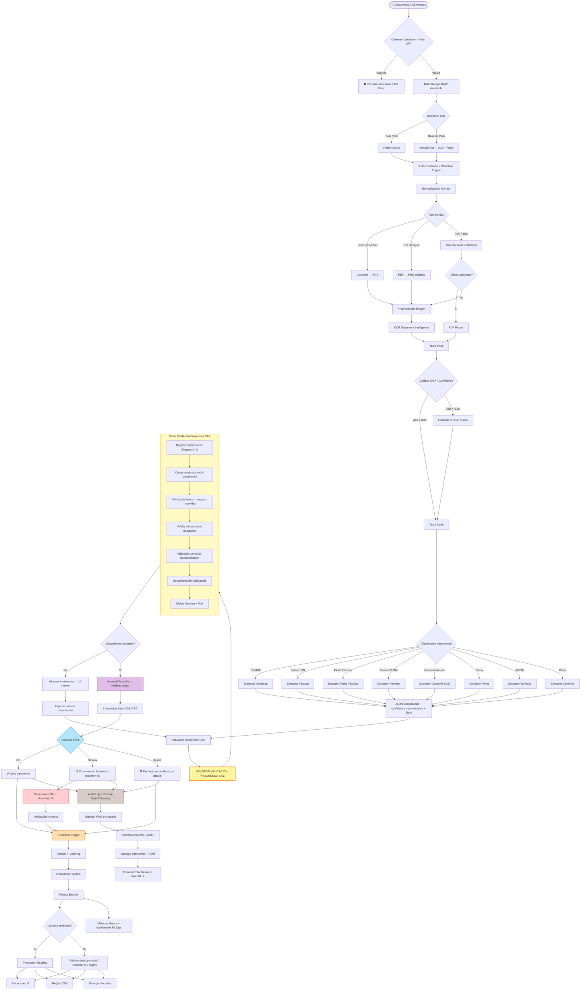
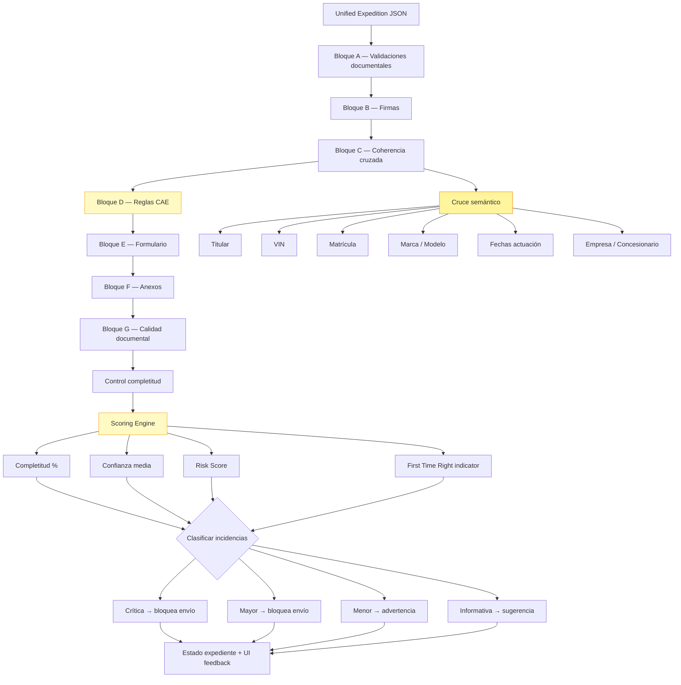
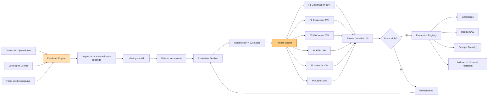
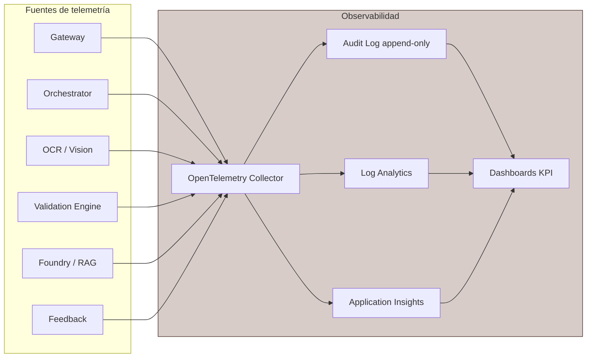
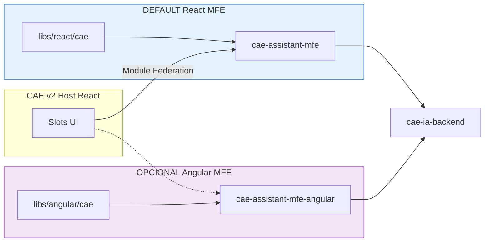

# SISTEMA DE ASISTENCIA INTELIGENTE PARA PLATAFORMA CAE

## Diagrama maestro de arquitectura — Visión funcional + Técnica E2E

| Campo | Valor |
|-------|-------|
| **Versión diagrama** | 3.0 |
| **Fecha** | 03/07/2026 |

> Este fichero es la **referencia visual oficial** del proyecto. Los documentos funcional y técnico derivan de aquí.
>
> **PNG exportado:** [`ARQUITECTURA-CAE-IA.png`](ARQUITECTURA-CAE-IA.png) — diagrama maestro combinado (visión funcional + arquitectura técnica E2E + MLOps/Fitness + hexagonal/DDD/microservicios + monorepo Nx + MFE React/Angular).
> PNGs individuales en [`diagrams/`](diagrams/): `01-vision-funcional.png`, `02-arquitectura-tecnica-e2e.png`, `03-mlops-fitness.png`, `04-hexagonal-microservicios.png`, `05-monorepo-nx-cae.png`, `06-mfe-react-angular.png`.

---

## Leyenda de fases

| Color | Fase | Alcance |
|-------|------|---------|
| 🔵 Azul claro | **Ingesta** | Gateway, auth, idempotencia |
| 🔵 Azul | **Extracción** | Blob RAW, OCR, clasificación, JSON |
| 🟡 Amarillo | **Validación progresiva** | Motor CAE, cruces, completitud — **NÚCLEO** |
| 🟣 Púrpura | **Razonamiento IA** | Orchestrator, Foundry, RAG |
| 🔷 Azul oscuro | **Decisión** | OK / Review / Reject pre-envío |
| 🔴 Rojo | **Humano** | Operaciones, supervisor |
| 🟠 Naranja | **MLOps + Fitness** | Feedback, labeling, dataset, evaluación, fitness, promoción/rollback |
| 🟤 Beige | **Observabilidad** | Transversal — audit, tracing, KPIs |

**Principios transversales:** API First · Hexagonal · DDD · Libs first · Deploy elástico · Microfrontend CAE v2 · Human in the Loop · Observabilidad

---

## 0. Paradigma arquitectónico

La capa de asistencia inteligente se implementará con:

| Paradigma | Aplicación en el proyecto |
|-----------|---------------------------|
| **Arquitectura hexagonal** | Puertos y adaptadores en cada lib; dominio aislado de frameworks cloud |
| **DDD** | Bounded contexts en `libs/isomorphic/cae/core` |
| **Monorepo Nx** | `libs/` reutilizables + `apps/` compositores |
| **Deploy elástico** | Monolito modular (`apps/cae-ia-backend`) → microservicios según demanda |
| **UI React (default)** | CAE v2 es React; MFE principal en `apps/cae-assistant-mfe` |
| **UI Angular (opcional)** | MFE alternativo `apps/cae-assistant-mfe-angular` |

### 0.1 Situación actual vs objetivo

| | Plataforma CAE v2.0 (hoy) | Capa IA CAE (objetivo) |
|---|---------------------------|------------------------|
| Estructura | Monolito / acoplado | `libs/` Nx independientes |
| Backend | Core CAE propietario | `libs/node/cae/*-backend` + ACL |
| Frontend host | **React** | Sin sustituir shell; MFE embebido |
| UI IA | — | **React default** + Angular opcional |
| Despliegue | Single app | Monolito IA → microservicios opcional |

---

## 1. VISIÓN FUNCIONAL COMPLETA (10 fases)

```mermaid
flowchart LR
    subgraph P1["① FRONTEND — ASISTENCIA CONTINUA"]
        direction TB
        P1A["Cliente crea expediente"]
        P1B["Sube documentos PDF / imagen"]
        P1C["Feedback inmediato IA"]
        P1D["% completitud + incidencias"]
        P1A --> P1B --> P1C --> P1D
    end

    subgraph P2["②③④ INGESTA + EXTRACCIÓN"]
        direction TB
        P2A["Gateway + Auth + Idempotencia"]
        P2B["Blob Storage RAW inmutable"]
        P2C["Preprocesado + OCR"]
        P2D["Document Intelligence"]
        P2E["Fallback GPT-4o Vision"]
        P2F["Clasificación documental"]
        P2G["Extracción estructurada"]
        P2H["JSON + confidence score"]
        P2A --> P2B --> P2C --> P2D
        P2C --> P2E
        P2D --> P2F --> P2G --> P2H
        P2E --> P2F
    end

    subgraph P3["⑤ VALIDACIÓN PROGRESIVA CAE — CORE"]
        direction TB
        P3A["Validation Engine + Reglas CAE"]
        P3B["Cruce semántico entre docs"]
        P3C["Titular · VIN · Matrícula · Fechas · Empresa"]
        P3D["Control de completitud"]
        P3E{"¿Incidencias?"}
        P3F["🔴 Crítica — bloquea envío"]
        P3G["🟠 Mayor — advertencia + corrección"]
        P3H["🟡 Menor — mejora calidad"]
        P3I["Feedback cliente tiempo real"]
        P3A --> P3B --> P3C --> P3D --> P3E
        P3E --> P3F & P3G & P3H --> P3I
    end

    subgraph P4["⑥ RAZONAMIENTO IA AVANZADO"]
        direction TB
        P4A["AI Orchestrator"]
        P4B["Azure AI Foundry"]
        P4C["RAG — Knowledge Base CAE"]
        P4D["Normativa · checklists · casuísticas"]
        P4E["Análisis global expediente"]
        P4F["Resumen ejecutivo + Risk Score"]
        P4A --> P4B --> P4C --> P4D
        P4B --> P4E --> P4F
    end

    subgraph P5["⑦ VALIDACIÓN FINAL Y DECISIÓN"]
        direction TB
        P5A{"Decision Engine pre-envío"}
        P5B["✅ OK — listo para envío"]
        P5C["🔍 Review — cola humana + resumen IA"]
        P5D["❌ Reject — detalle incidencias"]
        P5A --> P5B & P5C & P5D
    end

    subgraph P6["⑧ REVISIÓN OPERACIONES"]
        direction TB
        P6A["Resumen IA incidencias priorizadas"]
        P6B["Supervisor CAE"]
        P6C["Asistente IA Operaciones"]
        P6D["Validación humana final"]
        P6A --> P6B --> P6C --> P6D
    end

    subgraph P7["⑨ FEEDBACK + MLOps + FITNESS"]
        direction TB
        P7A["Feedback Engine"]
        P7B["Registro correcciones + etiquetas"]
        P7C["Dataset versionado + Labeling"]
        P7D["Evaluation Pipeline + Golden set"]
        P7E["Fitness Engine F1-F6"]
        P7F["Promoción / Rollback Registry"]
        P7A --> P7B --> P7C --> P7D --> P7E --> P7F
        P7F -.->|Mejora| P2
    end

    P1 --> P2 --> P3 --> P4 --> P5 --> P6 --> P7

    subgraph P8["⑩ OBSERVABILIDAD + AUDITORÍA — TRANSVERSAL"]
        direction LR
        P8A["Audit Log completo"] --> P8B["Trazabilidad E2E"]
        P8B --> P8C["Monitorización + alertas"]
        P8C --> P8D["KPIs + Dashboards"]
    end

    P8 -.-> P1 & P2 & P3 & P4 & P5 & P6 & P7

    style P1 fill:#e3f2fd,stroke:#1565c0
    style P2 fill:#bbdefb,stroke:#0d47a1
    style P3 fill:#fff9c4,stroke:#f9a825,stroke-width:3px
    style P4 fill:#e1bee7,stroke:#6a1b9a
    style P5 fill:#b3e5fc,stroke:#0277bd
    style P6 fill:#ffcdd2,stroke:#c62828
    style P7 fill:#ffe0b2,stroke:#e65100
    style P8 fill:#d7ccc8,stroke:#4e342e
```

### Detalle por fase funcional

| # | Fase | Entrada | Salida | Actor principal |
|---|------|---------|--------|-----------------|
| 1 | Frontend asistido | Acción usuario | Upload + feedback UI | Cliente |
| 2-4 | Ingesta + Extracción | Archivo binario | JSON estructurado + confidence | Sistema IA |
| 5 | **Validación progresiva** | JSON expediente | Incidencias + scoring + completitud | Sistema IA |
| 6 | Razonamiento IA | Expediente + incidencias | Resumen, explicaciones, risk score | Azure AI Foundry |
| 7 | Decisión final | Validación completa | OK / Review / Reject | Decision Engine |
| 8 | Revisión Operaciones | Expediente en cola | Aprobado / Devuelto / Rechazado | Operaciones |
| 9 | Feedback + MLOps + Fitness | Correcciones humanas | Dataset, fitness, promoción modelos | Sistema |
| 10 | Observabilidad | Todos los eventos | Logs, métricas, dashboards | Transversal |

---

## 2. ARQUITECTURA TÉCNICA — FLUJO COMPLETO E2E

---

## 3. MOTOR VALIDACIÓN PROGRESIVA CAE (detalle)

---

## 4. Bucle MLOps, Fitness y Feedback

### Modelo de fitness (resumen técnico)

| Componente | Peso | Fuente |
|------------|------|--------|
| F₁ Clasificación | 15% | F1-score clasificador documental |
| F₂ Extracción | 25% | Exactitud campos clave (golden set) |
| F₃ Validación | 25% | Recall + precisión incidencias |
| F₄ FTR | 15% | First Time Right producción |
| F₅ Latencia | 10% | P95 análisis documento |
| F₆ Coste | 10% | Coste medio por expediente |

**Promoción:** fitness candidato ≥ activo + 1; regresión F₂/F₃ ≤ 1 pt; recall críticas ≥ 98%.
**Rollback:** si fitness producción cae > 2% respecto versión activa.

---

## 5. Capa de observabilidad transversal

### Métricas monitorizadas

| Categoría | Métricas |
|-----------|----------|
| Latencia | OCR, Vision fallback, reglas, Foundry, E2E documento, E2E expediente |
| Coste | Por documento, por expediente, por llamada Foundry |
| Calidad | Precisión clasificación, extracción, recall incidencias, **fitness global** |
| Negocio | FTR, incidencias pre-envío, devoluciones, tiempo revisión |
| Infra | DLQ depth, error rate, disponibilidad |

---

## 6. Mapa fase funcional ↔ componente técnico

| Fase funcional | Componentes técnicos |
|----------------|---------------------|
| ① Frontend | UI CAE, WebSocket/SSE, panel incidencias, auto-fill |
| ② Gateway | Edge Gateway, JWT Entra ID, idempotency Redis |
| ③ Blob RAW | Azure Blob Storage, hash SHA-256, WORM |
| ④ Extracción | Preprocessing, Document Intelligence, GPT-4o Vision, Classifier, Workers |
| ⑤ Validación progresiva | Validation Engine, reglas A–G, cruces, scoring |
| ⑥ Razonamiento IA | AI Orchestrator, Azure AI Foundry, AI Search RAG |
| ⑦ Decisión | Decision Engine |
| ⑧ Operaciones | Cola revisión, resumen IA, UI supervisor |
| ⑨ MLOps + Fitness | Feedback Engine, Labeling, Dataset, Evaluation, Fitness Engine, Registry |
| ⑩ Observabilidad | OpenTelemetry, Audit Log, dashboards |
| **Implementación** | Monorepo Nx: `libs/isomorphic/cae`, `libs/node/cae`, `libs/react/cae` (+ `libs/angular/cae` opc.), `apps/cae-ia-backend`, MFE React default |

---

## 7. Mapa objetivo monorepo Nx

| Capa | Ruta objetivo | Rol |
|------|---------------|-----|
| Dominio DDD | `libs/isomorphic/cae/core` | Agregados, reglas RF, eventos |
| Contratos | `libs/isomorphic/cae/api` | OpenAPI, DTOs |
| Backend IA | `libs/node/cae/*-backend` | NestJS modules hexagonales |
| UI React (default) | `libs/react/cae/feature-*` | Paneles para host CAE v2 (React) |
| UI Angular (opc.) | `libs/angular/cae/feature-*` | Misma funcionalidad; stack alternativo |
| Host backend | `apps/cae-ia-backend` | Monolito modular IA (Modo A) |
| MFE React (default) | `apps/cae-assistant-mfe` | Remote → shell CAE v2 |
| MFE Angular (opc.) | `apps/cae-assistant-mfe-angular` | Remote alternativo |

| Modo despliegue | Composición | Cuándo |
|-----------------|-------------|--------|
| A — Monolito modular | Solo `cae-ia-backend` | MVP, integración CAE, baja carga |
| B — Híbrido | Monolito + 1–2 servicios | Picos aislados (p. ej. MLOps) |
| C — Microservicios | Un `apps/cae-*-service` por lib backend | Alta escala |

### 7.1 Integración UI: React vs Angular

1. Abrir [mermaid.live](https://mermaid.live)
2. Pegar el bloque Mermaid deseado
3. Exportar PNG o SVG
4. Usar en presentaciones o anexar a los PDFs de especificación

---

*Diagrama maestro v3.0 — Sistema de Asistencia Inteligente CAE.*
