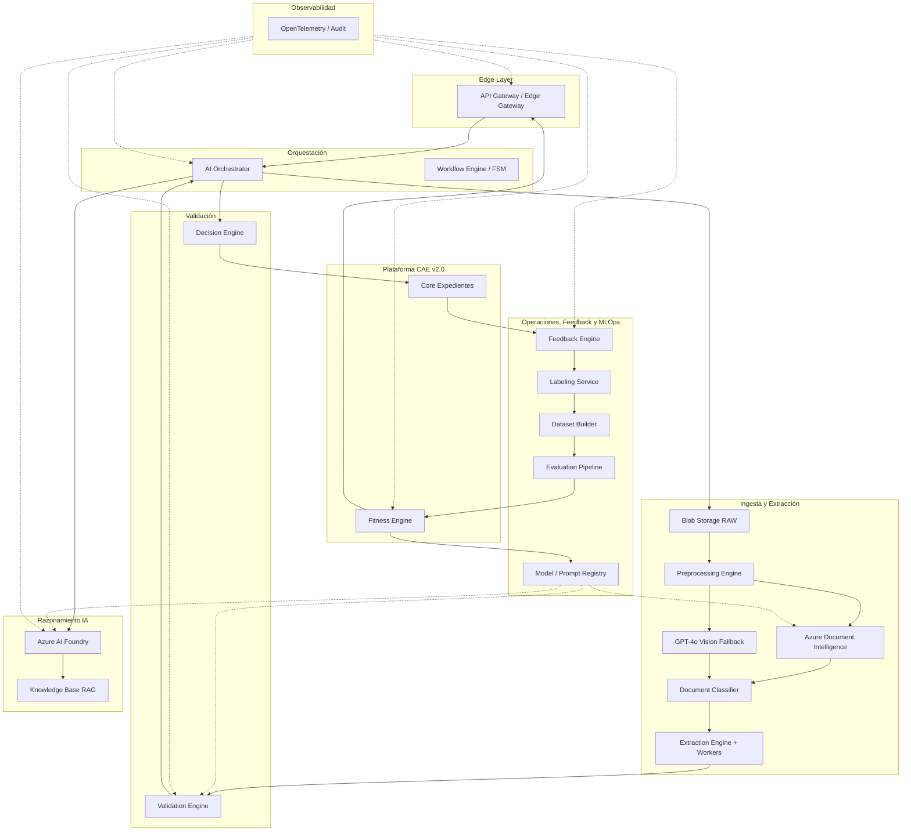
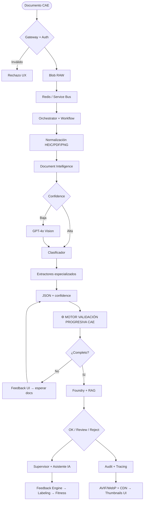
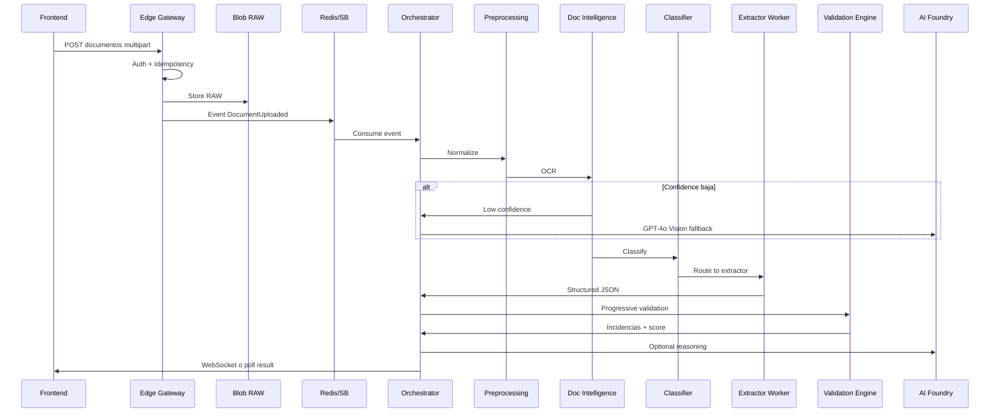
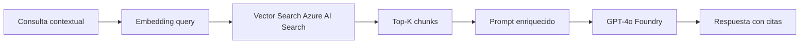
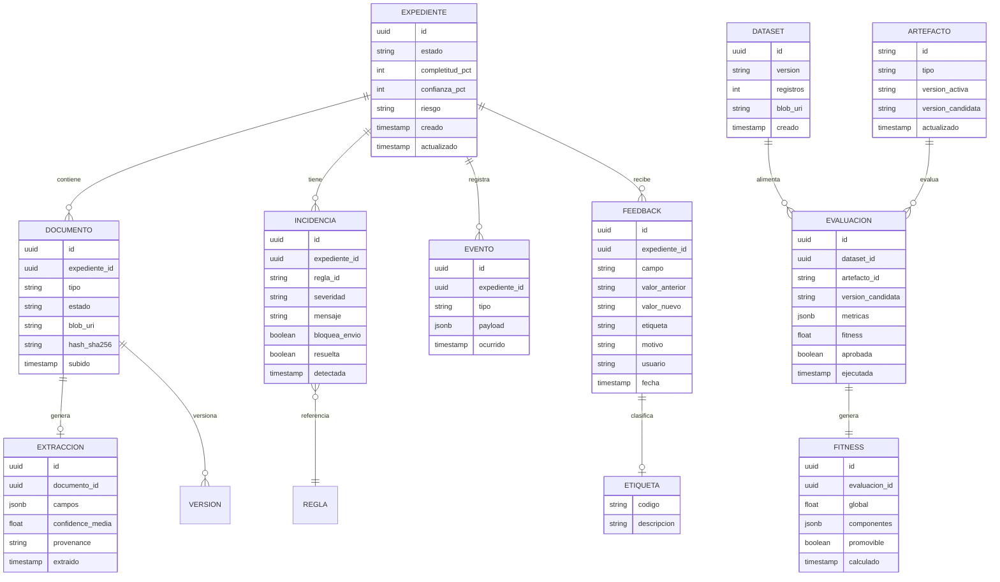
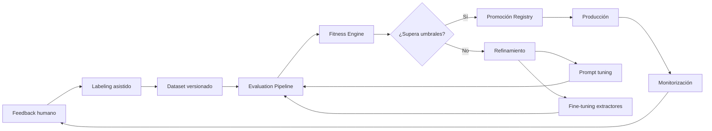
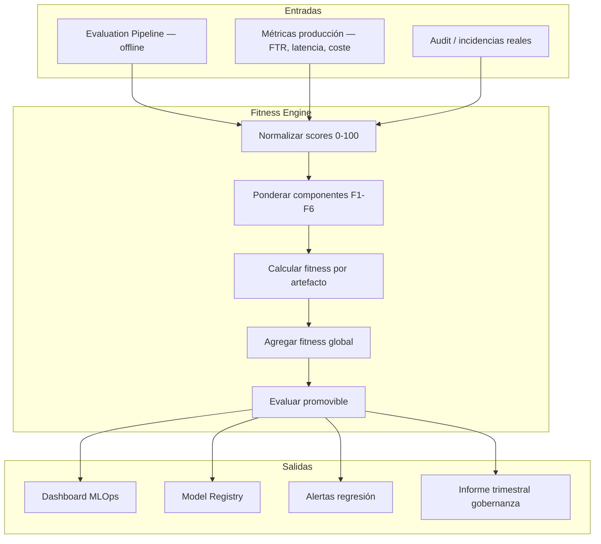
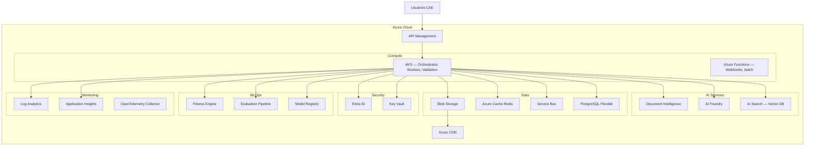

# DISEÑO TÉCNICO DE REFERENCIA

## SISTEMA DE ASISTENCIA INTELIGENTE PARA PLATAFORMA CAE v3.0

| Campo | Valor |
|-------|-------|
| **Versión** | 3.0 |
| **Estado** | Borrador para revisión |
| **Fecha** | 03/07/2026 |
| **Proyecto** | Plataforma CAE v2.0 — Desarrollo IA |
| **Clasificación** | Confidencial — IDEAUTO / Babooni |

---

## Histórico de revisiones

| Rev. | Fecha | Naturaleza del cambio |
|------|-------|------------------------|
| 0 | 27/06/2026 | Primera versión del documento (Borrador) |
| 1 | 03/07/2026 | Arquitectura por fases end-to-end, componentes, flujos, modelo de datos, eventos, APIs, seguridad, observabilidad |
| 2 | 03/07/2026 | MLOps completo, Fitness Engine, golden set, criterios promoción/rollback, APIs evaluación, entidades de datos y KPIs de fitness |

---

## Índice de contenidos

1. [Objetivo técnico](#1-objetivo-técnico)
2. [Principios de arquitectura](#2-principios-de-arquitectura)
3. [Arquitectura general](#3-arquitectura-general)
4. [Arquitectura por fases (end-to-end)](#4-arquitectura-por-fases-end-to-end)
5. [Componentes principales](#5-componentes-principales)
6. [Pipeline documental](#6-pipeline-documental)
7. [Validation Engine](#7-validation-engine)
8. [Azure AI Foundry y Knowledge Base](#8-azure-ai-foundry-y-knowledge-base)
9. [Flujos técnicos](#9-flujos-técnicos)
10. [Modelo de IA](#10-modelo-de-ia)
11. [Modelo de datos](#11-modelo-de-datos)
12. [Modelo de eventos](#12-modelo-de-eventos)
13. [APIs](#13-apis)
14. [Colas y orquestación](#14-colas-y-orquestación)
15. [Seguridad](#15-seguridad)
16. [Observabilidad](#16-observabilidad)
17. [MLOps y Feedback Engine](#17-mlops-y-feedback-engine)
18. [Fitness Engine y evaluación](#18-fitness-engine-y-evaluación)
19. [Despliegue Azure](#19-despliegue-azure)
20. [KPIs técnicos](#20-kpis-técnicos)
21. [Visión final](#21-visión-final)

---

## 1. Objetivo técnico

Definir la arquitectura tecnológica de referencia para la incorporación de capacidades de **Inteligencia Artificial de asistencia continua** dentro de la plataforma CAE v2.0.

La arquitectura deberá:

- Ser **escalable** horizontalmente (workers, colas, inferencia stateless).
- **Desacoplar** completamente las capacidades IA del núcleo CAE.
- Mantener **trazabilidad completa** del expediente (audit log end-to-end).
- Permitir la **evolución independiente** de modelos, reglas y prompts.
- Garantizar **explicabilidad** y supervisión humana (Human in the Loop).
- Implementar **validación progresiva** como pipeline reactivo a eventos.
- Minimizar vendor lock-in mediante abstracciones API-first.
- Soportar **observabilidad** de costes, latencia y calidad IA.

---

## 2. Principios de arquitectura

| ID | Principio | Implementación |
|----|-----------|----------------|
| PA-01 | **API First** | Toda funcionalidad IA consumible vía REST/OpenAPI. Sin acceso directo a BD desde componentes IA. |
| PA-02 | **Desacoplamiento** | CAE es propietario del expediente; servicios IA son auxiliares stateless. |
| PA-03 | **Stateless** | Workers de inferencia sin estado; persistencia en Blob, Redis, PostgreSQL/Cosmos. |
| PA-04 | **Human in the Loop** | Decision Engine recomienda; nunca aprueba automáticamente. |
| PA-05 | **Observabilidad** | OpenTelemetry, audit log, métricas por componente y coste IA. |
| PA-06 | **Idempotencia** | Reintentos seguros en ingesta y procesamiento documental. |
| PA-07 | **Separación de capas** | Extracción ≠ Validación determinista ≠ Razonamiento generativo. |

---

## 3. Arquitectura general

### 3.1 Vista lógica de alto nivel



---

## 4. Arquitectura por fases (end-to-end)

Arquitectura alineada con el **modelo de 10 fases** del sistema de asistencia inteligente CAE.

### 4.0 Flujo técnico E2E (resumen)



### 4.1 Motor Validación Progresiva CAE (componente central)

El **Motor Validación Progresiva CAE** es el núcleo técnico del sistema. Se ejecuta tras cada extracción o modificación de datos.

| Submódulo | Responsabilidad |
|-----------|-----------------|
| Reglas deterministas | Bloques A–G (RF-001 a RF-030), versionadas en Git |
| Cruce semántico | Join multi-documento: titular, VIN, matrícula, fechas, empresa |
| Validación fechas/vigencias | RF-019, antigüedad VO (API IDEAUTO) |
| Validación vehículo-documentación | Coherencia VO/VN, combustible, homologación |
| Documentación obligatoria | Checklist por tipología expediente |
| Global Scoring + Risk | Completitud, confianza, riesgo, FTR |
| Clasificador incidencias | Crítica / Mayor / Menor / Informativa |

**Entrada:** Unified Expedition JSON (datos extraídos + formulario CAE).
**Salida:** Incidencias[], scoring{}, estadoExpediente, bloqueaEnvio: boolean.

**Latencia objetivo:** < 3 s (reglas deterministas); < 10 s (con Foundry opcional).

### 4.2 Pipeline de ingesta y extracción

| Etapa | Tecnología | Notas |
|-------|------------|-------|
| Gateway | API Management / Edge Gateway | JWT Entra ID, idempotency Redis |
| Blob RAW | Azure Blob Storage | Inmutable, SHA-256, versionado |
| Colas | Redis (fast) + Service Bus (reliable) | DLQ, retry exponencial |
| Normalización | Preprocessing Engine | HEIC/JPG/PNG/PDF → PNG normalizado |
| OCR primario | Azure Document Intelligence | Layout + custom models |
| OCR fallback | GPT-4o Vision (Foundry) | Si confidence < 0.85 |
| Clasificación | DI classifier + reglas | Routing a extractor |
| Extracción | Workers especializados | Ver tabla 4.3 |

### 4.3 Extractores especializados CAE

| Extractor | Tipos documentales | Campos clave |
|-----------|-------------------|--------------|
| Identidad | DNI, NIE | Nombre, NIF, dirección, firma |
| Factura | Factura VN | Titular, VIN, matrícula, marca, modelo |
| Ficha Técnica | Ficha VN/VO | VIN, energía, categoría, masa |
| Permiso | Permiso circulación, IVTM | Titular, matrícula, ejercicio |
| Vehículo VO/VN | Sustitución, baja, contrato | Fechas, titular, identificación |
| Convenio CAE | Convenio, anexo, autorización | Firma, contraprestación €/kWh |
| Firma | Todos los firmables | Detección, comparación DNI |
| Genérico | No clasificado | Extracción best-effort |

### 4.4 Decisión final y revisión humana

| Resultado | Condición técnica | Destino |
|-----------|-------------------|---------|
| **OK** | Sin incidencias críticas/mayores; completitud 100% | Permite envío a Operaciones |
| **Review** | Incidencias menores o baja confidence global | Cola revisión + resumen IA |
| **Reject** | Incidencias críticas/mayores abiertas | Bloqueo + detalle al cliente |

> **Importante:** OK no es aprobación automática. La validación humana en Operaciones (Fase 8) es obligatoria para aprobación definitiva.

### 4.5 Capa observabilidad y entrega UI

Flujo transversal post-procesamiento:

```
Audit Log → OpenTelemetry Tracing → Guardar PNG procesado
         → Optimización AVIF/WebP → CDN → Frontend Thumbnails + Auto-fill UI
```

| Componente | Función |
|------------|---------|
| Audit Log | Append-only: prompts, respuestas, decisiones, correcciones |
| OpenTelemetry | Tracing E2E con correlation-id |
| PNG procesado | Versión normalizada para revisión |
| AVIF/WebP | Optimización para CDN |
| Thumbnails | Preview documentos en UI cliente |
| Auto-fill UI | Campos rellenados desde JSON extracción |

### 4.6 Mapa fase funcional ↔ técnica

| Fase funcional | Componentes técnicos |
|----------------|---------------------|
| ① Frontend | UI CAE, SSE/WebSocket, panel incidencias |
| ②–④ Ingesta + Extracción | Gateway, Blob, OCR, Vision, Classifier, Workers |
| ⑤ Validación progresiva | **Motor Validación Progresiva CAE** |
| ⑥ Razonamiento IA | Orchestrator, Foundry, AI Search RAG |
| ⑦ Decisión | Decision Engine |
| ⑧ Operaciones | Cola revisión, UI supervisor, asistente IA |
| ⑨ MLOps | Feedback Engine, Labeling, Dataset, Fitness Engine, Evaluation, Registry |
| ⑩ Observabilidad | OpenTelemetry, Audit, dashboards |

---

## 5. Componentes principales

### 5.1 Edge Gateway

| Atributo | Detalle |
|----------|---------|
| **Responsabilidad** | Punto de entrada único para servicios IA |
| **Funciones** | Autenticación JWT (Entra ID), rate limiting, idempotency key, validación schema, trazabilidad request-id |
| **Entrada** | HTTP/REST + multipart upload |
| **Salida** | Request enrutado a Orchestrator o respuesta cached |
| **Dependencias** | Redis (idempotency), Key Vault (secrets) |
| **Escalabilidad** | Horizontal, stateless |
| **Errores** | 401/403 auth, 429 rate limit, 409 duplicate |

### 5.2 Blob Storage RAW

| Atributo | Detalle |
|----------|---------|
| **Responsabilidad** | Almacenamiento inmutable del documento original |
| **Funciones** | Versionado, WORM lógico, hash SHA-256, metadata expediente |
| **Entrada** | Archivo binario post-validación gateway |
| **Salida** | URI + hash + metadata |
| **Dependencias** | Azure Blob Storage |
| **Auditoría** | Toda versión documental trazable |

### 5.3 Preprocessing Engine

| Atributo | Detalle |
|----------|---------|
| **Responsabilidad** | Normalización de formatos e imagen |
| **Funciones** | HEIC/JPG/PNG → PNG, PDF split, mejora contraste, deskew, denoise |
| **Entrada** | Blob URI |
| **Salida** | Páginas normalizadas listas para OCR |
| **Dependencias** | Blob, ImageMagick/libvips o equivalente |

### 5.4 Document Classifier

| Atributo | Detalle |
|----------|---------|
| **Responsabilidad** | Detectar tipo documental y asignar extractor |
| **Entrada** | Texto OCR + metadata imagen |
| **Salida** | `{ tipo: "factura_vn", confidence: 0.96, extractor: "extractor-factura" }` |
| **Modelos** | Document Intelligence custom classifier + reglas fallback |

### 5.5 Extraction Engine + Workers IA

Workers especializados alineados con el clasificador documental del flujo E2E:

| Worker | Documentos | Routing clasificador |
|--------|------------|---------------------|
| Extractor Identidad | DNI, NIE | `CLASS → Identidad` |
| Extractor Factura | Factura VN | `CLASS → Factura VN` |
| Extractor Ficha Técnica | Ficha técnica VN/VO | `CLASS → Ficha Técnica` |
| Extractor Permiso | Permiso circulación, IVTM | `CLASS → Permiso/IVTM` |
| Extractor Vehículo | Sustitución VO, baja, contrato | `CLASS → VO/VN` |
| Extractor Convenio CAE | Convenio, anexo, autorización datos | `CLASS → Convenio` |
| Extractor Firma | Detección y comparación firmas | `CLASS → Firma` |
| Extractor Genérico | No clasificado / fallback | `CLASS → Otros` |

**Salida estándar:**

```json
{
  "documentoId": "doc-abc123",
  "tipo": "factura_vn",
  "campos": {
    "vin": { "valor": "VF1ABC12345678901", "confidence": 0.97, "bbox": [120, 340, 400, 360] },
    "titular": { "valor": "GARCIA LOPEZ, JUAN", "confidence": 0.95, "bbox": null },
    "matricula": { "valor": "1234ABC", "confidence": 0.98, "bbox": [80, 200, 180, 220] }
  },
  "provenance": "document-intelligence",
  "timestamp": "2026-07-03T10:15:00Z"
}
```

### 5.6 Motor Validación Progresiva CAE (Validation Engine)

| Atributo | Detalle |
|----------|---------|
| **Responsabilidad** | **Núcleo técnico** — motor determinista de reglas CAE + cruces + scoring |
| **Funciones** | Reglas RF-001 a RF-030, cruces semánticos, completitud, scoring, severidades, validación progresiva reactiva |
| **Entrada** | Unified Expedition JSON |
| **Salida** | Incidencias[] + scoring{} + estadoExpediente + bloqueaEnvio |
| **Disparadores** | DocumentExtracted, FieldModified, DocumentReplaced |
| **Versionado** | Reglas versionadas en repositorio Git + despliegue controlado |
| **Parametrización** | Rangos, marcas, tipologías configurables sin redeploy |

Ver [sección 4.1](#41-motor-validación-progresiva-cae-componente-central) y [sección 7](#7-validation-engine).

### 5.7 AI Orchestrator

| Atributo | Detalle |
|----------|---------|
| **Responsabilidad** | Coordinación de todos los servicios IA |
| **Funciones** | Planificación, fan-out/fan-in, agregación, gestión prompts, normalización respuestas, resumen ejecutivo, coordinación agentes |
| **Entrada** | Eventos de expediente/documento |
| **Salida** | Respuestas unificadas para CAE |
| **Estado** | FSM en Redis (live state) |
| **Dependencias** | Todos los subsistemas IA |

**Contrato entrada/salida:**

```json
// Entrada
{
  "expedienteId": "exp-123",
  "evento": "DOCUMENTO_PROCESADO",
  "documentos": [{ "id": "doc-1", "tipo": "dni", "extraccion": {} }]
}

// Salida
{
  "expedienteId": "exp-123",
  "estado": "CON_INCIDENCIAS",
  "scoring": { "completitud": 85, "confianza": 78, "riesgo": "MEDIO" },
  "incidencias": [],
  "recomendaciones": [],
  "resumenEjecutivo": null
}
```

### 5.8 Decision Engine

| Atributo | Detalle |
|----------|---------|
| **Responsabilidad** | Decisión pre-envío: OK / Review / Reject |
| **Entrada** | Resultado Validation Engine + análisis Foundry |
| **Lógica** | Críticas abiertas → Reject; Mayores → Reject; Solo menores → Review; Limpio → OK |
| **Salida** | `{ decision: "REVIEW", motivo: "...", incidenciasBloqueantes: [] }` |

### 5.9 Knowledge Base CAE (RAG)

| Atributo | Detalle |
|----------|---------|
| **Responsabilidad** | Conocimiento específico negocio CAE para Foundry |
| **Fuentes** | Procedimientos IDEAUTO, normativa, checklists, casuísticas, FAQ Operaciones |
| **Tecnología** | Embeddings + Vector DB (Azure AI Search) |
| **Versionado** | Índices versionados, rollback posible |
| **Chunking** | Por sección normativa, caso de uso, checklist |

### 5.10 Feedback Engine

| Atributo | Detalle |
|----------|---------|
| **Responsabilidad** | Captura correcciones humanas y alimenta mejora |
| **Registra** | Dato corregido, motivo, usuario, fecha, regla/incidencia asociada, etiqueta sugerida |
| **Genera** | Eventos `FeedbackStored`, cola labeling, métricas precisión por campo |
| **Salidas** | Labeling Service, Dataset Builder, Fitness Engine |

**Payload estándar:**

```json
{
  "feedbackId": "FB-2026-001234",
  "expedienteId": "exp-123",
  "documentoId": "doc-456",
  "tipo": "CORRECCION_EXTRACCION",
  "campo": "vin",
  "valorIa": "VF1ABC12345678901",
  "valorCorrecto": "VF1ABC12345678902",
  "etiquetaSugerida": "FALLO_EXTRACCION",
  "reglaAsociada": "RF-012",
  "usuario": "operaciones@ideauto.com",
  "timestamp": "2026-07-03T14:22:00Z"
}
```

### 5.11 Labeling Service

| Atributo | Detalle |
|----------|---------|
| **Responsabilidad** | Etiquetado asistido de feedback para datasets de entrenamiento/evaluación |
| **Entrada** | Eventos FeedbackStored |
| **Etiquetas** | `ACIERTO_IA`, `FALLO_EXTRACCION`, `FALLO_CLASIFICACION`, `FALLO_REGLA`, `FALSO_POSITIVO`, `FALSO_NEGATIVO` |
| **Salida** | Registros etiquetados versionados en Dataset Builder |

### 5.12 Dataset Builder

| Atributo | Detalle |
|----------|---------|
| **Responsabilidad** | Construcción y versionado de datasets (producción + golden set) |
| **Funciones** | Agregación batch nocturna, deduplicación, anonimización PII, split train/eval |
| **Almacenamiento** | Blob (archivos) + PostgreSQL (metadata, versiones) |
| **Salida** | Datasets referenciados por Evaluation Pipeline |

### 5.13 Fitness Engine

| Atributo | Detalle |
|----------|---------|
| **Responsabilidad** | Cálculo de fitness compuesto (0–100) por artefacto y global del sistema |
| **Entrada** | Resultados Evaluation Pipeline + métricas producción (FTR, latencia, coste) |
| **Componentes** | F₁ Clasificación (15%), F₂ Extracción (25%), F₃ Validación (25%), F₄ FTR (15%), F₅ Latencia (10%), F₆ Coste (10%) |
| **Salida** | `{ fitnessGlobal, componentes{}, artefactoId, version, candidato }` |
| **Decisiones** | Promoción, bloqueo o rollback según umbrales |

### 5.14 Evaluation Pipeline

| Atributo | Detalle |
|----------|---------|
| **Responsabilidad** | Evaluación offline de versiones candidatas vs. producción |
| **Funciones** | Golden set (≥200 casos), regresión cruzada, comparativa A/B offline |
| **Herramientas** | Foundry Eval, MLflow, tests automatizados reglas YAML |
| **Bloqueo deploy** | Regresión global > 2% o caída > 1 pt en F₂/F₃ |

### 5.15 Model / Prompt Registry

| Atributo | Detalle |
|----------|---------|
| **Responsabilidad** | Registro versionado de extractores, prompts, reglas y umbrales activos |
| **Funciones** | Promoción controlada, rollback < 15 min, trazabilidad versión por expediente |
| **Integración** | Document Intelligence custom models, Foundry Prompt Registry, Git reglas |

### 5.16 Observability Stack

| Componente | Función |
|------------|---------|
| Audit Log | Prompts, respuestas, decisiones, correcciones |
| OpenTelemetry | Tracing distribuido end-to-end |
| Metrics | Latencia OCR, Foundry, reglas, coste por llamada |
| Dashboards | KPIs técnicos y funcionales |
| Alerting | DLQ, latencia P99, error rate, coste anómalo |

---

## 6. Pipeline documental

### 6.1 Secuencia por documento



### 6.2 Formatos soportados

| Formato | Tratamiento |
|---------|-------------|
| PDF texto embebido | PDF Parser directo |
| PDF escaneado | PDF → PNG → OCR |
| JPG/PNG/HEIC | Normalización → OCR |
| Multi-página | Split + procesamiento paralelo (fan-out) |

### 6.3 Umbrales de confidence

| Nivel | Rango | Acción |
|-------|-------|--------|
| Alta | ≥ 0.85 | Extracción aceptada |
| Media | 0.65 – 0.84 | Extracción + advertencia menor |
| Baja | < 0.65 | Fallback GPT-4o Vision |
| Muy baja | < 0.50 | Incidencia mayor + revisión manual |

---

## 7. Validation Engine

### 7.1 Arquitectura interna

```mermaid
flowchart LR
    IN["Unified Expedition JSON"] --> DOC["Reglas documentales A/G"]
    DOC --> COH["Cruces semánticos C"]
    COH --> CAE["Reglas CAE D"]
    CAE --> FORM["Reglas formulario E"]
    FORM --> ANX["Anexos F"]
    ANX --> COMP["Completitud"]
    COMP --> SEV["Clasificación severidad"]
    SEV --> SCORE["Scoring Engine"]
    SCORE --> OUT["Incidencias + Estado"]
```



### 7.2 Tipos de regla

| Tipo | Implementación | Ejemplo |
|------|----------------|---------|
| Regex / Checksum | Código determinista | DNI, VIN (17 chars, sin I/O/Q) |
| Comparación cross-doc | Join por campo | RF-012 VIN |
| API externa | HTTP client | RF-015 antigüedad VO → API IDEAUTO |
| Rango numérico | Config parametrizable | RF-027 contraprestación 0.10–0.20 |
| Temporal | Date diff | RF-019 fechas actuación |
| Completitud | Checklist obligatorios | Documentos requeridos por tipología |

### 7.3 Versionado de reglas

```yaml
# rules/rf-012-vin.yaml
id: RF-012
version: "2.1.0"
nombre: Coherencia VIN
severidad: CRITICA
documentos:
  - factura_vn
  - ficha_tecnica_vn
  - permiso_circulacion_vo
campo: vin
tipo: cross_document_match
tolerancia: exact
api_validacion: ideauto/vehiculos/{vin}
```

### 7.4 Validación progresiva (implementación)

- **Trigger:** Eventos `DocumentExtracted`, `FieldModified`, `DocumentReplaced`.
- **Scope:** Re-evaluar reglas afectadas (matriz documento → reglas).
- **Cache:** Resultados parciales en Redis con TTL.
- **Latencia objetivo:** < 3 s reglas deterministas; < 10 s incluyendo Foundry opcional.

---

## 8. Azure AI Foundry y Knowledge Base

### 8.1 Azure Document Intelligence

| Capacidad | Uso |
|-----------|-----|
| OCR | Extracción texto general |
| Custom models | DNI, facturas, fichas técnicas |
| Layout analysis | Bounding boxes, tablas |
| Classification | Tipo documental |

### 8.2 Azure AI Foundry

| Capacidad | Uso |
|-----------|-----|
| GPT-4o | Razonamiento, explicaciones, resumen |
| GPT-4o Vision | Fallback OCR baja confidence |
| Prompt management | Versionado prompts |
| Evaluation | Regression testing prompts |
| Agents | Orquestación multi-paso |

### 8.3 RAG — Knowledge Base CAE



**Fuentes indexadas:**

- Procedimientos operativos IDEAUTO
- Normativa CAE y guías de gestión
- Checklists de revisión
- Casuísticas e incidencias frecuentes
- FAQ generadas por Operaciones
- Resoluciones históricas anonimizadas

### 8.4 Guardrails IA

| Guardrail | Implementación |
|-----------|----------------|
| Hallucination guard | Respuestas ancladas a chunks RAG + JSON expediente |
| PII masking | En logs y datasets |
| Prompt injection | Sanitización input usuario |
| Confidence threshold | No afirmar datos no presentes en extracción |
| Human review | Decisiones críticas siempre con revisión humana |

---

## 9. Flujos técnicos

| ID | Flujo | Descripción |
|----|-------|-------------|
| FT-01 | Creación expediente | CAE crea expediente; IA en standby |
| FT-02 | Subida documento | Gateway → Blob → Queue → Pipeline |
| FT-03 | Extracción IA | OCR → Classify → Extract → JSON |
| FT-04 | Validación progresiva | Rules → Cross → Score → UI feedback |
| FT-05 | Construcción expediente | Auto-fill + incidencias continuas |
| FT-06 | Validación final | Decision Engine pre-envío |
| FT-07 | Revisión Operaciones | Resumen IA + cola + validación humana |
| FT-08 | Feedback continuo | Correcciones → Labeling → Dataset → Evaluación → Fitness |
| FT-09 | Evaluación y fitness | Golden set → Fitness Engine → Promoción / Rollback |

### 9.1 FT-02 Subida documento (detalle)

```
Cliente → POST /api/v1/expedientes/{id}/documentos
       → Edge Gateway (auth, idempotency, validation)
       → Blob RAW (immutable)
       → Event DocumentUploaded → Redis/SB
       → Orchestrator → Fan-out worker
       → Response 202 Accepted { jobId, status: "PROCESANDO" }
       → Webhook/SSE → Frontend actualizado
```

### 9.2 FT-06 Validación final

```
Cliente → POST /api/v1/expedientes/{id}/enviar
       → Orchestrator → Validation Engine (full)
       → Foundry → Análisis global + resumen
       → Decision Engine → OK | REVIEW | REJECT
       → Si REJECT: 422 + incidencias bloqueantes
       → Si OK/REVIEW: Cola Operaciones
```

### 9.3 FT-08 Feedback continuo

```
Operaciones corrige dato → POST /api/v1/feedback
                        → Feedback Engine persiste + etiqueta sugerida
                        → Labeling Service (confirmación humana opcional)
                        → Dataset Builder (batch nocturno, versionado)
                        → Evaluation Pipeline (golden set + muestra producción)
                        → Fitness Engine calcula score candidato vs. activo
```

### 9.4 FT-09 Evaluación y promoción

```
MLOps dispara evaluación → Evaluation Pipeline ejecuta golden set
                        → Fitness Engine agrega componentes F₁–F₆
                        → Si fitness candidato ≥ activo + 1 y sin regresión crítica:
                              Model Registry promueve versión
                        → Si regresión > 2%: bloqueo + alerta
                        → Rollback manual/automático vía Registry (< 15 min)
```

---

## 10. Modelo de IA

### 10.1 Capas de IA

| Capa | Tecnología | Responsabilidad |
|------|------------|-----------------|
| **IA Extractiva** | Document Intelligence, OCR, Classifier | Campos estructurados, confidence |
| **IA Generativa** | Azure AI Foundry, GPT-4o, RAG | Resumen, explicación, asistencia |
| **IA Especializada** | Workers custom | Firmas, VO, VN, convenios |

### 10.2 Capas evolutivas de IA

| Capa | Tecnología | Evolución |
|------|------------|-----------|
| **Extractiva base** | Document Intelligence prebuilt + custom | Prompt tuning → custom models → fine-tuning |
| **Generativa** | Azure AI Foundry + RAG | Prompt Registry + evaluación Foundry |
| **Determinista** | Validation Engine YAML | Git versionado + tests regresión |
| **Fitness** | Fitness Engine + Evaluation Pipeline | Golden set + métricas producción |

### 10.3 Fine-tuning y extractores especializados

Cuando el fitness de un extractor (F₂ por artefacto) permanezca por debajo del umbral durante dos ciclos consecutivos:

1. Dataset Builder genera corpus específico del tipo documental.
2. Evaluation Pipeline evalúa modelo candidato (DI custom / fine-tune).
3. Fitness Engine compara candidato vs. producción.
4. Model Registry promueve solo si supera umbrales y pasa regresión cruzada.

### 10.4 Trazabilidad de versión IA por expediente

Cada evaluación de expediente persiste:

```json
{
  "expedienteId": "exp-123",
  "artefactos": {
    "extractorFactura": "2.3.1",
    "clasificador": "1.8.0",
    "promptResumen": "v14-hash-abc",
    "reglasCAE": "2026.07.01"
  },
  "fitnessSnapshot": 88.1
}
```

---

## 11. Modelo de datos

### 11.1 Entidades principales



### 11.2 Almacenamiento

| Dato | Tecnología |
|------|------------|
| Metadatos expediente/incidencias | PostgreSQL o Cosmos DB |
| Documentos RAW | Azure Blob (Hot) |
| Documentos optimizados (AVIF/WebP) | Blob + CDN |
| Estado FSM / cache | Redis |
| Vectores RAG | Azure AI Search |
| Datasets + golden set | Blob + PostgreSQL metadata |
| Evaluaciones / fitness | PostgreSQL |
| Model Registry | PostgreSQL + Foundry / Azure ML |
| Audit log | Blob append-only + Log Analytics |

---

## 12. Modelo de eventos

| Evento | Productor | Consumidores |
|--------|-----------|--------------|
| `DocumentUploaded` | Edge Gateway | Orchestrator |
| `DocumentExtracted` | Extraction Worker | Validation Engine |
| `ValidationCompleted` | Validation Engine | Orchestrator, Frontend |
| `IncidentDetected` | Validation Engine | Frontend, Audit |
| `ReviewRequested` | Decision Engine | Cola Operaciones |
| `FeedbackStored` | Feedback Engine | Labeling Service, MLOps Pipeline |
| `LabelConfirmed` | Labeling Service | Dataset Builder |
| `DatasetVersionCreated` | Dataset Builder | Evaluation Pipeline |
| `EvaluationCompleted` | Evaluation Pipeline | Fitness Engine, Dashboards |
| `FitnessCalculated` | Fitness Engine | Model Registry, Alerting |
| `ModelPromoted` | Model Registry | Workers, Validation Engine, Audit |
| `ModelRollback` | Model Registry | Workers, Alerting |
| `ExpedienteStateChanged` | Orchestrator | CAE Core, Audit |

**Ejemplo payload:**

```json
{
  "eventId": "evt-789",
  "type": "DocumentExtracted",
  "timestamp": "2026-07-03T10:15:00Z",
  "expedienteId": "exp-123",
  "payload": {
    "documentoId": "doc-456",
    "tipo": "factura_vn",
    "confidence": 0.97
  },
  "correlationId": "corr-abc",
  "traceId": "00-4bf92f3577b34da6a3ce929d0e0e4736-00"
}
```

---

## 13. APIs

### 13.1 Principios

- REST JSON sobre HTTPS
- OpenAPI 3.1 spec versionada
- Autenticación JWT Bearer (Entra ID)
- Idempotency-Key header en operaciones de escritura
- Correlation-Id / X-Request-Id para tracing

### 13.2 Endpoints principales

| Método | Ruta | Descripción |
|--------|------|-------------|
| POST | `/api/v1/expedientes/{id}/documentos` | Subir documento |
| GET | `/api/v1/expedientes/{id}/estado` | Estado, scoring, incidencias |
| GET | `/api/v1/expedientes/{id}/incidencias` | Listado incidencias |
| POST | `/api/v1/expedientes/{id}/validar` | Forzar re-validación |
| POST | `/api/v1/expedientes/{id}/enviar` | Solicitar envío a revisión |
| GET | `/api/v1/expedientes/{id}/resumen` | Resumen ejecutivo IA |
| POST | `/api/v1/expedientes/{id}/asistente` | Consulta asistente inteligente |
| POST | `/api/v1/feedback` | Registrar corrección |
| POST | `/api/v1/feedback/{id}/etiqueta` | Confirmar/modificar etiqueta labeling |
| GET | `/api/v1/mlops/datasets` | Listar datasets versionados |
| POST | `/api/v1/mlops/evaluaciones` | Lanzar evaluación offline |
| GET | `/api/v1/mlops/fitness` | Fitness global y por componente |
| GET | `/api/v1/mlops/fitness/{artefactoId}` | Fitness por extractor/prompt/reglas |
| POST | `/api/v1/mlops/promover` | Promoción controlada (requiere rol MLOps) |
| POST | `/api/v1/mlops/rollback` | Rollback a versión anterior |
| GET | `/api/v1/jobs/{jobId}` | Estado procesamiento async |

### 13.3 Ejemplo — Subir documento

**Request:**

```http
POST /api/v1/expedientes/exp-123/documentos
Authorization: Bearer {jwt}
Idempotency-Key: upload-doc-001
Content-Type: multipart/form-data

file: [binary]
tipoEsperado: factura_vn  (opcional)
```

**Response 202:**

```json
{
  "jobId": "job-xyz789",
  "documentoId": "doc-new-001",
  "estado": "PROCESANDO",
  "links": {
    "status": "/api/v1/jobs/job-xyz789"
  }
}
```

### 13.4 Ejemplo — Estado expediente

**Response 200:**

```json
{
  "expedienteId": "exp-123",
  "estado": "CON_INCIDENCIAS",
  "scoring": {
    "completitud": 85,
    "confianza": 78,
    "riesgo": "MEDIO"
  },
  "incidenciasAbiertas": {
    "criticas": 0,
    "mayores": 2,
    "menores": 1
  },
  "documentosPendientes": ["ultimo_ivtm", "convenio_cae"],
  "decisionPreEnvio": null
}
```

### 13.5 Códigos de error

| Código | Significado |
|--------|-------------|
| 400 | Payload inválido |
| 401 | No autenticado |
| 403 | Sin permisos |
| 409 | Duplicado (idempotency) |
| 422 | Validación fallida / incidencias bloqueantes |
| 429 | Rate limit excedido |
| 500 | Error interno |
| 503 | Servicio IA temporalmente no disponible |

---

## 14. Colas y orquestación

### 14.1 Estrategia dual de colas

| Cola | Uso | Garantías |
|------|-----|-----------|
| **Redis Queue** | Fast path, feedback UI tiempo real | At-least-once, baja latencia |
| **Azure Service Bus** | Reliable path, batch, reintentos | At-least-once, DLQ, sessions |

### 14.2 Resiliencia

| Patrón | Implementación |
|--------|----------------|
| Retry | Exponential backoff (max 3) |
| Dead Letter Queue | Mensajes fallidos tras N reintentos |
| Poison message | Alerta + manual review |
| Circuit Breaker | API IDEAUTO, Foundry, DI |
| Idempotency | Redis key TTL 24h |

### 14.3 Fan-out / Fan-in

- **Fan-out:** Orchestrator despacha N workers paralelos (uno por documento/página).
- **Fan-in:** Aggregator consolida JSON parciales en Unified Expedition JSON.
- **FSM:** Estados en Redis con TTL y persistencia checkpoint.

---

## 15. Seguridad

### 15.1 Identidad y acceso

| Capa | Tecnología |
|------|------------|
| Autenticación | Microsoft Entra ID + JWT |
| Autorización | RBAC por rol (cliente, operaciones, admin) |
| Service-to-service | Managed Identity |
| Secrets | Azure Key Vault |

### 15.2 Datos

| Requisito | Implementación |
|-----------|----------------|
| Cifrado tránsito | TLS 1.2+ |
| Cifrado reposo | Azure Storage SSE |
| PII | Minimización, masking en logs |
| GDPR | Retención configurable, derecho supresión |
| Blob RAW | Acceso restringido, SAS temporales |

### 15.3 Seguridad IA

| Riesgo | Mitigación |
|--------|------------|
| Prompt injection | Sanitización + system prompts reforzados |
| Data leakage | Tenant isolation, no cross-expediente en prompts |
| Model abuse | Rate limiting por tenant/usuario |
| Audit | Log completo prompts/respuestas (retención policy) |

---

## 16. Observabilidad

### 16.1 Métricas técnicas

| Métrica | Objetivo |
|---------|----------|
| Disponibilidad | > 99,5% |
| Latencia OCR (P95) | < 5 s |
| Latencia Foundry (P95) | < 8 s |
| Latencia reglas (P95) | < 1 s |
| Latencia total documento (P95) | < 10 s |
| Latencia total expediente | < 30 s |
| Coste por documento | Monitorizado |
| Coste por expediente | Monitorizado |
| Error rate | < 0,5% |

### 16.2 Métricas funcionales

| Métrica | Descripción |
|---------|-------------|
| Precisión clasificación | % tipo documental correcto |
| Precisión extracción | % campos clave correctos |
| Recall incidencias | % incidencias reales detectadas |
| First Time Right | Expedientes sin devolución |
| Incidencias pre-envío | % detectadas antes de Operaciones |
| Fitness global / por componente | Score 0–100, tendencia temporal |
| Cola labeling pendiente | Registros sin etiqueta confirmada |

### 16.3 Tracing

- OpenTelemetry end-to-end: Gateway → Orchestrator → DI → VE → Foundry
- Correlation-Id propagado en todos los headers
- Prompt tracing en Foundry (version + tokens + cost)

### 16.4 Dashboards

| Dashboard | Audiencia |
|-----------|-----------|
| Pipeline health | DevOps |
| Costes IA | Dirección / FinOps |
| Fitness y evaluación | MLOps / Dirección |
| KPIs funcionales | Operaciones / Producto |
| Audit trail | Compliance |

---

## 17. MLOps y Feedback Engine

### 17.1 Pipeline MLOps



### 17.2 Artefactos versionados

| Artefacto | Repositorio | Evaluación |
|-----------|-------------|------------|
| Reglas CAE | Git (YAML) | Tests regresión + golden set |
| Prompts | Foundry Prompt Registry | Foundry Eval + fitness F₃/F₄ |
| Custom models DI | Azure ML / DI Studio | Fitness F₂ por extractor |
| Clasificador documental | DI / custom | Fitness F₁ |
| Datasets | Blob + metadata DB | Versionado semver |
| Golden set | Blob + PostgreSQL | ≥ 200 casos, revisión semestral |
| Evaluaciones / fitness | MLflow + PostgreSQL | Histórico comparativo |

### 17.3 Labeling y datasets

| Etiqueta | Uso en dataset |
|----------|----------------|
| `ACIERTO_IA` | Negative sample para falsos positivos |
| `FALLO_EXTRACCION` | Train/eval extractores |
| `FALLO_CLASIFICACION` | Train/eval clasificador |
| `FALLO_REGLA` | Mejora reglas YAML |
| `FALSO_POSITIVO` | Ajuste umbrales incidencias |
| `FALSO_NEGATIVO` | Recall reglas / validación |

Batch nocturno: Dataset Builder agrega feedback etiquetado, anonimiza PII y publica `DatasetVersionCreated`.

### 17.4 Regression testing

- Golden set anonimizado (todos los tipos documentales + casos borde).
- Umbral mínimo precisión extracción: 95%.
- Umbral mínimo recall incidencias críticas: 98%.
- Bloqueo de deploy si regresión fitness global > 2%.
- Bloqueo si caída > 1 punto en F₂ (extracción) o F₃ (validación).

### 17.5 Promoción y rollback

| Acción | Condición | SLA |
|--------|-----------|-----|
| Promoción automática | Fitness candidato ≥ activo + 1; sin regresión crítica | Tras evaluación aprobada |
| Promoción manual | Aprobación rol MLOps + comité | Bajo demanda |
| Rollback | Regresión en producción o fitness < umbral | < 15 min operativos |

---

## 18. Fitness Engine y evaluación

### 18.1 Arquitectura del Fitness Engine



### 18.2 Componentes y pesos

| ID | Componente | Peso | Fuente de datos | Métrica base |
|----|------------|------|-----------------|--------------|
| F₁ | Clasificación | 15% | Evaluation Pipeline | F1-score tipo documental |
| F₂ | Extracción | 25% | Golden set + feedback | Exactitud campos clave (VIN, titular, matrícula) |
| F₃ | Validación | 25% | Golden set incidencias | Recall + precisión incidencias |
| F₄ | FTR | 15% | Producción Operaciones | % expedientes sin devolución primer envío |
| F₅ | Latencia | 10% | OpenTelemetry | P95 tiempo análisis documento |
| F₆ | Coste | 10% | FinOps / App Insights | Coste medio por expediente |

### 18.3 Fórmula

```
Fitness Global = Σ (peso_i × score_i)    // score_i normalizado 0–100

Promovible = (fitness_candidato ≥ fitness_activo + 1)
          AND (regresión_F2 ≤ 1 pt)
          AND (regresión_F3 ≤ 1 pt)
          AND (recall_críticas ≥ 98%)
```

### 18.4 Fitness por artefacto

| Artefacto | Componentes aplicables | Umbral mínimo |
|-----------|------------------------|---------------|
| Extractor DNI | F₂ campos identidad | 92 |
| Extractor Factura | F₂ VIN, matrícula, titular | 95 |
| Clasificador | F₁ | 95 |
| Bloque reglas C | F₃ recall cruce semántico | 98 |
| Prompt resumen | F₄ proxy utilidad | 80 |

### 18.5 Periodicidad

| Job | Frecuencia | Trigger |
|-----|------------|---------|
| Agregación métricas producción | Continua | Eventos + OTEL |
| Informe fitness semanal | Cron semanal | Azure Functions |
| Evaluación golden set | Mensual | MLOps manual/automático |
| Revisión gobernania | Trimestral | Comité IA |

### 18.6 Ejemplo respuesta API

```json
GET /api/v1/mlops/fitness

{
  "fitnessGlobal": 88.1,
  "componentes": {
    "clasificacion": { "score": 96, "peso": 0.15, "contribucion": 14.4 },
    "extraccion": { "score": 92, "peso": 0.25, "contribucion": 23.0 },
    "validacion": { "score": 94, "peso": 0.25, "contribucion": 23.5 },
    "ftr": { "score": 68, "peso": 0.15, "contribucion": 10.2 },
    "latencia": { "score": 88, "peso": 0.10, "contribucion": 8.8 },
    "coste": { "score": 82, "peso": 0.10, "contribucion": 8.2 }
  },
  "versionActiva": {
    "extractorFactura": "2.3.1",
    "clasificador": "1.8.0",
    "reglasCAE": "2026.07.01"
  },
  "candidato": null,
  "calculadoEn": "2026-07-03T12:00:00Z"
}
```

---

## 19. Despliegue Azure

### 19.1 Vista física (referencia)



### 19.2 Entornos

| Entorno | Propósito |
|---------|-----------|
| DEV | Desarrollo, mocks API IDEAUTO |
| STAGING | Integración, regression tests |
| PRO | Producción con SLA |

### 19.3 CI/CD

- GitHub Actions / Azure DevOps
- Deploy independiente: reglas, prompts, workers, fitness evaluators, infra
- Gate de CI: evaluación golden set + fitness mínimo antes de promoción a STAGING/PRO
- Feature flags para activación gradual de reglas

---

## 20. KPIs técnicos

| KPI | Objetivo |
|-----|----------|
| Disponibilidad | > 99,5% |
| Tiempo análisis documento | < 10 s (P95) |
| Tiempo análisis expediente | < 30 s (P95) |
| Precisión OCR | > 95% |
| Precisión clasificación | > 95% |
| Precisión extracción campos clave | > 95% |
| Recall incidencias críticas | > 98% |
| **Fitness global** | **> 85; mejora trimestral demostrable** |
| Rollback artefacto IA | < 15 min |
| Trazabilidad | 100% |
| Expedientes auditables | 100% |
| First Time Right | > 60% |

---

## 21. Visión final

La arquitectura utiliza **Azure AI Foundry** como núcleo de razonamiento para asistir activamente a usuarios y operadores durante todo el ciclo de vida del expediente, apoyándose en **Document Intelligence** para captura documental y en una **Knowledge Base CAE** (RAG) para recomendaciones contextualizadas.

La validación progresiva mediante **Validation Engine** determinista — complementada, no sustituida, por razonamiento generativo — garantiza que el sistema refleje el conocimiento funcional del proceso CAE y reduzca la intervención manual del equipo de Operaciones.

El **Feedback Engine**, **Fitness Engine** y pipeline **MLOps** cierran el ciclo de mejora continua: las correcciones humanas se convierten en datasets etiquetados, evaluaciones objetivas y decisiones de promoción o rollback basadas en **fitness medible**, no en despliegues ciegos de modelos.

> Documento de referencia para equipos de Arquitectura, Desarrollo, IA, DevOps, Operaciones, QA y Dirección.

---

*Diseño Técnico de Referencia — Sistema de Asistencia Inteligente para Plataforma CAE.*
