# DISEÑO TÉCNICO DE REFERENCIA

## SISTEMA DE ASISTENCIA INTELIGENTE PARA PLATAFORMA CAE v3.0

| Campo | Valor |
|-------|-------|
| **Versión** | 3.0 |
| **Estado** | Versión de entrega |
| **Fecha** | 03/07/2026 |
| **Proyecto** | Plataforma CAE v2.0 — Desarrollo IA |
| **Clasificación** | Confidencial — IDEAUTO / Babooni |

---

## Índice de contenidos

1. [Objetivo técnico](#1-objetivo-técnico)
2. [Principios de arquitectura](#2-principios-de-arquitectura)
3. [Arquitectura general](#3-arquitectura-general)
4. [Arquitectura por fases (end-to-end)](#4-arquitectura-por-fases-end-to-end)
5. [Componentes principales](#5-componentes-principales)
6. [Pipeline documental](#6-pipeline-documental)
7. [Validation Engine](#7-validation-engine)
8. [Azure AI Foundry y Knowledge Base](#8-azure-ai-foundry-y-knowledge-base)
9. [Flujos técnicos](#9-flujos-técnicos)
10. [Modelo de IA](#10-modelo-de-ia)
11. [Modelo de datos](#11-modelo-de-datos)
12. [Modelo de eventos](#12-modelo-de-eventos)
13. [APIs](#13-apis)
14. [Colas y orquestación](#14-colas-y-orquestación)
15. [Seguridad](#15-seguridad)
16. [Observabilidad](#16-observabilidad)
17. [MLOps y Feedback Engine](#17-mlops-y-feedback-engine)
18. [Fitness Engine y evaluación](#18-fitness-engine-y-evaluación)
19. [Despliegue Azure](#19-despliegue-azure)
20. [KPIs técnicos](#20-kpis-técnicos)
21. [Estrategia de calidad y testing](#21-estrategia-de-calidad-y-testing)
22. [Monorepo Nx y organización del repositorio](#22-monorepo-nx-y-organización-del-repositorio-base)
23. [Riesgos explícitos y mitigaciones](#23-riesgos-explícitos-y-mitigaciones)
24. [Visión final](#24-visión-final)

---

## 1. Objetivo técnico

Definir la arquitectura tecnológica de referencia para la incorporación de capacidades de **Inteligencia Artificial de asistencia continua** dentro de la plataforma CAE v2.0.

> **Enfoque:** la arquitectura prioriza el **Validation Engine** (reglas CAE RF-001–RF-030, cruces, completitud) sobre la extracción documental. La OCR/IA extractiva es un **adaptador de entrada** al dominio CAE, no el producto. El objetivo es que la IA **realice progresivamente el trabajo de validación funcional** que hoy ejecuta manualmente Operaciones IDEAUTO.

La arquitectura deberá:

- Adoptar **arquitectura hexagonal** (Ports & Adapters) en cada servicio desplegable.
- Organizarse mediante **DDD** (Domain-Driven Design): bounded contexts, agregados y lenguaje ubicuo CAE.
- Implementarse como **microservicios** independientes, comunicados por APIs y eventos asíncronos.
- Ser **escalable** horizontalmente (workers, colas, inferencia stateless).
- **Desacoplar** completamente las capacidades IA del núcleo CAE actual, aislando los nuevos componentes de la deuda técnica heredada.
- Mantener **trazabilidad completa** del expediente (audit log end-to-end).
- Permitir la **evolución independiente** de modelos, reglas y prompts.
- Garantizar **explicabilidad** y supervisión humana (Human in the Loop).
- Implementar **validación progresiva** como pipeline reactivo a eventos.
- Minimizar vendor lock-in mediante abstracciones API-first.
- Soportar **observabilidad** de costes, latencia y calidad IA.

**Aislamiento de deuda técnica externa:** para garantizar la alta disponibilidad y la velocidad de cómputo que requieren los modelos LLM y de visión, el sistema de asistencia inteligente operará de forma autónoma a nivel de infraestructura, lógica y persistencia. La integración con sistemas preexistentes de la plataforma se realizará exclusivamente mediante interfaces síncronas/asíncronas controladas por una **Capa de Anti-Corrupción (ACL)**. Se prohíbe explícitamente el acceso directo a bases de datos compartidas o la dependencia de lógicas de negocio externas no expuestas vía API contractual.

---

## 2. Principios de arquitectura

| ID | Principio | Implementación |
|----|-----------|----------------|
| PA-01 | **API First** | Toda funcionalidad IA consumible vía REST/OpenAPI. Sin acceso directo a BD desde componentes IA. |
| PA-02 | **Desacoplamiento** | CAE es propietario del expediente; servicios IA son auxiliares stateless. |
| PA-03 | **Stateless** | Workers de inferencia sin estado; persistencia en Blob, Redis, PostgreSQL/Cosmos. |
| PA-04 | **Automatización progresiva** | Decision Engine: AUTO_APPROVE / HUMAN_REVIEW / AUTO_REJECT; Operaciones solo en excepciones. |
| PA-05 | **Observabilidad** | OpenTelemetry, audit log, métricas por componente y coste IA. |
| PA-06 | **Idempotencia** | Reintentos seguros en ingesta y procesamiento documental. |
| PA-07 | **Separación de capas** | Extracción ≠ Validación determinista ≠ Razonamiento generativo. |
| PA-08 | **Arquitectura hexagonal** | Dominio en el centro; infraestructura (Azure, BD, colas) en adaptadores periféricos. |
| PA-09 | **DDD** | Bounded contexts explícitos; reglas CAE y validación en el dominio, no en controllers. |
| PA-10 | **Microservicios** | Un servicio desplegable por capacidad de negocio; contratos API/eventos versionados. |
| PA-11 | **Anti-Corruption Layer** | Integración con Plataforma CAE v2.0 mediante adaptadores independientes; evita contaminar el nuevo dominio por el software heredado. |
| PA-12 | **Libs first** | Toda capacidad IA como lib Nx; apps solo componen y despliegan. Permite reutilizar el código en la migración global sin reescritura. |
| PA-13 | **Deploy elástico** | Misma codebase: monolito modular (default) → microservicios bajo demanda. |
| PA-14 | **Pirámide de testing** | Muchos unitarios e integración; pocos E2E; carga/estrés periódicos; golden set IA en CI. |
| PA-15 | **UI reusable** | Componentes tontos en `ui/` + Storybook; componentes listos en `feature-*`; sin lógica de negocio en presentación. |
| PA-16 | **Dominio CAE, no OCR genérico** | El Validation Engine (reglas RF, cruces, completitud) es el núcleo; extracción alimenta validación, no la sustituye. |
| PA-17 | **Reducción carga Operaciones** | AUTO_APPROVE evita cola humana en casos limpios; HUMAN_REVIEW solo excepciones. |

---

## 3. Arquitectura general

### 3.1 Vista lógica de alto nivel

Vista **infraestructural** simplificada (capas, servicios Azure, integración con CAE heredado). El **pipeline funcional completo** (9 capas, Decision Engine, MLOps) está en [§4.0 — Diagrama maestro v3.0](#40-flujo-técnico-e2e--diagrama-maestro-v30).

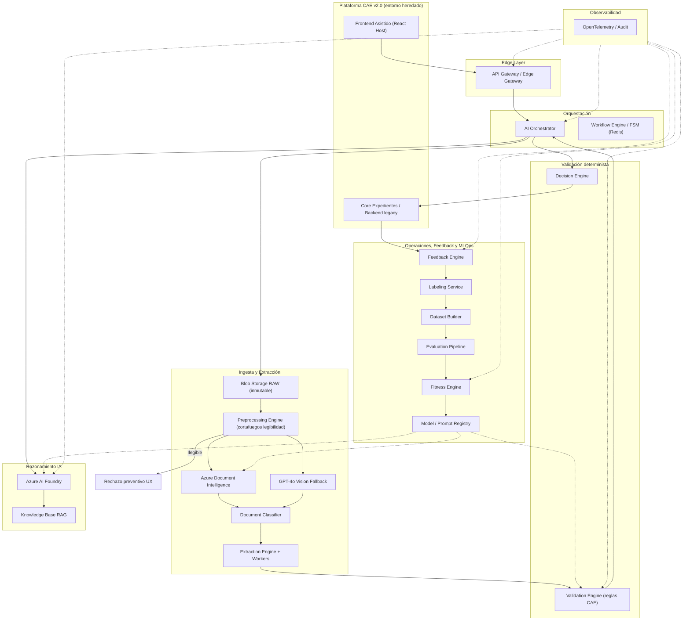

### 3.2 Paradigma: arquitectura hexagonal, DDD y microservicios

La capa de asistencia inteligente se **descompone lógicamente en microservicios**, cada uno con **arquitectura hexagonal** interna y fronteras de dominio definidas mediante **DDD**. Esa descomposición es el modelo de dominio; el **despliegue inicial** se realiza como monolito modular (Modo A, §3.3.4), y solo se extraen servicios independientes cuando la demanda lo justifica.

#### 3.2.1 Arquitectura hexagonal (Ports & Adapters)

Cada microservicio estructura su código en tres anillos:

| Anillo | Contenido | Regla |
|--------|-----------|-------|
| **Dominio** | Entidades, agregados, value objects, reglas de negocio, domain events | Sin dependencias de framework ni Azure |
| **Aplicación** | Casos de uso, orquestación, puertos de entrada/salida (interfaces) | Depende solo del dominio |
| **Infraestructura** | Adaptadores REST, consumidores de cola, clientes Azure DI/Foundry, repositorios | Implementa los puertos definidos en aplicación |

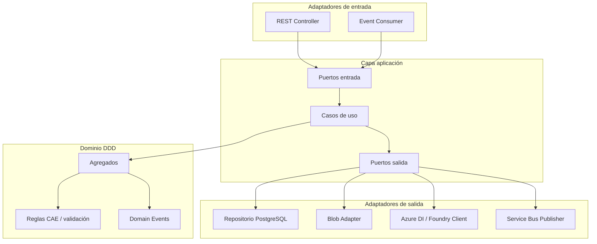

#### 3.2.2 Bounded contexts (DDD)

| Bounded context | Responsabilidad de dominio | Agregados principales |
|-----------------|---------------------------|------------------------|
| **Expedición CAE** (host) | Ciclo de vida expediente, formulario, envío | `Expediente`, `Documento` |
| **Ingesta documental** | Recepción, almacenamiento RAW, normalización | `DocumentoRaw`, `JobIngesta` |
| **Extracción** | Clasificación y extracción estructurada | `Extraccion`, `CampoExtraido` |
| **Validación CAE** | Reglas RF-001–RF-030, cruces, scoring, incidencias | `EvaluacionExpediente`, `Incidencia` |
| **Razonamiento IA** | Resumen, explicaciones, asistencia conversacional | `AnalisisExpediente`, `ConsultaAsistente` |
| **Conocimiento CAE** | Índices RAG, procedimientos, normativa | `IndiceConocimiento`, `Fragmento` |
| **Feedback y calidad** | Correcciones, labeling, datasets | `Feedback`, `Etiqueta` |
| **MLOps** | Evaluación, fitness, promoción/rollback | `Evaluacion`, `Fitness`, `ArtefactoIA` |

Los contextos se comunican mediante **contratos de integración** (API REST + eventos de dominio), nunca compartiendo modelos de persistencia ni bases de datos con el software heredado.

#### 3.2.3 Unidades desplegables (lógicas)

| Unidad lógica | Bounded context | Responsabilidad | Comunicación |
|---------------|-----------------|-----------------|--------------|
| `cae-gateway` | Transversal | Auth, rate limit, idempotency, enrutamiento | REST → servicios internos |
| `cae-ingestion` | Ingesta | Upload, Blob RAW, preprocessing, jobs | REST + `DocumentUploaded` |
| `cae-extraction` | Extracción | OCR, clasificación, workers extractores | Eventos + REST interno |
| `cae-validation` | Validación CAE | Motor validación progresiva, Decision Engine | Eventos + REST |
| `cae-reasoning` | Razonamiento IA | Orchestrator, Foundry, resumen ejecutivo | REST + eventos |
| `cae-knowledge` | Conocimiento | RAG, AI Search, indexación | REST interno |
| `cae-feedback` | Feedback | Captura correcciones, labeling | REST + `FeedbackStored` |
| `cae-mlops` | MLOps | Dataset, evaluación, Fitness Engine, Registry | REST + eventos batch |
| `cae-integration` | Anti-corruption | Sincronización con Core CAE v2.0 | REST hacia plataforma host |

> Materializadas primero como **libs Nx** (§3.3). El despliegue como contenedor independiente es **opcional** según demanda.

Cuando se despliegan aisladas (Modo C):

- Contenedor propio en AKS (o equivalente).
- OpenAPI versionada, persistencia propia, Service Bus, Redis según §14.

#### 3.2.4 Orquestación vs. coreografía

| Patrón | Uso |
|--------|-----|
| **Coreografía (eventos)** | Pipeline documental: upload → extracción → validación progresiva |
| **Orquestación (Orchestrator)** | Análisis global expediente, fan-out/fan-in multi-documento |
| **Saga** | Envío a revisión: validación final + decisión + cola Operaciones + rollback compensatorio si falla integración CAE |

#### 3.2.5 Regla de compartición entre libs

> Solo **value objects** y **contratos API** estables se comparten entre bounded contexts (`VIN`, `NIF`, DTOs OpenAPI). La lógica de negocio permanece encapsulada en cada lib de dominio.

### 3.3 Arquitectura objetivo en monorepo Nx

La Plataforma CAE v2.0 **no dispone hoy** de esta estructura modular para IA. La **arquitectura objetivo** organiza el código en un **monorepo Nx** con **`libs/`** reutilizables e **`apps/`** como hosts de composición y despliegue. Esta estructura es el estándar técnico destino de la compañía (**Strangler Fig Pattern**): permite canibalizar el software heredado de forma progresiva sin interrumpir la operativa.

#### 3.3.1 Patrón de capas (monorepo Nx)

| Capa | Ubicación objetivo | Patrón |
|------|-------------------|--------|
| Dominio + puertos | `libs/isomorphic/cae/core` | DDD + hexagonal (ports) — agnóstico de framework |
| Contratos API | `libs/isomorphic/cae/api` | OpenAPI, DTOs compartidos |
| Backend por capacidad | `libs/node/cae/*-backend` | NestJS modules exportables (`forRoot()`) |
| UI React (Fase 1) | `libs/react/cae/*` | MFE integrado en host CAE v2 actual |
| UI Angular (evolución) | `libs/angular/cae/*` | Stack de evolución de la plataforma; activación progresiva por módulo |
| UI reusable (tontos) | `libs/react/cae/ui`, `libs/angular/cae/ui` | Presentational + Storybook |
| Storybook | `apps/cae-ui-storybook` | Catálogo visual de componentes React y Angular |
| Host backend IA | `apps/cae-ia-backend` | Monolito modular NestJS |
| MFE React (Fase 1) | `apps/cae-assistant-mfe` | Remote embebido en shell CAE v2 |
| MFE Angular (evolución) | `apps/cae-assistant-mfe-angular` | Remote de evolución; sustituye progresivamente al remote React |

#### 3.3.2 Estructura objetivo — libs IA CAE

```
cae-ia-monorepo/                               # Monorepo Nx dedicado IA CAE
├── apps/
│   ├── cae-ia-backend/                        # Host monolito modular backend IA
│   ├── cae-assistant-mfe/                     # [DEFAULT] Microfrontend React → CAE v2
│   ├── cae-assistant-mfe-angular/             # [EVOLUCIÓN] Microfrontend Angular
│   └── cae-ui-storybook/                      # Storybook — catálogo componentes UI
│
├── libs/
│   ├── isomorphic/cae/
│   │   ├── core/                              # Dominio DDD puro (sin Nest/React/Angular)
│   │   └── api/                               # Contratos OpenAPI, DTOs
│   │
│   ├── node/cae/
│   │   ├── ingestion-backend/
│   │   ├── extraction-backend/
│   │   ├── validation-backend/
│   │   ├── reasoning-backend/
│   │   ├── knowledge-backend/
│   │   ├── feedback-backend/
│   │   ├── mlops-backend/
│   │   └── integration-backend/               # ACL → Plataforma CAE v2.0
│   │
│   ├── react/cae/                             # UI default — stack nativo CAE v2
│   │   ├── ui/                                # Componentes tontos + *.stories.tsx
│   │   ├── data-access/                       # Hooks, stores, clientes API
│   │   ├── feature-assistant/                 # Componentes listos (containers)
│   │   ├── feature-operations/
│   │   └── feature-mlops/
│   │
│   └── angular/cae/                           # UI evolución — misma API de componentes
│       ├── ui/                                # Componentes tontos + *.stories.ts
│       ├── data-access/
│       ├── feature-assistant/                 # Smart components / containers
│       ├── feature-operations/
│       └── feature-mlops/
```

Cada lib `*-backend` sigue **domain / application / infrastructure**, exportando un módulo NestJS composable (`XxxBackendModule.forRoot()`). Las libs UI comparten **`data-access`** y contratos de props/eventos; solo cambia la capa de presentación (React vs Angular).

#### 3.3.3 Correspondencia bounded context → lib Nx

| Bounded context | Lib dominio | Lib backend | Lib UI React (cliente) | Lib UI Angular (evolución) |
|-----------------|-------------|-------------|------------------------|----------------------|
| Validación CAE | `isomorphic/cae/core` | `validation-backend` | `react/cae/feature-assistant` | `angular/cae/feature-assistant` |
| Extracción | `isomorphic/cae/core` | `extraction-backend` | Sin capa UI | Sin capa UI |
| Ingesta | `isomorphic/cae/core` | `ingestion-backend` | Sin capa UI | Sin capa UI |
| Razonamiento IA | `isomorphic/cae/core` | `reasoning-backend` | `feature-assistant` (chat) | idem Angular |
| Operaciones | Reutiliza `isomorphic/cae/core` | `reasoning-backend` + `validation-backend` | `feature-operations` | idem Angular |
| MLOps / Fitness | `isomorphic/cae/core` | `mlops-backend` | `feature-mlops` | idem Angular |
| Integración CAE v2 | `isomorphic/cae/api` | `integration-backend` | Sin capa UI (solo ACL) | Sin capa UI (solo ACL) |

#### 3.3.4 Modos de despliegue (misma codebase)

La decisión monolito vs microservicio es **operativa**, no de reescritura:

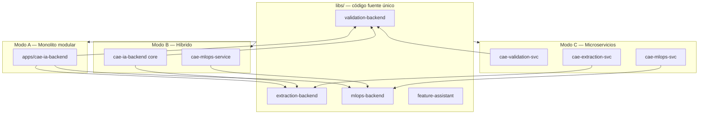

| Modo | Cuándo | Composición | Comunicación interna |
|------|--------|-------------|----------------------|
| **A — Monolito modular** | MVP, dev, baja carga, integración temprana CAE | `apps/cae-ia-backend` importa todos los `*-backend` | Llamadas in-process / eventos in-memory |
| **B — Híbrido** | MLOps o extracción con picos aislados | Core monolito + 1–2 servicios extraídos | REST + Service Bus |
| **C — Microservicios** | Alta escala, equipos separados, SLA distintos | Un contenedor AKS por unidad lógica §3.2.3 | Service Bus + API Gateway |

**Principio:** empezar siempre en **Modo A** (libs + monolito modular). Extraer a Modo B/C solo cuando métricas (latencia, coste, equipos) lo justifiquen — sin fork de código.

#### 3.3.5 Apps objetivo

| App Nx | Tipo | Rol |
|--------|------|-----|
| `apps/cae-ia-backend` | NestJS host | Componer todos los `node/cae/*-backend`; API única IA |
| `apps/cae-assistant-mfe` | **React remote (Fase 1)** | MFE embebido en shell CAE v2 actual |
| `apps/cae-assistant-mfe-angular` | **Angular remote (evolución)** | Sustituye progresivamente al remote React según roadmap de migración |

Wrappers microservicio (Modo C), generados solo bajo demanda:

```
apps/cae-validation-service/    → import @cae-ia/validation-backend
apps/cae-extraction-service/
apps/cae-mlops-service/
```

### 3.4 Integración con Plataforma CAE v2.0 — Microfrontends

CAE v2.0 permanece **host del expediente** (formulario, ciclo de vida, Operaciones). El **frontend CAE v2 está construido en React** — stack **actual de la plataforma**, acordado para la integración de Fase 1. La capa IA se integra como **capacidades embebidas**, no como reemplazo del shell CAE.

> **Estrategia Strangler Fig:** la iniciativa de IA introduce arquitectura limpia (Nx, DDD, hexagonal) en una **zona aislada** del sistema heredado. El MFE y el backend IA nacen con estándares modernos; el código legacy no se modifica internamente — solo se consume vía ACL. Cada nuevo módulo se desarrolla en el monorepo Nx y se expone al host mediante MFE, sustituyendo progresivamente el núcleo antiguo.

> **Contexto de evolución:** **CAE React actual** se termina sin interrupción. La **App IA** se integra en CAE React vía MFE (Fase 1). En paralelo se construye **CAE Angular nueva** (`apps/cae-platform-angular`) como sustituto — distinta del MFE de evolución `apps/cae-assistant-mfe-angular`, que es la capa IA expuesta en Angular. Los microfrontends son **temporales** — ver [`ESTRATEGIA-MIGRACION-FRONTEND-CAE.md`](ESTRATEGIA-MIGRACION-FRONTEND-CAE.md) §2.3.

#### 3.4.0 Fase 1 acordada y evolución Angular

| Dimensión | React (Fase 1) | Angular (evolución) |
|-----------|----------------|---------------------|
| **Rol** | Integración acordada con CAE v2 | Stack propuesto para módulos nuevos y modernización |
| **Alcance en el proyecto** | MFE de producción Fase 1 | MFE equivalente; referencia arquitectónica de evolución |
| **Ventaja principal** | Continuidad con el host actual | Estructura modular, mantenibilidad y testing integrado |
| **Consideración** | Alineado con stack CAE v2 existente | Integración Module Federation cross-framework |
| **Horizonte** | Meses 1–2 (MFE en producción) | Meses 2–6 (**100 % Angular en mes 6**) |

#### 3.4.1 Stack UI: React (Fase 1) vs Angular (evolución)

| Aspecto | **React — Fase 1** | **Angular — evolución** |
|---------|-------------------|-------------------------|
| Motivación | Continuidad con CAE v2 actual | Estandarización para aplicaciones enterprise CAE |
| Alineación host | Nativa (mismo stack del host) | Module Federation cross-framework |
| App remote | `apps/cae-assistant-mfe` | `apps/cae-assistant-mfe-angular` |
| Libs UI | `libs/react/cae/*` | `libs/angular/cae/*` |
| Federación | Vite / Webpack Module Federation (React) | `@nx/module-federation` (Angular) |
| Prioridad entrega | **Alcance contractual actual** | Desarrollo paralelo; escenario evolutivo |

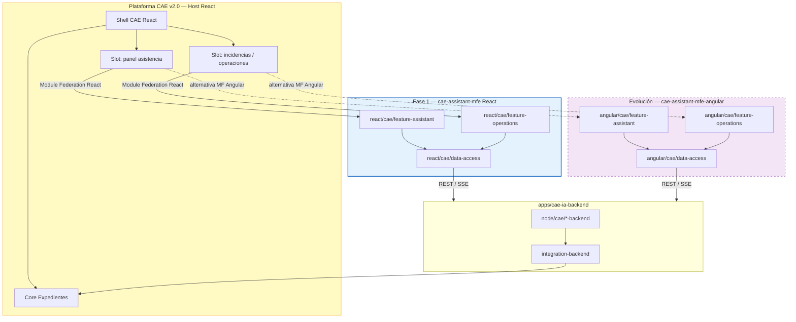

#### 3.4.2 Componentes expuestos por el MFE

| Remote | Componentes | Pantalla CAE v2 |
|--------|-------------|-----------------|
| `cae-assistant-mfe` (React) | `AssistantPanel`, `IncidentsSidebar`, `DocumentUploadAssist` | Construcción expediente |
| `cae-assistant-mfe` (React) | `OperationsReviewPanel`, `ExecutiveSummary` | Cola Operaciones |
| `cae-assistant-mfe-angular` | Equivalentes Angular | Mismos slots (alternativa) |
| Ambos | `MlopsDashboard` (opcional) | Backoffice MLOps |

**Ventajas del MFE frente a iframe o copia de UI:**

- Despliegue **independiente** del remote sin redeploy completo de CAE v2.
- **React (Fase 1):** integración inmediata con el host CAE v2; tipos y tokens compartibles donde existan.
- **Angular (evolución):** capa UI con arquitectura estandarizada; referencia para la modernización progresiva de CAE.
- Contrato estable: remote entry + versión semver (válido para ambos stacks).

**Contrato de integración host React ↔ remote (ambos stacks):**

| Parámetro | Descripción |
|-----------|-------------|
| `expedienteId` | ID expediente activo en CAE |
| `tenantId` / `concesionarioId` | Contexto multi-tenant |
| `authToken` | JWT propagado desde CAE (Entra ID) |
| `locale` | es-ES |
| Callbacks / eventos | `onIncidenciaResuelta`, `onDocumentoProcesado`, `onEnvioSolicitado` |

#### 3.4.3 Backend — Anti-Corruption Layer

`integration-backend` traduce entre modelos CAE v2 y agregados IA:

- **No** accede a la BD de CAE directamente salvo acuerdo explícito; preferencia por **APIs CAE** existentes.
- Sincroniza estado expediente ↔ Unified Expedition JSON.
- Emite eventos de dominio IA sin filtrar detalles internos CAE al resto de libs.

#### 3.4.4 Fases de adopción

| Fase | Entregable | Despliegue |
|------|------------|------------|
| **1 — Libs** | `isomorphic/cae/core` + `validation-backend` + `react/cae/feature-assistant` | Monolito `cae-ia-backend`; CAE consume API REST |
| **2 — MFE React piloto** | `cae-assistant-mfe` con panel incidencias | Host CAE React carga remote en slot (Fase 1) |
| **2b — MFE Angular (paralelo)** | `cae-assistant-mfe-angular` | MFE equivalente; validación de arquitectura de evolución |
| **2c — Strangler Fig** | Módulos CAE nuevos en Angular embebidos en host React | Ver [`ESTRATEGIA-MIGRACION-FRONTEND-CAE.md`](ESTRATEGIA-MIGRACION-FRONTEND-CAE.md) §8 |
| **2d — Consolidación** | Host Angular unificado; React desmantelado | Objetivo final plataforma |
| **3 — Pipeline completo** | Todas las libs backend + MFE operaciones | Modo A o B |
| **4 — Escala** | Extracción servicios Modo C según métricas | AKS multi-pod |

> **Nota de correspondencia:** estas son las **fases de entrega técnica de la capa IA** (libs, pipeline, escala), alineadas con las **fases de migración de la plataforma** (0–4, **horizonte total 6 meses**) definidas en [`ESTRATEGIA-MIGRACION-FRONTEND-CAE.md`](ESTRATEGIA-MIGRACION-FRONTEND-CAE.md) §8. Equivalencia aproximada: Fases 1–2 (Libs, MFE piloto) ↔ meses 1–2 Estrategia (IA integrada); Fases 2b–2c (paralelo Angular, Strangler Fig) ↔ meses 2–5 Estrategia (convivencia, sustitución); Fase 2d (consolidación) ↔ mes 6 Estrategia (consolidación); Fases 3–4 (pipeline completo, escala) se ejecutan en paralelo durante todo el programa.

#### 3.4.5 Module Federation — integración temporal (React ↔ Angular)

Module Federation conecta **CAE React**, la **App IA** y **CAE Angular** mientras conviven. **No es la arquitectura objetivo**: al consolidar CAE Angular única, los remotes desaparecen y la IA pasa a `libs/angular/cae/feature-*`.

| Capa | React (CAE v2 / MFE Fase 1) | Angular (evolución) |
|------|----------------------------|---------------------|
| **Bundler / MFE** | Webpack 5 MF o Vite + plugin federación | `@nx/module-federation` (Webpack) |
| **Rol posible** | Host (Fase 1) o remote (hasta migración) | Remote (módulos nuevos) o host (consolidación) |
| **Shared deps** | `react`, `react-dom` como singletons | `@angular/core`, `@angular/common`, etc. |
| **Build legacy** | Webpack 4 / CRA → adaptación previa | Nx greenfield |

**Requisitos de integración** (obligatorios desde el inicio):

1. **Autenticación compartida** — JWT Entra ID propagado por el shell; sesión única.
2. **Contrato de rutas** — Tabla ruta → remote versionada; convención de paths común.
3. **Design system** — Tokens CSS / componentes base alineados entre equipos.
4. **Comunicación entre MFE** — Eventos tipados o bus ligero; evitar estado global duplicado.
5. **Aislamiento CSS** — Prefijos por MFE o estrategia acordada para evitar colisiones.
6. **Versionado remotes** — Semver + remote entry; despliegue independiente por equipo.

**Escenarios de build React en CAE v2:**

| Escenario | Viabilidad MFE | Acción |
|-----------|----------------|--------|
| Webpack 5 | Alta | Configurar `ModuleFederationPlugin` en host y remotes |
| Vite | Media-alta | Plugin `@originjs/vite-plugin-federation` o equivalente |
| CRA sin eject | Baja-media | CRACO / migración a Webpack configurable |
| Webpack 4 | Baja | Actualizar toolchain antes de federar |

> Opciones de shell (React vs Angular) y modelo de dos equipos: [`ESTRATEGIA-MIGRACION-FRONTEND-CAE.md`](ESTRATEGIA-MIGRACION-FRONTEND-CAE.md) §2.3 y §3.2.

#### 3.4.6 Garantías de aislamiento y resiliencia en convivencia UI

Para asegurar que el rendimiento y la estabilidad del MFE de asistencia inteligente no se vean comprometidos por el estado o la toolchain del host heredado, se imponen las siguientes restricciones:

1. **Encapsulamiento de estilos** — CSS Modules, CSS-in-JS con prefijos dinámicos o Shadow DOM. Ningún estilo global del host altera el layout del asistente, y viceversa.
2. **Sandboxing de runtimes** — El MFE no depende de variables globales (`window.*`) inyectadas por el host, salvo el token de autenticación explícito. Dependencias compartidas gestionadas con `requiredVersion` estricto en Module Federation.
3. **Estrategia Decoupled-First (fallback Web Components)** — Si la toolchain del host (Webpack 4 / CRA) impide federación nativa, el MFE se empaqueta como Custom Element autónomo. El host solo inyecta una etiqueta HTML (`<cae-assistant-panel dossier-id="123">`), aislando por completo los runtimes modernos del framework legacy.

### 3.5 Arquitectura frontend: componentes listos y tontos

La capa UI del MFE sigue el patrón **Smart / Dumb** (también *container / presentational*). El dominio y las reglas CAE **nunca** viven en componentes de presentación.

#### 3.5.1 Componentes tontos (presentational / dumb)

Ubicación: `libs/react/cae/ui` (Fase 1) y `libs/angular/cae/ui` (evolución).

| Característica | Descripción |
|----------------|-------------|
| Responsabilidad | Solo renderizar UI a partir de **props/inputs** y emitir **eventos/callbacks** |
| Sin efectos secundarios | No llamadas HTTP, no acceso a stores globales, no reglas de negocio |
| Testabilidad | Tests unitarios con Testing Library; snapshots solo como complemento |
| Reutilización | Compartibles entre features, MFE y Storybook |
| Design system | Tokens alineados con CAE v2 (React); Angular con design system modular propio |

**Ejemplos de componentes tontos:**

| Componente | Props principales | Eventos |
|------------|-------------------|---------|
| `IncidentCard` | incidencia, severidad, mensaje | `onResolve`, `onDismiss` |
| `CompletenessGauge` | porcentaje, etiqueta | Sin eventos |
| `DocumentStatusBadge` | estado, confidence | Sin eventos |
| `AssistantMessage` | rol, contenido, timestamp | `onCopy`, `onFeedback` |
| `OperationsSummaryBlock` | items, prioridad | `onExpand` |

#### 3.5.2 Componentes listos (smart / container)

Ubicación: `libs/react/cae/feature-*` y `libs/angular/cae/feature-*`.

| Característica | Descripción |
|----------------|-------------|
| Responsabilidad | Orquestar datos, estado local, suscripciones SSE/WebSocket, navegación MFE |
| Data access | Consumen `data-access` (React Query / signals / NgRx según convención CAE) |
| Composición | Ensamblan componentes tontos; mapean DTOs API → props de presentación |
| Límite de lógica | Reglas de negocio CAE permanecen en `isomorphic/cae/core`; aquí solo coordinación UI |

**Ejemplos de componentes listos:**

| Componente listo | Compone (tontos) | Responsabilidad |
|------------------|------------------|-----------------|
| `AssistantPanel` | `AssistantMessage`, `CompletenessGauge`, `IncidentCard` | Chat IA + estado expediente |
| `IncidentsSidebar` | `IncidentCard`, filtros UI | Lista incidencias en tiempo real |
| `DocumentUploadAssist` | `DocumentStatusBadge`, progreso | Feedback post-OCR |
| `OperationsReviewPanel` | `OperationsSummaryBlock` | Cola Operaciones |

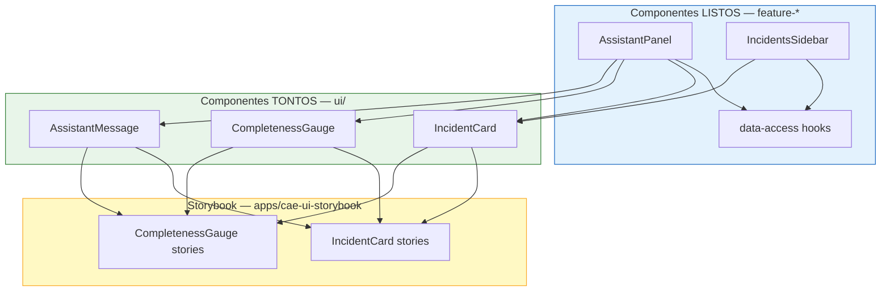

#### 3.5.3 Storybook — catálogo de componentes reutilizables

**Storybook** es la herramienta oficial para documentar, desarrollar y probar en aislamiento los **componentes tontos** reutilizables.

| Aspecto | Implementación |
|---------|----------------|
| App Nx | `apps/cae-ui-storybook` con targets `storybook` y `build-storybook` |
| Stories React | `libs/react/cae/ui/**/*.stories.tsx` |
| Stories Angular | `libs/angular/cae/ui/**/*.stories.ts` (opcional) |
| Controles | Args para variantes: severidad, estados vacío/carga/error, temas claro/oscuro |
| Documentación | MDX por componente: cuándo usarlo, accesibilidad, props |
| Interaction tests | `@storybook/test` + Testing Library en CI (`test-storybook`) |
| Visual regression | Opcional: Chromatic o Loki en pipeline STAGING |
| Design tokens | Variables CSS / theme compartido con shell CAE v2 |

**Reglas de gobernanza UI:**

1. Todo componente nuevo en `ui/` **debe** tener al menos una story antes de merge.
2. Los componentes listos (`feature-*`) **no** requieren Storybook obligatorio; se prueban con integración/E2E.
3. Cambios breaking en props de `ui/` exigen bump semver del paquete `@cae-ia/react-ui`.
4. Angular opcional: mismas variantes funcionales documentadas en Storybook Angular.

---

## 4. Arquitectura por fases (end-to-end)

Arquitectura alineada con el **modelo de 10 fases** del sistema de asistencia inteligente CAE.

### 4.0 Flujo técnico E2E — diagrama maestro v3.0

Diagrama de referencia **definitivo** del pipeline completo: frontend → edge → ingesta → extracción → validación progresiva (núcleo) → razonamiento IA → Decision Engine (AUTO_APPROVE / HUMAN_REVIEW / AUTO_REJECT) → MLOps → observabilidad.

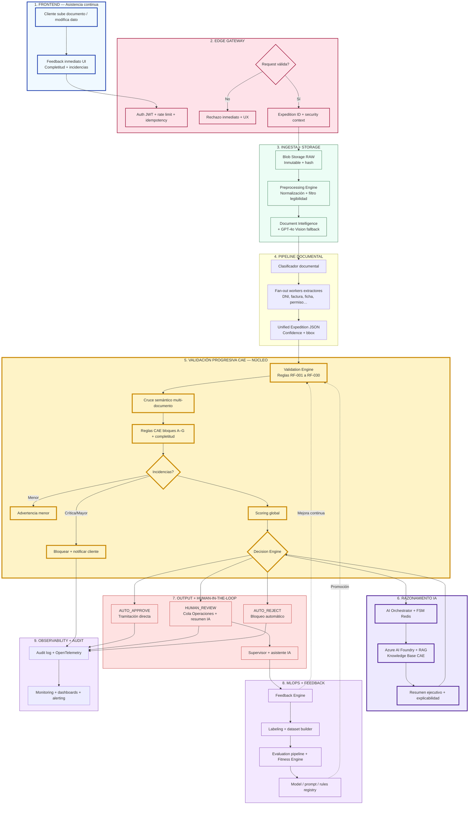

> **Leyenda rápida:** capa 5 (amarillo) = núcleo CAE; capa 7 = AUTO_APPROVE sin cola Operaciones en expedientes limpios; línea punteada desde MLOps = mejora continua de reglas y modelos.

### 4.0.1 Flujo técnico E2E (vista compacta)


### 4.1 Motor Validación Progresiva CAE (componente central)

El **Motor Validación Progresiva CAE** es el núcleo técnico del sistema. Se ejecuta tras cada extracción o modificación de datos.

| Submódulo | Responsabilidad |
|-----------|-----------------|
| Reglas deterministas | Bloques A–G (RF-001 a RF-030), versionadas en Git |
| Cruce semántico | Join multi-documento: titular, VIN, matrícula, fechas, empresa |
| Validación fechas/vigencias | RF-019, antigüedad VO (API IDEAUTO) |
| Validación vehículo-documentación | Coherencia VO/VN, combustible, homologación |
| Documentación obligatoria | Checklist por tipología expediente |
| Global Scoring + Risk | Completitud, confianza, riesgo, FTR |
| Clasificador incidencias | Crítica / Mayor / Menor / Informativa |

**Entrada:** Unified Expedition JSON (datos extraídos + formulario CAE).
**Salida:** Incidencias[], scoring{}, estadoExpediente, bloqueaEnvio: boolean.

**Latencia objetivo:** < 3 s (reglas deterministas); < 10 s (con Foundry opcional).

#### 4.1.2 Filtro de viabilidad e ingesta preventiva (gatekeeping)

Para optimizar el coste de inferencia en Azure AI Foundry y mantener la latencia del pipeline reactivo, el **Preprocessing Engine** actúa como cortafuegos de calidad:

- **Validación estricta de legibilidad** — Análisis de metadatos e histograma de imagen. Si el documento presenta resolución inferior a 150 ppp, rotación severa no corregible o compresión corrupta, el job emite `DocumentRejectedUX` de forma inmediata, sin consumir recursos del pipeline IA.
- **Bypass de inferencia genérica** — Ningún documento se deriva a GPT-4o Vision sin haber pasado por Document Intelligence y fallado el umbral de confianza mínimo (< 0,85). Esto evita el uso accidental de modelos multimodales costosos en tareas estructuradas estándar.

### 4.2 Pipeline de ingesta y extracción

| Etapa | Tecnología | Notas |
|-------|------------|-------|
| Gateway | API Management / Edge Gateway | JWT Entra ID, idempotency Redis |
| Blob RAW | Azure Blob Storage | Inmutable, SHA-256, versionado |
| Colas | Redis (fast) + Service Bus (reliable) | DLQ, retry exponencial |
| Normalización | Preprocessing Engine | HEIC/JPG/PNG/PDF → PNG normalizado |
| OCR primario | Azure Document Intelligence | Layout + custom models |
| OCR fallback | GPT-4o Vision (Foundry) | Si confidence < 0.85 |
| Clasificación | DI classifier + reglas | Routing a extractor |
| Extracción | Workers especializados | Ver tabla 4.3 |

### 4.3 Extractores especializados CAE

| Extractor | Tipos documentales | Campos clave |
|-----------|-------------------|--------------|
| Identidad | DNI, NIE | Nombre, NIF, dirección, firma |
| Factura | Factura VN | Titular, VIN, matrícula, marca, modelo |
| Ficha Técnica | Ficha VN/VO | VIN, energía, categoría, masa |
| Permiso | Permiso circulación, IVTM | Titular, matrícula, ejercicio |
| Vehículo VO/VN | Sustitución, baja, contrato | Fechas, titular, identificación |
| Convenio CAE | Convenio, anexo, autorización | Firma, contraprestación €/kWh |
| Firma | Todos los firmables | Detección, comparación DNI |
| Genérico | No clasificado | Extracción best-effort |

### 4.4 Decisión final — auto-aprobación, excepciones y auto-rechazo

| Resultado | Condición técnica | Destino |
|-----------|-------------------|---------|
| **AUTO_APPROVE** | Sin incidencias críticas/mayores; completitud 100 %; confidence ≥ umbral; reglas PASS | **Tramitación directa** — sin cola Operaciones |
| **HUMAN_REVIEW** | Incidencias menores, baja confidence, flags de riesgo | Cola excepciones Operaciones + resumen IA |
| **AUTO_REJECT** | Incidencias críticas/mayores abiertas | Bloqueo / rechazo automático + detalle al cliente |

> Meses 1–2: modo calibración (shadow). Desde mes 3: **AUTO_APPROVE en producción** cuando auditoría confirma precisión ≥ 95 % (criterios §17.5 ESPECIFICACION-FUNCIONAL).

### 4.5 Capa observabilidad y entrega UI

Flujo transversal post-procesamiento:

```
Audit Log → OpenTelemetry Tracing → Guardar PNG procesado
         → Optimización AVIF/WebP → CDN → Frontend Thumbnails + Auto-fill UI
```

| Componente | Función |
|------------|---------|
| Audit Log | Append-only: prompts, respuestas, decisiones, correcciones |
| OpenTelemetry | Tracing E2E con correlation-id |
| PNG procesado | Versión normalizada para revisión |
| AVIF/WebP | Optimización para CDN |
| Thumbnails | Preview documentos en UI cliente |
| Auto-fill UI | Campos rellenados desde JSON extracción |

### 4.6 Mapa fase funcional ↔ técnica

| Fase funcional | Componentes técnicos |
|----------------|---------------------|
| ① Frontend | UI CAE, SSE/WebSocket, panel incidencias |
| ②–④ Ingesta + Extracción | Gateway, Blob, OCR, Vision, Classifier, Workers |
| ⑤ Validación progresiva | **Motor Validación Progresiva CAE** |
| ⑥ Razonamiento IA | Orchestrator, Foundry, AI Search RAG |
| ⑦ Decisión | Decision Engine |
| ⑧ Operaciones | Cola revisión, UI supervisor, asistente IA |
| ⑨ MLOps | Feedback Engine, Labeling, Dataset, Fitness Engine, Evaluation, Registry |
| ⑩ Observabilidad | OpenTelemetry, Audit, dashboards |

---

## 5. Componentes principales

### 5.1 Edge Gateway

| Atributo | Detalle |
|----------|---------|
| **Responsabilidad** | Punto de entrada único para servicios IA |
| **Funciones** | Autenticación JWT (Entra ID), rate limiting, idempotency key, validación schema, trazabilidad request-id |
| **Entrada** | HTTP/REST + multipart upload |
| **Salida** | Request enrutado a Orchestrator o respuesta cached |
| **Dependencias** | Redis (idempotency), Key Vault (secrets) |
| **Escalabilidad** | Horizontal, stateless |
| **Errores** | 401/403 auth, 429 rate limit, 409 duplicate |

### 5.2 Blob Storage RAW

| Atributo | Detalle |
|----------|---------|
| **Responsabilidad** | Almacenamiento inmutable del documento original |
| **Funciones** | Versionado, WORM lógico, hash SHA-256, metadata expediente |
| **Entrada** | Archivo binario post-validación gateway |
| **Salida** | URI + hash + metadata |
| **Dependencias** | Azure Blob Storage |
| **Auditoría** | Toda versión documental trazable |

### 5.3 Preprocessing Engine

| Atributo | Detalle |
|----------|---------|
| **Responsabilidad** | Normalización de formatos e imagen y filtrado preventivo de legibilidad |
| **Funciones** | HEIC/JPG/PNG → PNG, PDF split, mejora contraste, deskew, denoise, cálculo de umbral de viabilidad |
| **Entrada** | Blob URI |
| **Salida** | Páginas normalizadas listas para OCR, o interrupción del job por ilegibilidad (`DocumentRejectedUX`) |
| **Dependencias** | Blob, ImageMagick/libvips o equivalente |

### 5.4 Document Classifier

| Atributo | Detalle |
|----------|---------|
| **Responsabilidad** | Detectar tipo documental y asignar extractor |
| **Entrada** | Texto OCR + metadata imagen |
| **Salida** | `{ tipo: "factura_vn", confidence: 0.96, extractor: "extractor-factura" }` |
| **Modelos** | Document Intelligence custom classifier + reglas fallback |

### 5.5 Extraction Engine + Workers IA

Workers especializados alineados con el clasificador documental del flujo E2E:

| Worker | Documentos | Routing clasificador |
|--------|------------|---------------------|
| Extractor Identidad | DNI, NIE | `CLASS → Identidad` |
| Extractor Factura | Factura VN | `CLASS → Factura VN` |
| Extractor Ficha Técnica | Ficha técnica VN/VO | `CLASS → Ficha Técnica` |
| Extractor Permiso | Permiso circulación, IVTM | `CLASS → Permiso/IVTM` |
| Extractor Vehículo | Sustitución VO, baja, contrato | `CLASS → VO/VN` |
| Extractor Convenio CAE | Convenio, anexo, autorización datos | `CLASS → Convenio` |
| Extractor Firma | Detección y comparación firmas | `CLASS → Firma` |
| Extractor Genérico | No clasificado / fallback | `CLASS → Otros` |

**Salida estándar** (invariante respecto al motor extractivo subyacente):

```json
{
  "documentoId": "doc-abc123",
  "tipo": "factura_vn",
  "campos": {
    "vin": { "valor": "VF1ABC12345678901", "confidence": 0.97, "bbox": [120, 340, 400, 360] },
    "titular": { "valor": "GARCIA LOPEZ, JUAN", "confidence": 0.95, "bbox": [45, 100, 200, 120] },
    "matricula": { "valor": "1234ABC", "confidence": 0.98, "bbox": [80, 200, 180, 220] }
  },
  "provenance": "document-intelligence",
  "timestamp": "2026-07-03T10:15:00Z"
}
```

> **Nota sobre bbox:** Formato estandarizado `[x_min, y_min, x_max, y_max]` en píxeles relativos al documento. Cuando `bbox: null`, el campo no tiene localización visual (valor calculado o inferido). El frontend puede resaltar errores en la UI de revisión cuando bbox está presente.

### 5.6 Motor Validación Progresiva CAE (Validation Engine)

| Atributo | Detalle |
|----------|---------|
| **Responsabilidad** | **Núcleo técnico** — motor determinista de reglas CAE + cruces + scoring |
| **Funciones** | Reglas RF-001 a RF-030, cruces semánticos, completitud, scoring, severidades, validación progresiva reactiva |
| **Entrada** | Unified Expedition JSON |
| **Salida** | Incidencias[] + scoring{} + estadoExpediente + bloqueaEnvio |
| **Disparadores** | DocumentExtracted, FieldModified, DocumentReplaced |
| **Versionado** | Reglas versionadas en repositorio Git + despliegue controlado |
| **Parametrización** | Rangos, marcas, tipologías configurables sin redeploy |

Ver [sección 4.1](#41-motor-validación-progresiva-cae-componente-central) y [sección 7](#7-validation-engine).

### 5.7 AI Orchestrator

| Atributo | Detalle |
|----------|---------|
| **Responsabilidad** | Coordinación de todos los servicios IA |
| **Funciones** | Planificación, fan-out/fan-in, agregación, gestión de estado unificado del expediente, normalización de respuestas, resumen ejecutivo, coordinación de agentes |
| **Entrada** | Eventos de expediente/documento o llamadas de la capa UI |
| **Salida** | Respuestas unificadas para Frontend Asistido y Core CAE |
| **Estado** | FSM en Redis (live state) con **control de concurrencia optimista** — cada versión del Unified Expedition JSON incluye token de versión; modificaciones concurrentes obsoletas se rechazan |
| **Dependencias** | Todos los subsistemas IA |

**Contrato entrada/salida:**

*Entrada:*

```json
{
  "expedienteId": "exp-123",
  "evento": "DOCUMENTO_PROCESADO",
  "documentos": [{ "id": "doc-1", "tipo": "dni", "extraccion": {} }]
}
```

*Salida:*

```json
{
  "expedienteId": "exp-123",
  "estado": "CON_INCIDENCIAS",
  "scoring": { "completitud": 85, "confianza": 78, "riesgo": "MEDIO" },
  "incidencias": [],
  "recomendaciones": [],
  "resumenEjecutivo": null
}
```

### 5.8 Decision Engine

| Atributo | Detalle |
|----------|---------|
| **Responsabilidad** | Decisión pre-envío/post-envío: AUTO_APPROVE / HUMAN_REVIEW / AUTO_REJECT |
| **Entrada** | Resultado Validation Engine + análisis Foundry + umbrales confidence/fitness |
| **Lógica** | Críticas/mayores abiertas → AUTO_REJECT; Cumple todos criterios §17.5 → AUTO_APPROVE; Resto → HUMAN_REVIEW |
| **Salida** | `{ decision: "AUTO_APPROVE", motivo: "...", auditTrail: [...] }` |

### 5.9 Knowledge Base CAE (RAG)

| Atributo | Detalle |
|----------|---------|
| **Responsabilidad** | Conocimiento específico negocio CAE para Foundry |
| **Fuentes** | Procedimientos IDEAUTO, normativa, checklists, casuísticas, FAQ Operaciones |
| **Tecnología** | Embeddings + Vector DB (Azure AI Search) |
| **Versionado** | Índices versionados, rollback posible |
| **Chunking** | Por sección normativa, caso de uso, checklist |

### 5.10 Feedback Engine

| Atributo | Detalle |
|----------|---------|
| **Responsabilidad** | Captura correcciones humanas y alimenta mejora |
| **Registra** | Dato corregido, motivo, usuario, fecha, regla/incidencia asociada, etiqueta sugerida |
| **Genera** | Eventos `FeedbackStored`, cola labeling, métricas precisión por campo |
| **Salidas** | Labeling Service, Dataset Builder, Fitness Engine |

**Payload estándar:**

```json
{
  "feedbackId": "FB-2026-001234",
  "expedienteId": "exp-123",
  "documentoId": "doc-456",
  "tipo": "CORRECCION_EXTRACCION",
  "campo": "vin",
  "valorIa": "VF1ABC12345678901",
  "valorCorrecto": "VF1ABC12345678902",
  "etiquetaSugerida": "FALLO_EXTRACCION",
  "reglaAsociada": "RF-012",
  "usuario": "operaciones@ideauto.com",
  "timestamp": "2026-07-03T14:22:00Z"
}
```

### 5.11 Labeling Service

| Atributo | Detalle |
|----------|---------|
| **Responsabilidad** | Etiquetado asistido de feedback para datasets de entrenamiento/evaluación |
| **Entrada** | Eventos FeedbackStored |
| **Etiquetas** | `ACIERTO_IA`, `FALLO_EXTRACCION`, `FALLO_CLASIFICACION`, `FALLO_REGLA`, `FALSO_POSITIVO`, `FALSO_NEGATIVO` |
| **Salida** | Registros etiquetados versionados en Dataset Builder |

### 5.12 Dataset Builder

| Atributo | Detalle |
|----------|---------|
| **Responsabilidad** | Construcción y versionado de datasets (producción + golden set) |
| **Funciones** | Agregación batch nocturna, deduplicación, anonimización PII, split train/eval |
| **Almacenamiento** | Blob (archivos) + PostgreSQL (metadata, versiones) |
| **Salida** | Datasets referenciados por Evaluation Pipeline |

### 5.13 Fitness Engine

| Atributo | Detalle |
|----------|---------|
| **Responsabilidad** | Cálculo de fitness compuesto (0–100) por artefacto y global del sistema |
| **Entrada** | Resultados Evaluation Pipeline + métricas producción (FTR, latencia, coste) |
| **Componentes** | F₁ Clasificación (15%), F₂ Extracción (25%), F₃ Validación (25%), F₄ FTR (15%), F₅ Latencia (10%), F₆ Coste (10%) |
| **Salida** | `{ fitnessGlobal, componentes{}, artefactoId, version, candidato }` |
| **Decisiones** | Promoción, bloqueo o rollback según umbrales |

### 5.14 Evaluation Pipeline

| Atributo | Detalle |
|----------|---------|
| **Responsabilidad** | Evaluación offline de versiones candidatas vs. producción |
| **Funciones** | Golden set (≥200 casos), regresión cruzada, comparativa A/B offline |
| **Herramientas** | Foundry Eval, MLflow, tests automatizados reglas YAML |
| **Bloqueo deploy** | Regresión global > 2% o caída > 1 pt en F₂/F₃ |

### 5.15 Model / Prompt Registry

| Atributo | Detalle |
|----------|---------|
| **Responsabilidad** | Registro versionado de extractores, prompts, reglas y umbrales activos |
| **Funciones** | Promoción controlada, rollback < 15 min, trazabilidad versión por expediente |
| **Integración** | Document Intelligence custom models, Foundry Prompt Registry, Git reglas |

### 5.16 Observability Stack

| Componente | Función |
|------------|---------|
| Audit Log | Prompts, respuestas, decisiones, correcciones |
| OpenTelemetry | Tracing distribuido end-to-end |
| Metrics | Latencia OCR, Foundry, reglas, coste por llamada |
| Dashboards | KPIs técnicos y funcionales |
| Alerting | DLQ, latencia P99, error rate, coste anómalo |

---

## 6. Pipeline documental

### 6.1 Secuencia por documento

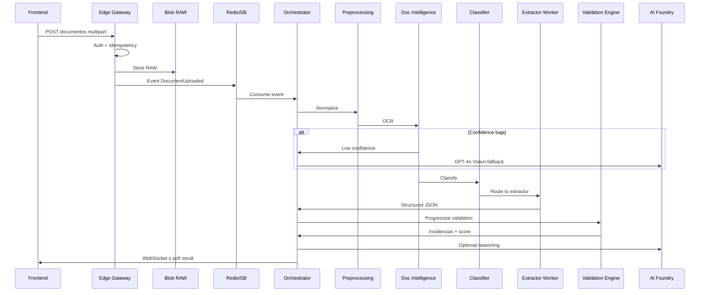

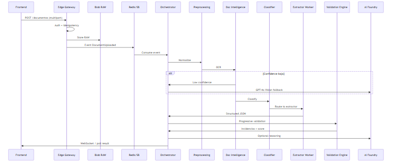

### 6.2 Formatos soportados

| Formato | Tratamiento |
|---------|-------------|
| PDF texto embebido | PDF Parser directo |
| PDF escaneado | PDF → PNG → OCR |
| JPG/PNG/HEIC | Normalización → OCR |
| Multi-página | Split + procesamiento paralelo (fan-out) |

### 6.3 Umbrales de confidence

| Nivel | Rango | Acción |
|-------|-------|--------|
| Alta | ≥ 0.85 | Extracción aceptada |
| Media | 0.65 – 0.84 | Extracción + advertencia menor |
| Baja | < 0.65 | Fallback GPT-4o Vision |
| Muy baja | < 0.50 | Incidencia mayor + revisión manual |

---

## 7. Validation Engine

### 7.1 Arquitectura interna

```mermaid
flowchart LR
    IN["Unified Expedition JSON"] --> DOC["Reglas documentales A/G"]
    DOC --> COH["Cruces semánticos C"]
    COH --> CAE["Reglas CAE D"]
    CAE --> FORM["Reglas formulario E"]
    FORM --> ANX["Anexos F"]
    ANX --> COMP["Completitud"]
    COMP --> SEV["Clasificación severidad"]
    SEV --> SCORE["Scoring Engine"]
    SCORE --> OUT["Incidencias + Estado"]
```

### 7.2 Tipos de regla

| Tipo | Implementación | Ejemplo |
|------|----------------|---------|
| Regex / Checksum | Código determinista | DNI, VIN (17 chars, sin I/O/Q) |
| Comparación cross-doc | Join por campo | RF-012 VIN |
| API externa | HTTP client | RF-015 antigüedad VO → API IDEAUTO |
| Rango numérico | Config parametrizable | RF-027 contraprestación 0.10–0.20 |
| Temporal | Date diff | RF-019 fechas actuación |
| Completitud | Checklist obligatorios | Documentos requeridos por tipología |

### 7.3 Versionado de reglas

```yaml
# rules/rf-012-vin.yaml
id: RF-012
version: "2.1.0"
nombre: Coherencia VIN
severidad: CRITICA
documentos:
  - factura_vn
  - ficha_tecnica_vn
  - permiso_circulacion_vo
campo: vin
tipo: cross_document_match
tolerancia: exact
api_validacion: ideauto/vehiculos/{vin}
```

### 7.4 Validación progresiva (implementación)

- **Trigger:** Eventos `DocumentExtracted`, `FieldModified`, `DocumentReplaced`.
- **Scope:** Re-evaluar reglas afectadas (matriz documento → reglas).
- **Cache:** Resultados parciales en Redis con TTL.
- **Latencia objetivo:** < 3 s reglas deterministas; < 10 s incluyendo Foundry opcional.

---

## 8. Azure AI Foundry y Knowledge Base

### 8.1 Azure Document Intelligence

| Capacidad | Uso |
|-----------|-----|
| OCR | Extracción texto general |
| Custom models | DNI, facturas, fichas técnicas |
| Layout analysis | Bounding boxes, tablas |
| Classification | Tipo documental |

### 8.2 Azure AI Foundry

| Capacidad | Uso |
|-----------|-----|
| GPT-4o | Razonamiento, explicaciones, resumen |
| GPT-4o Vision | Fallback OCR baja confidence |
| Prompt management | Versionado prompts |
| Evaluation | Regression testing prompts |
| Agents | Orquestación multi-paso |

### 8.3 RAG — Knowledge Base CAE

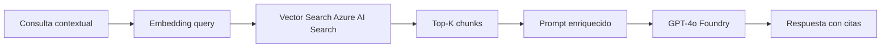

**Fuentes indexadas:**

- Procedimientos operativos IDEAUTO
- Normativa CAE y guías de gestión
- Checklists de revisión
- Casuísticas e incidencias frecuentes
- FAQ generadas por Operaciones
- Resoluciones históricas anonimizadas

### 8.4 Guardrails IA

| Guardrail | Implementación |
|-----------|----------------|
| Hallucination guard | Respuestas ancladas a chunks RAG + JSON expediente |
| PII masking | En logs y datasets |
| Prompt injection | Sanitización input usuario |
| Confidence threshold | No afirmar datos no presentes en extracción |
| Human review | Decisiones críticas siempre con revisión humana |

---

## 9. Flujos técnicos

| ID | Flujo | Descripción |
|----|-------|-------------|
| FT-01 | Creación expediente | CAE crea expediente; IA en standby |
| FT-02 | Subida documento | Gateway → Blob → Queue → Pipeline |
| FT-03 | Extracción IA | OCR → Classify → Extract → JSON |
| FT-04 | Validación progresiva | Rules → Cross → Score → UI feedback |
| FT-05 | Construcción expediente | Auto-fill + incidencias continuas |
| FT-06 | Validación final | Decision Engine pre-envío |
| FT-07 | Revisión Operaciones | Resumen IA + cola + validación humana |
| FT-08 | Feedback continuo | Correcciones → Labeling → Dataset → Evaluación → Fitness |
| FT-09 | Evaluación y fitness | Golden set → Fitness Engine → Promoción / Rollback |

### 9.1 FT-02 Subida documento (detalle)

```
Cliente → POST /api/v1/expedientes/{id}/documentos
       → Edge Gateway (auth, idempotency, validation)
       → Blob RAW (immutable)
       → Event DocumentUploaded → Redis/SB
       → Orchestrator → Fan-out worker
       → Response 202 Accepted { jobId, status: "PROCESANDO" }
       → Webhook/SSE → Frontend actualizado
```

### 9.2 FT-06 Validación final

```
Cliente → POST /api/v1/expedientes/{id}/enviar
       → Orchestrator → Validation Engine (full)
       → Foundry → Análisis global + resumen
       → Decision Engine → OK | REVIEW | REJECT
       → Si REJECT: 422 + incidencias bloqueantes
       → Si OK/REVIEW: Cola Operaciones
```

### 9.3 FT-08 Feedback continuo

```
Operaciones corrige dato → POST /api/v1/feedback
                        → Feedback Engine persiste + etiqueta sugerida
                        → Labeling Service (confirmación humana opcional)
                        → Dataset Builder (batch nocturno, versionado)
                        → Evaluation Pipeline (golden set + muestra producción)
                        → Fitness Engine calcula score candidato vs. activo
```

### 9.4 FT-09 Evaluación y promoción

```
MLOps dispara evaluación → Evaluation Pipeline ejecuta golden set
                        → Fitness Engine agrega componentes F₁–F₆
                        → Si fitness candidato ≥ activo + 1 y sin regresión crítica:
                              Model Registry promueve versión
                        → Si regresión > 2%: bloqueo + alerta
                        → Rollback manual/automático vía Registry (< 15 min)
```

---

## 10. Modelo de IA

### 10.1 Capas de IA

| Capa | Tecnología | Responsabilidad |
|------|------------|-----------------|
| **IA Extractiva** | Document Intelligence, OCR, Classifier | Campos estructurados, confidence |
| **IA Generativa** | Azure AI Foundry, GPT-4o, RAG | Resumen, explicación, asistencia |
| **IA Especializada** | Workers custom | Firmas, VO, VN, convenios |

### 10.2 Capas evolutivas de IA

| Capa | Tecnología | Evolución |
|------|------------|-----------|
| **Extractiva base** | Document Intelligence prebuilt + custom | Prompt tuning → custom models → fine-tuning |
| **Generativa** | Azure AI Foundry + RAG | Prompt Registry + evaluación Foundry |
| **Determinista** | Validation Engine YAML | Git versionado + tests regresión |
| **Fitness** | Fitness Engine + Evaluation Pipeline | Golden set + métricas producción |

### 10.3 Fine-tuning y extractores especializados

Cuando el fitness de un extractor (F₂ por artefacto) permanezca por debajo del umbral durante dos ciclos consecutivos:

1. Dataset Builder genera corpus específico del tipo documental.
2. Evaluation Pipeline evalúa modelo candidato (DI custom / fine-tune).
3. Fitness Engine compara candidato vs. producción.
4. Model Registry promueve solo si supera umbrales y pasa regresión cruzada.

### 10.4 Trazabilidad de versión IA por expediente

Cada evaluación de expediente persiste:

```json
{
  "expedienteId": "exp-123",
  "artefactos": {
    "extractorFactura": "2.3.1",
    "clasificador": "1.8.0",
    "promptResumen": "v14-hash-abc",
    "reglasCAE": "2026.07.01"
  },
  "fitnessSnapshot": 88.1
}
```

---

## 11. Modelo de datos

### 11.1 El Unified Expedition JSON como frontera de dominio

El **Unified Expedition JSON** representa la verdad única del estado documental para el motor de asistencia. Se almacena en Redis para computación reactiva y se consolida de forma asíncrona. Contiene tres capas agnósticas de la persistencia heredada:

| Capa | Contenido |
|------|-----------|
| **Procedencia** | Hashes SHA-256, mimetypes, marcas de tiempo, identificadores de workers |
| **Extracción estructurada** | Campos tipados (`vin`, `titular`, etc.) con valor, `bbox` y `confidence` |
| **Estado de validación** | Grafo de incidencias activas, histórico de correcciones y severidades |

Este modelo está **blindado** contra el esquema relacional del backend CAE v2.0. Cualquier cambio en el sistema heredado se resuelve exclusivamente en `integration-backend` (ACL); los servicios IA permanecen inmutables.

### 11.2 Entidades principales


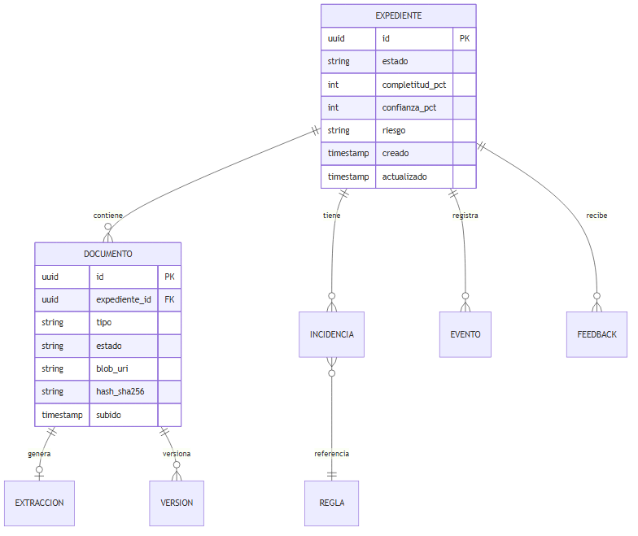

### 11.3 Almacenamiento

| Dato | Tecnología |
|------|------------|
| Metadatos expediente/incidencias | PostgreSQL (por defecto) — Cosmos DB si se requiere escala multi-región |
| Documentos RAW | Azure Blob (Hot) |
| Documentos optimizados (AVIF/WebP) | Blob + CDN |
| Estado FSM / cache | Redis |
| Vectores RAG | Azure AI Search |
| Datasets + golden set | Blob + PostgreSQL metadata |
| Evaluaciones / fitness | PostgreSQL |
| Model Registry | PostgreSQL + Foundry / Azure ML |
| Audit log | Blob append-only + Log Analytics |

---

## 12. Modelo de eventos

| Evento | Productor | Consumidores |
|--------|-----------|--------------|
| `DocumentUploaded` | Edge Gateway | Orchestrator |
| `DocumentExtracted` | Extraction Worker | Validation Engine |
| `ValidationCompleted` | Validation Engine | Orchestrator, Frontend |
| `IncidentDetected` | Validation Engine | Frontend, Audit |
| `ReviewRequested` | Decision Engine | Cola Operaciones |
| `FeedbackStored` | Feedback Engine | Labeling Service, MLOps Pipeline |
| `LabelConfirmed` | Labeling Service | Dataset Builder |
| `DatasetVersionCreated` | Dataset Builder | Evaluation Pipeline |
| `EvaluationCompleted` | Evaluation Pipeline | Fitness Engine, Dashboards |
| `FitnessCalculated` | Fitness Engine | Model Registry, Alerting |
| `ModelPromoted` | Model Registry | Workers, Validation Engine, Audit |
| `ModelRollback` | Model Registry | Workers, Alerting |
| `ExpedienteStateChanged` | Orchestrator | CAE Core, Audit |

**Ejemplo payload:**

```json
{
  "eventId": "evt-789",
  "type": "DocumentExtracted",
  "timestamp": "2026-07-03T10:15:00Z",
  "expedienteId": "exp-123",
  "payload": {
    "documentoId": "doc-456",
    "tipo": "factura_vn",
    "confidence": 0.97
  },
  "correlationId": "corr-abc",
  "traceId": "00-4bf92f3577b34da6a3ce929d0e0e4736-00"
}
```

---

## 13. APIs

### 13.1 Principios

- REST JSON sobre HTTPS
- OpenAPI 3.1 spec versionada
- Autenticación JWT Bearer (Entra ID)
- Idempotency-Key header en operaciones de escritura
- Correlation-Id / X-Request-Id para tracing

### 13.2 Endpoints principales

| Método | Ruta | Descripción |
|--------|------|-------------|
| POST | `/api/v1/expedientes/{id}/documentos` | Subir documento |
| GET | `/api/v1/expedientes/{id}/estado` | Estado, scoring, incidencias |
| GET | `/api/v1/expedientes/{id}/incidencias` | Listado incidencias |
| POST | `/api/v1/expedientes/{id}/validar` | Forzar re-validación |
| POST | `/api/v1/expedientes/{id}/enviar` | Solicitar envío a revisión |
| GET | `/api/v1/expedientes/{id}/resumen` | Resumen ejecutivo IA |
| POST | `/api/v1/expedientes/{id}/asistente` | Consulta asistente inteligente |
| POST | `/api/v1/feedback` | Registrar corrección |
| POST | `/api/v1/feedback/{id}/etiqueta` | Confirmar/modificar etiqueta labeling |
| GET | `/api/v1/mlops/datasets` | Listar datasets versionados |
| POST | `/api/v1/mlops/evaluaciones` | Lanzar evaluación offline |
| GET | `/api/v1/mlops/fitness` | Fitness global y por componente |
| GET | `/api/v1/mlops/fitness/{artefactoId}` | Fitness por extractor/prompt/reglas |
| POST | `/api/v1/mlops/promover` | Promoción controlada (requiere rol MLOps) |
| POST | `/api/v1/mlops/rollback` | Rollback a versión anterior |
| GET | `/api/v1/jobs/{jobId}` | Estado procesamiento async |

### 13.3 Ejemplo — Subir documento

**Request:**

```http
POST /api/v1/expedientes/exp-123/documentos
Authorization: Bearer {jwt}
Idempotency-Key: upload-doc-001
Content-Type: multipart/form-data

file: [binary]
tipoEsperado: factura_vn  (opcional)
```

**Response 202:**

```json
{
  "jobId": "job-xyz789",
  "documentoId": "doc-new-001",
  "estado": "PROCESANDO",
  "links": {
    "status": "/api/v1/jobs/job-xyz789"
  }
}
```

### 13.4 Ejemplo — Estado expediente

**Response 200:**

```json
{
  "expedienteId": "exp-123",
  "estado": "CON_INCIDENCIAS",
  "scoring": {
    "completitud": 85,
    "confianza": 78,
    "riesgo": "MEDIO"
  },
  "incidenciasAbiertas": {
    "criticas": 0,
    "mayores": 2,
    "menores": 1
  },
  "documentosPendientes": ["ultimo_ivtm", "convenio_cae"],
  "decisionPreEnvio": null
}
```

### 13.5 Códigos de error

| Código | Significado |
|--------|-------------|
| 400 | Payload inválido |
| 401 | No autenticado |
| 403 | Sin permisos |
| 409 | Duplicado (idempotency) |
| 422 | Validación fallida / incidencias bloqueantes |
| 429 | Rate limit excedido |
| 500 | Error interno |
| 503 | Servicio IA temporalmente no disponible |

---

## 14. Colas y orquestación

### 14.1 Estrategia dual de colas

| Cola | Uso | Garantías |
|------|-----|-----------|
| **Redis Queue** | Fast path, feedback UI tiempo real | At-least-once, baja latencia |
| **Azure Service Bus** | Reliable path, batch, reintentos | At-least-once, DLQ, sessions |

### 14.2 Resiliencia

| Patrón | Implementación |
|--------|----------------|
| Retry | Exponential backoff (max 3) |
| Dead Letter Queue | Mensajes fallidos tras N reintentos |
| Poison message | Alerta + manual review |
| Circuit Breaker | API IDEAUTO, Foundry, DI |
| Idempotency | Redis key TTL 24h |

### 14.3 Fan-out / Fan-in

- **Fan-out:** Orchestrator despacha N workers paralelos (uno por documento/página).
- **Fan-in:** Aggregator consolida JSON parciales en Unified Expedition JSON.
- **FSM:** Estados en Redis con TTL y persistencia checkpoint.

---

## 15. Seguridad

### 15.1 Identidad y acceso

| Capa | Tecnología |
|------|------------|
| Autenticación | Microsoft Entra ID + JWT |
| Autorización | RBAC por rol (cliente, operaciones, admin) |
| Service-to-service | Managed Identity |
| Secrets | Azure Key Vault |

### 15.2 Datos

| Requisito | Implementación |
|-----------|----------------|
| Cifrado tránsito | TLS 1.2+ |
| Cifrado reposo | Azure Storage SSE |
| PII | Minimización, masking en logs |
| GDPR | Retención configurable, derecho supresión |
| Blob RAW | Acceso restringido, SAS temporales |

### 15.3 Seguridad IA

| Riesgo | Mitigación |
|--------|------------|
| Prompt injection | Sanitización + system prompts reforzados |
| Data leakage | Tenant isolation, no cross-expediente en prompts |
| Model abuse | Rate limiting por tenant/usuario |
| Audit | Log completo prompts/respuestas (retención policy) |

---

## 16. Observabilidad

### 16.1 Métricas técnicas

| Métrica | Objetivo |
|---------|----------|
| Disponibilidad | > 99,5% |
| Latencia OCR (P95) | < 5 s |
| Latencia Foundry (P95) | < 8 s |
| Latencia reglas (P95) | < 1 s |
| Latencia total documento (P95) | < 10 s |
| Latencia total expediente | < 30 s |
| Coste por documento | Monitorizado |
| Coste por expediente | Monitorizado |
| Error rate | < 0,5% |

### 16.2 Métricas funcionales

| Métrica | Descripción |
|---------|-------------|
| Precisión clasificación | % tipo documental correcto |
| Precisión extracción | % campos clave correctos |
| Recall incidencias | % incidencias reales detectadas |
| First Time Right | Expedientes sin devolución |
| Incidencias pre-envío | % detectadas antes de Operaciones |
| Fitness global / por componente | Score 0–100, tendencia temporal |
| Cola labeling pendiente | Registros sin etiqueta confirmada |

### 16.3 Tracing

- OpenTelemetry end-to-end: Gateway → Orchestrator → DI → VE → Foundry
- Correlation-Id propagado en todos los headers
- Prompt tracing en Foundry (version + tokens + cost)

### 16.4 Dashboards

| Dashboard | Audiencia |
|-----------|-----------|
| Pipeline health | DevOps |
| Costes IA | Dirección / FinOps |
| Fitness y evaluación | MLOps / Dirección |
| KPIs funcionales | Operaciones / Producto |
| Audit trail | Compliance |

---

## 17. MLOps y Feedback Engine

### 17.1 Pipeline MLOps

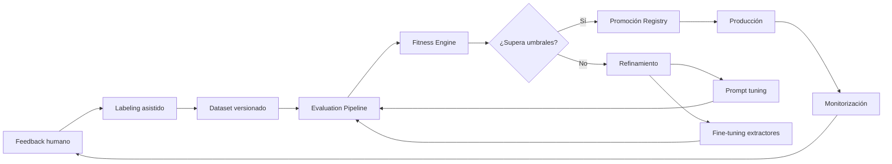

### 17.2 Artefactos versionados

| Artefacto | Repositorio | Evaluación |
|-----------|-------------|------------|
| Reglas CAE | Git (YAML) | Tests regresión + golden set |
| Prompts | Foundry Prompt Registry | Foundry Eval + fitness F₃/F₄ |
| Custom models DI | Azure ML / DI Studio | Fitness F₂ por extractor |
| Clasificador documental | DI / custom | Fitness F₁ |
| Datasets | Blob + metadata DB | Versionado semver |
| Golden set | Blob + PostgreSQL | ≥ 200 casos, revisión semestral |
| Evaluaciones / fitness | MLflow + PostgreSQL | Histórico comparativo |

### 17.3 Labeling y datasets

| Etiqueta | Uso en dataset |
|----------|----------------|
| `ACIERTO_IA` | Positive sample — refuerzo de extracciones/validaciones correctas |
| `FALLO_EXTRACCION` | Train/eval extractores |
| `FALLO_CLASIFICACION` | Train/eval clasificador |
| `FALLO_REGLA` | Mejora reglas YAML |
| `FALSO_POSITIVO` | Ajuste umbrales incidencias |
| `FALSO_NEGATIVO` | Recall reglas / validación |

Batch nocturno: Dataset Builder agrega feedback etiquetado, anonimiza PII y publica `DatasetVersionCreated`.

### 17.4 Regression testing

- Golden set anonimizado (todos los tipos documentales + casos borde).
- Umbral mínimo precisión extracción: 95%.
- Umbral mínimo recall incidencias críticas: 98%.
- Bloqueo de deploy si regresión fitness global > 2%.
- Bloqueo si caída > 1 punto en F₂ (extracción) o F₃ (validación).

### 17.5 Promoción y rollback

| Acción | Condición | SLA |
|--------|-----------|-----|
| Promoción automática | Fitness candidato ≥ activo + 1; sin regresión crítica | Tras evaluación aprobada |
| Promoción manual | Aprobación rol MLOps + comité | Bajo demanda |
| Rollback | Regresión en producción o fitness < umbral | < 15 min operativos |

---

## 18. Fitness Engine y evaluación

### 18.1 Arquitectura del Fitness Engine

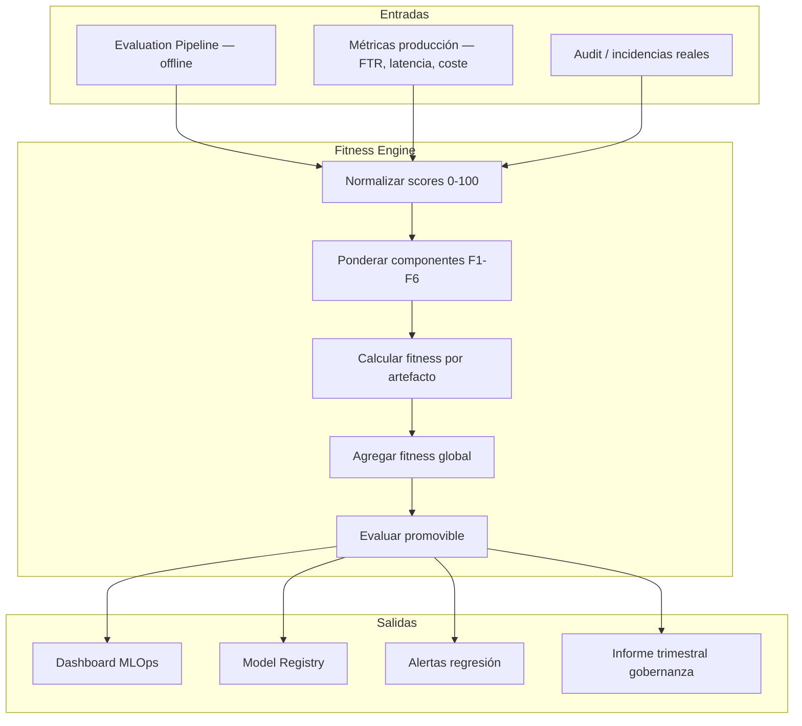

### 18.2 Componentes y pesos

| ID | Componente | Peso | Fuente de datos | Métrica base |
|----|------------|------|-----------------|--------------|
| F₁ | Clasificación | 15% | Evaluation Pipeline | F1-score tipo documental |
| F₂ | Extracción | 25% | Golden set + feedback | Exactitud campos clave (VIN, titular, matrícula) |
| F₃ | Validación | 25% | Golden set incidencias | Recall + precisión incidencias |
| F₄ | FTR | 15% | Producción Operaciones | % expedientes sin devolución primer envío |
| F₅ | Latencia | 10% | OpenTelemetry | P95 tiempo análisis documento |
| F₆ | Coste | 10% | FinOps / App Insights | Coste medio por expediente |

### 18.3 Fórmula

```
Fitness Global = Σ (peso_i × score_i)    // score_i normalizado 0–100

Promovible = (fitness_candidato ≥ fitness_activo + 1)
          AND (regresión_F2 ≤ 1 pt)
          AND (regresión_F3 ≤ 1 pt)
          AND (recall_críticas ≥ 98%)
```

### 18.4 Fitness por artefacto

| Artefacto | Componentes aplicables | Umbral mínimo |
|-----------|------------------------|---------------|
| Extractor DNI | F₂ campos identidad | 92 |
| Extractor Factura | F₂ VIN, matrícula, titular | 95 |
| Clasificador | F₁ | 95 |
| Bloque reglas C | F₃ recall cruce semántico | 98 |
| Prompt resumen | F₄ proxy utilidad | 80 |

### 18.5 Periodicidad

| Job | Frecuencia | Trigger |
|-----|------------|---------|
| Agregación métricas producción | Continua | Eventos + OTEL |
| Informe fitness semanal | Cron semanal | Azure Functions |
| Evaluación golden set | Mensual | MLOps manual/automático |
| Revisión gobernanza | Trimestral | Comité IA |

### 18.6 Ejemplo respuesta API

`GET /api/v1/mlops/fitness`

```json
{
  "fitnessGlobal": 88.1,
  "componentes": {
    "clasificacion": { "score": 96, "peso": 0.15, "contribucion": 14.4 },
    "extraccion": { "score": 92, "peso": 0.25, "contribucion": 23.0 },
    "validacion": { "score": 94, "peso": 0.25, "contribucion": 23.5 },
    "ftr": { "score": 68, "peso": 0.15, "contribucion": 10.2 },
    "latencia": { "score": 88, "peso": 0.10, "contribucion": 8.8 },
    "coste": { "score": 82, "peso": 0.10, "contribucion": 8.2 }
  },
  "versionActiva": {
    "extractorFactura": "2.3.1",
    "clasificador": "1.8.0",
    "reglasCAE": "2026.07.01"
  },
  "candidato": null,
  "calculadoEn": "2026-07-03T12:00:00Z"
}
```

---

## 19. Despliegue Azure

### 19.1 Vista física (referencia)

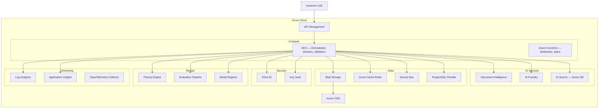

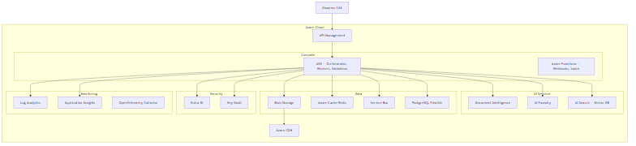

### 19.2 Entornos

| Entorno | Propósito |
|---------|-----------|
| DEV | Desarrollo, mocks API IDEAUTO |
| STAGING | Integración, regression tests |
| PRO | Producción con SLA |

### 19.3 CI/CD

- GitHub Actions / Azure DevOps
- Deploy independiente: reglas, prompts, workers, fitness evaluators, infra, **Storybook estático** (design review)
- Gate de CI: evaluación golden set + fitness mínimo antes de promoción a STAGING/PRO
- Pipeline por capa de pirámide §21: unit → integración → Storybook → contrato → E2E smoke → carga (release)
- Feature flags para activación gradual de reglas

---

## 20. KPIs técnicos

| KPI | Objetivo |
|-----|----------|
| Disponibilidad | > 99,5% |
| Tiempo análisis documento | < 10 s (P95) |
| Tiempo análisis expediente | < 30 s (P95) |
| Precisión OCR | > 95% |
| Precisión clasificación | > 95% |
| Precisión extracción campos clave | > 95% |
| Recall incidencias críticas | > 98% |
| **Fitness global** | **> 85; mejora trimestral demostrable** |
| Rollback artefacto IA | < 15 min |
| Trazabilidad | 100% |
| Expedientes auditables | 100% |
| First Time Right | > 60% |

---

## 21. Estrategia de calidad y testing

La calidad del sistema se garantiza mediante una **pirámide de testing** alineada con Nx: tests rápidos y numerosos en la base; tests de frontera en el medio; flujos E2E y pruebas de carga en la cima. La capa IA añade **regresión con golden set** y **fitness** como gate de CI.

> Diagrama: [`diagrams/07-testing-piramide.mmd`](diagrams/07-testing-piramide.mmd)

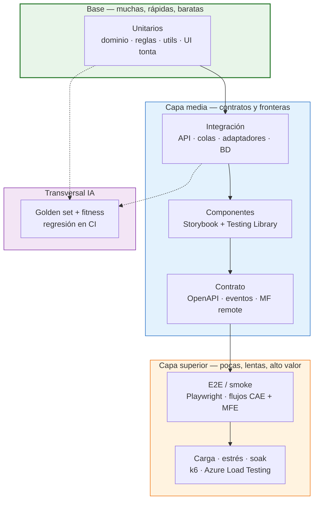

### 21.1 Capas de la pirámide

| Capa | Qué se prueba | Herramientas | Target Nx (ejemplo) | Frecuencia CI |
|------|---------------|--------------|---------------------|---------------|
| **Unitarios** | Dominio DDD, reglas RF, utils, mappers, componentes tontos | Jest / Vitest, Testing Library | `nx test <lib>` | Cada PR |
| **Integración** | Módulos NestJS, repos, adaptadores Azure (mocks/emuladores), colas | Jest + Supertest, Testcontainers, Azurite | `nx test <backend-lib> --configuration=integration` | Cada PR |
| **Contrato** | OpenAPI request/response, esquemas eventos, remote entry MFE | Pact / Schemathesis, contract tests | `nx run cae-api:contract-test` | Cada PR + nightly |
| **Componentes** | Estados UI, accesibilidad, interacción en aislamiento | Storybook, `@storybook/test`, test-runner | `nx storybook`, `nx test-storybook cae-ui-storybook` | Cada PR (UI) |
| **E2E** | Flujos usuario: subida doc → incidencias → envío → Operaciones; MFE embebido | Playwright (preferido) o Cypress | `nx e2e cae-assistant-e2e` | Nightly + pre-release |
| **Integración E2E** | CAE host + remote MFE + backend IA en entorno STAGING | Playwright multi-app | `nx e2e cae-integration-e2e` | STAGING deploy |
| **Carga / estrés** | Throughput documentos, latencia P95/P99, colas, autoscaling AKS | k6, Azure Load Testing, JMeter | `nx run cae-load-test:stress` | Mensual + pre-PRO |
| **Soak / resistencia** | Fugas memoria, degradación 24–72 h bajo carga sostenida | k6 + monitorización | Pipeline programado | Trimestral |
| **IA — golden set** | Precisión clasificación, extracción, incidencias vs dataset etiquetado | Evaluation Pipeline + Fitness Engine | `nx run mlops-backend:evaluate` | Gate promoción |
| **IA — fitness gate** | Score compuesto F₁–F₆ ≥ umbral antes de STAGING/PRO | Fitness Engine | CI gate en §19.3 | Cada release |

### 21.2 Alcance por capa del monorepo

| Ruta | Unitarios | Integración | Storybook | E2E |
|------|-----------|-------------|-----------|-----|
| `libs/isomorphic/cae/core` | Reglas, agregados, value objects | No aplica | No aplica | No aplica |
| `libs/node/cae/*-backend` | Application services, domain | Adaptadores, API modules | No aplica | No aplica |
| `libs/react/cae/ui` | Render + eventos | No aplica | **Obligatorio** | No aplica |
| `libs/react/cae/feature-*` | Mappers ligeros | MSW / mock API | Opcional | vía E2E |
| `apps/cae-ia-backend` | No aplica | Smoke API | No aplica | Parcial |
| `apps/cae-assistant-mfe` | No aplica | No aplica | No aplica | Playwright |
| `apps/cae-ui-storybook` | No aplica | No aplica | Catálogo + interaction | No aplica |

### 21.3 Escenarios E2E prioritarios

| ID | Flujo | Actores |
|----|-------|---------|
| E2E-01 | Crear expediente → subir DNI + factura → ver incidencias en sidebar | Cliente |
| E2E-02 | Resolver incidencia menor → recalcular completitud | Cliente |
| E2E-03 | Subida documento ilegible → feedback OCR + incidencia calidad | Cliente |
| E2E-04 | Envío expediente → decisión Review → cola Operaciones | Cliente + Operaciones |
| E2E-05 | MFE React cargado en slot CAE v2 (Module Federation smoke) | Sistema |
| E2E-06 | Regresión golden set post-deploy STAGING | CI / MLOps |

### 21.4 Pruebas de carga y estrés

| Escenario | Objetivo | Criterio de éxito |
|-----------|----------|-------------------|
| **Carga nominal** | 100 docs/min sostenidos 30 min | P95 análisis doc < 10 s; error rate < 0,1% |
| **Pico** | 3× carga nominal 10 min | Autoscaling AKS; cola DLQ < umbral |
| **Estrés** | Incremento gradual hasta fallo | Identificar cuello de botella; sin pérdida de mensajes |
| **Soak** | 50% carga nominal 24 h | Sin memory leak; latencia estable |
| **Chaos ligero** | Reinicio pods + retry colas | Idempotencia; recuperación < 5 min |

Herramientas recomendadas: **k6** (scripts versionados en repo), **Azure Load Testing** para entornos STAGING espejo de PRO.

### 21.5 Gates de CI/CD

| Gate | Condición | Bloquea |
|------|-----------|---------|
| G1 — Lint + unit | 100% libs afectadas pasan `test` + `lint` | Merge PR |
| G2 — Integración | Backend libs críticas pasan integration suite | Merge PR (backend) |
| G3 — Storybook | Componentes `ui/` modificados tienen stories + test-runner OK | Merge PR (frontend) |
| G4 — Contrato | OpenAPI diff compatible; contract tests verdes | Merge PR (API) |
| G5 — Golden set | Fitness ≥ umbral STAGING (p. ej. 85) | Deploy STAGING |
| G6 — E2E smoke | Suite smoke Playwright en STAGING | Deploy PRO |
| G7 — Carga | Informe k6 dentro de SLO (pre-release mayor) | Release PRO |

### 21.6 Objetivos de cobertura (orientativos)

| Ámbito | Cobertura mínima | Notas |
|--------|------------------|-------|
| `isomorphic/cae/core` (reglas) | ≥ 90% líneas | Prioridad absoluta |
| `*-backend` application layer | ≥ 80% | Excluir adaptadores cloud mockeados |
| `react/cae/ui` | ≥ 70% + 100% stories | Calidad visual vía Storybook |
| E2E | Flujos críticos §21.3 | No sustituye unitarios de dominio |

---

## 22. Monorepo Nx y organización del repositorio base

El monorepo Nx (`cae-ia-monorepo/`) constituye el núcleo operativo de la estrategia de evolución tecnológica: no es una mera agrupación de código, sino la infraestructura donde se aíslan los estándares modernos de la deuda técnica circundante.

### 22.1 Estrategia Strangler Fig mediante librerías acoplables

Toda la lógica de negocio, reglas de dominio y abstracciones de puertos se desarrollan como **librerías Nx independientes** (`libs/isomorphic/cae/core`). Las aplicaciones en `apps/` operan exclusivamente como hosts de orquestación y empaquetado.

| Objetivo | Cómo se logra |
|----------|---------------|
| **Inmunidad frente al legado** | El código de extracción, validación y decisión nace con cobertura de tests bajo estándares DDD/hexagonal; el backend heredado no contamina el nuevo dominio |
| **Reutilización en consolidación** | Al desmantelar el backend legacy, las libs `*-backend` y `core` se conectan a los hosts definitivos sin reescritura |
| **Tolerancia cero a regresiones** | La lógica interna del sistema heredado no se modifica; la IA se integra como capacidad embebida vía ACL y MFE |

### 22.2 Matriz de librerías y responsabilidades

| Ruta objetivo | Tipo | Responsabilidad |
|---------------|------|-----------------|
| `libs/isomorphic/cae/core` | Dominio | Agregados, reglas CAE, eventos; agnóstico de framework |
| `libs/isomorphic/cae/api` | Contratos | OpenAPI, DTOs compartidos front/back |
| `libs/isomorphic/shared/model` | Modelo compartido | Value Objects (EntityId, Money, Status) |
| `libs/node/cae/*-backend` | Backend | NestJS modules hexagonales por capacidad |
| `libs/node/shared-infrastructure` | Infraestructura transversal | Prisma, guards, outbox, utilities transversales |
| `libs/node/adapters/*` | Adaptadores | Integraciones externas (Verifactu, email, webhooks) |
| `libs/react/cae/*` | UI React Fase 1 | MFE asistencia integrado en CAE v2 |
| `libs/angular/cae/*` | UI Angular evolución | Stack propuesto, módulos nativos |
| `libs/browser/shared/ui-kit` | UI Components | Componentes tontos, presentacionales |
| `libs/browser/shared/data-access` | Data Access | Servicios HTTP, interceptores, plugin store |
| `libs/browser/feature/*` | Features UI | Smart components (contenedores) |
| `libs/browser/shell/*` | Shell | Rutas, lazy loading, guards de plugin |

### 22.3 Reglas de dependencias estrictas (Nx + ESLint module boundaries)

| Origen | Permitido depender de | Justificación / Nota |
|--------|---------------------|---------------------|
| `isomorphic/core` | Ninguno | Dominio puro, sin dependencias externas |
| `isomorphic/api` | `isomorphic/core` | Solo DTOs y contratos del dominio |
| `node/backend/<dominio>` | `isomorphic/core`, `isomorphic/api`, `shared-infrastructure` | Sólo lógica de aplicación y adaptadores |
| `node/shared-infrastructure` | `isomorphic/core`, `isomorphic/api` | Utilities, guards, Prisma, outbox reutilizable |
| `browser/shared/ui-kit` | Ninguno | UI pura, sin lógica de negocio ni servicios |
| `browser/data-access` | `isomorphic/api`, `browser/shared/ui-kit` | Servicios HTTP, stores, multitenancy; no depende de backend directo |
| `browser/feature/<dominio>` | `data-access`, `shared/ui-kit` | Componentes listos, orquestan UI |
| `libs/plugins/*` | `browser/feature`, `isomorphic/core`, `isomorphic/api` | Activar/desactivar módulos sin romper dominios |

Regla de dependencias: **las capas superiores (UI/feature) pueden depender de capas inferiores (core/api), nunca al revés.**

### 22.4 BaseRepository Pattern (obligatorio para todos los dominios)

Propósito: garantizar consistencia en todos los repositorios de dominio y aplicar filtrado por `tenantId` automáticamente (seguridad por defecto).

Estrategia de implementación:
- Carpeta `repositories/` dentro de `libs/node/cae/<dominio>-backend`.
- Extender siempre de `BaseRepository`.
- Implementar métodos obligatorios + específicos del dominio.
- Inyectar repositorio en Services vía puertos.
- Mantener `tenantId` como parámetro obligatorio (aunque fijo actualmente).

Beneficios:
- Consistencia total entre dominios.
- Seguridad por defecto contra fugas de datos.
- Fácil activación de multi-tenant.
- Testabilidad alta (mocks del puerto o base repository).

### 22.5 Unit of Work (UoW) y transaccionalidad

Propósito: coordinar la escritura de cambios cuando un proceso involucra múltiples agregados o repositorios. Garantiza que la lógica de negocio y la persistencia del evento en outbox ocurran en la misma transacción.

Implementación con Prisma:
- `UnitOfWorkPort` en core (interfaz).
- `PrismaUnitOfWork` en infrastructure (implementa $transaction).
- El Service de aplicación orquesta: recibe UoW → ejecuta `runInTransaction` → pasa `tx` a repositorios → rollback automático si falla.

### 22.6 Base Controller Pattern

Propósito: normalizar la entrada HTTP y reducir boilerplate.

Funciones:
- Extracción automática de `tenantId` y `userId` del request (inyectados por Guards).
- Gestión de respuestas uniforme (éxito/error).
- Seguridad por construcción: centraliza el filtrado del tenant.

Ubicación: `libs/node/shared-infrastructure/api/base.controller.ts`

---

## 23. Riesgos explícitos y mitigaciones

### 23.1 Riesgos arquitectónicos de integración (sistema heredado)

| ID | Riesgo | Impacto | Mitigación |
|----|--------|---------|------------|
| **R-01** | Incompatibilidad de toolchain del frontend heredado para Module Federation | Alto | Patrón Smart/Dumb en libs UI; fallback a Web Components si el host no acepta federación nativa |
| **R-02** | Condiciones de carrera entre workers (`DocumentExtracted`) y ediciones manuales (`FieldModified`) | Alto | FSM en Redis con concurrencia optimista; versiones obsoletas del Unified Expedition JSON se rechazan |
| **R-03** | Degradación por llamadas bloqueantes al backend heredado | Muy alto | ACL asíncrona vía Service Bus; servicios IA resuelven contra caché Redis sin esperar al core legacy |
| **R-04** | Explosión de costes/latencia por uso indiscriminado de GPT-4o Vision | Medio-alto | Cortafuegos de legibilidad en Preprocessing (§4.1.2); fallback solo tras fallo explícito de DI (< 0,85) |

### 23.2 Riesgos operativos del monorepo

| ID | Riesgo | Impacto | Señal de alerta | Mitigación |
|----|--------|---------|-----------------|------------|
| R1 | Olvido de filtro `tenant_id` | Crítico (datos) | Code review, tests sin aislamiento | BaseRepository + reviews + tests de aislamiento |
| R2 | Tenant no validado en BD | Alto (suplantación) | Cabecera presente pero UUID inexistente | Fortalecer TenantGuard y validación en BD |
| R3 | Duplicación de eventos (outbox) | Alto (pagos/email duplicados) | Reintentos sin idempotencia | Idempotencia + claves únicas en DB |
| R4 | Contención / locks en agregados calientes | Medio (timeouts) | Timeouts en picos | Transacciones cortas + colas para procesos pesados |
| R5 | Violación de fronteras de capas | Medio | Imports incorrectos en PR | ESLint module boundaries + tags Nx estrictos |
| R6 | Observabilidad insuficiente | Alto | "No sabemos qué pasó" en incidentes | Logs estructurados + métricas + trazas obligatorias |
| R7 | Extracción prematura a microservicio | Alto | Latencia y bugs distribuidos | Reglas claras de Strangler; no antes de 6 meses |
| R8 | Plugins sin paridad front/back | Medio | 403 inesperados o UX rota | Contratos compartidos + guards |

---

## 24. Visión final

El sistema de asistencia inteligente para la Plataforma CAE v3.0 establece el nuevo estándar de ingeniería para IDEAUTO / Babooni. Al encapsular la lógica cognitiva mediante **arquitectura hexagonal** y **DDD**, la organización adquiere una plataforma elástica, agnóstica de proveedores de IA y protegida frente a la obsolescencia técnica.

La introducción de este diseño mediante **microfrontends** y **capa anticorrupción** garantiza un despliegue antifrágil: aporta valor operativo inmediato (validación progresiva, auto-aprobación, reducción de carga Operaciones) mientras ejecuta de forma progresiva la sustitución y modernización del núcleo heredado — **sin modificar la lógica interna del sistema actual**.

La arquitectura utiliza **Azure AI Foundry** como núcleo de razonamiento, **Document Intelligence** para captura documental y **Knowledge Base CAE** (RAG) para recomendaciones contextualizadas. La implementación se basa en **libs Nx independientes** (hexagonal + DDD):

- **Meses 1–2:** App IA (`cae-assistant-mfe` React) integrada en CAE v2; calibración del Decision Engine.
- **Meses 2–5:** MFE temporal entre CAE React y CAE Angular nueva (Strangler Fig).
- **Mes 6:** plataforma Angular única, IA nativa, sin Module Federation — ver [`ESTRATEGIA-MIGRACION-FRONTEND-CAE.md`](ESTRATEGIA-MIGRACION-FRONTEND-CAE.md) §8.

La **pirámide de testing** (unitarios → integración → Storybook → E2E → carga/estrés) y el **golden set con fitness** garantizan calidad continua sin sacrificar velocidad de entrega.

El **Validation Engine** determinista — complementado, no sustituido, por razonamiento generativo — refleja el conocimiento funcional del proceso CAE y reduce la intervención manual de Operaciones. El **Feedback Engine**, **Fitness Engine** y pipeline **MLOps** cierran el ciclo de mejora continua con decisiones de promoción o rollback basadas en **fitness medible**.

> Documento de referencia para equipos de Arquitectura, Desarrollo, IA, DevOps, Operaciones, QA y Dirección.

---

*Diseño Técnico de Referencia — Sistema de Asistencia Inteligente para Plataforma CAE.*
