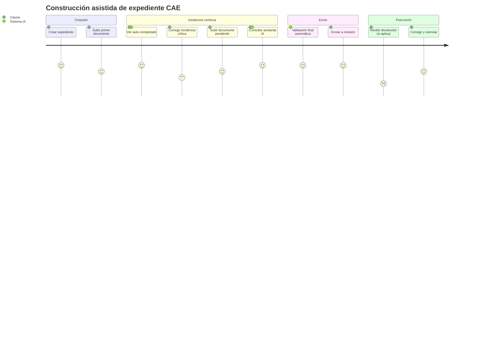
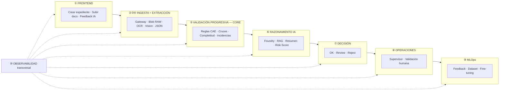
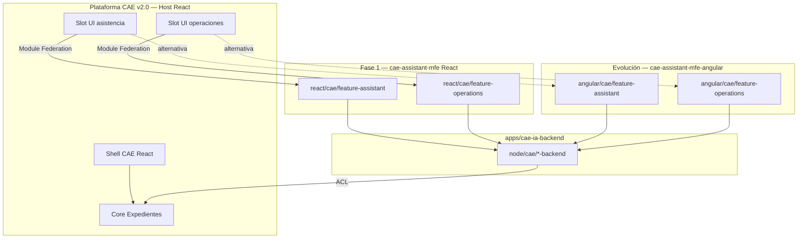
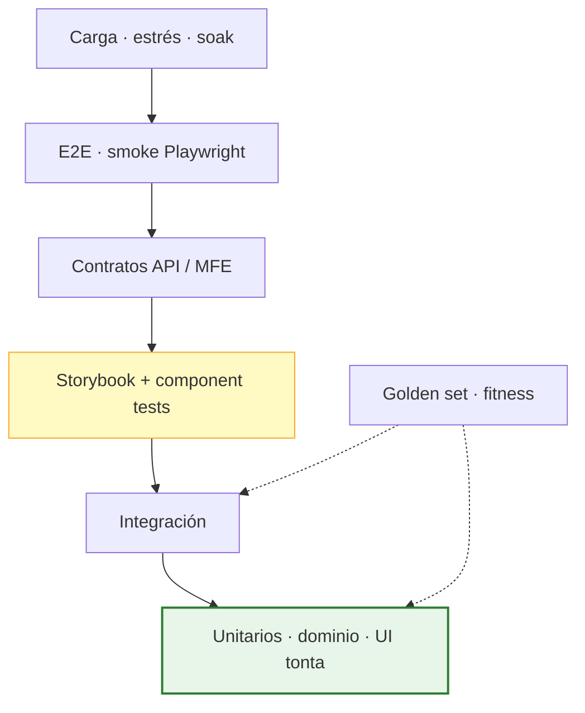
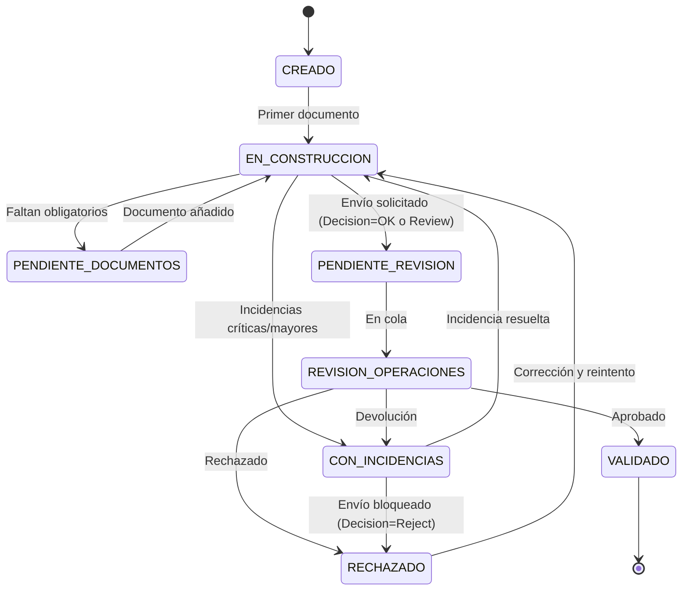
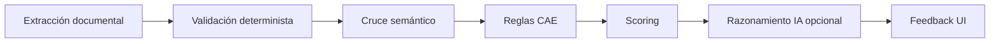
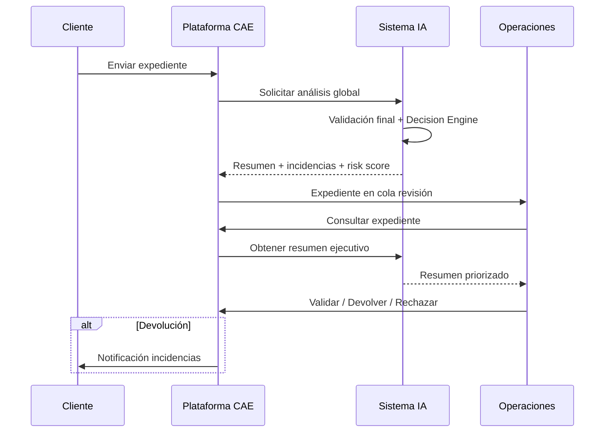
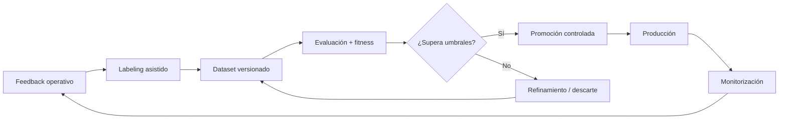

# ESPECIFICACIÓN FUNCIONAL

## SISTEMA DE ASISTENCIA INTELIGENTE PARA LA PLATAFORMA CAE v3.0

| Campo | Valor |
|-------|-------|
| **Versión** | 3.0 |
| **Estado** | Versión de entrega |
| **Fecha** | 03/07/2026 |
| **Proyecto** | Plataforma CAE v2.0 — Desarrollo IA |
| **Clasificación** | Confidencial — IDEAUTO / Babooni |

---

## Histórico de revisiones

| Rev. | Fecha | Naturaleza del cambio |
|------|-------|------------------------|
| 0 | 27/06/2026 | Primera versión del documento (Borrador) |
| 1 | 27/06/2026 | Incorporación elementos de negocio (Operaciones) |
| 2 | 03/07/2026 | Versión consolidada: validación progresiva, MLOps, modelo de fitness, integraciones, requisitos no funcionales y catálogo completo de reglas |
| 3 | 03/07/2026 | Enfoque de implementación: arquitectura hexagonal, DDD y microservicios |
| 4 | 03/07/2026 | Arquitectura objetivo monorepo Nx (`libs`/`apps`), monolito modular vs microservicios, microfrontends CAE v2 |
| 5 | 03/07/2026 | Stack UI React (default CAE v2) + Angular opcional MFE; arquitectura dual documentada |
| 6 | 03/07/2026 | Pirámide de testing, Storybook, componentes listos/tontos en frontend |
| 7 | 03/07/2026 | Stack UI: React Fase 1 acordada; Angular como evolución arquitectónica |
| 8 | 03/07/2026 | Enlace a [`ESTRATEGIA-MIGRACION-FRONTEND-CAE.md`](ESTRATEGIA-MIGRACION-FRONTEND-CAE.md) — Strangler Fig React→Angular |
| 9 | 03/07/2026 | Tono de entrega al cliente; eliminación de lenguaje interno |
| 10 | 03/07/2026 | Tres apps en paralelo; MFE temporal; CAE Angular sustituye React (§6.5.2) |
| 11 | 03/07/2026 | Respuesta explícita a requisitos Operaciones IDEAUTO; posicionamiento CAE vs OCR genérico; objetivo reducción carga operativa |

---

## Índice de contenidos

1. [Introducción](#1-introducción)
2. [Objetivos de negocio](#2-objetivos-de-negocio)
3. [Alcance](#3-alcance)
4. [Principios funcionales](#4-principios-funcionales)
5. [Actores y casos de uso](#5-actores-y-casos-de-uso)
6. [Arquitectura funcional](#6-arquitectura-funcional)
7. [Flujo funcional detallado](#7-flujo-funcional-detallado)
8. [Estados del expediente y del documento](#8-estados-del-expediente-y-del-documento)
9. [Capacidades funcionales](#9-capacidades-funcionales)
10. [Validación progresiva (núcleo del sistema)](#10-validación-progresiva-núcleo-del-sistema)
11. [Sistema de incidencias y severidades](#11-sistema-de-incidencias-y-severidades)
12. [Sistema de scoring](#12-sistema-de-scoring)
13. [Catálogo de reglas funcionales (Bloques A–G)](#13-catálogo-de-reglas-funcionales-bloques-ag)
14. [Matrices documentales](#14-matrices-documentales)
15. [Pack documental y tipologías de expediente](#15-pack-documental-y-tipologías-de-expediente)
16. [Experiencia de usuario](#16-experiencia-de-usuario)
17. [Revisión Operaciones](#17-revisión-operaciones)
18. [Knowledge Base y asistencia contextual](#18-knowledge-base-y-asistencia-contextual)
19. [Feedback operativo](#19-feedback-operativo)
20. [MLOps y evolución de modelos IA](#20-mlops-y-evolución-de-modelos-ia)
21. [Modelo de fitness y evaluación](#21-modelo-de-fitness-y-evaluación)
22. [Integraciones externas](#22-integraciones-externas)
23. [Requisitos no funcionales](#23-requisitos-no-funcionales)
24. [Histórico y analítica](#24-histórico-y-analítica)
25. [Indicadores de éxito (KPIs)](#25-indicadores-de-éxito-kpis)
26. [Gobernanza y evolución planificada](#26-gobernanza-y-evolución-planificada)
27. [Visión final](#27-visión-final)

---

## 1. Introducción

### 1.1 Objetivo

El objetivo de este proyecto es incorporar capacidades de **Inteligencia Artificial de asistencia continua** en la Plataforma CAE v2.0 con el fin de asistir a los usuarios durante la creación, validación y revisión de expedientes de Certificados de Ahorro Energético (CAE).

La solución deberá ayudar a:

- Reducir errores documentales y funcionales.
- Mejorar la calidad de la documentación aportada.
- **Detectar incidencias de forma temprana**, conforme se incorporan documentos.
- **Validar progresivamente** el expediente aplicando reglas de negocio CAE específicas.
- **Cruzar información entre documentos** en tiempo real.
- Reducir devoluciones de expedientes.
- Disminuir la carga operativa del equipo de revisión de IDEAUTO.
- Mejorar los tiempos de tramitación.

> **Principio rector:** La extracción automática de información desde documentos (OCR + IA) constituye **únicamente una de las capacidades** del sistema. El objetivo principal es la **validación continua y asistida del expediente** durante todo su ciclo de vida, con **mejora evolutiva** de modelos, reglas y extractores mediante un ciclo MLOps gobernado.

### 1.2 Contexto del negocio CAE

Un expediente CAE agrupa la documentación necesaria para certificar el ahorro energético derivado de la sustitución de un vehículo de combustión (VO) por un vehículo eléctrico (VN). El proceso exige:

- Documentación acreditativa del titular, vehículos y operación de sustitución.
- Coherencia entre múltiples fuentes (DNI, facturas, fichas técnicas, permisos, IVTM, convenios).
- Cumplimiento de requisitos regulatorios y de negocio IDEAUTO (antigüedad VO, tipología BEV, plazos, ahorro energético).
- Revisión humana final por el equipo de Operaciones antes de la tramitación definitiva — con el objetivo de que la **IA asuma progresivamente las comprobaciones** que hoy realiza ese equipo de forma manual (§1.7, §17.4).

El sistema de asistencia inteligente no sustituye el proceso CAE: **lo acompaña**, detectando errores en origen, reduciendo retrabajo y generando datos para la **evolución continua** de la calidad del servicio IA.

### 1.3 Alcance funcional del documento

Este documento define de forma integral:

- Comportamiento esperado del sistema frente a clientes, Operaciones y supervisores.
- Reglas de negocio aplicables (catálogo RF-001 a RF-030).
- Flujos, estados, incidencias, scoring y decisiones pre-envío.
- Capacidades de extracción, validación, razonamiento y asistencia conversacional.
- Ciclo de feedback, **MLOps**, **cálculo de fitness** y criterios de promoción o rollback de modelos.
- Integraciones, requisitos no funcionales y KPIs de negocio y calidad IA.

### 1.4 Definiciones clave

| Término | Definición |
|---------|------------|
| **Expediente** | Conjunto documental y formulario CAE asociado a una operación de sustitución VO→VN |
| **Validación progresiva** | Recálculo del estado del expediente tras cada evento documental o de datos |
| **Confidence** | Grado de confianza (0–1) de un dato extraído automáticamente |
| **Fitness** | Puntuación compuesta que mide la calidad global de un modelo, extractor, prompt o versión de reglas |
| **Feedback** | Corrección humana registrada que alimenta el ciclo de mejora |
| **Golden set** | Conjunto de expedientes/documentos de referencia para evaluación y regresión |
| **Human in the Loop** | Supervisión humana obligatoria en decisiones finales de aprobación |
| **Operaciones IDEAUTO** | Equipo de revisión CAE de IDEAUTO (Operaciones); responsable de la validación humana final antes de tramitación |

### 1.5 Posicionamiento: solución CAE específica, no OCR genérico

Este documento define una **plataforma de asistencia inteligente para el proceso CAE**, diseñada a partir del **conocimiento funcional acumulado en la colaboración con IDEAUTO** sobre flujos operativos, reglas de negocio, tipologías documentales y casuísticas de revisión. **No se trata de un producto documental genérico** aplicable a cualquier gestor documental.

| Perspectiva | Solución OCR / extracción genérica | Esta solución CAE |
|-------------|-----------------------------------|-------------------|
| **Propósito** | Digitalizar documentos y extraer campos | **Validar el expediente CAE** conforme se construye |
| **Momento de validación** | Tras extracción; revisión al final | **Validación progresiva** tras cada documento o dato |
| **Reglas de negocio** | Genéricas o inexistentes | **Catálogo RF-001 a RF-030** (Bloques A–G), específicas CAE |
| **Cruces documentales** | Limitados o manuales | **Automáticos en tiempo real** (titular, VIN, matrícula, fechas…) |
| **Rol de Operaciones IDEAUTO** | Revisión funcional **completa manual** de cada expediente | **Evolución:** la IA ejecuta las comprobaciones; Operaciones supervisa **excepciones** |
| **Valor diferencial** | Ahorro de tecleo | **Detección temprana de incidencias**, FTR, reducción de devoluciones y **menor carga operativa** |

> La **extracción documental (OCR + IA)** es un **medio** para alimentar el motor de validación, no el fin del sistema. El **núcleo funcional** es el **Validation Engine** con reglas CAE deterministas (§10, §13).

### 1.6 Cobertura de los requisitos del proceso CAE (Operaciones IDEAUTO)

Los siguientes requisitos, planteados por el equipo de Operaciones IDEAUTO en la revisión del documento, quedan **explícitamente cubiertos** en esta especificación:

| Requisito | Cómo se implementa | Referencia |
|-----------|-------------------|------------|
| Validar el expediente **conforme se incorporan** documentos y datos | Pipeline de **validación progresiva** disparado por cada evento documental o de formulario | §10, §7 Fase 3, CF-010 |
| **Cruzar información** entre los distintos documentos aportados | Bloque C (RF-011–RF-014): titular, VIN, matrícula, marca/modelo vs. BD IDEAUTO | §13.3, §10.3 |
| **Detectar incoherencias en tiempo real** | Recálculo < 10 s; incidencias con severidad y explicabilidad en UI cliente | §11, §16.1, RNF latencia |
| **Informar al usuario** de errores o ausencias **antes** del envío a revisión | Incidencias críticas/mayores bloquean envío; checklist de completitud permanente | §11.1, §17.3, §15.3 |
| **Reducir la carga operativa** del equipo de revisión de IDEAUTO | Resumen ejecutivo IA, priorización, FTR; objetivo -40 % tiempo revisión | §17.4, OBJ-03, OBJ-09, §25 |
| **Reglas de negocio específicas CAE** (no genéricas) | 30 reglas en 7 bloques + matrices documentales + integración API IDEAUTO | §13, §14, §22 |
| **Conocimiento funcional del proceso** (no solo captura documental) | Knowledge Base RAG, procedimientos IDEAUTO, feedback de Operaciones → MLOps | §18, §19, §20 |

### 1.7 Objetivo estratégico: la IA asume el trabajo de validación de Operaciones IDEAUTO

**Objetivo a futuro del programa:** que la IA sea capaz de **realizar el trabajo de validación funcional** que hoy ejecuta manualmente el **equipo de revisión de Operaciones IDEAUTO** (validar coherencia documental, aplicar reglas CAE, detectar incidencias, comprobar completitud), de modo que ese equipo **deje de repetir comprobaciones rutinarias** y se concentre en **excepciones, casos complejos, auditoría de calidad y aprobación formal**.

| Hoy (sin IA) | Objetivo con la solución |
|--------------|--------------------------|
| El cliente construye el expediente **sin feedback funcional** en tiempo real | El cliente recibe incidencias y recomendaciones **mientras construye** |
| Operaciones **revisa manualmente** cada campo, cruce y regla CAE | La IA **ejecuta las mismas comprobaciones** (RF-001–RF-030) de forma automática |
| Operaciones **detecta incidencias** que el cliente no corrigió | La IA **detecta y bloquea** incidencias críticas/mayores **antes del envío** |
| **Alta carga operativa** y devoluciones frecuentes | **Reducción medible** de tiempo de revisión (-40 % objetivo) y devoluciones (-30 % objetivo) |

> **Matiz importante (Human in the Loop):** la **aprobación formal** del expediente para tramitación definitiva **permanece siempre humana** (§3.2, PF-04). Lo que evoluciona es **quién realiza el trabajo analítico de validación**: pasa de ser **100 % manual por Operaciones** a ser **ejecutado por la IA**, con Operaciones supervisando el resultado, atendiendo excepciones y aprobando.

**Evolución del reparto de trabajo (horizonte 6 meses):**

| Horizonte | Cliente | Sistema IA | Operaciones IDEAUTO |
|-----------|---------|------------|---------------------|
| **Meses 1–2** | Corrige incidencias en origen gracias al feedback en tiempo real | Validación progresiva + reglas CAE activas; MFE en producción | Recibe expedientes **pre-validados** con resumen ejecutivo IA; revisión acotada |
| **Meses 3–4** | Menos reenvíos; mayor FTR | Cruces, completitud y scoring consolidados; RAG operativo | Atiende **solo excepciones** y casos marcados como Review |
| **Meses 5–6** | Expedientes llegan mayoritariamente limpios | IA replica el know-how operativo acumulado (reglas + feedback + golden set) | **Supervisión** de muestra, casos complejos y aprobación formal |
| **Evolución continua** | Experiencia asistida | Aprendizaje MLOps: cada corrección de Operaciones mejora reglas y modelos | Carga operativa **decreciente**; foco en gobernanza y calidad |

---

| ID | Objetivo | Métrica asociada |
|----|----------|------------------|
| OBJ-01 | Reducir expedientes devueltos por errores documentales | % devoluciones / expedientes enviados |
| OBJ-02 | Reducir tiempo medio de creación de expedientes | Minutos desde creación hasta envío válido |
| OBJ-03 | Reducir tiempo medio de revisión por Operaciones | Minutos de revisión humana / expediente |
| OBJ-04 | Detectar incidencias **antes** del envío a revisión | % incidencias detectadas pre-envío |
| OBJ-05 | Mejorar calidad global de expedientes | First Time Right (FTR) |
| OBJ-06 | Disponer de métricas objetivas sobre errores frecuentes | Dashboard de calidad por marca/concesionario |
| OBJ-07 | Mejorar continuamente la calidad de la IA | Fitness de modelos y extractores en mejora trimestral |
| OBJ-08 | Reducir falsos positivos/negativos en validación | Recall y precisión de incidencias monitorizados |
| OBJ-09 | **Automatizar el trabajo de validación funcional** que hoy realiza Operaciones IDEAUTO manualmente | % comprobaciones CAE ejecutadas por IA vs. humano; reducción horas revisión / expediente |

---

## 3. Alcance

### 3.1 Incluido

- Asistencia continua al cliente durante construcción del expediente.
- Clasificación documental automática.
- OCR, extracción estructurada y auto-completado de campos.
- **Validación documental** (legibilidad, integridad, tipo).
- **Validación funcional CAE** (reglas de negocio deterministas).
- **Validación progresiva** tras cada documento o modificación.
- Cruce semántico entre documentos del expediente.
- Control de completitud y scoring global.
- Detección, clasificación y explicación de incidencias.
- Asistencia inteligente conversacional (consultas contextuales).
- Resumen ejecutivo y priorización para Operaciones.
- Históricos, métricas y registro de correcciones.
- **Feedback operativo** y ciclo **MLOps** completo.
- **Cálculo de fitness** de modelos, extractores, prompts y reglas.
- **Evaluación periódica**, regresión y criterios de promoción/rollback.
- **Labeling** asistido y datasets versionados.
- **Fine-tuning** y mejora de extractores (fase evolutiva).
- Integración con APIs IDEAUTO (vehículos, antigüedad, ahorro).
- Knowledge Base CAE (RAG) para asistencia y explicaciones.

### 3.2 Excluido

- Gestión de usuarios y permisos (permanece en plataforma CAE).
- Facturación y gestión económica.
- Gestión de Sujetos Delegados.
- Gestión de Lotes.
- **Aprobación automática de expedientes** — la decisión final siempre corresponde a un usuario autorizado.
- **Despliegue automático de modelos sin evaluación** — todo cambio de modelo/prompt/regla exige evaluación de fitness y aprobación de gobernanza IA.

---

## 4. Principios funcionales

| ID | Principio | Descripción |
|----|-----------|-------------|
| PF-01 | **Asistencia continua** | La IA acompaña al usuario durante toda la construcción del expediente, no solo al final. |
| PF-02 | **Prevención de errores** | Las incidencias se detectan lo antes posible; preferencia por corrección en origen. |
| PF-03 | **Explicabilidad** | Toda validación indica: regla, documento, dato, motivo y acción recomendada. |
| PF-04 | **Supervisión humana** | La IA nunca aprueba expedientes automáticamente. |
| PF-05 | **Trazabilidad completa** | Toda acción de la IA es auditable (prompts, respuestas, reglas, correcciones). |
| PF-06 | **Validación progresiva** | Cada evento documental dispara recálculo del estado global del expediente. |
| PF-07 | **Separación de responsabilidades** | Extracción ≠ Validación determinista ≠ Razonamiento IA. |
| PF-08 | **Mejora continua gobernada** | Toda evolución de IA se basa en feedback, fitness y evaluación objetiva. |
| PF-09 | **Gobernanza de modelos** | Versionado, trazabilidad y rollback de modelos, prompts y reglas. |
| PF-10 | **Calidad medible** | Precisión, recall, FTR y fitness son métricas de producto, no solo técnicas. |
| PF-11 | **Dominio explícito (DDD)** | Reglas CAE, incidencias y validación modeladas en el dominio, no como lógica de presentación. |
| PF-12 | **Servicios autónomos** | Cada capacidad (extracción, validación, MLOps…) es una lib desacoplada, desplegable en monolito o microservicio. |
| PF-13 | **Libs first** | Desarrollo en `libs/` reutilizables; integración en CAE v2 sin acoplar código al host. |
| PF-14 | **UI embebida (MFE)** | Paneles IA en CAE v2: **React** en Fase 1 (integración acordada); **Angular** como opción de evolución arquitectónica. |
| PF-15 | **Testabilidad en capas** | Pirámide de testing: unitarios abundantes, integración, E2E selectivos, carga/estrés periódicos. |
| PF-16 | **UI reusable documentada** | Componentes tontos en catálogo Storybook; componentes listos sin lógica de dominio embebida. |
| PF-17 | **Modernización incremental** | Estrategia Strangler Fig: módulos nuevos en Angular vía MFE; host React actual en retirada progresiva (ver doc. estrategia). |
| PF-18 | **Reducción carga Operaciones** | La IA debe **asumir progresivamente** las comprobaciones que hoy ejecuta manualmente el equipo de revisión IDEAUTO; Operaciones pasa a supervisar excepciones y aprobar. |
| PF-19 | **Dominio CAE, no OCR genérico** | Toda capacidad se evalúa por su aportación al **proceso CAE** (reglas, cruces, completitud), no por calidad de extracción aislada. |

---

## 5. Actores y casos de uso

### 5.1 Actores

| Actor | Rol | Responsabilidades |
|-------|-----|-------------------|
| **Cliente** | Concesionario / usuario final | Crear expediente, subir documentos, corregir incidencias, enviar a revisión |
| **Operaciones IDEAUTO** | Revisor CAE | Revisar expedientes, validar/rechazar, devolver incidencias, corregir datos |
| **Supervisor CAE** | Responsable operativo | Priorizar cola, validar casos complejos, alimentar feedback |
| **Sistema IA** | Asistente automatizado | Clasificar, extraer, validar, puntuar, explicar, resumir |
| **Equipo MLOps / IA** | Evolución de modelos | Evaluar fitness, gestionar datasets, promover o revertir versiones |
| **Plataforma CAE** | Sistema host | Propietario del expediente, formularios, flujos de negocio |

### 5.2 Casos de uso principales

| UC | Nombre | Actor | Descripción |
|----|--------|-------|-------------|
| UC-01 | Crear expediente | Cliente | Inicia expediente CAE; IA inactiva hasta primera documentación |
| UC-02 | Subir documento | Cliente | Sube PDF/imagen; dispara pipeline completo de ingesta → validación |
| UC-03 | Consultar estado | Cliente | Ve completitud, incidencias, scoring y recomendaciones |
| UC-04 | Auto-completar campos | Sistema IA | Rellena formulario desde datos extraídos con confianza |
| UC-05 | Consultar asistente | Cliente | Preguntas contextuales sobre el expediente |
| UC-06 | Enviar a revisión | Cliente | Solicita envío; Decision Engine evalúa OK / Revisión / Rechazo |
| UC-07 | Revisar expediente | Operaciones | Consulta resumen IA, incidencias priorizadas, campos corregidos |
| UC-08 | Devolver expediente | Operaciones | Genera devolución estructurada al cliente |
| UC-09 | Registrar corrección | Operaciones / Cliente | Alimenta Feedback Engine con dato corregido y motivo |
| UC-10 | Consultar analítica | Operaciones / Dirección | Dashboard de calidad e históricos |
| UC-11 | Etiquetar corrección | Operaciones | Clasifica feedback como acierto/error IA para labeling |
| UC-12 | Ejecutar evaluación | MLOps | Lanza evaluación de fitness sobre golden set o muestra producción |
| UC-13 | Comparar versiones | MLOps | Compara fitness entre versión actual y candidata de modelo/prompt |
| UC-14 | Promover versión | MLOps / Supervisor | Aprueba despliegue de nueva versión si supera umbrales de fitness |
| UC-15 | Revertir versión | MLOps / Supervisor | Rollback a versión anterior ante regresión detectada |

### 5.3 User Journey — Cliente



---

## 6. Arquitectura funcional

### 6.0 Visión funcional completa

La arquitectura funcional sigue un **modelo de 10 fases** aprobado por IDEAUTO, con leyenda de fases, flujo técnico end-to-end y detalle del motor de validación progresiva integrados en este documento.

La arquitectura refleja el sistema como **plataforma de asistencia inteligente**, no como un OCR aislado. La **Fase 5 — Validación Progresiva CAE** es el núcleo funcional del sistema.

A nivel de implementación, la plataforma de asistencia IA se construirá como **libs independientes en monorepo Nx** (`libs/isomorphic/cae`, `libs/node/cae`, `libs/react/cae` y opcionalmente `libs/angular/cae`). Las libs se componen en **monolito modular** por defecto y pueden **escalar a microservicios** según demanda.

**Stack UI — Fase 1 acordada y evolución propuesta:**

| | **React (Fase 1)** | **Angular (evolución)** |
|---|-------------------|-------------------------|
| **Rol** | Integración acordada con CAE v2 (host actual) | Stack propuesto para módulos nuevos y modernización |
| **Motivo** | Continuidad operativa; despliegue inmediato de la capa IA | Estandarización, mantenibilidad y testing en aplicaciones enterprise |
| **Alcance** | MFE principal `apps/cae-assistant-mfe` en slots CAE v2 | MFE alternativo `cae-assistant-mfe-angular` y libs en paralelo |

> La evolución de la plataforma se documenta en [`ESTRATEGIA-MIGRACION-FRONTEND-CAE.md`](ESTRATEGIA-MIGRACION-FRONTEND-CAE.md): **CAE React** opera como host transitorio; la **App IA** se integra en React vía MFE (meses 1–2); **CAE Angular nueva** la sustituye progresivamente (**objetivo mes 6**). Los microfrontends son **solución temporal** de transición; el objetivo final es **todo Angular, sin MFE, en 6 meses**.



### 6.1 Detalle de las 10 fases

#### Fase 1 — Frontend: Asistencia continua

| Elemento | Comportamiento |
|----------|----------------|
| Creación expediente | Usuario inicia expediente CAE en la plataforma |
| Subida documental | PDF, JPG, PNG, HEIC — pack documental CAE |
| Feedback inmediato | Tras cada documento: % completitud, incidencias, scoring |
| Auto-fill UI | Campos rellenados con badge de confidence |
| Asistente IA | Consultas: «¿Qué falta?», «¿Por qué rechazado?», «¿Cómo corregir?» |

#### Fases 2–4 — Ingesta + Extracción

| Paso | Componente | Resultado |
|------|------------|-----------|
| 2 | Gateway + Auth + Idempotencia | Request validado, tenant identificado |
| 3 | Blob Storage RAW (inmutable) | Original preservado para auditoría |
| 4a | Preprocesado + OCR (Document Intelligence) | Texto estructurado |
| 4b | Fallback GPT-4o Vision | Si confidence OCR < umbral |
| 4c | Clasificación documental | Tipo detectado → extractor asignado |
| 4d | Extracción estructurada | JSON + confidence score + provenance |

#### Fase 5 — Validación progresiva CAE (CORE)

> **Esta fase es el valor diferencial del sistema.** Se ejecuta tras cada documento o modificación, no solo al final.

| Capacidad | Detalle |
|-----------|---------|
| Validation Engine | Reglas deterministas Bloques A–G (RF-001 a RF-030) |
| Cruce semántico | Titular, VIN, matrícula, fechas, marca/modelo, empresa |
| Control completitud | Documentos obligatorios por tipología CAE |
| Clasificación incidencias | Crítica / Mayor / Menor / Informativa |
| Feedback tiempo real | Cliente informado antes del envío a Operaciones |

**Comportamiento por severidad:**

| Severidad | Efecto | Notificación cliente |
|-----------|--------|----------------------|
| **Crítica** | Bloquea envío | Inmediata, acción obligatoria |
| **Mayor** | Bloquea envío | Advertencia + sugerencia corrección |
| **Menor** | No bloquea | Información / mejora calidad |
| **Informativa** | No bloquea | Sugerencia opcional |

#### Fase 6 — Razonamiento IA avanzado

| Componente | Función |
|------------|---------|
| AI Orchestrator | Coordina flujo, agrega resultados, gestiona agentes |
| Azure AI Foundry | Análisis global del expediente |
| RAG — Knowledge Base CAE | Normativa, checklists, casuísticas, FAQ Operaciones |
| Análisis global | Resumen ejecutivo + Risk Score |

#### Fase 7 — Validación final y decisión (pre-envío)

| Decisión | Significado | Acción |
|----------|-------------|--------|
| **OK** | Expediente listo para envío | Permite envío a Operaciones |
| **Review** | Requiere revisión humana | Cola Operaciones + resumen IA |
| **Reject** | Rechazo automático | Detalle incidencias bloqueantes |

> La IA **nunca aprueba** definitivamente. OK significa «listo para envío», no «aprobado».

#### Fase 8 — Revisión Operaciones

- Resumen IA con incidencias priorizadas.
- Supervisor CAE + Asistente IA para Operaciones.
- Validación humana final (aprobar / devolver / rechazar).

#### Fase 9 — Feedback + MLOps

- Feedback Engine registra correcciones (Operaciones y cliente).
- Dataset + Labeling para mejora continua.
- Fine-tuning de extractores, reglas CAE y prompts Foundry.

#### Fase 10 — Observabilidad + Auditoría (transversal)

Flujo horizontal que atraviesa todo el sistema:

`Audit Log completo` → `Trazabilidad E2E` → `Monitorización + alertas` → `KPIs + Dashboards`

### 6.2 Leyenda de fases (colores del diagrama)

| Color | Fase |
|-------|------|
| Azul claro / Azul | Ingesta + Extracción |
| **Amarillo** | **Validación progresiva (CORE)** |
| Púrpura | Razonamiento IA |
| Azul oscuro | Decisión |
| Rojo | Humano / Operaciones |
| Naranja | MLOps |
| Beige | Observabilidad |

### 6.3 Principios transversales

- **API First** — Toda capacidad IA consumible vía API.
- **Desacoplamiento** — CAE es propietario del expediente; IA es servicio auxiliar.
- **Arquitectura hexagonal** — Dominio en el centro; Azure, BD y colas en adaptadores periféricos.
- **DDD** — Bounded contexts por capacidad (validación, extracción, MLOps…); lenguaje ubicuo CAE.
- **Libs first (Nx)** — Capacidades IA como paquetes en `libs/` antes que apps desplegables.
- **Deploy elástico** — Monolito modular por defecto; microservicios solo bajo demanda.
- **Microfrontend React (Fase 1)** — Paneles IA embebidos en shell CAE v2 (React + Module Federation).
- **Microfrontend Angular (evolución)** — Misma integración funcional; stack propuesto para modernización progresiva de CAE.
- **Stateless** — Persistencia en sistemas especializados.
- **Human in the Loop** — Sin aprobación automática de expedientes.
- **Observabilidad** — Logs, telemetría, trazabilidad end-to-end.

### 6.4 Correspondencia fases ↔ libs Nx (objetivo)

| Fase funcional | Lib backend | Lib UI React (cliente) | Lib UI Angular (recom.) |
|----------------|-------------|------------------------|----------------------|
| ②–④ Ingesta + Extracción | `ingestion-backend`, `extraction-backend` | Sin capa UI | Sin capa UI |
| ⑤ Validación progresiva | `validation-backend` | `react/cae/feature-assistant` | `angular/cae/feature-assistant` |
| ⑥ Razonamiento IA | `reasoning-backend`, `knowledge-backend` | `feature-assistant` (chat) | idem |
| ⑦ Decisión | `validation-backend` | `feature-assistant` | idem |
| ⑧ Operaciones | `reasoning-backend` | `react/cae/feature-operations` | `angular/cae/feature-operations` |
| ⑨ MLOps + Fitness | `feedback-backend`, `mlops-backend` | `react/cae/feature-mlops` | `angular/cae/feature-mlops` |
| Integración CAE v2 | `integration-backend` | Sin capa UI (solo ACL) | Sin capa UI (solo ACL) |
| Dominio compartido | `isomorphic/cae/core`, `api` | `react/cae/data-access` | `angular/cae/data-access` |

*(Rutas relativas a `libs/node/cae/` y `libs/` respectivamente.)*

### 6.5 Integración con CAE v2.0 — Monorepo, React y microfrontends

CAE v2.0 **no implementa hoy** esta arquitectura modular para IA. El **host CAE v2 es React** (stack actual de la plataforma). El objetivo de implementación es:

1. **Desarrollar primero en `libs/`** — Dominio, backend y UI como paquetes Nx reutilizables.
2. **Componer en `apps/cae-ia-backend`** — Monolito modular NestJS (Modo A).
3. **Exponer UI vía `apps/cae-assistant-mfe` (React)** — MFE de **Fase 1**, cargado en slots del shell CAE v2.
4. **En paralelo: `apps/cae-assistant-mfe-angular`** — Misma superficie funcional; stack de **evolución** documentado en la estrategia de migración.
5. **Escalar a microservicios** — Solo si volumen, latencia o equipos lo requieren.

#### 6.5.1 Fase 1 acordada y evolución Angular

| Criterio | React (Fase 1) | Angular (evolución) |
|----------|----------------|---------------------|
| Integración | Nativa con host CAE v2 | Module Federation cross-framework |
| Alcance inicial | MFE asistencia IA en producción | MFE equivalente; módulos CAE nuevos |
| Mantenibilidad | Continuidad con plataforma actual | Arquitectura modular estandarizada |
| Testing / estructura | Convenciones CAE v2 existentes | DI, módulos, testing integrado |
| Horizonte | Meses 1–2 (MFE React en producción) | Meses 2–6 (migración progresiva; **100 % Angular en mes 6**) |

**Roadmap de evolución (6 meses):**

1. **Meses 1–2:** capa IA integrada en React (MFE) sobre CAE v2 — App IA en producción.
2. **Meses 2–4:** mismo backend IA; CAE Angular crece en paralelo; UI Angular con arquitectura estandarizada.
3. **Meses 4–6:** sustitución de módulos React; IA como features nativas Angular; **mes 6 = plataforma Angular única, sin MFE**.

> El monorepo **contempla ambos stacks**. Horizonte del programa: **6 meses**. Detalle en **[Estrategia de migración frontend](ESTRATEGIA-MIGRACION-FRONTEND-CAE.md)** §8.

#### 6.5.2 Tres aplicaciones en paralelo

| App | Rol | Integración |
|-----|-----|-------------|
| **CAE React (actual)** | Terminar el desarrollo planificado de CAE v2 | Plataforma operativa; host de la App IA en Fase 1 |
| **App IA (nueva)** | Asistencia inteligente (`cae-ia-backend` + `cae-assistant-mfe`) | **MFE embebido** en slots de CAE React |
| **CAE Angular (nueva)** | Sustituto progresivo de CAE React | Convive vía MFE durante transición; **objetivo final único** |

| Aspecto | Descripción |
|---------|-------------|
| **Microfrontends** | **Temporales** — solo mientras conviven CAE React y CAE Angular |
| **Objetivo final** | Una sola aplicación Angular al **mes 6**; IA como módulos nativos; **sin Module Federation** |
| **Plazo del programa** | **6 meses** — App IA completa + CAE Angular completa + migración finalizada |
| **Migración** | Cada módulo React pasa a Angular; al completar, se retira React y los MFE |

| Escenario build React (CAE v2) | Implicación para MFE temporal |
|--------------------------------|------------------------------|
| Webpack 5 | Integración MFE más directa |
| Vite | Posible con plugins de federación |
| CRA / Webpack 4 | Requiere adaptación del sistema de build |

> Detalle: [`ESTRATEGIA-MIGRACION-FRONTEND-CAE.md`](ESTRATEGIA-MIGRACION-FRONTEND-CAE.md) §2.3–2.4 y [`DISENO-TECNICO-v3.0.md`](DISENO-TECNICO-v3.0.md) §3.4.5.



**Experiencia funcional:** el flujo de negocio CAE **no cambia**; los paneles IA se integran en las pantallas existentes.

| Slot CAE v2 | Componente | Stack | Capacidad |
|-------------|------------|-------|-----------|
| Construcción expediente | `AssistantPanel`, `IncidentsSidebar` | React (Fase 1) | Incidencias, completitud, auto-fill |
| Subida documentos | `DocumentUploadAssist` | React (Fase 1) | Feedback post-OCR |
| Cola Operaciones | `OperationsReviewPanel` | React (Fase 1) | Resumen IA |
| Mismos slots | Equivalentes Angular | Angular (evolución) | Misma funcionalidad |
| Backoffice | `MlopsDashboard` | React o Angular | Fitness, evaluaciones |

| RNF asociado | Requisito |
|--------------|-----------|
| RNF-11 | Libs Nx + hexagonal + DDD; monolito o microservicio |
| RNF-12 | ACL hacia Core CAE; sin BD compartida entre libs |
| RNF-13 | MFE **React** Fase 1; contrato host ↔ remote versionado |
| RNF-14 | MFE **Angular** evolución; misma API de integración; desarrollo en paralelo |

### 6.6 Calidad de software, testing y frontend reutilizable

La plataforma IA debe ser **testeable por diseño** y la UI **composable** mediante componentes reutilizables documentados.

#### 6.6.1 Pirámide de testing

| Nivel | Alcance funcional | Objetivo de negocio |
|-------|-------------------|---------------------|
| **Unitarios** | Reglas CAE, scoring, severidades, mappers, UI tonta | Detectar regresiones de lógica al instante |
| **Integración** | APIs IA, colas, ACL CAE, persistencia | Validar fronteras entre capacidades |
| **Contrato** | OpenAPI, eventos, remote MFE | Evitar roturas entre CAE host e IA |
| **Componentes (Storybook)** | Estados visuales, accesibilidad, interacción | UI consistente sin desplegar CAE completo |
| **E2E** | Flujos cliente y Operaciones de punta a punta | Garantizar experiencia real del expediente |
| **Carga / estrés / soak** | Picos documentales, colas, latencia | SLO de rendimiento §23 bajo demanda real |
| **Golden set + fitness** | Precisión IA vs dataset etiquetado | No promover modelos que empeoren calidad |



#### 6.6.2 Componentes listos vs tontos (frontend)

| Tipo | Nombre alternativo | Ubicación | Responsabilidad |
|------|-------------------|-----------|-----------------|
| **Tonto** | Presentational / dumb | `libs/react/cae/ui` (cliente), `libs/angular/cae/ui` (recom.) | Renderizar según props; emitir eventos; **sin** reglas CAE |
| **Listo** | Smart / container | `libs/react/cae/feature-*`, `libs/angular/cae/feature-*` | Datos, SSE, orquestación; compone tontos |

**Storybook** (`apps/cae-ui-storybook`) documenta los componentes tontos: variantes de severidad, estados vacío/error/carga, temas y accesibilidad. Es requisito de entrega para todo componente nuevo en `ui/`.

| RNF asociado | Requisito |
|--------------|-----------|
| RNF-15 | Pirámide de testing aplicada por lib Nx |
| RNF-16 | E2E flujos críticos expediente antes de PRO |
| RNF-17 | Pruebas carga/estrés periódicas con SLO verificados |
| RNF-18 | Storybook obligatorio para componentes `ui/` |
| RNF-19 | Reglas CAE solo en dominio; UI tonta sin lógica de negocio |
| RNF-20 | Golden set + fitness como gate de promoción IA |

---

## 7. Flujo funcional detallado

> Las **6 fases** de esta sección describen el **flujo de trabajo percibido por el usuario** (crear expediente → subir documentos → validar → enviar → revisar → mejorar). Son una vista simplificada de las **10 fases de arquitectura funcional** de §6 (que incluyen además Razonamiento IA, Observabilidad y el detalle de Ingesta/Extracción como pasos independientes).

### 7.1 Resumen simplificado (comportamiento real para el cliente)

Aunque la arquitectura interna es compleja, el comportamiento percibido por el usuario es:

1. El cliente sube un documento (PDF/imagen).
2. La IA identifica el tipo de documento.
3. La IA extrae los datos relevantes.
4. La IA evalúa si el documento es válido, legible y completo.
5. La IA cruza la información con el resto del expediente.
6. La IA informa incidencias, completitud y recomendaciones **en tiempo real**.
7. Al enviar, la IA realiza validación final y recomienda OK / Revisión / Rechazo.
8. Operaciones recibe **solo lo que requiere atención humana** (resumen priorizado, excepciones); la IA ya habrá ejecutado las comprobaciones rutinarias.
9. Operaciones **aprueba, devuelve o rechaza** — la decisión formal es humana; el trabajo de validación funcional lo hace la IA.

### 7.2 Fases detalladas

#### Fase 1 — Creación del expediente

- El usuario crea un expediente en la plataforma CAE.
- El Sistema IA permanece **inactivo** hasta la incorporación de documentación.
- Estado inicial: `CREADO` → `EN_CONSTRUCCION`.

#### Fase 2 — Subida documental (por cada documento)

| Paso | Acción | Resultado |
|------|--------|-----------|
| 2.1 | Recepción y validación de formato | Aceptación o rechazo inmediato |
| 2.2 | Almacenamiento RAW inmutable | Trazabilidad y auditoría |
| 2.3 | Preprocesado y OCR | Texto estructurado + confidence |
| 2.4 | Clasificación documental | Tipo detectado + extractor asignado |
| 2.5 | Extracción estructurada | JSON con valor, confidence, origen |
| 2.6 | Validaciones documentales (Bloque A, G) | Incidencias por documento |

#### Fase 3 — Construcción del expediente (validación progresiva)

Tras **cada** documento o modificación de datos:

- Auto-completar campos del formulario CAE.
- Ejecutar reglas de coherencia (Bloque C).
- Ejecutar reglas CAE (Bloque D).
- Validar firmas y anexos (Bloques B, F).
- Validar formulario (Bloque E).
- Recalcular completitud y scoring.
- Mostrar incidencias en tiempo real en UI cliente.
- **No esperar** al envío para detectar errores críticos.

#### Fase 4 — Validación previa al envío

Antes de permitir el envío a Operaciones:

- Validación de completitud (100% documentos obligatorios).
- Validación de coherencia global (VIN, titular, matrícula, fechas).
- Validación funcional CAE completa (antigüedad VO, combustible, ahorro).
- Decision Engine: **OK** / **Revisión** / **Rechazo**.
- Incidencias críticas y mayores **bloquean** el envío.

#### Fase 5 — Revisión Operaciones

La IA genera para el revisor:

- Resumen ejecutivo del expediente.
- Incidencias priorizadas (críticas → mayores → menores).
- Risk score y nivel de confianza global.
- Campos auto-completados vs. modificados manualmente por el cliente.
- Historial de correcciones previas.

#### Fase 6 — Feedback

- Correcciones de Operaciones y del cliente se registran en Feedback Engine.
- Alimentan datasets para mejora de reglas, prompts y extractores.
- Métricas de precisión y recall de incidencias.

---

## 8. Estados del expediente y del documento

### 8.1 Estados del expediente



> Tanto `Decision=OK` (sin incidencias) como `Decision=Review` (incidencias menores) envían el expediente a la cola de Operaciones; la diferencia es la prioridad y el nivel de detalle del resumen IA. Solo `Decision=Reject` (incidencias críticas/mayores abiertas) bloquea el envío antes de llegar a Operaciones. El estado `VALIDADO` del expediente se alcanza siempre tras la aprobación de Operaciones — nunca se salta la cola de revisión.

| Estado | Descripción | Acciones permitidas al cliente |
|--------|-------------|--------------------------------|
| `CREADO` | Expediente vacío | Subir documentos |
| `EN_CONSTRUCCION` | Con documentación parcial o completa | Subir, corregir, consultar IA |
| `PENDIENTE_DOCUMENTOS` | Faltan documentos obligatorios | Subir pendientes |
| `CON_INCIDENCIAS` | Incidencias críticas o mayores abiertas | Corregir incidencias |
| `PENDIENTE_REVISION` | Enviado, en cola | Solo consulta |
| `REVISION_OPERACIONES` | En revisión activa | Responder devoluciones |
| `VALIDADO` | Aprobado por Operaciones | Solo consulta |
| `RECHAZADO` | Rechazado (automático o humano) | Corregir y reiniciar flujo |

### 8.2 Estados del documento

| Estado | Descripción |
|--------|-------------|
| `SUBIDO` | Recibido, pendiente de procesamiento |
| `PROCESANDO` | En pipeline OCR/extracción |
| `EXTRAIDO` | Datos extraídos con confidence |
| `VALIDADO_DOCUMENTAL` | Pasa las validaciones documentales (Bloques A–G a nivel de documento) |
| `CON_INCIDENCIAS` | Incidencias detectadas |
| `REEMPLAZADO` | Sustituido por nueva versión |
| `ERROR` | Fallo de procesamiento |

---

## 9. Capacidades funcionales

| ID | Capacidad | Descripción |
|----|-----------|-------------|
| CF-001 | Clasificación documental | Identificación automática del tipo documental |
| CF-002 | Extracción de información | Auto-completado con valor, confidence y origen |
| CF-003 | Validación documental | Legibilidad, integridad, tipo, calidad mínima |
| CF-004 | Validación funcional | Reglas de negocio CAE (Bloques A–G) |
| CF-005 | Detección de incoherencias | Cruce entre documentos (titular, VIN, matrícula…) |
| CF-006 | Control de completitud | % avance permanente y listado de pendientes |
| CF-007 | Asistente de revisión | Resumen ejecutivo para Operaciones |
| CF-008 | Gestión de incidencias | Registro centralizado con severidad y trazabilidad |
| CF-009 | Históricos | Consulta de errores y correcciones por expediente |
| **CF-010** | **Validación progresiva** | Recálculo continuo tras cada modificación documental |
| **CF-011** | **Auto-completado** | Campos del formulario rellenados desde extracción |
| **CF-012** | **Explicabilidad** | Regla + documento + dato + acción recomendada |
| **CF-013** | **Scoring** | Completitud, riesgo, confianza global |
| **CF-014** | **Asistencia inteligente** | Consultas contextuales («¿Qué falta?», «¿Cómo solucionarlo?») |
| **CF-015** | **Aprendizaje continuo** | Ciclo feedback → dataset → evaluación → mejora |
| **CF-016** | **Labeling asistido** | Etiquetado de correcciones para entrenamiento y evaluación |
| **CF-017** | **Cálculo de fitness** | Puntuación compuesta de calidad por modelo/extractor/prompt/regla |
| **CF-018** | **Evaluación y regresión** | Comparación de versiones contra golden set y producción |
| **CF-019** | **Gobernanza de versiones** | Promoción, rollback y auditoría de artefactos IA |
| **CF-020** | **Knowledge Base CAE** | RAG con normativa, procedimientos y casuísticas |

---

## 10. Validación progresiva (núcleo del sistema)

### 10.1 Definición

La **validación progresiva** es la capacidad central que diferencia este sistema de un OCR genérico — y responde al **valor diferencial del proceso CAE** identificado por Operaciones IDEAUTO: no basta con extraer datos; hay que **validar continuamente** conforme se construye el expediente.

Consiste en:

1. **Disparador:** Cada evento `DocumentoSubido`, `DocumentoReemplazado`, `CampoModificado` o `DocumentoEliminado`.
2. **Pipeline:** Extracción (si aplica) → Reglas documentales → Reglas de coherencia → Reglas CAE → Completitud.
3. **Agregación:** Actualización del estado global del expediente.
4. **Notificación:** UI cliente actualizada en tiempo real (< 10 s objetivo por documento).
5. **Persistencia:** Histórico de evaluaciones versionado.

### 10.2 Eventos que disparan recálculo

| Evento | Acciones de validación |
|--------|------------------------|
| Subida de documento | Clasificación, extracción, reglas A/G, cruces C, CAE D, completitud |
| Reemplazo de documento | Invalidar extracción anterior, reprocesar, recalcular cruces |
| Modificación manual de campo | Validar coherencia campo ↔ documentos fuente |
| Eliminación de documento | Recalcular completitud y dependencias cruzadas |

### 10.3 Separación de capas de validación



| Capa | Tipo | Ejemplos |
|------|------|----------|
| Extracción | IA + OCR | VIN, matrícula, titular desde factura |
| Determinista | Reglas | Regex DNI, checksum VIN, rangos fechas |
| Semántica | Cruces | Titular DNI = titular factura |
| CAE | Negocio | Antigüedad VO ≥ 365 días, VN = BEV |
| IA | Razonamiento | Explicación, resumen, casos ambiguos |

---

## 11. Sistema de incidencias y severidades

### 11.1 Modelo de severidades

| Severidad | Código | Comportamiento | Bloquea envío | Ejemplos |
|-----------|--------|----------------|---------------|----------|
| **Crítica** | `CRITICA` | Corrección obligatoria inmediata | **Sí** | Documento obligatorio ausente, VIN inconsistente, falta firma |
| **Mayor** | `MAYOR` | Requiere corrección antes del envío | **Sí** | Información incoherente, documento incompleto |
| **Menor** | `MENOR` | Advertencia, no bloquea | No | Calidad mejorable, confidence baja |
| **Informativa** | `INFO` | Contexto o sugerencia | No | Recomendación de mejora documental |

### 11.2 Estructura de una incidencia

Cada incidencia incluye (CF-012 — Explicabilidad):

```json
{
  "id": "INC-2026-004521",
  "severidad": "CRITICA",
  "reglaId": "RF-012",
  "reglaNombre": "Coherencia VIN",
  "documentoOrigen": "factura_vn",
  "documentoComparado": "ficha_tecnica_vn",
  "campo": "vin",
  "valorDetectado": "VF1ABC12345678901",
  "valorEsperado": "VF1ABC12345678902",
  "mensaje": "El VIN de la factura no coincide con la ficha técnica.",
  "accionRecomendada": "Verifique que ha subido la ficha técnica correspondiente al vehículo de la factura.",
  "bloqueaEnvio": true,
  "fechaDeteccion": "2026-07-03T10:15:00Z"
}
```

### 11.3 Priorización para Operaciones

Orden de presentación en vista Operaciones:

1. Críticas abiertas
2. Mayores abiertas
3. Menores
4. Informativas (colapsadas por defecto)

---

## 12. Sistema de scoring

### 12.1 Dimensiones

| Dimensión | Rango | Descripción |
|-----------|-------|-------------|
| **Completitud** | 0–100% | % documentos obligatorios presentes y válidos |
| **Confianza** | 0–100% | Media ponderada de confidence de extracciones |
| **Riesgo** | Bajo / Medio / Alto | Derivado de incidencias abiertas y reglas CAE |
| **First Time Right** | Boolean | Sin incidencias críticas/mayores al primer envío |

### 12.2 Cálculo de riesgo

| Condición | Impacto en riesgo |
|-----------|-------------------|
| Incidencia crítica abierta | Alto |
| Incidencia mayor abierta | Medio–Alto |
| Confidence media < 80% | Medio |
| Solo menores/informativas | Bajo |
| Expediente 100% completo sin incidencias | Bajo |

### 12.3 Presentación en UI

```
Expediente: EXP-2026-004521
Completitud: ████████░░ 85%
Confianza:   ███████░░░ 78%
Riesgo:      MEDIO

Pendiente:
  - Último IVTM
  - Firma Convenio CAE

Incidencias abiertas: 2 mayores, 1 menor
```

---

## 13. Catálogo de reglas funcionales (Bloques A–G)

### 13.1 Bloque A — Validaciones documentales

| ID | Regla | Validaciones | Severidad |
|----|-------|--------------|-----------|
| RF-001 | DNI | Documento DNI, dos caras, legible, datos extraíbles | Crítica |
| RF-002 | Factura VN | Factura válida, titular, matrícula/VIN, marca, modelo | Crítica |
| RF-003 | Ficha Técnica VN | Matrícula, VIN, marca, modelo, versión, energía | Crítica |
| RF-004 | Documento Sustitución VO | Baja definitiva, contrato de compraventa o permiso del nuevo propietario | Crítica |
| RF-005 | Ficha Técnica VO | Ficha técnica o informe DGT por extravío | Crítica |
| RF-006 | Permiso Circulación VO | Permiso circulación o penúltimo IVTM por extravío | Crítica |
| RF-007 | Último IVTM | Matrícula, VIN, ejercicio correspondiente | Crítica |

### 13.2 Bloque B — Validaciones de firmas

| ID | Regla | Validaciones | Severidad |
|----|-------|--------------|-----------|
| RF-008 | Firma manuscrita | Anexo, Convenio CAE, Autorización datos — obligatoria para particulares | Crítica |
| RF-009 | Firma digital | Permitida para empresas cuando proceda; regla aplica solo si el expediente usa firma digital | Informativa |
| RF-010 | Comparación firma DNI | Similitud firma aportada vs. DNI | Menor |

### 13.3 Bloque C — Validaciones de coherencia

| ID | Regla | Documentos cruzados | Severidad |
|----|-------|---------------------|-----------|
| RF-011 | Titular | DNI, factura, contrato, permiso circulación | Crítica |
| RF-012 | VIN | Factura, ficha técnica, permiso, BD IDEAUTO | Crítica |
| RF-013 | Matrícula | Toda la documentación del expediente | Crítica |
| RF-014 | Marca y modelo | Factura, ficha técnica, BD vehículos IDEAUTO | Mayor |

### 13.4 Bloque D — Validaciones CAE

| ID | Regla | Criterio | Severidad |
|----|-------|----------|-----------|
| RF-015 | Antigüedad VO | Periodo mínimo 365 días (API IDEAUTO) | Crítica |
| RF-016 | Combustible VO | No puede ser BEV | Crítica |
| RF-017 | Combustible VN | Debe ser BEV | Crítica |
| RF-018 | Categoría homologación | Compatible entre VO y VN | Crítica |
| RF-019 | Fechas actuación | Sustitución VO antes de VN: máx. 3 meses; VN antes de VO: máx. 6 meses | Crítica |
| RF-020 | Ahorro energético | Valor dentro de rangos por tipología | Menor |

### 13.5 Bloque E — Formulario

| ID | Regla | Descripción | Severidad |
|----|-------|-------------|-----------|
| RF-021 | Nombre expediente | Formato homogéneo, numeración automática | Menor |
| RF-022 | Dirección postal | Autocompletado desde DNI/factura | Menor |
| RF-023 | Referencia catastral | Autocompletado desde dirección postal | Mayor |
| RF-024 | Ayudas públicas | Si indicadas: denominación, entidad, disposición, año | Mayor |
| RF-025 | Datos bancarios | Determinar transferencia vs. abono | Mayor |

### 13.6 Bloque F — Documentos anexos

| ID | Regla | Validaciones | Severidad |
|----|-------|--------------|-----------|
| RF-026 | Convenio CAE | Firmado, contraprestación cumplimentada | Crítica |
| RF-027 | Contraprestación convenio | Rango: 0,10 €/kWh ≤ valor ≤ 0,20 €/kWh | Crítica |
| RF-028 | Autorización datos personales | Obligatorio solo marcas definidas por IDEAUTO (ver Anexo A — Listado de marcas, a facilitar por IDEAUTO) | Crítica |

### 13.7 Bloque G — Calidad documental

| ID | Regla | Validaciones | Severidad |
|----|-------|--------------|-----------|
| RF-029 | Calidad imagen | Resolución, contraste, legibilidad | Menor |
| RF-030 | Integridad documento | Páginas faltantes, duplicadas, superpuestas, orden incorrecto | Mayor |

---

## 14. Matrices documentales

### 14.1 Matriz Documento → Validaciones

| Documento | Reglas aplicables |
|-----------|-------------------|
| DNI | RF-001, RF-008, RF-010, RF-011, RF-029, RF-030 |
| Factura VN | RF-002, RF-011, RF-012, RF-013, RF-014, RF-017, RF-022 |
| Ficha Técnica VN | RF-003, RF-012, RF-013, RF-014, RF-017, RF-018 |
| Documento Sustitución VO | RF-004, RF-015, RF-019 |
| Ficha Técnica VO | RF-005, RF-012, RF-016 |
| Permiso Circulación VO | RF-006, RF-011, RF-012, RF-013 |
| Último IVTM | RF-007, RF-012, RF-013 |
| Convenio CAE | RF-008, RF-026, RF-027 |
| Autorización datos | RF-008, RF-028 |
| Anexo | RF-008 |

### 14.2 Matriz Documento → Datos extraídos

| Documento | Campos extraídos |
|-----------|------------------|
| DNI | Nombre, apellidos, DNI/NIE, fecha nacimiento, dirección, firma |
| Factura VN | Titular, NIF, matrícula, VIN, marca, modelo, fecha, importe |
| Ficha Técnica VN/VO | Matrícula, VIN, marca, modelo, versión, energía, categoría, masa |
| Permiso Circulación | Titular, matrícula, VIN, fecha matriculación |
| IVTM | Matrícula, VIN, ejercicio, importe |
| Convenio CAE | Firmas, contraprestación €/kWh, fecha |

### 14.3 Matriz Campo formulario → Fuente

| Campo expediente CAE | Fuente primaria | Fuente secundaria |
|----------------------|-----------------|-------------------|
| Titular | DNI | Factura, permiso |
| VIN vehículo nuevo | Factura VN | Ficha técnica VN |
| VIN vehículo antiguo | Ficha técnica VO | Permiso, IVTM |
| Matrícula VO | Permiso circulación | IVTM, ficha técnica |
| Dirección postal | DNI | Factura |
| Referencia catastral | API catastro | Derivada de dirección postal |
| Contraprestación | Convenio CAE | No aplica (solo convenio) |
| Ahorro energético | Cálculo CAE | API IDEAUTO |

---

## 15. Pack documental y tipologías de expediente

### 15.1 Documentos del pack CAE estándar

| # | Documento | Obligatorio | Observaciones |
|---|-----------|-------------|---------------|
| 1 | DNI / NIE titular | Sí | Dos caras, legible |
| 2 | Factura vehículo nuevo (VN) | Sí | BEV |
| 3 | Ficha técnica VN | Sí | Incluye homologación BEV |
| 4 | Documento sustitución VO | Sí | Baja, contrato o permiso nuevo propietario |
| 5 | Ficha técnica VO | Sí | O informe DGT por extravío |
| 6 | Permiso circulación VO | Sí | O penúltimo IVTM por extravío |
| 7 | Último IVTM | Sí | Ejercicio vigente |
| 8 | Convenio CAE firmado | Sí | Contraprestación cumplimentada |
| 9 | Anexo / autorizaciones | Condicional | Según marca y tipo titular |

### 15.2 Variantes por tipología

| Tipología | Particularidades |
|-----------|------------------|
| Particular | Firma manuscrita obligatoria en convenio y anexos |
| Empresa | Firma digital permitida cuando proceda |
| Marcas IDEAUTO específicas | Autorización protección de datos obligatoria (RF-028) |
| Con ayudas públicas | Campos adicionales RF-024 obligatorios |

### 15.3 Control de completitud documental

El sistema mantendrá un **checklist dinámico** por tipología de expediente. La completitud documental es una dimensión independiente del scoring de confianza y alimenta directamente el Decision Engine pre-envío.

---

## 16. Experiencia de usuario

### 16.1 Vista Cliente

Elementos visibles permanentemente:

- **Barra de completitud** (% y listado de pendientes).
- **Panel de incidencias** agrupadas por severidad.
- **Indicadores de scoring** (completitud, confianza, riesgo).
- **Auto-completado** de campos con badge de confidence.
- **Asistente inteligente** (chat contextual).
- **Estado por documento** (procesando, válido, con incidencias).

### 16.2 Vista Operaciones

Mostrar **únicamente**:

- Incidencias detectadas (priorizadas).
- Alertas y risk score.
- Campos corregidos manualmente por el cliente.
- Resumen ejecutivo IA.
- Histórico de devoluciones.

No mostrar validaciones correctas salvo consulta expresa.

### 16.3 Vista MLOps / Calidad IA

Panel dedicado para el equipo de evolución de modelos:

- Fitness global y por componente (extractor, clasificador, prompt, reglas).
- Tendencia de precisión/recall por periodo.
- Cola de feedback pendiente de labeling.
- Comparativa versión activa vs. candidata.
- Alertas de regresión tras evaluaciones.

### 16.4 Comunicación de incidencias

Operaciones puede generar una **devolución estructurada** al usuario con listado de incidencias, comentarios, plazo opcional y trazabilidad en histórico.

---

## 17. Revisión Operaciones

El equipo de **Operaciones IDEAUTO** mantiene la **aprobación formal** de expedientes, pero el sistema está diseñado para que la IA **asuma progresivamente el trabajo de validación funcional** que hoy ejecutan de forma manual (§1.7, §17.4). Operaciones recibe expedientes **pre-validados**, con resumen ejecutivo y solo las incidencias que requieren atención humana.

### 17.1 Flujo de revisión



### 17.2 Contenido del resumen ejecutivo IA

- Identificación del expediente y concesionario.
- Completitud y riesgo global.
- Top 5 incidencias por impacto.
- Campos con baja confidence (menor al 80%).
- Campos modificados manualmente vs. extraídos.
- Recomendación: aprobar / revisar con atención / rechazar.

### 17.3 Decision Engine (pre-envío)

| Resultado | Condición funcional | Efecto |
|-----------|---------------------|--------|
| **OK** | Sin incidencias críticas/mayores; completitud 100% | Permite envío a Operaciones |
| **Review** | Incidencias menores o confidence global baja | Cola revisión + resumen IA |
| **Reject** | Incidencias críticas/mayores abiertas | Bloqueo con detalle al cliente |

### 17.4 Reducción de la carga operativa de Operaciones IDEAUTO

Esta sección responde directamente a la pregunta de **cómo se reduce la intervención manual** del equipo de revisión de Operaciones IDEAUTO.

#### 17.4.1 Qué hace hoy Operaciones vs. qué hará la IA

| Tarea de revisión (hoy manual) | Responsable futuro | Cuándo |
|--------------------------------|-------------------|--------|
| Comprobar legibilidad e integridad documental | **IA** (Bloque A, G — RF-001–RF-007, RF-029–RF-030) | Validación progresiva, en origen |
| Verificar firmas y anexos | **IA** (Bloque B, F — RF-008–RF-010, RF-026–RF-028) | Al incorporar cada documento |
| Cruzar titular, VIN, matrícula entre documentos | **IA** (Bloque C — RF-011–RF-014) | Tras cada documento o modificación |
| Validar reglas CAE (antigüedad VO, BEV, plazos, ahorro) | **IA** (Bloque D — RF-015–RF-020) + API IDEAUTO | Continuo + pre-envío |
| Comprobar completitud del pack documental | **IA** (§15.3, control completitud) | Permanente en UI cliente |
| Detectar incidencias y priorizarlas | **IA** (Validation Engine + scoring) | Antes de que llegue a Operaciones |
| Resumir expediente para el revisor | **IA** (resumen ejecutivo — §17.2) | Al entrar en cola |
| **Aprobar, devolver o rechazar** expediente | **Operaciones IDEAUTO** (humano) | Siempre — aprobación formal |
| Casos excepcionales, dudosos o nuevos | **Operaciones IDEAUTO** (humano) | Cuando IA marca Review o confidence baja |
| Corregir y alimentar mejora del sistema | **Operaciones IDEAUTO** → Feedback Engine | Continuo; mejora reglas y modelos |

> **La IA no sustituye la decisión de aprobación** (PF-04). **Sí sustituye el trabajo repetitivo de comprobación** que hoy consume la mayor parte del tiempo de revisión.

#### 17.4.2 Mecanismos concretos de reducción de carga

1. **Filtrado pre-envío** — Incidencias críticas/mayores bloquean el envío; Operaciones no recibe expedientes con errores evidentes sin corregir.
2. **First Time Right (FTR)** — Objetivo > 60 %: expedientes que llegan limpios a la cola, reduciendo devoluciones y re-trabajo.
3. **Resumen ejecutivo priorizado** — Operaciones ve solo incidencias, alertas y campos dudosos (§16.2); no repite comprobaciones ya validadas por la IA.
4. **Cola inteligente** — Expedientes OK vs. Review vs. Reject pre-clasificados; Operaciones invierte tiempo en excepciones.
5. **Ciclo MLOps** — Cada corrección de Operaciones mejora reglas y modelos; la IA aprende el criterio operativo de IDEAUTO.

#### 17.4.3 KPIs de reducción de carga (Operaciones IDEAUTO)

| KPI | Objetivo | Efecto en Operaciones |
|-----|----------|----------------------|
| Reducción tiempo revisión | **-40 %** vs. baseline | Menos minutos por expediente en cola |
| Reducción expedientes devueltos | **-30 %** vs. baseline | Menos ciclos de corrección cliente ↔ Operaciones |
| Incidencias detectadas pre-envío | **> 90 %** | Operaciones recibe menos sorpresas |
| First Time Right | **> 60 %** | Mayoría de expedientes listos al primer envío |
| % comprobaciones CAE por IA | Crecimiento hasta **> 95 %** (mes 6) | Operaciones deja de ejecutar comprobaciones rutinarias |

---

## 18. Knowledge Base y asistencia contextual

### 18.1 Contenido de la Knowledge Base CAE

| Categoría | Ejemplos |
|-----------|----------|
| Normativa | Requisitos regulatorios CAE, guías oficiales |
| Procedimientos IDEAUTO | Manuales operativos, checklists de revisión |
| Casuísticas | Incidencias frecuentes y resoluciones tipo |
| FAQ | Preguntas recurrentes de clientes y Operaciones |

### 18.2 Usos funcionales del RAG

- Explicar incidencias al cliente en lenguaje natural.
- Sugerir acciones correctivas contextualizadas.
- Enriquecer resumen ejecutivo para Operaciones.
- Responder consultas del asistente inteligente (CF-014).

### 18.3 Gobernanza del conocimiento

- Versionado de índices y contenidos.
- Actualización periódica tras cambios normativos o operativos.
- Trazabilidad de fuentes citadas en cada respuesta IA.

---

## 19. Feedback operativo

### 19.1 Fuentes de feedback

| Fuente | Datos capturados | Uso |
|--------|------------------|-----|
| Operaciones | Dato corregido, motivo, regla/incidencia, usuario, fecha | Labeling, fitness, mejora reglas |
| Cliente | Campo modificado, motivo | Validar auto-completado |
| Sistema | Falso positivo/negativo detectado | Ajuste umbrales y reglas |
| Revisión supervisor | Validación de corrección IA | Golden set |

### 19.2 Estructura de registro de feedback

```json
{
  "feedbackId": "FB-2026-001234",
  "expedienteId": "EXP-123",
  "documentoId": "DOC-456",
  "tipo": "CORRECCION_EXTRACCION",
  "campo": "vin",
  "valorIa": "VF1ABC12345678901",
  "valorCorrecto": "VF1ABC12345678902",
  "motivo": "Error OCR en carácter 12",
  "reglaAsociada": "RF-012",
  "etiqueta": "FALLO_EXTRACCION",
  "usuario": "operaciones@ideauto.com",
  "fecha": "2026-07-03T14:22:00Z"
}
```

### 19.3 Labeling asistido (CF-016)

Tras cada corrección humana, el sistema propondrá una etiqueta:

| Etiqueta | Significado |
|----------|-------------|
| `ACIERTO_IA` | La IA acertó; corrección por otro motivo |
| `FALLO_EXTRACCION` | Dato extraído incorrectamente |
| `FALLO_CLASIFICACION` | Tipo documental incorrecto |
| `FALLO_REGLA` | Regla mal aplicada o ausente |
| `FALSO_POSITIVO` | Incidencia generada sin causa real |
| `FALSO_NEGATIVO` | Incidencia no detectada por la IA |

Operaciones puede confirmar o modificar la etiqueta propuesta. Los registros etiquetados alimentan datasets de entrenamiento y evaluación.

---

## 20. MLOps y evolución de modelos IA

### 20.1 Objetivo

Garantizar que el sistema **mejore de forma continua y controlada** en precisión de extracción, clasificación, detección de incidencias y calidad de asistencia, sin degradar el servicio en producción.

### 20.2 Ciclo MLOps funcional



### 20.3 Artefactos evolutivos

| Artefacto | Descripción | Versionado |
|-----------|-------------|------------|
| Extractores documentales | Modelos OCR/NER por tipo documental | Semver + fecha |
| Clasificador documental | Routing a extractor correcto | Semver |
| Prompts Foundry | Instrucciones de razonamiento y resumen | Registry con hash |
| Reglas CAE | Bloques A–G parametrizables | Git + tag |
| Knowledge Base | Índices RAG | Índice versionado |
| Umbrales confidence | Parámetros de decisión | Config versionada |

### 20.4 Fases de madurez MLOps

| Fase | Capacidades |
|------|-------------|
| **Inicial** | Feedback, métricas manuales, ajuste de prompts |
| **Intermedia** | Datasets automáticos, evaluación programada, fitness calculado |
| **Avanzada** | Fine-tuning extractores, A/B testing, promoción automática condicionada |
| **Objetivo** | Mejora trimestral demostrable en fitness global |

### 20.5 Fine-tuning y mejora de extractores

Cuando el fitness de un extractor permanezca por debajo del umbral durante dos ciclos consecutivos:

1. Se genera dataset específico del tipo documental afectado.
2. Se evalúa fine-tuning o modelo custom en Document Intelligence.
3. Se compara fitness candidato vs. producción.
4. Solo se promueve si supera umbrales y no degrada otras métricas (regresión cruzada).

### 20.6 Regresión y rollback

- Toda versión candidata se evalúa contra **golden set** y muestra de producción anonimizada.
- Si el fitness global cae más del 2% respecto a la versión activa, se **bloquea la promoción**.
- Rollback funcional a versión anterior en menos de 15 minutos operativos.

---

## 21. Modelo de fitness y evaluación

### 21.1 Definición de fitness

El **fitness** es una puntuación compuesta (0–100) que resume la calidad de un artefacto IA o conjunto de artefactos en el contexto del proceso CAE. Permite comparar versiones de forma objetiva y tomar decisiones de promoción.

### 21.2 Componentes del fitness global

| Componente | Peso | Métrica base | Descripción |
|------------|------|--------------|-------------|
| **F₁ Clasificación** | 15% | F1-score tipo documental | ¿Se identifica correctamente el tipo? |
| **F₂ Extracción** | 25% | Exactitud campos clave | VIN, matrícula, titular, fechas |
| **F₃ Validación** | 25% | Recall + precisión incidencias | Detección correcta de errores CAE |
| **F₄ FTR** | 15% | First Time Right | Expedientes sin devolución al primer envío |
| **F₅ Latencia** | 10% | P95 tiempo documento | Experiencia de usuario |
| **F₆ Coste** | 10% | Coste medio por expediente | Eficiencia económica IA |

### 21.3 Fórmula de fitness global

```
Fitness Global = Σ (peso_i × score_i)

Donde score_i está normalizado 0–100 por componente.
```

**Ejemplo:**

| Componente | Score | Peso | Contribución |
|------------|-------|------|--------------|
| Clasificación | 96 | 15% | 14,4 |
| Extracción | 92 | 25% | 23,0 |
| Validación | 94 | 25% | 23,5 |
| FTR | 68 | 15% | 10,2 |
| Latencia | 88 | 10% | 8,8 |
| Coste | 82 | 10% | 8,2 |
| **Fitness Global** | | | **88,1** |

### 21.4 Fitness por artefacto

Además del fitness global del sistema, se calculará fitness específico:

| Artefacto | Métricas principales |
|-----------|---------------------|
| Extractor DNI | Exactitud NIF, nombre, dirección |
| Extractor Factura | Exactitud VIN, matrícula, titular |
| Extractor Ficha técnica | Exactitud VIN, energía, categoría |
| Clasificador | F1 por clase documental |
| Prompt resumen | Utilidad percebida Operaciones (encuesta + proxy) |
| Bloque reglas C | Recall incidencias cruce semántico |

### 21.5 Umbrales de promoción

| Criterio | Umbral mínimo |
|----------|---------------|
| Fitness global candidato | ≥ fitness actual + 1 punto |
| Regresión en componente crítico (F₂, F₃) | ≤ 1 punto de caída |
| Recall incidencias críticas | ≥ 98% |
| Precisión extracción VIN | ≥ 97% |
| Evaluación golden set | 100% casos ejecutados sin error pipeline |

### 21.6 Periodicidad de evaluación

| Evaluación | Frecuencia | Responsable |
|------------|------------|-------------|
| Monitorización producción | Continua | Sistema |
| Informe fitness semanal | Semanal | MLOps |
| Evaluación formal golden set | Mensual | MLOps + Operaciones |
| Revisión de gobernanza | Trimestral | Dirección + IA |

### 21.7 Golden set

Conjunto de referencia de al menos **200 documentos/expedientes** anonimizados que cubren:

- Todos los tipos documentales del pack CAE.
- Casos normales, borde y error conocidos.
- Variantes de calidad (escaneado, foto móvil, PDF nativo).
- Incidencias críticas, mayores y menores esperadas.

El golden set se revisa semestralmente e incorpora nuevas casuísticas detectadas en producción.

---

## 22. Integraciones externas

| Integración | Uso funcional | Reglas asociadas |
|-------------|---------------|------------------|
| API vehículos IDEAUTO | Validar VIN, marca, modelo, antigüedad | RF-012, RF-014, RF-015 |
| API ahorro energético | Validar rangos de ahorro | RF-020 |
| API catastro | Referencia catastral desde dirección | RF-023 |
| Azure Document Intelligence | OCR y extracción | CF-001, CF-002 |
| Azure AI Foundry | Razonamiento, resumen, asistencia | CF-007, CF-014 |
| Plataforma CAE | Propietaria del expediente | Todas |

Toda integración externa debe ser **opcional con degradación graceful**: si la API no responde, el sistema genera incidencia informativa y permite continuar el flujo salvo reglas críticas bloqueantes.

---

## 23. Requisitos no funcionales

| ID | Categoría | Requisito |
|----|-----------|-----------|
| RNF-01 | Rendimiento | Análisis documento < 10 s (P95) |
| RNF-02 | Rendimiento | Análisis expediente completo < 30 s (P95) |
| RNF-03 | Disponibilidad | > 99,5% servicios IA |
| RNF-04 | Seguridad | Cifrado tránsito y reposo; JWT Entra ID |
| RNF-05 | Privacidad | PII enmascarada en logs y datasets |
| RNF-06 | Auditoría | 100% trazabilidad decisiones IA |
| RNF-07 | Escalabilidad | Procesamiento horizontal por documento |
| RNF-08 | Explicabilidad | Toda incidencia con regla y motivo |
| RNF-09 | Evolutividad | Fitness calculable en cada release |
| RNF-10 | Recuperación | Rollback artefacto IA < 15 min |
| RNF-11 | Arquitectura | Libs Nx + hexagonal + DDD; monolito modular por defecto, microservicios bajo demanda |
| RNF-12 | Integración backend | Anti-Corruption Layer hacia Core CAE; sin BD compartida entre libs |
| RNF-13 | Integración UI | MFE **React** Fase 1 embebido en CAE v2; Module Federation; despliegue independiente |
| RNF-14 | Integración UI — evolución | MFE **Angular**; misma API de slots y eventos; roadmap de modernización CAE |
| RNF-15 | Calidad — pirámide | Unitarios, integración, contrato, Storybook, E2E y carga según §6.6 |
| RNF-16 | Calidad — E2E | Suite E2E flujos críticos (subida, incidencias, envío, Operaciones) en STAGING |
| RNF-17 | Calidad — rendimiento | Pruebas carga/estrés/soak periódicas; P95 documento < 10 s bajo carga nominal |
| RNF-18 | Calidad — UI | Storybook para componentes tontos `ui/`; interaction tests en CI |
| RNF-19 | Calidad — frontend | Separación listos/tontos; dominio CAE fuera de presentación |
| RNF-20 | Calidad — IA | Golden set + fitness mínimo antes de promoción a STAGING/PRO |

---

## 24. Histórico y analítica

### 24.1 Histórico por expediente

- Errores detectados y resueltos.
- Correcciones (quién, cuándo, qué).
- Versiones de documentos.
- Evaluaciones de validación (timestamped).
- Versión de extractores/reglas vigente en cada evaluación.

### 24.2 Dashboard de calidad

| Métrica | Dimensión |
|---------|-----------|
| Errores por marca | Marca vehículo |
| Errores por concesionario | Concesionario |
| Errores por mes | Temporal |
| Errores por tipo documental | Tipo documento |
| Expedientes devueltos | Ratio |
| Expedientes corregidos | Ratio |
| First Time Right | Global |
| Fitness global | Temporal / por componente |
| Feedback pendiente labeling | Cola MLOps |

---

## 25. Indicadores de éxito (KPIs)

| KPI | Objetivo | Responsable |
|-----|----------|-------------|
| Reducción expedientes devueltos | -30% vs. baseline | Operaciones |
| Reducción tiempo revisión | -40% vs. baseline | Operaciones |
| Reducción tiempo creación | -25% vs. baseline | Producto |
| **Comprobaciones CAE ejecutadas por IA** | **> 95 % al mes 6** (vs. 0 % hoy) | Sistema IA / Operaciones |
| First Time Right | > 60% | Sistema IA |
| Incidencias detectadas pre-envío | > 90% | Sistema IA |
| Precisión clasificación documental | > 95% | MLOps |
| Precisión extracción campos clave | > 95% | MLOps |
| Recall incidencias críticas | > 98% | MLOps |
| **Fitness global** | **> 85 y mejora trimestral** | **MLOps** |
| Tiempo análisis por documento | < 10 s | DevOps |
| Trazabilidad | 100% | Auditoría |

> **Baseline y naturaleza de los objetivos:** los KPIs de reducción (devoluciones, tiempo de revisión, tiempo de creación) se miden frente a la **media de los 3 meses previos al despliegue** de cada fase, sobre la misma tipología de expediente. Los KPIs de precisión, recall y fitness son **objetivos orientativos de mejora continua**, verificados en el golden set (§21.7) y ajustados en el comité de gobernanza (§26.1); no constituyen compromiso contractual salvo que se pacte expresamente por fase.

---

## 26. Gobernanza y evolución planificada

### 26.1 Comité de gobernanza IA

Participantes: Operaciones, MLOps, Producto, Dirección. Revisa trimestralmente fitness, KPIs y propuestas de promoción de modelos.

### 26.2 Evolución planificada de capacidades

| Horizonte | Capacidades | Impacto en Operaciones IDEAUTO |
|-----------|-------------|-------------------------------|
| **Meses 1–2 (corto plazo)** | Validación progresiva completa, reglas A–G, scoring, Decision Engine, MFE en producción | Expedientes pre-validados; resumen IA en cola; **inicio reducción carga** |
| **Meses 3–4 (medio plazo)** | Asistente RAG, feedback estructurado, fitness automatizado, cola inteligente | Operaciones atiende **excepciones**; FTR en crecimiento |
| **Meses 5–6 (consolidación)** | IA replica know-how operativo; golden set maduro; reglas refinadas con feedback | **> 95 % comprobaciones por IA**; Operaciones en supervisión y aprobación |
| **Evolución continua** | Fine-tuning extractores, A/B testing, fitness predictivo | Carga operativa **decreciente**; foco en gobernanza |

La evolución se mide por **fitness demostrable**, no por despliegue de funcionalidades aisladas.

---

## 27. Visión final

La IA actuará como un **revisor funcional automatizado del expediente CAE** — capaz de **hacer el trabajo de validación que hoy realiza manualmente el equipo de Operaciones IDEAUTO**, con supervisión humana en la aprobación formal y en casos excepcionales.

### 27.1 Capacidades de la plataforma

- Guiar al usuario durante la construcción del expediente.
- **Validar continuamente** la documentación aportada (no solo al final).
- Aplicar **reglas de negocio específicas** del proceso CAE (RF-001–RF-030).
- **Cruzar información entre documentos** en tiempo real.
- Detectar incidencias **antes** de la revisión por Operaciones.
- **Ejecutar automáticamente** las comprobaciones que hoy consume el tiempo de revisión humano.
- Asistir al equipo de Operaciones mediante resúmenes, alertas y recomendaciones **solo en lo que requiere atención humana**.
- **Aprender y mejorar** mediante feedback, cálculo de fitness y ciclo MLOps gobernado.
- **Integrarse en CAE v2 (React)** como libs Nx y microfrontend embebido (meses 1–2), con **migración a Angular completa al mes 6**.

### 27.2 Objetivo estratégico para Operaciones IDEAUTO

| Dimensión | Situación actual | Objetivo con la solución |
|-----------|------------------|--------------------------|
| **Trabajo de revisión** | Operaciones comprueba manualmente cada regla, cruce y documento | **La IA ejecuta esas comprobaciones**; Operaciones supervisa el resultado |
| **Momento de detección** | Incidencias detectadas en revisión (tarde) | Incidencias detectadas **en origen**, antes del envío |
| **Carga operativa** | Alta; devoluciones y re-trabajo frecuentes | **Reducción -40 % tiempo revisión**, **-30 % devoluciones** |
| **Rol del revisor** | Ejecutor de comprobaciones rutinarias | **Supervisor de excepciones** y aprobador formal |
| **Conocimiento CAE** | Concentrado en el equipo de revisión | **Codificado en reglas + RAG + feedback** → mejora continua |

> **No es una solución documental genérica.** Es una **plataforma de asistencia inteligente diseñada para el proceso CAE de IDEAUTO**: validación progresiva, reglas de negocio, razonamiento contextual, **libs reutilizables en monorepo Nx** y **evolución continua medida por fitness** — con el objetivo explícito de **reducir la carga operativa del equipo de revisión** y **transferir progresivamente a la IA el trabajo de validación funcional** que hoy realizan de forma manual.

---

*Especificación Funcional — Sistema de Asistencia Inteligente para Plataforma CAE.*
