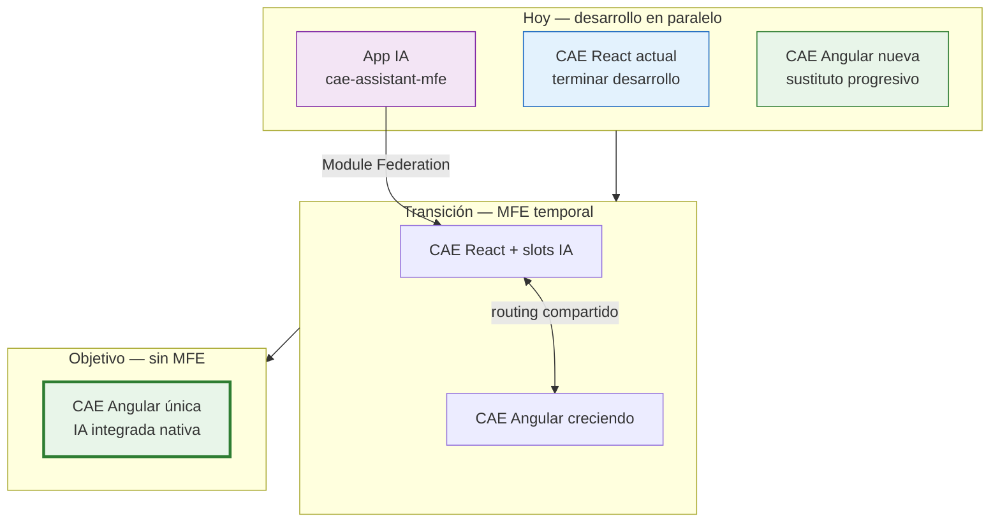
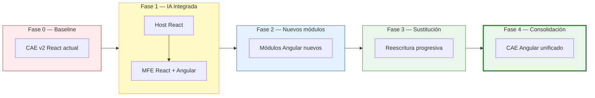
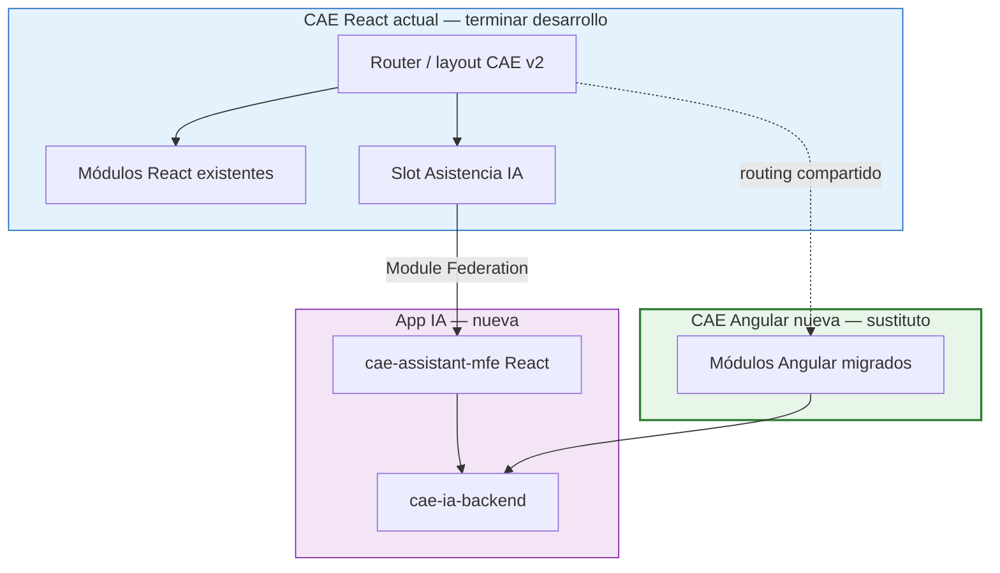
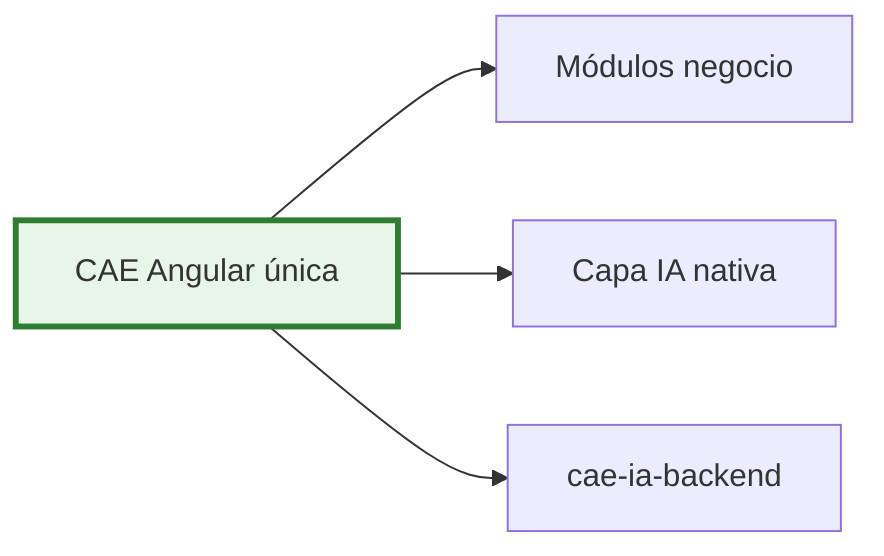
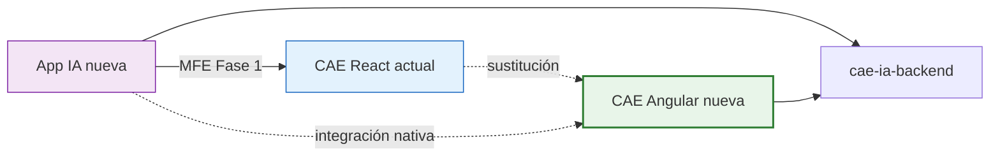

# ESTRATEGIA DE MODERNIZACIÓN FRONTEND — PLATAFORMA CAE

## Migración incremental React → Angular mediante microfrontends (Strangler Fig)

| Campo | Valor |
|-------|-------|
| **Versión** | 1.0 |
| **Estado** | Documento de referencia |
| **Fecha** | 03/07/2026 |
| **Proyecto** | Plataforma CAE v2.0 — Evolución frontend + Capa IA |
| **Clasificación** | Confidencial — IDEAUTO / Babooni |
| **Documentos relacionados** | [`ESPECIFICACION-FUNCIONAL-v3.0.md`](ESPECIFICACION-FUNCIONAL-v3.0.md), [`DISENO-TECNICO-v3.0.md`](DISENO-TECNICO-v3.0.md), [`ARQUITECTURA-CAE-IA.md`](ARQUITECTURA-CAE-IA.md) |

---

## Histórico de revisiones

| Rev. | Fecha | Naturaleza del cambio |
|------|-------|------------------------|
| 1 | 03/07/2026 | Primera versión: estrategia Strangler Fig, evolución React→Angular, relación con capa IA |
| 2 | 03/07/2026 | Tono orientado a documentación de entrega; eliminación de lenguaje interno |
| 3 | 03/07/2026 | Modelo dos equipos/dos apps; Module Federation cross-framework; opciones de shell |
| 4 | 03/07/2026 | Tres apps en paralelo (CAE React, App IA, CAE Angular); MFE como solución temporal de transición |

---

## Índice de contenidos

1. [Contexto y oportunidad de mejora](#1-contexto-y-oportunidad-de-mejora)
2. [Propuesta estratégica](#2-propuesta-estratégica)
3. [Patrón Strangler Fig con microfrontends](#3-patrón-strangler-fig-con-microfrontends)
4. [Angular vs React — criterios de selección](#4-angular-vs-react--criterios-de-selección)
5. [Ventajas del enfoque incremental](#5-ventajas-del-enfoque-incremental)
6. [Costes, riesgos e inconvenientes](#6-costes-riesgos-e-inconvenientes)
7. [Criterios de aplicabilidad](#7-criterios-de-aplicabilidad)
8. [Fases de migración](#8-fases-de-migración)
9. [Relación con el proyecto de Asistencia IA](#9-relación-con-el-proyecto-de-asistencia-ia)
10. [Gobernanza, métricas y criterios de éxito](#10-gobernanza-métricas-y-criterios-de-éxito)
11. [Beneficios y encaje estratégico](#11-beneficios-y-encaje-estratégico)
12. [Visión final](#12-visión-final)

---

## 1. Contexto y oportunidad de mejora

### 1.1 Situación actual

La **Plataforma CAE v2.0** está construida en **React**. Con el crecimiento funcional del producto se han identificado **oportunidades de mejora** en mantenibilidad, consistencia de experiencia, estandarización entre equipos y capacidad de evolución del frontend:

- **Acoplamiento entre módulos** — dificulta cambios localizados.
- **Heterogeneidad de patrones** — distintas librerías y enfoques (routing, estado, formularios, validación).
- **Coste creciente de cambio** — nuevas funcionalidades impactan zonas no relacionadas.
- **Cobertura de pruebas mejorable** — el monolito frontend dificulta regresiones automatizadas.

> La oportunidad no reside en sustituir React de forma abrupta, sino en **evolucionar la plataforma de forma incremental**, aprovechando el proyecto de Asistencia IA como primer hito de modernización arquitectónica.

### 1.2 Enfoque acordado y evolución propuesta

| | Enfoque |
|---|---------|
| **CAE React (actual)** | Se **termina el desarrollo** en React, sin interrumpir el roadmap existente |
| **App IA (nueva)** | Se desarrolla en paralelo e **se integra en CAE React** mediante microfrontend (Fase 1) |
| **CAE Angular (nueva)** | Se construye en paralelo como **sustituto** de la plataforma React actual |
| **Microfrontends** | **Solución temporal** de transición: permiten convivencia React + Angular sin parar el negocio |
| **Horizonte final** | **Una sola aplicación Angular**; los microfrontends **dejan de ser necesarios** al completar la migración |

---

## 2. Propuesta estratégica

### 2.1 Idea central

El programa combina **tres líneas de desarrollo en paralelo**, sin detener la plataforma actual:

1. **CAE React (actual)** — El equipo continúa **finalizando CAE v2** tal como está planificado, en React.
2. **App de Asistencia IA (nueva)** — Se desarrolla como aplicación independiente (`cae-ia-backend` + `cae-assistant-mfe`) e **se integra en CAE React** mediante microfrontend en los slots de expediente y operaciones.
3. **CAE Angular (nueva)** — En paralelo se construye la **aplicación que sustituirá** a CAE React, módulo a módulo, con arquitectura moderna desde cero.
4. **Transición (temporal)** — Mientras conviven CAE React y CAE Angular, **Module Federation** permite navegar entre ambas y desplegar la IA embebida **sin reescribir el host React**.
5. **Objetivo final** — **Todo en Angular**: una sola aplicación, sin microfrontends. La IA pasa a ser módulos nativos de la plataforma Angular; CAE React se retira progresivamente.



> **Los microfrontends no son la arquitectura objetivo.** Son el **puente** que permite mejorar la plataforma antigua (React) e incorporar IA **sin interrumpir** el desarrollo en curso, mientras la nueva plataforma Angular madura. Al completar la migración, la complejidad de Module Federation desaparece.

### 2.2 Principios de la estrategia

| ID | Principio | Descripción |
|----|-----------|-------------|
| EM-01 | **No big bang** | Nunca reescribir CAE completo de una vez |
| EM-02 | **Angular destino** | CAE Angular nueva es la plataforma objetivo; todo converge ahí |
| EM-03 | **CAE React sin interrupción** | El desarrollo actual de CAE v2 continúa hasta completarse o sustituirse módulo a módulo |
| EM-04 | **MFE solo en transición** | Module Federation se usa mientras conviven React y Angular; no forma parte del estado final |
| EM-05 | **Libs first** | Dominio y backend en `libs/isomorphic` y `libs/node`; UI en `libs/react/cae` (IA Fase 1) y `libs/angular/cae` (CAE nueva) |
| EM-06 | **Medir para migrar** | Sustituir módulo React por Angular cuando ROI, riesgo y dependencias lo avalen |
| EM-07 | **Transparencia** | Costes y plazo del período dual stack explicitados; MFE acotado en el tiempo |
| EM-08 | **Equipos autónomos** | CAE React, App IA y CAE Angular evolucionan con releases independientes |
| EM-09 | **Contrato antes que código** | Auth, rutas, eventos y design system acordados para la fase de convivencia |

### 2.3 Tres aplicaciones en paralelo

| App | Stack | Equipo / foco | Rol en el programa |
|-----|-------|---------------|-------------------|
| **CAE v2 (actual)** | React | Equipo CAE existente | **Terminar el desarrollo** planificado; host operativo durante la transición |
| **Asistencia IA** | React MFE + NestJS (`cae-assistant-mfe`, `cae-ia-backend`) | Equipo IA | **Integrarse en CAE React** vía slots MFE; entregar valor inmediato (validación, MLOps) |
| **CAE nueva** | Angular (`apps/cae-platform-angular` u homólogo) | Equipo Angular | **Sustituir progresivamente** a CAE React; arquitectura greenfield |

**Relación entre las tres:**

```
CAE React (actual)          App IA (nueva)              CAE Angular (nueva)
     │                           │                            │
     │◄── MFE: paneles IA ────────┤                            │
     │                           │                            │
     │◄──── MFE temporal ────────┼──── routing compartido ───►│
     │     (mientras conviven)   │                            │
     │                           │                            │
     └──── retirada módulo ──────┴──── sustitución ──────────►│
                                    a módulo                  │
                                                              ▼
                                                    CAE Angular única
                                                    (IA nativa, sin MFE)
```

| Fase | CAE React | App IA | CAE Angular | Microfrontends |
|------|-----------|--------|-------------|----------------|
| **1 — IA en producción** | Operativa; desarrollo continúa | MFE embebido en CAE React | Arranque / primeros módulos | **Sí** — IA → React |
| **2 — Convivencia** | Se reduce módulo a módulo | Misma funcionalidad; UI puede migrar a Angular | Crece; asume rutas de negocio | **Sí** — React ↔ Angular |
| **3 — Consolidación** | Retirada | Integrada como módulos Angular nativos | Plataforma principal | **No** — app Angular única |
| **4 — Objetivo** | Desmantelada | Parte de CAE Angular (`libs/angular/cae`) | **100 % plataforma** | **Eliminados** |

> Durante la transición, el usuario puede navegar entre CAE React e CAE Angular como una sola experiencia. Al finalizar la migración, **no hace falta Module Federation**: todo vive en la misma aplicación Angular.

### 2.4 Integración técnica durante la transición

Mientras conviven las aplicaciones, **Module Federation** conecta host y remotes. No es plug-and-play: requiere configuración explícita y contrato compartido (auth, rutas, design system). La mayoría de apps React modernas pueden integrarse; algunas necesitarán ajustes en el build (ver §3.1).

**Ejemplo de routing durante la convivencia:**

| Ruta | Resuelve | Stack |
|------|----------|-------|
| `/expedientes`, `/operaciones` | CAE React + paneles IA (MFE) | React |
| `/reportes`, `/administracion` | CAE Angular (módulo ya migrado) | Angular |

Al migrar `/expedientes` a Angular, **solo cambia qué app resuelve la ruta**; la URL no cambia. Cuando **todas** las rutas estén en CAE Angular, se **elimina Module Federation**.

---

## 3. Patrón Strangler Fig — microfrontends como puente temporal

La estrategia sigue el patrón **Strangler Fig**: la **CAE Angular nueva** crece alrededor de la **CAE React actual** hasta sustituirla. Los **microfrontends solo existen durante esa transición**; no forman parte de la arquitectura final.

### 3.1 Integración técnica — Module Federation cross-framework

**Module Federation** (Webpack 5 y plugins equivalentes en otras herramientas) permite exponer una aplicación React como microfrontend y consumirla desde Angular, o al revés. No obstante, **no es cierto que cualquier aplicación React pueda integrarse sin cambios**.

| Escenario de build | Integración MFE | Notas |
|--------------------|-----------------|-------|
| **React + Webpack 5** | Más directa | Module Federation nativo; configuración en host y remote |
| **React + Vite** | Posible | Requiere plugins de federación compatibles; configuración distinta a Webpack |
| **Create React App (CRA)** | Posible con adaptación | Suele requerir eject, CRACO o migración de configuración |
| **Webpack 4 o anterior** | Requiere actualización | Adaptación del build antes de habilitar federación |
| **Angular (Nx)** | Soportado | `@nx/module-federation`; host o remote según fase |

**Aspectos que deben resolverse en la integración** (independientemente del framework):

| Tema | Enfoque CAE |
|------|-------------|
| **Dependencias compartidas** | `react`/`react-dom` (y equivalentes Angular) como *shared singletons* para evitar cargar varias copias |
| **Autenticación** | JWT / Entra ID propagado desde el shell; sesión única |
| **Estado global** | Evitar stores duplicados; eventos o APIs para comunicación entre remotes |
| **Design system** | Tokens CSS / componentes compartidos para UX homogénea |
| **Conflictos CSS** | Namespaces, shadow DOM o convenciones de prefijo por MFE |
| **Versionado** | Semver por remote; contrato host ↔ remote documentado |

### 3.2 Opciones de shell

Existen **dos enfoques válidos** para el shell que orquesta los microfrontends:

#### Opción A — React como shell (fase inicial CAE)

Adecuada cuando **CAE v2 ya existe en React** y se quiere evitar un shell nuevo al arrancar.

```
React Shell (CAE v2)
├── Expedientes      → React (equipo A)
├── Operaciones      → React + MFE IA
├── Reportes         → Angular remote (equipo B)
└── Administración   → Angular remote (equipo B)
```

#### Opción B — Angular como shell (horizonte de consolidación)

Adecuada cuando **Angular es el framework de futuro** y se quiere que todo lo nuevo nazca nativo en el host.

```
Angular Shell
├── Inicio           → Angular
├── Usuarios         → Angular
├── Facturación      → React remote (hasta migración)
├── Informes         → React remote (hasta migración)
└── Configuración    → Angular
```

El shell gestiona: **login**, **layout** (menú, cabecera), **routing principal**, **comunicación entre MFE** y **librerías compartidas**. Al migrar un módulo, se sustituye el remote sin tocar el shell.

| Fase CAE | Shell recomendado | Motivo |
|----------|-------------------|--------|
| **Fase 1 — IA integrada** | React (CAE v2 actual) | Continuidad; CAE v2 ya es el host operativo |
| **Fase 2–3 — Convivencia dual** | React o shell mínimo compartido | Según madurez del equipo Angular |
| **Fase 4 — Consolidación** | Angular unificado | Objetivo de estandarización |

### 3.3 Fases de evolución Strangler Fig



| Elemento | Rol |
|--------|-----|
| **CAE React (actual)** | Plataforma en operación; desarrollo se completa; host de la App IA en Fase 1 |
| **App IA (MFE React)** | Remote embebido en slots CAE React; backend en `cae-ia-backend` |
| **CAE Angular (nueva)** | Sustituto progresivo de CAE React; absorbe módulos y, al final, la IA |
| **Module Federation** | **Temporal** — conecta las apps mientras conviven; **se retira** al consolidar Angular |
| **Contrato de slot** | `expedienteId`, auth JWT, callbacks — válido solo en fase de integración MFE |
| **Design system compartido** | UX homogénea durante la convivencia React ↔ Angular |

### 3.4 Arquitectura durante la transición (con MFE)



### 3.5 Arquitectura objetivo (sin MFE)

Al completar la migración, **una sola aplicación Angular** contiene todos los módulos de negocio y la capa IA como features nativas (`libs/angular/cae/*`). No hay remotes ni Module Federation.



---

## 4. Angular vs React — criterios de selección

### 4.1 Por qué Angular encaja en CAE (proyecto enterprise grande)

| Ventaja Angular | Aplicación en CAE |
|-----------------|-------------------|
| **Arquitectura definida** | Todos los equipos organizan proyectos de forma similar (módulos, servicios, componentes) |
| **Baterías incluidas** | Routing, DI, HTTP, formularios, validación — menos decisiones ad hoc |
| **Estandarización** | Decenas de desarrolladores pueden seguir las mismas convenciones |
| **TypeScript first-class** | Mantenimiento a largo plazo en ERP/administración |
| **Testing integrado** | Karma/Jest, TestBed, herramientas oficiales para E2E (Cypress/Playwright) |
| **Precedente sector** | Banca, administración pública, ERPs internos — perfil similar a CAE |

Por estas razones, **muchas organizaciones grandes** siguen apostando por Angular en aplicaciones con vida útil de muchos años y equipos numerosos.

### 4.2 Fortalezas de React

| Ventaja React | Aplicación en CAE v2 |
|---------------|----------------------|
| Integración nativa | Host actual de CAE v2; adopción inmediata en Fase 1 |
| Flexibilidad | Permite evolución rápida con convenciones bien definidas |
| Ecosistema | Amplia disponibilidad de librerías y perfiles |
| Continuidad | Sin interrupción del servicio durante despliegue IA |

> **Conclusión:** React es el **stack acordado para la Fase 1** (integración IA en CAE v2). Angular se propone como **stack de evolución** para módulos nuevos y modernización, cuando el beneficio en estandarización, mantenibilidad y productividad supere el coste de la convivencia temporal de ambos ecosistemas.

---

## 5. Ventajas del enfoque incremental

| Ventaja | Descripción |
|---------|-------------|
| **Sin parada de negocio** | CAE sigue operando durante toda la transición |
| **Riesgo acotado** | Cada módulo migrado es un entregable independiente |
| **Valor temprano** | IA y mejoras visibles antes de reescribir todo |
| **Equipos en paralelo** | Equipo A mantiene CAE v2 React; equipo B desarrolla Angular sin bloquearse mutuamente |
| **Aprendizaje progresivo** | Contratos y design system se afianzan durante la convivencia; MFE se simplifica al consolidar |
| **MFE acotado en el tiempo** | La complejidad de federación desaparece al llegar a CAE Angular única |
| **Mejora estructurada** | Plan de evolución de plataforma, no parches aislados |

---

## 6. Costes, riesgos e inconvenientes

Durante la transición (potencialmente **varios meses**) coexistirán:

| Inconveniente | Mitigación |
|---------------|------------|
| **Dos frameworks** | Gobernanza clara: reglas de qué va en cada stack |
| **Dos pipelines CI/CD** | Monorepo Nx unifica build; targets por app |
| **Dos formas de trabajar** | Guías de arquitectura, Storybook, formación Angular |
| **Dos ecosistemas de dependencias** | Renovación automatizada; política de versiones shared |
| **Mayor peso en navegador** | Lazy loading remotes; no cargar Angular + React en misma ruta si no es necesario |
| **Complejidad MFE** | Auth centralizada, contrato de eventos, design tokens, semver remotes |
| **Período dual stack** | Presupuesto y roadmap explícitos; no indefinido |

> Los microfrontends implican complejidad adicional **solo durante la transición**. Evitan un *big bang* y permiten terminar CAE React e integrar IA sin parar el negocio. **No son el diseño permanente** de la plataforma.

---

## 7. Criterios de aplicabilidad

### 7.1 La estrategia es adecuada cuando…

| Condición | CAE |
|-----------|-----|
| El producto tiene **vida útil prolongada** | CAE es core de negocio IDEAUTO |
| **Varios equipos** evolucionan la plataforma en paralelo | Desarrollo continuo CAE + capa IA |
| Existe **arquitectura MFE** definida (contratos, auth, design system) | Documentada en diseño técnico v3.0 |
| Se busca **mejora de plataforma** junto con la capa IA | Programa integrado IA + modernización |
| Se requiere **estandarización** y mantenibilidad a largo plazo | Angular como stack de evolución |

### 7.2 Requiere replanteamiento cuando…

| Condición | Notas |
|-----------|-------|
| No hay presupuesto para **período dual stack** | Acordar fases y duración máxima de convivencia |
| Capacidad limitada para Angular | Valorar formación o refuerzo de equipo |
| Migración sin ROI demostrable | Priorizar módulos con mayor impacto en negocio |

---

## 8. Fases de migración

| Fase | Horizonte | CAE React (actual) | App IA | CAE Angular (nueva) | MFE |
|------|-----------|-------------------|--------|---------------------|-----|
| **0 — Baseline** | Actual | Desarrollo en curso | Diseño / arranque | Diseño / arranque | No |
| **1 — IA integrada** | 0–6 meses | Operativa; desarrollo continúa | MFE embebido en CAE React | Primeros módulos | **Sí** (IA → React) |
| **2 — Convivencia** | 6–18 meses | Sin features grandes nuevas; retirada gradual | Funcionalidad estable | Módulos de negocio en Angular | **Sí** (React ↔ Angular) |
| **3 — Sustitución** | 18–36+ meses | Módulos retirados uno a uno | UI migrada a Angular | Plataforma principal | **Sí**, reduciéndose |
| **4 — Consolidación** | Objetivo | **Desmantelada** | Módulos nativos en CAE Angular | **100 % plataforma** | **No** |

### 8.1 Criterios para migrar un módulo React concreto

| Criterio | Peso |
|----------|------|
| Volumen de incidencias en el módulo | Alto |
| Complejidad y acoplamiento | Alto |
| Frecuencia de cambios previstos | Medio |
| Dependencias con otros módulos React | Medio (orden de migración) |
| Disponibilidad de diseño/UX revisado | Medio |
| Equipo con capacidad Angular | Bloqueante |

---

## 9. Relación con el proyecto de Asistencia IA

La **App IA** es una **aplicación nueva** (`cae-ia-backend` + `cae-assistant-mfe`), desarrollada en paralelo al CAE React actual. **No sustituye** a CAE v2: **se integra en ella** mediante microfrontend mientras la plataforma React sigue activa.

| Aspecto | Enfoque |
|---------|---------|
| **Backend IA** | Agnóstico de UI — `libs/node/cae`, `libs/isomorphic/cae`; reutilizable en CAE Angular |
| **UI Fase 1** | MFE React embebido en slots de CAE v2 (expediente, operaciones) |
| **CAE React** | Sigue su desarrollo; la IA se añade sin reescribir el host |
| **CAE Angular** | Cuando un módulo migre, la IA puede exponerse como feature nativa Angular (sin MFE) |
| **Horizonte IA** | De remote MFE → módulos `libs/angular/cae/feature-*` dentro de CAE Angular única |



---

## 10. Gobernanza, métricas y criterios de éxito

### 10.1 Comité de arquitectura frontend

- Revisión mensual: módulos candidatos a migración, estado dual stack, oportunidades de mejora.
- Participantes: Arquitectura, Producto, IDEAUTO, Babooni.

### 10.2 Métricas de seguimiento

| Métrica | Objetivo transición |
|---------|---------------------|
| % líneas UI en Angular vs React | Crecimiento trimestral Angular |
| Nº módulos React activos | Decrecimiento planificado |
| Incidencias frontend por módulo | ↓ post-migración Angular |
| Tiempo medio entrega feature | ↓ en módulos Angular estandarizados |
| Cobertura tests + Storybook | ↑ en `libs/angular/cae/ui` |
| Peso bundle remotes | Monitorizado; alertas si supera umbral |
| Satisfacción de usuario (encuesta) | ↑ respecto a línea base |

### 10.3 Criterio de cierre React y retirada de MFE

React y Module Federation se consideran **retirados** cuando:

1. **CAE Angular** cubre el 100 % de las rutas y funcionalidades de negocio.
2. La **App IA** está integrada como módulos nativos Angular (no como remote).
3. E2E completos pasan en la aplicación Angular única.
4. UAT de paridad funcional aprobada.
5. Período de hypercare post-switch sin incidencias P1.

---

## 11. Beneficios y encaje estratégico

### 11.1 Beneficios para la plataforma CAE

1. **Continuidad operativa** — CAE sigue en producción durante toda la transición; mejoras por módulos.
2. **Valor inmediato con IA** — Validación progresiva, MLOps y asistencia al usuario desde la Fase 1.
3. **Estandarización progresiva** — Angular aporta arquitectura uniforme en módulos nuevos.
4. **Inversión protegida** — React permanece en Fase 1; la migración avanza cuando aporta valor medible.
5. **Plan estructurado** — Roadmap por fases con métricas, gobernanza y criterios de éxito.

### 11.2 Preguntas frecuentes

| Pregunta | Respuesta |
|----------|-----------|
| ¿Por qué dos stacks (React y Angular)? | React integra la Fase 1 en CAE v2; Angular es el stack de evolución para módulos nuevos |
| ¿Implica parar la plataforma? | No. Migración incremental mediante microfrontends |
| ¿Cuánto dura la convivencia dual? | Acotada por fases; se revisa trimestralmente en comité de arquitectura |
| ¿Se puede mantener solo React? | Fase 1 sí; la evolución Angular es opcional y se activa por módulo según ROI |
| ¿Por qué microfrontends si el objetivo es Angular? | Son el **puente temporal** para integrar IA en CAE React y convivir con CAE Angular sin parar el desarrollo |
| ¿Se eliminan los MFE al final? | **Sí.** La arquitectura objetivo es **una sola app Angular**, sin Module Federation |
| ¿Qué pasa con CAE React mientras tanto? | **Sigue desarrollándose** hasta completarse o hasta que cada módulo tenga equivalente en Angular |
| ¿Cómo trabajan los equipos? | Tres líneas: CAE React (terminar), App IA (integrar en React), CAE Angular (sustituto) |

---

## 12. Visión final

La Plataforma CAE converge hacia **una sola aplicación Angular** que sustituye por completo a CAE React. La capa de Asistencia IA deja de ser un microfrontend y pasa a ser **módulos nativos** de esa plataforma.

Durante la transición, los **microfrontends** permiten:

- **Terminar CAE React** sin interrumpir el desarrollo en curso.
- **Integrar la App IA** en la plataforma actual de forma inmediata.
- **Construir CAE Angular** en paralelo, módulo a módulo.

Al completar la migración, **desaparece la complejidad de Module Federation**: una app, un stack, un pipeline.

> **Resumen:** *CAE React se termina; App IA se integra vía MFE; CAE Angular la sustituye progresivamente; MFE solo durante la transición; objetivo final = todo Angular, sin microfrontends.*

---

*Estrategia de Modernización Frontend — Plataforma CAE.*
