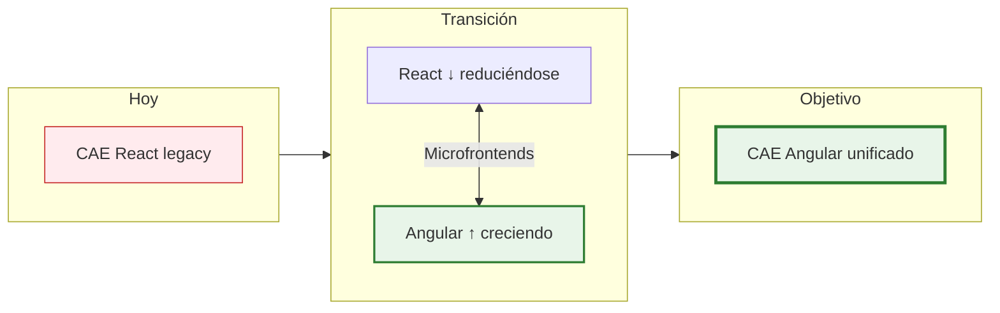
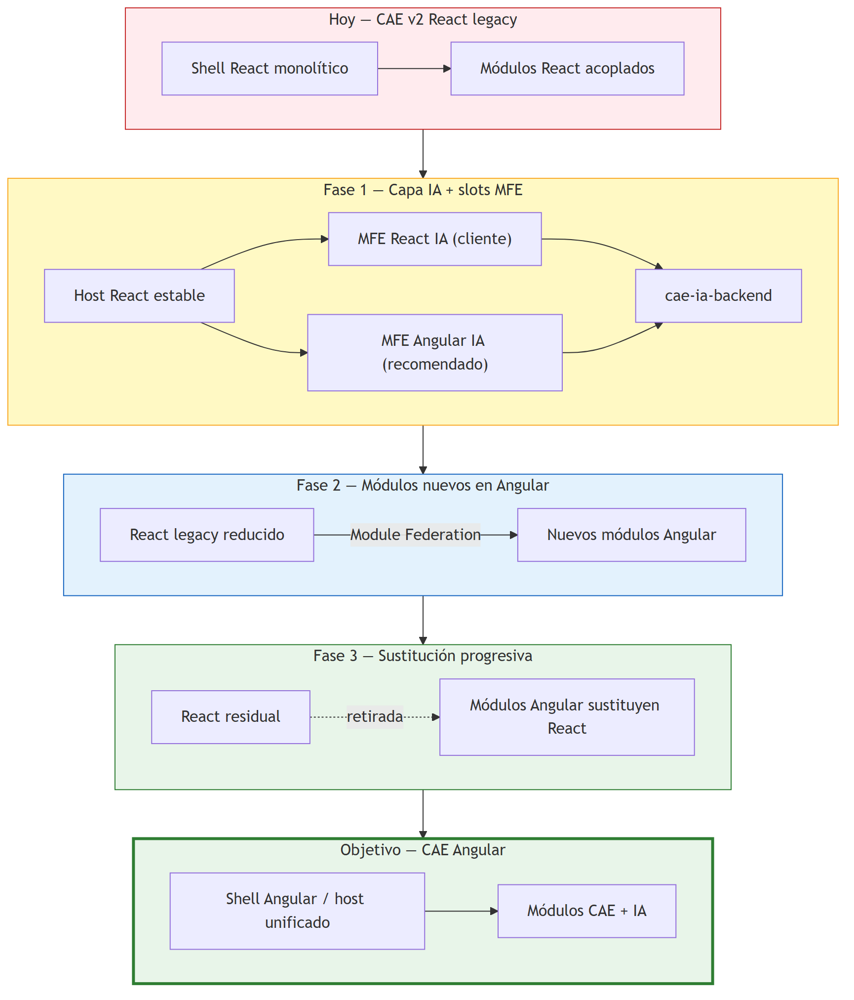
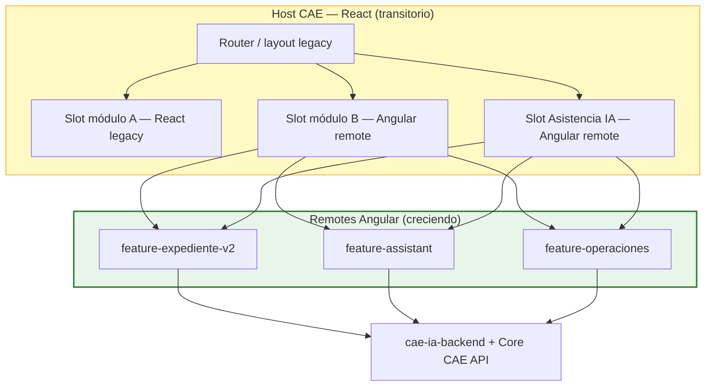
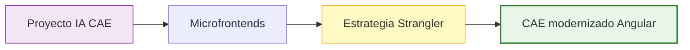

# ESTRATEGIA DE MODERNIZACIÓN FRONTEND — PLATAFORMA CAE

## Migración incremental React → Angular mediante microfrontends (Strangler Fig)

| Campo | Valor |
|-------|-------|
| **Versión** | 1.0 |
| **Estado** | Propuesta estratégica para alineación con cliente |
| **Fecha** | 03/07/2026 |
| **Proyecto** | Plataforma CAE v2.0 — Evolución frontend + Capa IA |
| **Clasificación** | Confidencial — IDEAUTO / Babooni |
| **Documentos relacionados** | [`ESPECIFICACION-FUNCIONAL-v3.0.md`](ESPECIFICACION-FUNCIONAL-v3.0.md), [`DISENO-TECNICO-v3.0.md`](DISENO-TECNICO-v3.0.md), [`ARQUITECTURA-CAE-IA.md`](ARQUITECTURA-CAE-IA.md) |

---

## Histórico de revisiones

| Rev. | Fecha | Naturaleza del cambio |
|------|-------|------------------------|
| 1 | 03/07/2026 | Primera versión: estrategia Strangler Fig, Angular destino, React transitorio, relación con capa IA |

---

## Índice de contenidos

1. [Contexto y problema](#1-contexto-y-problema)
2. [Propuesta estratégica](#2-propuesta-estratégica)
3. [Patrón Strangler Fig con microfrontends](#3-patrón-strangler-fig-con-microfrontends)
4. [Angular vs React — criterio técnico honesto](#4-angular-vs-react--criterio-técnico-honesto)
5. [Ventajas del enfoque incremental](#5-ventajas-del-enfoque-incremental)
6. [Costes, riesgos e inconvenientes](#6-costes-riesgos-e-inconvenientes)
7. [Cuándo recomendar esta estrategia](#7-cuándo-recomendar-esta-estrategia)
8. [Fases de migración](#8-fases-de-migración)
9. [Relación con el proyecto de Asistencia IA](#9-relación-con-el-proyecto-de-asistencia-ia)
10. [Gobernanza, métricas y criterios de éxito](#10-gobernanza-métricas-y-criterios-de-éxito)
11. [Argumentario para el cliente](#11-argumentario-para-el-cliente)
12. [Visión final](#12-visión-final)

---

## 1. Contexto y problema

### 1.1 Situación actual

La **Plataforma CAE v2.0** está construida en **React**. El cliente mantiene **quejas continuas** sobre calidad, mantenibilidad, inconsistencias de experiencia y dificultad para evolucionar el producto. Desde el análisis técnico, el frontend acumula:

- **Deuda técnica** — acoplamiento entre módulos, estado global difícil de razonar.
- **Falta de estandarización** — distintos equipos han adoptado librerías y patrones diferentes (routing, estado, formularios, validación).
- **Coste creciente de cambio** — cada nueva funcionalidad o corrección impacta zonas no relacionadas.
- **Testing insuficiente** — difícil garantizar regresiones en un monolito frontend poco estructurado.

> El problema **no siempre es React en sí**, sino **años de evolución sin arquitectura común**. En proyectos enterprise muy grandes, esa falta de disciplina suele penalizar más que el framework elegido.

### 1.2 Decisión del cliente vs oportunidad de mejora

| | Situación |
|---|-----------|
| **Decisión actual del cliente** | Mantener integración con CAE v2 en **React** (continuidad operativa) |
| **Oportunidad detectada** | Presentar la **capa de Asistencia IA** y la **modernización CAE** como un **programa de mejora de plataforma**, no solo como un add-on OCR |
| **Destino técnico propuesto** | **Angular** como stack estratégico para módulos nuevos y reescrituras; **React** como legado en retirada progresiva |

---

## 2. Propuesta estratégica

### 2.1 Idea central

**Incluir como mejora de la plataforma antigua** un modelo arquitectónico alineado con el monorepo Nx, libs hexagonales y microfrontends, de forma que:

1. **Hoy:** el host CAE v2 **React** sigue operando; la capa IA se integra por slots (MFE).
2. **Mañana:** **todo módulo nuevo** se desarrolla en **Angular** e integra en el shell React vía Module Federation.
3. **Progresivamente:** los módulos React legacy se **reescriben en Angular** cuando el coste/beneficio lo justifique.
4. **Objetivo final:** el shell React **desaparece**; CAE queda unificado en **Angular** (o host Angular con remotes Angular).

### 2.2 Principios de la estrategia

| ID | Principio | Descripción |
|----|-----------|-------------|
| EM-01 | **No big bang** | Nunca reescribir CAE completo de una vez |
| EM-02 | **Angular greenfield** | Módulos nuevos siempre en Angular |
| EM-03 | **React estable** | Legacy React solo mantenimiento y parches; sin features grandes nuevas |
| EM-04 | **Misma integración** | Contrato MFE versionado (slots, eventos, auth) independiente del framework |
| EM-05 | **Libs first** | Dominio y backend en `libs/isomorphic` y `libs/node`; UI en `libs/angular/cae` |
| EM-06 | **Medir para migrar** | Solo sustituir módulo React cuando ROI, riesgo y dependencias lo avalen |
| EM-07 | **Cliente informado** | Beneficios y costes de dual stack explicitados desde el inicio |

---

## 3. Patrón Strangler Fig con microfrontends

La estrategia sigue el patrón **Strangler Fig** (*estrangular* el legacy): el sistema nuevo crece alrededor del antiguo hasta sustituirlo por completo.

| Elemento | Rol |
|--------|-----|
| **Host React (transitorio)** | Shell CAE v2; carga remotes por Module Federation |
| **Remote Angular** | Módulos nuevos: IA, Operaciones mejoradas, backoffice, etc. |
| **Remote React (fase 1 IA)** | Entrega acordada con cliente para integración inmediata de IA |
| **Contrato de slot** | `expedienteId`, auth JWT, callbacks — idéntico para ambos stacks |
| **Design system compartido** | Tokens visuales comunes para que la UX no “salte” entre frameworks |

---

## 4. Angular vs React — criterio técnico honesto

### 4.1 Por qué Angular encaja en CAE (proyecto enterprise grande)

| Ventaja Angular | Aplicación en CAE |
|-----------------|-------------------|
| **Arquitectura definida** | Todos los equipos organizan proyectos de forma similar (módulos, servicios, componentes) |
| **Baterías incluidas** | Routing, DI, HTTP, formularios, validación — menos decisiones ad hoc |
| **Estandarización** | Decenas de desarrolladores pueden seguir las mismas convenciones |
| **TypeScript first-class** | Mantenimiento a largo plazo en ERP/administración |
| **Testing integrado** | Karma/Jest, TestBed, herramientas oficiales para E2E (Cypress/Playwright) |
| **Precedente sector** | Banca, administración pública, ERPs internos — perfil similar a CAE |

Por estas razones, **muchas organizaciones grandes** siguen apostando por Angular en aplicaciones con vida útil de muchos años y equipos numerosos.

### 4.2 Fortalezas de React (sin demonizar)

| Ventaja React | Matiz para CAE |
|---------------|----------------|
| Flexibilidad | Requiere **imponer disciplina**; sin ella aparecen N arquitecturas distintas |
| Ecosistema enorme | Cada equipo elige librerías distintas → fragmentación en 5 años |
| Curva de entrada baja | Proyectos pequeños sí; **proyectos grandes** necesitan convenciones estrictas |
| Talento en mercado | Válido, pero no compensa solo el coste de migración |

> **Conclusión equilibrada:** React puede ser excelente con gobernanza fuerte. En CAE v2, la evidencia es **deuda acumulada y quejas del cliente**, no una comparativa abstracta de frameworks. La migración tiene sentido cuando el **beneficio esperado** (estandarización, mantenibilidad, productividad) **supera el coste** de mantener temporalmente ambos ecosistemas.

---

## 5. Ventajas del enfoque incremental

| Ventaja | Descripción |
|---------|-------------|
| **Sin parada de negocio** | CAE sigue operando durante toda la transición |
| **Riesgo acotado** | Cada módulo migrado es un entregable independiente |
| **Valor temprano** | IA y mejoras visibles antes de reescribir todo |
| **Equipos en paralelo** | Un equipo en legacy React (mantenimiento); otro(s) en Angular greenfield |
| **Aprendizaje progresivo** | Module Federation, contratos y design system se afianzan módulo a módulo |
| **Alineado con quejas cliente** | Responde al malestar con **plan de mejora**, no con parches eternos |

---

## 6. Costes, riesgos e inconvenientes

Durante la transición (potencialmente **varios años**) coexistirán:

| Inconveniente | Mitigación |
|---------------|------------|
| **Dos frameworks** | Gobernanza clara: reglas de qué va en cada stack |
| **Dos pipelines CI/CD** | Monorepo Nx unifica build; targets por app |
| **Dos formas de trabajar** | Guías de arquitectura, Storybook, formación Angular |
| **Dos ecosistemas de dependencias** | Renovación automatizada; política de versiones shared |
| **Mayor peso en navegador** | Lazy loading remotes; no cargar Angular + React en misma ruta si no es necesario |
| **Complejidad MFE** | Auth centralizada, contrato de eventos, design tokens, semver remotes |
| **Período dual stack** | Presupuesto y roadmap explícitos; no indefinido |

> Los microfrontends **no son gratis**. La clave es que el cliente entienda que es el **precio de no hacer un big bang** — y que ese precio suele ser **mucho menor** que reescribir CAE entero fallando en plazo o funcionalidad.

---

## 7. Cuándo recomendar esta estrategia

### 7.1 Sí recomendar si…

| Condición | CAE |
|-----------|-----|
| Angular (o similar opinionado) es **decisión estratégica** de la organización | ✅ Propuesta del equipo |
| El producto tiene **muchos años de vida** por delante | ✅ CAE es core de negocio |
| **Varios equipos** trabajan en paralelo | ✅ IDEAUTO + Babooni + evolución continua |
| Existe **arquitectura MFE** bien diseñada (contratos, auth, design system) | ✅ Documentada en diseño técnico v3.0 |
| El legacy React tiene **deuda y quejas** recurrentes | ✅ Situación actual |
| El cliente busca **mejora de plataforma**, no solo IA puntual | ✅ Encaje del programa IA + modernización |

### 7.2 No recomendar (o replantear) si…

| Condición | Notas |
|-----------|-------|
| React está **sano**, bien testeado y con convenciones claras | **No es el caso de CAE v2** según análisis actual |
| Migración **solo por preferencia** tecnológica sin ROI | Evitar; aquí hay **quejas de negocio** de respaldo |
| No hay presupuesto para **período dual stack** | Acordar fases y duración máxima de convivencia |
| Un solo equipo minúsculo sin capacidad Angular | Valorar formación o refuerzo antes de comprometer |

---

## 8. Fases de migración

| Fase | Horizonte | CAE React legacy | Angular | Entregables clave |
|------|-----------|------------------|---------|-------------------|
| **0 — Baseline** | Actual | 100% CAE | Pendiente de arranque | Auditoría deuda, mapa módulos, contrato MFE |
| **1 — IA integrada** | 0–6 meses | Host estable | MFE IA (React cliente + Angular POC) | `cae-ia-backend`, paneles asistencia, slots |
| **2 — Nuevos módulos** | 6–18 meses | Sin features grandes nuevas | Todo greenfield en Angular | Primer módulo negocio nuevo en Angular embebido |
| **3 — Sustitución** | 18–36+ meses | Módulos retirados uno a uno | Reescrituras priorizadas por ROI | Matriz módulo → fecha retirada React |
| **4 — Consolidación** | Objetivo | **0% shell React** | Host Angular unificado | CAE completo en Angular; React desmantelado |

### 8.1 Criterios para migrar un módulo React concreto

| Criterio | Peso |
|----------|------|
| Volumen de incidencias / quejas en el módulo | Alto |
| Complejidad y acoplamiento | Alto |
| Frecuencia de cambios previstos | Medio |
| Dependencias con otros módulos legacy | Medio (orden de migración) |
| Disponibilidad de diseño/UX revisado | Medio |
| Equipo con capacidad Angular | Bloqueante |

---

## 9. Relación con el proyecto de Asistencia IA

La capa IA **no es un silo**: es el **primer candidato** para demostrar el modelo de modernización.

| Aspecto | Enfoque |
|---------|---------|
| **Backend** | Agnóstico de UI — `libs/node/cae`, `libs/isomorphic/cae` |
| **MFE React (fase 1)** | Cumple decisión cliente; integración inmediata en CAE v2 |
| **MFE Angular (paralelo)** | Demuestra calidad técnica: Storybook, tests, arquitectura limpia |
| **Segundo módulo Angular** | Cola Operaciones mejorada, dashboard MLOps o expediente v2 |
| **Mensaje al cliente** | “La IA viene con un **plan de mejora de plataforma**, no solo un plugin” |

---

## 10. Gobernanza, métricas y criterios de éxito

### 10.1 Comité de arquitectura frontend

- Revisión mensual: módulos candidatos a migración, estado dual stack, deuda.
- Participantes: Arquitectura, Producto, IDEAUTO, Babooni.

### 10.2 Métricas de seguimiento

| Métrica | Objetivo transición |
|---------|---------------------|
| % líneas UI en Angular vs React | Crecimiento trimestral Angular |
| Nº módulos React activos | Decrecimiento planificado |
| Incidencias frontend por módulo | ↓ post-migración Angular |
| Tiempo medio entrega feature | ↓ en módulos Angular estandarizados |
| Cobertura tests + Storybook | ↑ en `libs/angular/cae/ui` |
| Peso bundle remotes | Monitorizado; alertas si supera umbral |
| Satisfacción cliente (encuesta) | ↑ respecto baseline quejas |

### 10.3 Criterio de cierre React

React se considera **retirado** cuando:

1. Ningún módulo de negocio crítico depende del shell legacy.
2. E2E completos pasan en host Angular.
3. Cliente aprueba UAT de paridad funcional.
4. Período de hypercare post-switch sin incidencias P1.

---

## 11. Argumentario para el cliente

### 11.1 Mensajes clave (lenguaje de negocio)

1. **“No proponemos parar CAE para reescribirlo.”** Seguís operando; mejoramos por módulos.
2. **“La IA es la primera pieza del nuevo CAE.”** Asistencia inteligente + arquitectura moderna.
3. **“Angular nos da un CAE más mantenible.”** Menos sorpresas, más previsibilidad en evoluciones.
4. **“React no desaparece mañana.”** Respetamos la inversión actual; migramos cuando aporta valor.
5. **“Vuestras quejas actuales encajan con un plan estructurado.”** No más parches sin estrategia.

### 11.2 Respuesta a objeciones habituales

| Objeción | Respuesta |
|----------|-----------|
| “Ya tenemos React” | React se mantiene; **lo nuevo** nace mejor arquitecturado en Angular |
| “Dos tecnologías es caro” | Es **más barato** que un big bang fallido; duración acotada y planificada |
| “¿Por qué no seguir en React?” | Se puede, pero **la historia de CAE v2** muestra costes crecientes; Angular impone el orden que falta |
| “¿Y si preferimos React?” | Alcance fase 1 en React; POC Angular demuestra diferencias con hechos, no opiniones |

---

## 12. Visión final

La Plataforma CAE puede evolucionar de un **monolito React con deuda y quejas recurrentes** hacia un **ecosistema modular en Angular**, construido módulo a módulo mediante **microfrontends**, sin interrumpir el negocio.

El proyecto de **Asistencia Inteligente** es el **caballo de Troya constructivo**: entrega valor inmediato (validación progresiva, MLOps, fitness) y, al mismo tiempo, **establece el patrón** (libs Nx, hexagonal, MFE, Storybook, pirámide de testing) con el que el resto de CAE irá **estrangulando** el legacy React hasta su retirada natural.

> **Resumen en una frase:** *React hoy por decisión del cliente; Angular mañana por salud del producto; microfrontends como puente; desaparición progresiva de React cuando cada módulo lo merezca.*

---

*Estrategia de Modernización Frontend — Plataforma CAE.*
