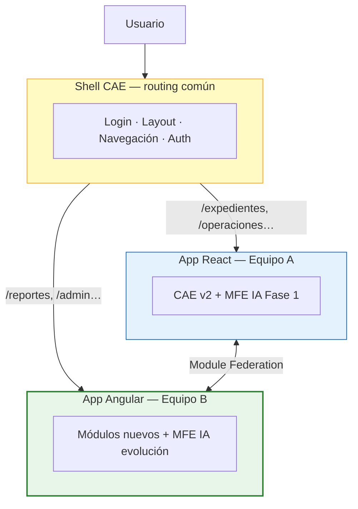
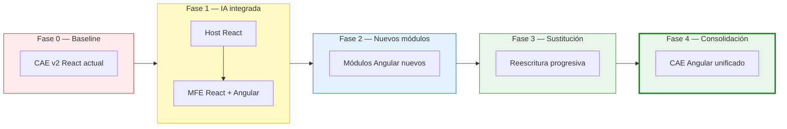
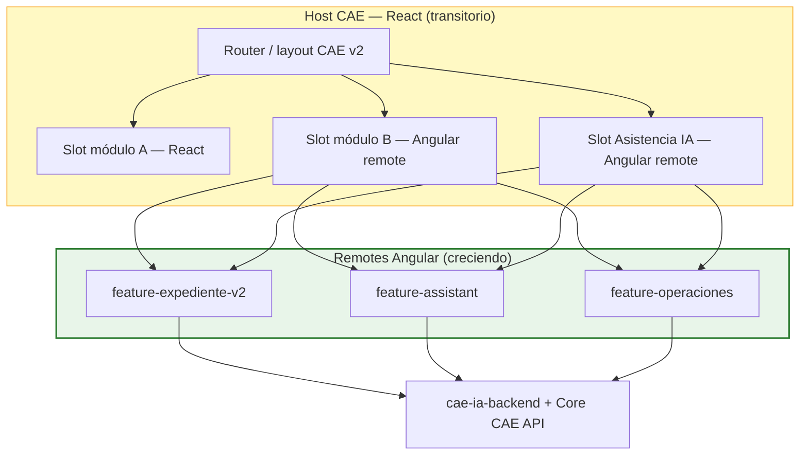
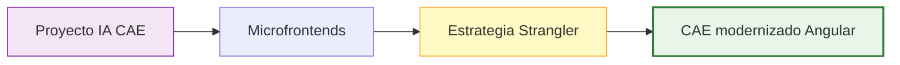

# ESTRATEGIA DE MODERNIZACIÓN FRONTEND — PLATAFORMA CAE

## Migración incremental React → Angular mediante microfrontends (Strangler Fig)

| Campo | Valor |
|-------|-------|
| **Versión** | 1.0 |
| **Estado** | Documento de referencia |
| **Fecha** | 03/07/2026 |
| **Proyecto** | Plataforma CAE v2.0 — Evolución frontend + Capa IA |
| **Clasificación** | Confidencial — IDEAUTO / Babooni |
| **Documentos relacionados** | [`ESPECIFICACION-FUNCIONAL-v3.0.md`](ESPECIFICACION-FUNCIONAL-v3.0.md), [`DISENO-TECNICO-v3.0.md`](DISENO-TECNICO-v3.0.md), [`ARQUITECTURA-CAE-IA.md`](ARQUITECTURA-CAE-IA.md) |

---

## Histórico de revisiones

| Rev. | Fecha | Naturaleza del cambio |
|------|-------|------------------------|
| 1 | 03/07/2026 | Primera versión: estrategia Strangler Fig, evolución React→Angular, relación con capa IA |
| 2 | 03/07/2026 | Tono orientado a documentación de entrega; eliminación de lenguaje interno |
| 3 | 03/07/2026 | Modelo dos equipos/dos apps; Module Federation cross-framework; opciones de shell |

---

## Índice de contenidos

1. [Contexto y oportunidad de mejora](#1-contexto-y-oportunidad-de-mejora)
2. [Propuesta estratégica](#2-propuesta-estratégica)
3. [Patrón Strangler Fig con microfrontends](#3-patrón-strangler-fig-con-microfrontends)
4. [Angular vs React — criterios de selección](#4-angular-vs-react--criterios-de-selección)
5. [Ventajas del enfoque incremental](#5-ventajas-del-enfoque-incremental)
6. [Costes, riesgos e inconvenientes](#6-costes-riesgos-e-inconvenientes)
7. [Criterios de aplicabilidad](#7-criterios-de-aplicabilidad)
8. [Fases de migración](#8-fases-de-migración)
9. [Relación con el proyecto de Asistencia IA](#9-relación-con-el-proyecto-de-asistencia-ia)
10. [Gobernanza, métricas y criterios de éxito](#10-gobernanza-métricas-y-criterios-de-éxito)
11. [Beneficios y encaje estratégico](#11-beneficios-y-encaje-estratégico)
12. [Visión final](#12-visión-final)

---

## 1. Contexto y oportunidad de mejora

### 1.1 Situación actual

La **Plataforma CAE v2.0** está construida en **React**. Con el crecimiento funcional del producto se han identificado **oportunidades de mejora** en mantenibilidad, consistencia de experiencia, estandarización entre equipos y capacidad de evolución del frontend:

- **Acoplamiento entre módulos** — dificulta cambios localizados.
- **Heterogeneidad de patrones** — distintas librerías y enfoques (routing, estado, formularios, validación).
- **Coste creciente de cambio** — nuevas funcionalidades impactan zonas no relacionadas.
- **Cobertura de pruebas mejorable** — el monolito frontend dificulta regresiones automatizadas.

> La oportunidad no reside en sustituir React de forma abrupta, sino en **evolucionar la plataforma de forma incremental**, aprovechando el proyecto de Asistencia IA como primer hito de modernización arquitectónica.

### 1.2 Enfoque acordado y evolución propuesta

| | Enfoque |
|---|---------|
| **Integración Fase 1 (acordada)** | Capa IA integrada en **CAE v2 (React)** mediante microfrontends — continuidad operativa |
| **Programa de mejora** | Asistencia IA + **modernización progresiva** de la plataforma CAE |
| **Horizonte de evolución** | **Angular** como stack para módulos nuevos y reescrituras; convivencia temporal con React hasta consolidación |

---

## 2. Propuesta estratégica

### 2.1 Idea central

**Incluir como mejora de la plataforma CAE** un modelo arquitectónico alineado con monorepo Nx, libs hexagonales y microfrontends:

1. **Fase actual:** el **equipo React** continúa evolucionando **CAE v2**; la capa IA se integra como MFE en slots del host existente.
2. **En paralelo:** el **equipo Angular** desarrolla **módulos nuevos** como aplicación/MFE independiente, con arquitectura limpia desde cero.
3. **Integración:** ambas aplicaciones se **exponen como remotes** y el usuario **navega entre ellas** como si fuera una sola plataforma (routing común, misma sesión).
4. **Progresivamente:** cada módulo React se **sustituye por su equivalente Angular** cuando el coste/beneficio lo justifique — sin cambiar la URL ni interrumpir el servicio.
5. **Objetivo final:** shell unificado en **Angular** (o host Angular con remotes Angular); React retirado módulo a módulo.



> **Importante:** no se trata de “inyectar React sin cambios” dentro de Angular (ni al revés). Cada aplicación requiere **configuración explícita de Module Federation** y cumplir un **contrato compartido** (auth, rutas, design system). La mayoría de aplicaciones React modernas pueden integrarse, pero **algunas necesitarán ajustes** en su sistema de build.

### 2.2 Principios de la estrategia

| ID | Principio | Descripción |
|----|-----------|-------------|
| EM-01 | **No big bang** | Nunca reescribir CAE completo de una vez |
| EM-02 | **Angular greenfield** | Módulos nuevos siempre en Angular |
| EM-03 | **React estable en Fase 1** | CAE v2 React en operación; nuevas capacidades grandes priorizan Angular |
| EM-04 | **Misma integración** | Contrato MFE versionado (slots, eventos, auth) independiente del framework |
| EM-05 | **Libs first** | Dominio y backend en `libs/isomorphic` y `libs/node`; UI en `libs/angular/cae` y `libs/react/cae` |
| EM-06 | **Medir para migrar** | Sustituir módulo React cuando ROI, riesgo y dependencias lo avalen |
| EM-07 | **Transparencia** | Costes y plazos del período dual stack explicitados desde el inicio |
| EM-08 | **Equipos autónomos** | React y Angular evolucionan con pipelines y releases independientes |
| EM-09 | **Contrato antes que código** | Auth, rutas, eventos y design system acordados antes de integrar remotes |

### 2.3 Modelo operativo: dos equipos, dos aplicaciones

En la **fase inicial** del programa coexisten **dos aplicaciones frontend distintas**, cada una con su equipo:

| | **Equipo A — React** | **Equipo B — Angular** |
|---|---------------------|------------------------|
| **Aplicación** | CAE v2 (existente) + MFE IA Fase 1 | Módulos nuevos + MFE IA evolución |
| **Objetivo** | Continuidad operativa; finalizar/evolucionar CAE v2 | Greenfield con arquitectura estandarizada |
| **Despliegue** | Independiente (`apps/cae-assistant-mfe`, host CAE v2) | Independiente (`apps/cae-assistant-mfe-angular`, futuros módulos) |
| **Integración** | Expone/consuma remotes vía Module Federation | Expone/consuma remotes vía Module Federation |

**Ejemplo de routing unificado** (el usuario no percibe el cambio de framework):

| Ruta | Remote | Stack |
|------|--------|-------|
| `/dashboard`, `/expedientes` | CAE v2 + paneles IA | React |
| `/operaciones` | Cola Operaciones + resumen IA | React (Fase 1) |
| `/reportes`, `/administracion` | Módulos nuevos | Angular |
| `/mlops` (opcional) | Dashboard MLOps | Angular |

Cuando un módulo React se migre a Angular, **solo cambia el remote** que resuelve esa ruta; la URL y el shell permanecen iguales para el usuario.

---

## 3. Patrón Strangler Fig con microfrontends

La estrategia sigue el patrón **Strangler Fig**: el sistema nuevo crece alrededor del existente hasta sustituirlo progresivamente.

### 3.1 Integración técnica — Module Federation cross-framework

**Module Federation** (Webpack 5 y plugins equivalentes en otras herramientas) permite exponer una aplicación React como microfrontend y consumirla desde Angular, o al revés. No obstante, **no es cierto que cualquier aplicación React pueda integrarse sin cambios**.

| Escenario de build | Integración MFE | Notas |
|--------------------|-----------------|-------|
| **React + Webpack 5** | Más directa | Module Federation nativo; configuración en host y remote |
| **React + Vite** | Posible | Requiere plugins de federación compatibles; configuración distinta a Webpack |
| **Create React App (CRA)** | Posible con adaptación | Suele requerir eject, CRACO o migración de configuración |
| **Webpack 4 o anterior** | Requiere actualización | Adaptación del build antes de habilitar federación |
| **Angular (Nx)** | Soportado | `@nx/module-federation`; host o remote según fase |

**Aspectos que deben resolverse en la integración** (independientemente del framework):

| Tema | Enfoque CAE |
|------|-------------|
| **Dependencias compartidas** | `react`/`react-dom` (y equivalentes Angular) como *shared singletons* para evitar cargar varias copias |
| **Autenticación** | JWT / Entra ID propagado desde el shell; sesión única |
| **Estado global** | Evitar stores duplicados; eventos o APIs para comunicación entre remotes |
| **Design system** | Tokens CSS / componentes compartidos para UX homogénea |
| **Conflictos CSS** | Namespaces, shadow DOM o convenciones de prefijo por MFE |
| **Versionado** | Semver por remote; contrato host ↔ remote documentado |

### 3.2 Opciones de shell

Existen **dos enfoques válidos** para el shell que orquesta los microfrontends:

#### Opción A — React como shell (fase inicial CAE)

Adecuada cuando **CAE v2 ya existe en React** y se quiere evitar un shell nuevo al arrancar.

```
React Shell (CAE v2)
├── Expedientes      → React (equipo A)
├── Operaciones      → React + MFE IA
├── Reportes         → Angular remote (equipo B)
└── Administración   → Angular remote (equipo B)
```

#### Opción B — Angular como shell (horizonte de consolidación)

Adecuada cuando **Angular es el framework de futuro** y se quiere que todo lo nuevo nazca nativo en el host.

```
Angular Shell
├── Inicio           → Angular
├── Usuarios         → Angular
├── Facturación      → React remote (hasta migración)
├── Informes         → React remote (hasta migración)
└── Configuración    → Angular
```

El shell gestiona: **login**, **layout** (menú, cabecera), **routing principal**, **comunicación entre MFE** y **librerías compartidas**. Al migrar un módulo, se sustituye el remote sin tocar el shell.

| Fase CAE | Shell recomendado | Motivo |
|----------|-------------------|--------|
| **Fase 1 — IA integrada** | React (CAE v2 actual) | Continuidad; CAE v2 ya es el host operativo |
| **Fase 2–3 — Convivencia dual** | React o shell mínimo compartido | Según madurez del equipo Angular |
| **Fase 4 — Consolidación** | Angular unificado | Objetivo de estandarización |

### 3.3 Fases de evolución Strangler Fig



| Elemento | Rol |
|--------|-----|
| **Host React (transitorio)** | Shell CAE v2; carga remotes por Module Federation |
| **Remote Angular** | Módulos nuevos: IA, Operaciones mejoradas, backoffice, etc. |
| **Remote React (Fase 1 IA)** | Integración acordada de la capa IA en CAE v2 |
| **Contrato de slot** | `expedienteId`, auth JWT, callbacks — idéntico para ambos stacks |
| **Design system compartido** | Tokens visuales comunes para que la UX no “salte” entre frameworks |

### 3.4 Arquitectura de slots en el host



---

## 4. Angular vs React — criterios de selección

### 4.1 Por qué Angular encaja en CAE (proyecto enterprise grande)

| Ventaja Angular | Aplicación en CAE |
|-----------------|-------------------|
| **Arquitectura definida** | Todos los equipos organizan proyectos de forma similar (módulos, servicios, componentes) |
| **Baterías incluidas** | Routing, DI, HTTP, formularios, validación — menos decisiones ad hoc |
| **Estandarización** | Decenas de desarrolladores pueden seguir las mismas convenciones |
| **TypeScript first-class** | Mantenimiento a largo plazo en ERP/administración |
| **Testing integrado** | Karma/Jest, TestBed, herramientas oficiales para E2E (Cypress/Playwright) |
| **Precedente sector** | Banca, administración pública, ERPs internos — perfil similar a CAE |

Por estas razones, **muchas organizaciones grandes** siguen apostando por Angular en aplicaciones con vida útil de muchos años y equipos numerosos.

### 4.2 Fortalezas de React

| Ventaja React | Aplicación en CAE v2 |
|---------------|----------------------|
| Integración nativa | Host actual de CAE v2; adopción inmediata en Fase 1 |
| Flexibilidad | Permite evolución rápida con convenciones bien definidas |
| Ecosistema | Amplia disponibilidad de librerías y perfiles |
| Continuidad | Sin interrupción del servicio durante despliegue IA |

> **Conclusión:** React es el **stack acordado para la Fase 1** (integración IA en CAE v2). Angular se propone como **stack de evolución** para módulos nuevos y modernización, cuando el beneficio en estandarización, mantenibilidad y productividad supere el coste de la convivencia temporal de ambos ecosistemas.

---

## 5. Ventajas del enfoque incremental

| Ventaja | Descripción |
|---------|-------------|
| **Sin parada de negocio** | CAE sigue operando durante toda la transición |
| **Riesgo acotado** | Cada módulo migrado es un entregable independiente |
| **Valor temprano** | IA y mejoras visibles antes de reescribir todo |
| **Equipos en paralelo** | Equipo A mantiene CAE v2 React; equipo B desarrolla Angular sin bloquearse mutuamente |
| **Aprendizaje progresivo** | Module Federation, contratos y design system se afianzan módulo a módulo |
| **Mejora estructurada** | Plan de evolución de plataforma, no parches aislados |

---

## 6. Costes, riesgos e inconvenientes

Durante la transición (potencialmente **varios años**) coexistirán:

| Inconveniente | Mitigación |
|---------------|------------|
| **Dos frameworks** | Gobernanza clara: reglas de qué va en cada stack |
| **Dos pipelines CI/CD** | Monorepo Nx unifica build; targets por app |
| **Dos formas de trabajar** | Guías de arquitectura, Storybook, formación Angular |
| **Dos ecosistemas de dependencias** | Renovación automatizada; política de versiones shared |
| **Mayor peso en navegador** | Lazy loading remotes; no cargar Angular + React en misma ruta si no es necesario |
| **Complejidad MFE** | Auth centralizada, contrato de eventos, design tokens, semver remotes |
| **Período dual stack** | Presupuesto y roadmap explícitos; no indefinido |

> Los microfrontends implican complejidad adicional. El enfoque incremental evita un *big bang* y permite validar cada módulo antes de consolidar la plataforma en Angular.

---

## 7. Criterios de aplicabilidad

### 7.1 La estrategia es adecuada cuando…

| Condición | CAE |
|-----------|-----|
| El producto tiene **vida útil prolongada** | CAE es core de negocio IDEAUTO |
| **Varios equipos** evolucionan la plataforma en paralelo | Desarrollo continuo CAE + capa IA |
| Existe **arquitectura MFE** definida (contratos, auth, design system) | Documentada en diseño técnico v3.0 |
| Se busca **mejora de plataforma** junto con la capa IA | Programa integrado IA + modernización |
| Se requiere **estandarización** y mantenibilidad a largo plazo | Angular como stack de evolución |

### 7.2 Requiere replanteamiento cuando…

| Condición | Notas |
|-----------|-------|
| No hay presupuesto para **período dual stack** | Acordar fases y duración máxima de convivencia |
| Capacidad limitada para Angular | Valorar formación o refuerzo de equipo |
| Migración sin ROI demostrable | Priorizar módulos con mayor impacto en negocio |

---

## 8. Fases de migración

| Fase | Horizonte | CAE v2 React (actual) | Angular | Entregables clave |
|------|-----------|----------------------|---------|-------------------|
| **0 — Baseline** | Actual | 100% CAE | Pendiente de arranque | Análisis de arquitectura, mapa módulos, contrato MFE |
| **1 — IA integrada** | 0–6 meses | Host estable | MFE IA React (Fase 1) + Angular (evolución) | `cae-ia-backend`, paneles asistencia, slots |
| **2 — Nuevos módulos** | 6–18 meses | Sin features grandes nuevas | Todo greenfield en Angular | Primer módulo negocio nuevo en Angular embebido |
| **3 — Sustitución** | 18–36+ meses | Módulos retirados uno a uno | Reescrituras priorizadas por ROI | Matriz módulo → fecha retirada React |
| **4 — Consolidación** | Objetivo | **0% shell React** | Host Angular unificado | CAE completo en Angular; React desmantelado |

### 8.1 Criterios para migrar un módulo React concreto

| Criterio | Peso |
|----------|------|
| Volumen de incidencias en el módulo | Alto |
| Complejidad y acoplamiento | Alto |
| Frecuencia de cambios previstos | Medio |
| Dependencias con otros módulos React | Medio (orden de migración) |
| Disponibilidad de diseño/UX revisado | Medio |
| Equipo con capacidad Angular | Bloqueante |

---

## 9. Relación con el proyecto de Asistencia IA

La capa IA **no es un silo**: es el **primer candidato** para demostrar el modelo de modernización.

| Aspecto | Enfoque |
|---------|---------|
| **Backend** | Agnóstico de UI — `libs/node/cae`, `libs/isomorphic/cae` |
| **MFE React (Fase 1)** | Integración acordada de la capa IA en el host CAE v2 |
| **MFE Angular (evolución)** | Misma funcionalidad con arquitectura estandarizada: Storybook, tests, libs modulares |
| **Segundo módulo Angular** | Cola Operaciones mejorada, dashboard MLOps o expediente v2 |
| **Valor conjunto** | La capa IA incluye un **plan de mejora de plataforma**, no únicamente capacidades OCR |



---

## 10. Gobernanza, métricas y criterios de éxito

### 10.1 Comité de arquitectura frontend

- Revisión mensual: módulos candidatos a migración, estado dual stack, oportunidades de mejora.
- Participantes: Arquitectura, Producto, IDEAUTO, Babooni.

### 10.2 Métricas de seguimiento

| Métrica | Objetivo transición |
|---------|---------------------|
| % líneas UI en Angular vs React | Crecimiento trimestral Angular |
| Nº módulos React activos | Decrecimiento planificado |
| Incidencias frontend por módulo | ↓ post-migración Angular |
| Tiempo medio entrega feature | ↓ en módulos Angular estandarizados |
| Cobertura tests + Storybook | ↑ en `libs/angular/cae/ui` |
| Peso bundle remotes | Monitorizado; alertas si supera umbral |
| Satisfacción de usuario (encuesta) | ↑ respecto a línea base |

### 10.3 Criterio de cierre React

React se considera **retirado** cuando:

1. Ningún módulo de negocio crítico depende del shell React actual.
2. E2E completos pasan en host Angular.
3. UAT de paridad funcional aprobada.
4. Período de hypercare post-switch sin incidencias P1.

---

## 11. Beneficios y encaje estratégico

### 11.1 Beneficios para la plataforma CAE

1. **Continuidad operativa** — CAE sigue en producción durante toda la transición; mejoras por módulos.
2. **Valor inmediato con IA** — Validación progresiva, MLOps y asistencia al usuario desde la Fase 1.
3. **Estandarización progresiva** — Angular aporta arquitectura uniforme en módulos nuevos.
4. **Inversión protegida** — React permanece en Fase 1; la migración avanza cuando aporta valor medible.
5. **Plan estructurado** — Roadmap por fases con métricas, gobernanza y criterios de éxito.

### 11.2 Preguntas frecuentes

| Pregunta | Respuesta |
|----------|-----------|
| ¿Por qué dos stacks (React y Angular)? | React integra la Fase 1 en CAE v2; Angular es el stack de evolución para módulos nuevos |
| ¿Implica parar la plataforma? | No. Migración incremental mediante microfrontends |
| ¿Cuánto dura la convivencia dual? | Acotada por fases; se revisa trimestralmente en comité de arquitectura |
| ¿Se puede mantener solo React? | Fase 1 sí; la evolución Angular es opcional y se activa por módulo según ROI |
| ¿Se integra React en Angular sin cambios? | No siempre. Requiere Module Federation configurado y contrato compartido (auth, rutas, estilos) |
| ¿Cómo trabajan los equipos? | Dos aplicaciones independientes (React y Angular) integradas por MFE; el usuario navega entre ambas de forma transparente |
| ¿Qué pasa al migrar un módulo? | Se sustituye el remote (p. ej. `/clientes` pasa de React a Angular); la URL no cambia |

---

## 12. Visión final

La Plataforma CAE evoluciona hacia un **ecosistema modular en Angular**, construido módulo a módulo mediante **microfrontends**, sin interrumpir el negocio.

El proyecto de **Asistencia Inteligente** es el **primer hito** del programa: entrega valor inmediato (validación progresiva, MLOps, fitness) y establece el patrón arquitectónico (libs Nx, hexagonal, MFE, Storybook, pirámide de testing) para la modernización progresiva de CAE.

> **Resumen:** *Dos equipos, dos aplicaciones (React + Angular) integradas por Module Federation; Fase 1 en React (CAE v2); módulos nuevos en Angular; navegación unificada; migración módulo a módulo sin big bang.*

---

*Estrategia de Modernización Frontend — Plataforma CAE.*
