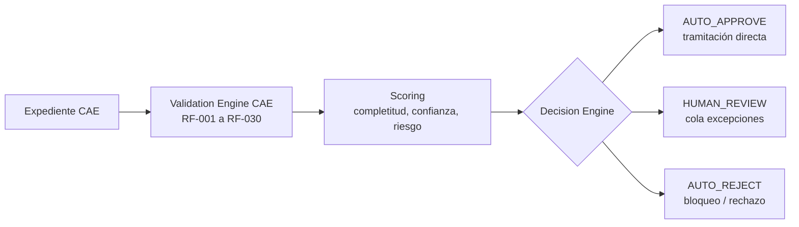
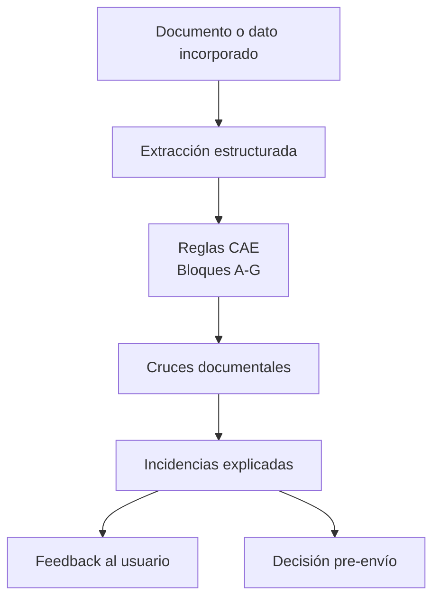

# RESUMEN EJECUTIVO PARA CLIENTE

## Sistema de Asistencia Inteligente CAE v3.0

| Campo | Valor |
|-------|-------|
| **Versión** | 3.0 |
| **Estado** | Versión de entrega |
| **Fecha** | 03/07/2026 |
| **Proyecto** | Plataforma CAE v2.0 — Desarrollo IA |
| **Clasificación** | Confidencial — IDEAUTO / Babooni |
| **Documentos relacionados** | [`ESPECIFICACION-FUNCIONAL-v3.0.md`](ESPECIFICACION-FUNCIONAL-v3.0.md), [`DISENO-TECNICO-v3.0.md`](DISENO-TECNICO-v3.0.md), [`ARQUITECTURA-CAE-IA.md`](ARQUITECTURA-CAE-IA.md), [`ESTRATEGIA-MIGRACION-FRONTEND-CAE.md`](ESTRATEGIA-MIGRACION-FRONTEND-CAE.md) |

---

## 1. Mensaje principal

La propuesta no plantea una solución genérica de OCR ni una simple extracción documental. El objetivo es construir una **plataforma de asistencia inteligente especializada en el proceso CAE de IDEAUTO**, capaz de validar expedientes de forma continua, aplicar reglas de negocio específicas, detectar incidencias en origen y reducir de forma medible la carga operativa del equipo de revisión.

La IA no se limita a leer documentos. La IA debe **hacer progresivamente el trabajo de validación funcional** que hoy realiza Operaciones IDEAUTO sobre expedientes rutinarios:

- Comprobar documentación obligatoria.
- Validar coherencia entre documentos.
- Aplicar reglas CAE específicas.
- Detectar incidencias críticas, mayores y menores.
- Aprobar automáticamente expedientes limpios.
- Rechazar automáticamente expedientes con errores claros.
- Enviar a Operaciones solo excepciones, casos dudosos o auditoría.

> **Objetivo final:** que Operaciones deje de revisar todos los expedientes uno a uno y pase a supervisar excepciones, auditar muestras y gobernar la calidad del sistema.

---

## 2. Respuesta directa a las preocupaciones planteadas

| Preocupación planteada | Respuesta de la solución |
|------------------------|--------------------------|
| La propuesta parecía centrada en OCR + extracción documental | El OCR es solo una entrada. El núcleo es el **Validation Engine CAE** con reglas RF-001 a RF-030. |
| Faltaba validación funcional continua | La validación se ejecuta tras cada documento, sustitución o cambio de dato. |
| Faltaban cruces entre documentos | Se implementan cruces automáticos de titular, VIN, matrícula, marca/modelo, fechas y reglas CAE. |
| El usuario debía enterarse tarde de los errores | La UI informa incidencias, ausencias y acciones correctivas antes del envío. |
| Operaciones seguía revisando todo | El modelo objetivo es **AUTO_APPROVE / HUMAN_REVIEW / AUTO_REJECT**: Operaciones solo ve excepciones. |
| Parecía una solución documental genérica | Se documentan reglas CAE específicas, matrices documentales, Knowledge Base CAE y feedback operativo IDEAUTO. |

---

## 3. Cómo cambia el trabajo de Operaciones IDEAUTO

### 3.1 Situación actual

En el flujo actual, Operaciones debe revisar manualmente gran parte del expediente:

- Si la documentación está completa.
- Si los documentos son válidos y legibles.
- Si el titular coincide entre documentos.
- Si VIN, matrícula, marca y modelo son coherentes.
- Si se cumplen requisitos CAE: antigüedad VO, BEV, plazos, ahorro energético, anexos y firmas.
- Si procede devolver, aprobar o rechazar.

Esto provoca carga operativa alta, tiempos de revisión elevados, devoluciones frecuentes y dependencia del criterio manual acumulado por el equipo.

### 3.2 Situación objetivo

La IA asume las comprobaciones rutinarias y decide automáticamente cuando el expediente es claro:

| Tipo de expediente | Decisión IA | Intervención Operaciones |
|--------------------|-------------|--------------------------|
| Expediente completo, coherente y con alta confianza | **AUTO_APPROVE** | No entra en cola |
| Expediente con incidencias críticas o mayores | **AUTO_REJECT** | No consume revisión ordinaria |
| Expediente dudoso, atípico o con baja confianza | **HUMAN_REVIEW** | Sí, cola de excepciones |
| Muestra de calidad sobre auto-aprobaciones | Auditoría | Revisión muestral, no revisión total |

> La clave del ahorro es que los expedientes auto-aprobados **no se vuelven a revisar manualmente**. Si se revisaran todos de nuevo, la IA no reduciría la carga real.

---

## 4. Motor de decisión

El Decision Engine clasifica cada expediente en tres salidas:

### 4.1 AUTO_APPROVE

La IA aprueba automáticamente cuando se cumplen todos los criterios:

- Documentación obligatoria al 100 %.
- Sin incidencias críticas ni mayores.
- Reglas CAE RF-001 a RF-030 superadas.
- Cruces de titular, VIN, matrícula y fechas coherentes.
- Confidence global por encima del umbral.
- Sin flags de riesgo ni tipologías atípicas.
- Fitness del sistema dentro de umbrales aprobados.

### 4.2 HUMAN_REVIEW

Operaciones revisa solo cuando hay zona gris:

- Confidence baja.
- Incidencias menores.
- Campo clave modificado manualmente.
- Tipología no habitual.
- Regla en advertencia.
- Caso no representado suficientemente en golden set.

### 4.3 AUTO_REJECT

La IA bloquea o rechaza automáticamente cuando hay errores claros:

- Documento obligatorio ausente.
- Incidencia crítica abierta.
- Incidencia mayor abierta.
- Incoherencia fuerte en VIN, matrícula, titular o requisitos CAE.

---

## 5. Validación progresiva: el núcleo del sistema

La validación no ocurre al final. Ocurre durante toda la construcción del expediente.

Cada subida documental, reemplazo o modificación de campo dispara:

- Validación documental.
- Validación funcional CAE.
- Cruces entre documentos.
- Recalculo de completitud.
- Recalculo de scoring y riesgo.
- Actualización inmediata de incidencias en UI.

Esto permite corregir en origen y evitar que Operaciones reciba expedientes con errores previsibles.

---

## 6. Reglas CAE específicas

El sistema incorpora un catálogo de reglas funcionales específico del proceso CAE:

| Bloque | Alcance | Ejemplos |
|--------|---------|----------|
| **A — Documentales** | DNI, factura, fichas, permiso, IVTM | Documento válido, legible, tipo correcto |
| **B — Firmas** | Firma manuscrita/digital | Firma obligatoria, comparación con DNI |
| **C — Coherencia** | Cruces entre documentos | Titular, VIN, matrícula, marca/modelo |
| **D — Reglas CAE** | Requisitos del negocio | Antigüedad VO, BEV, plazos, ahorro |
| **E — Formulario** | Datos introducidos | Dirección, referencia catastral, ayudas, datos bancarios |
| **F — Anexos** | Convenio, autorizaciones | Contraprestación, firmas, protección de datos |
| **G — Calidad** | Imagen e integridad | Páginas faltantes, duplicadas, baja calidad |

Esto diferencia la solución de una herramienta documental genérica.

---

## 7. MLOps y aprendizaje operativo

La IA mejora con el uso operativo real:

1. Operaciones corrige o valida excepciones.
2. El Feedback Engine registra el criterio humano.
3. El Labeling Service etiqueta el caso.
4. El Dataset Builder incorpora el caso a datasets versionados.
5. El Evaluation Pipeline compara versiones contra golden set.
6. El Fitness Engine decide si una versión mejora o empeora.
7. Se promocionan o revierten reglas, prompts o modelos con trazabilidad.

> El conocimiento operativo de IDEAUTO deja de estar solo en personas y se convierte progresivamente en reglas, datasets, métricas y modelos evaluables.

---

## 8. Horizonte de 6 meses

| Fase | Horizonte | Resultado esperado |
|------|-----------|-------------------|
| **0 — Baseline** | Mes 0 | Arquitectura, reglas, equipos y golden set inicial |
| **1 — IA integrada** | Meses 1–2 | App IA en producción; validación progresiva y Decision Engine en calibración |
| **2 — Auto-aprobación inicial** | Meses 3–4 | AUTO_APPROVE activo para expedientes limpios; Operaciones solo excepciones |
| **3 — Consolidación** | Meses 5–6 | > 70 % expedientes auto-aprobados; auditoría muestral; Angular completo |
| **4 — Evolución continua** | Posterior | Mayor cobertura de auto-aprobación, menor cola humana, mejora por fitness |

---

## 9. KPIs de éxito

| KPI | Objetivo |
|-----|----------|
| Expedientes auto-aprobados por IA | > 70 % al mes 6 |
| Comprobaciones CAE ejecutadas por IA | > 95 % al mes 6 |
| Reducción tiempo de revisión humana | -40 % vs. baseline |
| Reducción expedientes devueltos | -30 % vs. baseline |
| Incidencias detectadas pre-envío | > 90 % |
| Precisión de auto-aprobación en auditoría | > 98 % |
| Trazabilidad | 100 % decisiones auditadas |

---

## 10. Qué se entrega al cliente

La entrega completa se apoya en cuatro documentos:

1. **Especificación Funcional** — qué hace el sistema, reglas CAE, decisiones, experiencia de usuario y KPIs.
2. **Diseño Técnico** — cómo se implementa: arquitectura, APIs, datos, MLOps, seguridad y despliegue.
3. **Arquitectura CAE IA** — visión visual del sistema, fases, validación, MLOps y frontend.
4. **Estrategia de Migración Frontend** — transición React → Angular en 6 meses, con MFE temporal.

Este resumen ejecutivo permite entender rápidamente el valor de la propuesta sin entrar en todo el detalle técnico.

---

## 11. Conclusión

La propuesta v3.0 responde a la preocupación principal de IDEAUTO:

> No se entrega un OCR con revisión humana posterior. Se entrega una plataforma CAE inteligente donde la IA valida, decide y aprende; Operaciones deja de revisar todo y se concentra en excepciones, auditoría y mejora continua.

El valor principal para IDEAUTO es operativo:

- Menos expedientes erróneos.
- Menos devoluciones.
- Menos revisión manual.
- Más decisiones automáticas trazables.
- Conocimiento CAE codificado y mejorado con datos reales.

*Resumen Ejecutivo para Cliente — Sistema de Asistencia Inteligente CAE v3.0.*
