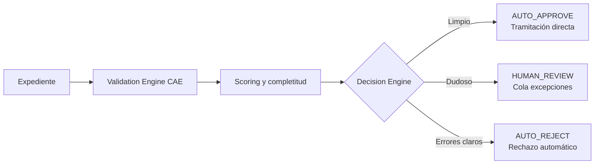

# RESUMEN EJECUTIVO PARA CLIENTE

## Sistema de Asistencia Inteligente para Plataforma CAE v3.0

| Campo | Valor |
|-------|-------|
| **Versión** | 3.0 |
| **Estado** | Versión de entrega |
| **Fecha** | 03/07/2026 |
| **Proyecto** | Plataforma CAE v2.0 — Desarrollo IA |
| **Clasificación** | Confidencial — IDEAUTO / Babooni |

---

## Mensaje clave

**No proponemos una solución genérica de OCR.**

Proponemos una **plataforma de asistencia inteligente especializada en el proceso CAE**, diseñada para validar expedientes de forma continua, aplicar las **reglas de negocio reales de IDEAUTO** y **reducir de forma significativa la carga operativa** del equipo de revisión.

**El objetivo principal es que la IA realice progresivamente el trabajo de validación funcional** que hoy ejecuta manualmente Operaciones IDEAUTO en expedientes rutinarios — comprobar documentación, cruzar datos, aplicar reglas CAE y decidir si un expediente está listo — dejando al equipo humano **solo las excepciones, los casos complejos y la auditoría de calidad**.

> Si Operaciones tuviera que revisar de nuevo cada expediente que la IA ya validó, no habría ahorro real. Por eso los expedientes limpios **se aprueban automáticamente** y **no entran en cola humana**.

---

## Respuesta directa a sus preocupaciones

| Preocupación planteada | Cómo lo resolvemos en v3.0 |
|------------------------|----------------------------|
| Enfoque excesivo en extracción documental | El núcleo es el **Validation Engine CAE** con 30 reglas específicas (RF-001 a RF-030). La extracción es solo una entrada. |
| Falta de validación funcional continua | **Validación progresiva** tras cada documento o cambio de dato — no al final. |
| Ausencia de cruces entre documentos | Cruces automáticos de titular, VIN, matrícula, fechas, marca/modelo y reglas CAE. |
| Errores detectados tarde | Feedback en **tiempo real** al cliente mientras construye el expediente. |
| Operaciones seguía revisando todo | Modelo **AUTO_APPROVE / HUMAN_REVIEW / AUTO_REJECT**. Operaciones solo ve excepciones. |
| Solución genérica, no específica CAE | Catálogo de reglas, matrices documentales y Knowledge Base del **proceso CAE de IDEAUTO**. |

---

## Cómo cambia el día a día de Operaciones IDEAUTO

**Antes**

Revisión manual completa de casi todos los expedientes: comprobar documentos, cruzar titular/VIN/matrícula, validar reglas CAE, detectar incidencias y decidir aprobar, devolver o rechazar.

**Después**

| Situación | Qué hace la IA | Operaciones |
|-----------|----------------|-------------|
| Expediente limpio y coherente | **AUTO_APPROVE** — tramitación directa | No interviene |
| Errores claros o bloqueantes | **AUTO_REJECT** — rechazo automático | No interviene |
| Caso dudoso o atípico | **HUMAN_REVIEW** — resumen priorizado | Revisa solo la excepción |
| Control de calidad | Auditoría muestral (~5 %) | Supervisión, no revisión masiva |

**Resultado esperado al mes 6:**

- **-40 %** tiempo de revisión humana
- **-30 %** expedientes devueltos
- **> 70 %** expedientes auto-aprobados por IA
- **> 90 %** incidencias detectadas antes del envío

---

## Motor de decisión

| Decisión | Cuándo | Efecto |
|----------|--------|--------|
| **AUTO_APPROVE** | Documentación completa, reglas OK, alta confianza, sin incidencias críticas/mayores | La IA aprueba y tramita — **sin cola Operaciones** |
| **HUMAN_REVIEW** | Confidence baja, incidencias menores, tipología atípica o campo editado manualmente | Cola de excepciones con resumen IA |
| **AUTO_REJECT** | Documento obligatorio ausente o incidencias críticas/mayores abiertas | Bloqueo o rechazo automático al cliente |

---

## Validación progresiva: el núcleo del sistema

La validación **no ocurre al final**. Cada vez que el cliente sube un documento o modifica un dato, el sistema:

1. Extrae la información relevante.
2. Aplica las reglas CAE (Bloques A–G).
3. Cruza datos entre documentos del expediente.
4. Informa incidencias, completitud y recomendaciones **en tiempo real**.

El cliente corrige en origen. Operaciones deja de recibir expedientes con errores evitables.

---

## Reglas CAE específicas (no genéricas)

El sistema codifica **30 reglas funcionales** del proceso CAE en siete bloques:

| Bloque | Qué valida |
|--------|------------|
| **A — Documentales** | DNI, factura, fichas, permiso, IVTM |
| **B — Firmas** | Firma obligatoria, comparación con DNI |
| **C — Coherencia** | Titular, VIN, matrícula, marca/modelo |
| **D — Reglas CAE** | Antigüedad VO, BEV, plazos, ahorro energético |
| **E — Formulario** | Dirección, referencia catastral, ayudas, datos bancarios |
| **F — Anexos** | Convenio, contraprestación, autorizaciones |
| **G — Calidad** | Legibilidad, integridad, páginas faltantes |

Detalle completo en [`ESPECIFICACION-FUNCIONAL-v3.0.md`](ESPECIFICACION-FUNCIONAL-v3.0.md) §13.

---

## Mejora continua

El sistema **aprende del criterio operativo de IDEAUTO**: cada corrección de Operaciones alimenta reglas, datasets y métricas de calidad. La IA mejora con el uso real — sin despliegues a ciegas ni regresiones silenciosas.

---

## Horizonte de entrega: 6 meses

| Periodo | Hito |
|---------|------|
| **Meses 1–2** | App IA en producción; validación progresiva activa; calibración del Decision Engine |
| **Meses 3–4** | Auto-aprobación activa; Operaciones solo atiende excepciones |
| **Mes 6** | > 70 % expedientes auto-aprobados; plataforma consolidada |

---

## Documentación de apoyo

| Documento | Contenido |
|-----------|-----------|
| [`ESPECIFICACION-FUNCIONAL-v3.0.md`](ESPECIFICACION-FUNCIONAL-v3.0.md) | Reglas, flujos, decisiones, UX y KPIs |
| [`DISENO-TECNICO-v3.0.md`](DISENO-TECNICO-v3.0.md) | Arquitectura, APIs, MLOps y despliegue |
| [`ARQUITECTURA-CAE-IA.md`](ARQUITECTURA-CAE-IA.md) | Diagramas maestros del sistema |
| [`ESTRATEGIA-MIGRACION-FRONTEND-CAE.md`](ESTRATEGIA-MIGRACION-FRONTEND-CAE.md) | Evolución frontend (6 meses) |

---

## Conclusión: valor para IDEAUTO

Esta propuesta responde a la preocupación central del equipo de Operaciones:

> **No entregamos un OCR con revisión humana posterior. Entregamos una plataforma CAE inteligente donde la IA valida, decide y aprende — y Operaciones deja de revisar todo para concentrarse en lo que realmente requiere criterio humano.**

**Beneficios concretos para IDEAUTO:**

- **Menos carga operativa** — el equipo de revisión deja de repetir comprobaciones rutinarias.
- **Menos devoluciones** — los errores se detectan y corrigen antes del envío.
- **Más calidad** — reglas CAE aplicadas de forma consistente, no dependiente del revisor.
- **Conocimiento preservado** — el criterio operativo se codifica en reglas y mejora con datos reales.
- **Trazabilidad total** — cada decisión de la IA queda registrada y es auditable.

*Resumen Ejecutivo para Cliente — Sistema de Asistencia Inteligente CAE v3.0.*
