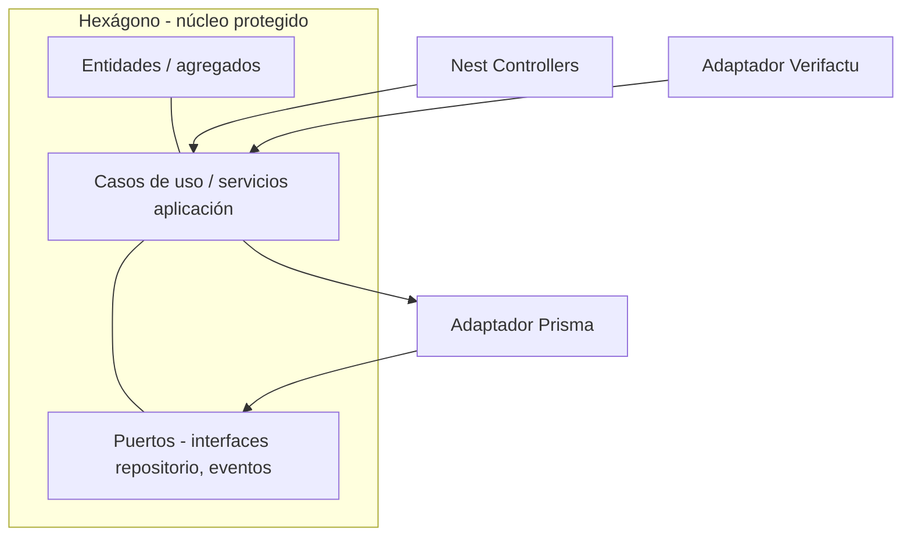

# Josanz ERP — Libro blanco de arquitectura y escalabilidad

**Versión del documento:** 2.0  
**Marco técnico:** Nx Monorepo, TypeScript, NestJS, Angular, Prisma, PostgreSQL  
**Ámbito:** Visión de sistema, decisiones estructurales, ventajas **y** límites; incluye **fricción real**, **trade-offs** y **riesgos** explícitos (no es un documento de marketing).

Este libro blanco **complementa y actualiza** la visión general del producto: incorpora la estructura **real** del repositorio (`libs/isomorphic`, `libs/node`, `libs/browser`, `apps/*`), mecanismos presentes (multi-tenant, Verifactu, outbox, plugins UI) y enlaza con planes operativos. A partir de la v2.0 se documenta también **dónde puede fallar**, **qué no escala por arte de magia** y **qué decisiones se posponen o duelen** en la práctica.

**Documentos relacionados**

| Documento | Relación |
|-----------|----------|
| [BACKLOG.md](./BACKLOG.md) | Deuda técnica, seguridad pendiente, mejoras multi-tenant |
| [IMPLEMENTATION_PLAN.md](./IMPLEMENTATION_PLAN.md) | Estado real por módulo |
| [IMPLEMENTATION_PLAN_PHASE4.md](./IMPLEMENTATION_PLAN_PHASE4.md) | Persistencia, webhooks, eventos |
| [POR_QUE_ANGULAR_VS_OTROS_FRAMEWORKS.md](./POR_QUE_ANGULAR_VS_OTROS_FRAMEWORKS.md) | Elección de frontend y riesgos |
| [PLAN_UI_UX_THEMING_BROWSER.md](./PLAN_UI_UX_THEMING_BROWSER.md) | Theming y capa browser |
| [USER_GUIDE.md](./USER_GUIDE.md) | Uso, entornos, E2E |

---

## Tabla de contenidos

1. [Resumen ejecutivo](#1-resumen-ejecutivo)  
2. [Por qué un monorepo Nx](#2-por-qué-un-monorepo-nx)  
3. [El núcleo: arquitectura hexagonal en Josanz ERP](#3-el-núcleo-arquitectura-hexagonal-en-josanz-erp)  
4. [Backend: capas concretas en el código](#4-backend-capas-concretas-en-el-código)  
5. [Frontend: arquitectura component-driven](#5-frontend-arquitectura-component-driven)  
6. [Matriz de librerías, runtime y responsabilidades](#6-matriz-de-librerías-runtime-y-responsabilidades)  
7. [Multi-tenant, identidad e infraestructura compartida](#7-multi-tenant-identidad-e-infraestructura-compartida)  
8. [Integraciones y adaptadores](#8-integraciones-y-adaptadores)  
9. [Escalabilidad: del monolito modular a microservicios](#9-escalabilidad-del-monolito-modular-a-microservicios)  
10. [Eventos, outbox, transacciones y consistencia](#10-eventos-outbox-transacciones-y-consistencia)  
11. [Modelo de negocio como plugin (UI)](#11-modelo-de-negocio-como-plugin-ui)  
12. [Calidad, límites y gobernanza del código](#12-calidad-límites-y-gobernanza-del-código)  
13. [Seguridad, amenazas y observabilidad](#13-seguridad-amenazas-y-observabilidad)  
14. [Fricción real, trade-offs y límites del patrón](#14-fricción-real-trade-offs-y-límites-del-patrón)  
15. [Registro explícito de riesgos](#15-registro-explícito-de-riesgos)  
16. [Conclusión y mensaje clave](#16-conclusión-y-mensaje-clave)

---

## 1. Resumen ejecutivo

Josanz ERP se implementa como **monolito modular** dentro de un **monorepo Nx**: el código se organiza en **librerías con fronteras claras** (dominio isomórfico, API de contratos, backend Node, frontend Angular). La **lógica de negocio** vive en núcleos **agnósticos de framework** (`libs/isomorphic/core/*`), mientras que NestJS, Prisma y Angular actúan como **adaptadores** en el borde del sistema.

**Ventajas que este documento desarrolla:**

- **Longevidad técnica:** cambiar ORM, base de datos o capa HTTP es *más local* si el puerto se respeta; el dominio *puede* permanecer estable (no es automático si el dominio filtró detalles de Prisma).  
- **Coherencia:** DTOs y tipos compartidos entre front y back (`libs/isomorphic/api/*`).  
- **Velocidad de equipo:** Nx afecta builds/tests por grafo de dependencias — **cuando** CI y caché están bien configurados.  
- **Escalabilidad:** escala horizontal del monolito hoy; **posible** extracción de servicios mañana **con coste** (red, datos, despliegue); el núcleo ayuda, no elimina el dolor.  
- **Producto modular:** plugins en shell Angular alineados con go-to-market — con **riesgo** de complejidad de configuración y UX fragmentada si no se gobierna.

### 1.1 Lectura crítica (intención de este documento)

Un arquitecto senior no solo lista virtudes: **anticipa fallos**. En las secciones [§9](#9-escalabilidad-del-monolito-modular-a-microservicios), [§10](#10-eventos-outbox-transacciones-y-consistencia), [§13](#13-seguridad-amenazas-y-observabilidad), [§14](#14-fricción-real-trade-offs-y-límites-del-patrón) y [§15](#15-registro-explícito-de-riesgos) encontrarás **trade-offs**, **límites** y **riesgos** alineados con el estado del repo y el [BACKLOG.md](./BACKLOG.md).

---

## 2. Por qué un monorepo Nx

### 2.1 Definición

Un **monorepo** alberga múltiples aplicaciones y librerías en un único repositorio con **herramientas unificadas** (TypeScript, ESLint, Jest/Playwright, build). **Nx** añade:

- **Grafo de dependencias** entre proyectos (`nx graph`).  
- **Caché de tareas** y **ejecución paralela** (`nx run-many`, `nx affected`).  
- **Generadores** alineados con el stack (Angular, Nest).  
- **Contratos de frontera** vía `tsconfig` paths (`@josanz-erp/*`).

### 2.2 Ventajas frente a multirepo o “monolito sin herramientas”

| Aspecto | Multirepo típico | Monorepo sin Nx | Monorepo Nx (Josanz) |
|---------|------------------|-----------------|----------------------|
| Sincronizar versión de TS / ESLint | Complejo (N versiones) | Manual | Centralizado |
| Cambio en DTO compartido | Publicar paquete + bump en N repos | Copiar/pegar riesgoso | Un commit, paths directos |
| CI “solo lo tocado” | Scripts frágiles | A menudo “build todo” | `nx affected` |
| Visibilidad de acoplamientos | Opaca | Opaca | Grafo explícito |
| Onboarding | N clones y convenciones | Una convención | Generators + docs |

### 2.3 Implicación estratégica

El monorepo **no es solo comodidad de carpetas**: es la **herramienta de alineación** entre dominio, API y UI. Cualquier decisión de “sacar un microservicio” puede hacerse **arrastrando librerías existentes** a una nueva `app` — **pero** el trabajo duro sigue siendo **acoplamiento de datos**, **latencia**, **versionado de contratos** y **operación** (véase [§9.4](#94-microservicios-la-parte-que-duele-en-la-vida-real)).

### 2.4 Fricción real del monorepo (lo que no cuenta el folleto)

| Fricción | Qué pasa en la práctica | Mitigación en Josanz / recomendación |
|----------|-------------------------|--------------------------------------|
| **CI lento o “casi todo”** | Sin caché remota o sin `affected`, cada PR compila medio mundo. | Nx Cloud o caché local en CI; pipelines por target; revisar `nx.json` y paralelismo. |
| **Carga cognitiva** | Decenas de `project.json`; nuevo dev pregunta “¿dónde toco?”. | Documentación (este libro, planes), tags `scope:*` / `type:*`, generadores. |
| **Acoplamiento “legal” por paths** | Import directo que rompe capas si ESLint no lo prohíbe. | **Module boundaries** estrictos (hoy [recomendado reforzar](#12-calidad-límites-y-gobernanza-del-código)). |
| **Upgrades en cadena** | Subir Angular o Nx implica alinear muchos proyectos a la vez. | Ventana de upgrade planificada; `nx migrate`. |

**Métrica orientativa del workspace:** en el entorno de desarrollo del repo, `nx show projects` lista del orden de **~99 proyectos Nx** (apps + libs); el número exacto fluctúa con el tiempo. No sustituye KPIs de CI: conviene medir **duración de pipeline**, **tasa de aciertos de caché** y **tiempo medio de feedback** por PR.

---

## 3. El núcleo: arquitectura hexagonal en Josanz ERP

La **arquitectura hexagonal** (puertos y adaptadores) separa:

1. **Dominio** — reglas de negocio puras.  
2. **Aplicación** — casos de uso que orquestan el dominio.  
3. **Infraestructura** — HTTP, BD, colas, terceros.

El dominio **no debería importar** NestJS ni Prisma; solo **interfaces (puertos)** que la infraestructura **implementa (adaptadores)**. Ese “no debería” es **disciplina humana**: si el caso de uso filtra tipos de Prisma al core, el hexágono **se rompe** sin que el compilador grite siempre.

### 3.1 Capa de dominio (core)

**Ubicación en repo:** `libs/isomorphic/core/<dominio>/core/` (por ejemplo `receipts`, `clients`, `budget`, `billing`).

**Características:**

- **TypeScript puro**, sin decoradores de Nest ni APIs de Angular.  
- **Entidades y agregados** con invariantes (p. ej. no marcar pagado un recibo en estado inválido).  
- **Value objects** donde aplica (`EntityId`, tipos en `libs/isomorphic/shared/model`).  
- **Puertos** como interfaces TypeScript (`*RepositoryPort`, tokens de inyección simbólica exportados desde el core o módulo de aplicación).

**Responsabilidades:**

| Elemento | Responsabilidad |
|----------|-----------------|
| Entidades | Estado coherente del negocio; transiciones válidas |
| Domain services | Reglas que no pertenecen a una sola entidad |
| Puertos | Contrato de persistencia, mensajería, reloj, etc. |

**Ventaja clave:** el dominio **ignora** si los datos vienen de PostgreSQL, un fichero CSV o una API externa; solo exige que el adaptador **cumpla el puerto**.

### 3.2 Capa de aplicación

**Ubicación típica:** servicios dentro de `libs/node/backend/<dominio>/backend` que coordinan repositorios, **outbox** y reglas del core (p. ej. `ReceiptsService`).

**Responsabilidades:**

- Recibir **DTOs** o primitivos desde la capa HTTP.  
- Instanciar o rehidratar **entidades** del core.  
- Ejecutar operaciones de dominio y **persistir** vía puertos.  
- Publicar **eventos de dominio** / outbox cuando corresponda.

**Ventaja clave:** un único lugar **orquesta** el flujo; los controladores Nest permanecen **delgados** (HTTP in/out).

### 3.3 Capa de infraestructura

**Ubicación:** `libs/node/backend/*/backend` (módulos Nest), `libs/node/shared-infrastructure` (Prisma, guards, outbox), `apps/backend` (composición, módulos transversales), `libs/node/adapters/*`.

**Componentes:**

| Componente | Rol |
|------------|-----|
| NestJS | Controllers, modules, guards, pipes, Swagger |
| Prisma + PostgreSQL | Persistencia relacional, migraciones |
| Adaptadores | Verifactu, email, almacenamiento (libs dedicadas) |

**Ventaja clave:** sustituir Prisma por otro driver **no obliga** a reescribir el caso de uso **si el puerto se mantiene** y el dominio no filtró detalles del ORM.

### 3.4 Cuándo el hexagonal sobra, se degrada o conviene romper el patrón

| Situación | Recomendación pragmática |
|-----------|-------------------------|
| **CRUD trivial sin reglas** | No crear seis capas “por religión”; al menos mantener contrato API y acceso a datos claro. |
| **Prototipo desechable** | Puede vivir en un solo módulo; **documentar** que no es el patrón de destino. |
| **Dominio anémico** | Si todo está en el servicio Nest y el core solo reexporta tipos, el hexágono es **teatro** — o se rellena de verdad o se simplifica la historia. |
| **Rendimiento crítico en lectura** | A veces hace falta query específica en adaptador (proyecciones); no “ensuciar” entidades, pero **aceptar** lecturas optimizadas en el borde. |
| **Transacciones distribuidas** | No fingir un agregado único: usar outbox, sagas, idempotencia (véase [§10](#10-eventos-outbox-transacciones-y-consistencia)). |

---

## 4. Backend: capas concretas en el código

### 4.1 Patrón por dominio (ejemplo conceptual: recibos)

| Capa | Ruta típica | Ejemplo |
|------|-------------|---------|
| Contratos / DTOs isomórficos | `libs/isomorphic/api/receipts/api` | Tipos `PaymentStatus`, DTOs compartidos con front |
| Dominio | `libs/isomorphic/core/receipts/core` | `Receipt` aggregate, `ReceiptsRepositoryPort` |
| Backend Nest | `libs/node/backend/receipts/backend` | `ReceiptsService`, `ReceiptsController`, `PrismaReceiptsRepository` |
| App | `apps/backend` | `ReceiptsBackendModule` importado en `AppModule` |

Este patrón se **replica** por dominio (clientes, presupuestos, facturación, etc.), con matices según madurez de cada módulo.

### 4.2 Infraestructura transversal

**`libs/node/shared-infrastructure`:**

- `PrismaService` y módulo Prisma.  
- `TenantGuard`, decoradores `@PublicTenant()`, middleware CLS para `tenantId`.  
- `OutboxService` para patrón **transactional outbox** (eventos fiables hacia procesamiento asíncrono).

**Ventajas:**

- **Consistencia** de acceso a datos y seguridad multi-tenant.  
- **Un solo lugar** para políticas transversales.

**Fricción:** todo lo transversal concentra **riesgo de regressión** y **cuellos de botella de revisión** si crece sin dueño claro.

### 4.3 Aplicación backend (`apps/backend`)

Actúa como **compositor**: registra módulos de dominio, analytics, health, integraciones Fase 3/4, CORS, Swagger, `ValidationPipe` global.

### 4.4 Prisma como adaptador: límites honestos

| Ventaja | Coste / límite |
|---------|----------------|
| Productividad y migraciones | **Consultas muy avanzadas** o **lock hints** específicos pueden pelear con el modelo mental de Prisma. |
| Type-safety | Schema y código generado acoplan el equipo al **ciclo `migrate` / `generate`**. |
| Multi-tenant | Cada query debe recordar **`tenant_id`**; olvidarlo en un repositorio es **vulnerabilidad**, no bug cosmético. |

---

## 5. Frontend: arquitectura component-driven

### 5.1 Principio Smart / Dumb

- **Dumb (presentación):** `libs/browser/shared/ui-kit` — botones, inputs, tablas, cards, modales. Ideales: **entradas/salidas** claras, poca o nula lógica de negocio.  
- **Smart (contenedores):** `libs/browser/feature/<dominio>/feature` — inyectan servicios, **signals**, rutas, orquestan el ui-kit.  
- **Data access:** `libs/browser/data-access/*` y `shared-data-access` — HTTP, stores, interceptores.  
- **Shell:** `libs/browser/shell/*` — rutas lazy, barrera de plugins.

### 5.2 Ventajas

| Ventaja | Descripción |
|---------|-------------|
| Reutilización | Un cambio en `ui-kit` propaga diseño a todas las features |
| Testabilidad | Componentes smart probables con mocks de data-access |
| Onboarding | Nuevos desarrolladores ubican lógica en `feature`, no en estilos sueltos |
| Theming | Tokens y `ThemeService` pueden unificar apariencia (ver plan UI/UX) |

### 5.3 Angular en el stack

- **Standalone components**, lazy loading por rutas en shell.  
- **Signals** para estado local reactivo.  
- **Interceptores** (`auth`, `tenant`, `apiOrigin`) centralizan cabeceras y orígenes.

### 5.4 Riesgos ocultos: Signals, smart components y plugins

| Riesgo | Síntoma | Contramedida |
|--------|---------|--------------|
| **Smart component “dios”** | Un `.ts` de miles de líneas mezcla HTTP, reglas de negocio y UI. | Extraer servicios de caso de uso de pantalla; empujar reglas a `isomorphic/core` cuando correspondan. |
| **Signals + RxJS sin norma** | Doble fuente de verdad (signal + BehaviorSubject). | Convención de equipo: *cuándo* signal, *cuándo* RxJS; documentar en ADR corto. |
| **Plugins y flags** | Rutas que “desaparecen” sin mensaje claro; permisos desalineados con API. | `pluginGuard` + contrato con backend; mensajes UX para “no licenciado”. |
| **Acoplamiento indirecto UI → negocio** | El front **reimplementa** reglas que ya están en core (o al revés). | DTOs y validaciones compartidas donde tenga sentido; tests de contrato API. |

Más detalle en [POR_QUE_ANGULAR_VS_OTROS_FRAMEWORKS.md](./POR_QUE_ANGULAR_VS_OTROS_FRAMEWORKS.md) (reactividad, formularios, TCO).

---

## 6. Matriz de librerías, runtime y responsabilidades

Tabla ampliada respecto al borrador original, alineada con **paths reales** (`tsconfig.base.json`).

| Prefijo / tipo | Runtime | Tecnología | Responsabilidad |
|----------------|---------|------------|-----------------|
| `libs/isomorphic/api/*` | Isomórfico (TS) | TypeScript | Contratos: DTOs, tipos, enums compartidos front/back |
| `libs/isomorphic/core/*` | Isomórfico | TypeScript | Dominio: entidades, puertos, reglas sin framework |
| `libs/isomorphic/shared/*` | Isomórfico | TS | Modelo compartido (`EntityId`), utils, config |
| `libs/node/backend/*` | Node | NestJS | Módulos de aplicación + adaptadores Prisma/controladores |
| `libs/node/shared-infrastructure` | Node | NestJS + Prisma | DB, guards, outbox, utilidades transversales |
| `libs/node/adapters/*` | Node | Nest / HTTP | Integraciones (p. ej. Verifactu) |
| `libs/browser/shared/ui-kit` | Browser | Angular | Componentes de presentación |
| `libs/browser/shared/ui-shell` | Browser | Angular | Layout, navegación global |
| `libs/browser/shared/data-access` | Browser | Angular | Servicios transversales (tema, plugins, APIs comunes) |
| `libs/browser/data-access/*` | Browser | Angular | HTTP y estado por dominio |
| `libs/browser/feature/*` | Browser | Angular | Pantallas smart, flujos de usuario |
| `libs/browser/shell/*` | Browser | Angular | Rutas, lazy loading, guards de plugin |
| `apps/backend` | Node | NestJS | Bootstrap, OpenAPI, composición de módulos |
| `apps/frontend` | Browser | Angular | Shell de aplicación, entorno, interceptores |
| `apps/verifactu-api`, workers | Node | Nest / workers | Desacople opcional de cargas Verifactu |

**Regla de dependencias (ideal):**

- `isomorphic` **no depende** de `node` ni `browser`.  
- `browser/feature` **depende** de `browser/data-access` y `ui-kit`, no de `node/backend` directamente.  
- `node/backend` **depende** de `isomorphic/core` y `api`, no de Angular.

**Estado honesto:** sin **ESLint module boundaries** estrictos y revisión humana, las reglas son **convención**. El grafo Nx muestra dependencias; **no impide** imports incorrectos por sí solo.

---

## 7. Multi-tenant, identidad e infraestructura compartida

### 7.1 Modelo multi-tenant

- Cabecera **`x-tenant-id`** (UUID) en peticiones API.  
- `TenantGuard` global (con excepciones explícitas para rutas públicas).  
- Datos persistidos con columna `tenant_id` y **aislamiento lógico** en consultas.

**Ventajas:**

- Una sola despliegue sirve a **múltiples organizaciones**.  
- Escalado horizontal **stateless** detrás de balanceador.

### 7.2 Identidad

- Módulo **identity** (JWT, login) integrado en monorepo.  
- Front: `AuthStore`, persistencia de token y `tenant_id` alineada con interceptores.

### 7.3 Consistencia, concurrencia y “filo legal” del multi-tenant

El modelo **shared database, shared schema** con `tenant_id` es estándar en SaaS B2B, pero exige rigor:

| Tema | Riesgo real | Estado / dirección |
|------|-------------|-------------------|
| **Consultas sin filtro tenant** | Fuga cruzada de datos entre clientes. | Cada repositorio debe filtrar por `tenant_id`; revisar código nuevo en PR. |
| **Validación de tenant** | Cabecera presente pero UUID inexistente o no autorizado para el usuario. | [BACKLOG.md](./BACKLOG.md): validar existencia en `tenants` y vínculo usuario–tenant. |
| **Concurrencia en escrituras** | Dos operaciones actualizan el mismo agregado (doble pago, stock negativo). | Usar **transacciones** DB donde haya invariante crítica; considerar **locks optimistas** (`version` / `updatedAt`); idempotencia en comandos repetidos. |
| **Índices** | Listados lentos al crecer datos por tenant. | Diseñar índices compuestos `(tenant_id, …)` según consultas reales; medir con `EXPLAIN`. |
| **Jobs y workers** | Proceso batch sin contexto HTTP olvida tenant. | Pasar `tenantId` explícito en mensajes outbox / colas. |

**Mensaje clave:** multi-tenant no es “una columna más”: es **política de datos** en **cada** lectura/escritura y en **cada** proceso en segundo plano.

---

## 8. Integraciones y adaptadores

### 8.1 Estado actual (referencia repo)

| Integración | Ubicación / patrón |
|-------------|-------------------|
| Verifactu | `libs/node/adapters/verifactu`, dominios `verifactu` en schema Prisma |
| Email / storage | Librerías bajo `libs/node/shared/integrations` (extensibles) |
| Webhooks / calendario | Endpoints en `apps/backend` (integraciones, persistencia Fase 4) |

### 8.2 Patrón recomendado para nuevas integraciones

1. Definir **puerto** en dominio o capa aplicación (interfaz).  
2. Implementar **adaptador** en `libs/node/adapters/<nombre>` o dentro del backend del dominio.  
3. Registrar provider en módulo Nest con token de inyección.  
4. **No** acoplar el adaptador a controladores sin pasar por el caso de uso.

**Ventaja:** pruebas con **dobles de prueba** del puerto; cambio de proveedor acotado.

**Fricción:** integraciones con **APIs frágiles** (rate limits, timeouts) necesitan **reintentos**, **circuit breaker** y **observabilidad** — no bastan interfaces limpias.

*(Stripe, AWS S3 u otros citados en borradores genéricos pueden seguir el mismo patrón cuando se prioricen en producto.)*

---

## 9. Escalabilidad: del monolito modular a microservicios

### 9.1 Fase 1 — Escalado horizontal (hoy)

- Instancias **stateless** del API Nest detrás de balanceador (Nginx, cloud LB, Cloudflare).  
- Sesión / tenant en **cabeceras y JWT**, no en memoria de instancia.  
- PostgreSQL como **fuente de verdad** central (con réplicas de lectura opcionales).

**Ventajas:** más throughput **sin** rediseño arquitectónico.

**Límites:** una sola BD compartida puede convertirse en **cuello de botella**; las migraciones Prisma afectan a **todo** el despliegue.

### 9.2 Fase 2 — Extracción por estrangulador (Strangler)

Cuando un dominio satura CPU, memoria o ciclo de despliegue:

1. **Crear** `apps/<servicio>` en Nx.  
2. **Mover** `libs/node/backend/<dominio>` y dependencias isomórficas al **grafo** del nuevo deployable.  
3. Exponer **API Gateway** o rutas en proxy (`/billing` → servicio billing).  
4. Base de datos: **compartida** inicialmente o **separada** si el acoplamiento lo exige.

**Lo que sí facilita el monolito modular:** el **código** del núcleo y los contratos ya están en libs — la extracción **empieza** por empaquetado, no en blanco.

### 9.3 Fase 3 — Comunicación asíncrona (event-driven)

- **Outbox** existente como puente hacia colas (RabbitMQ, Redis Streams, SQS).  
- **Domain events** persistidos (Fase 4) habilitan auditoría y notificaciones.  
- Consumidores idempotentes con **claves de deduplicación**.

**Ventajas:** desacoplamiento temporal, **resiliencia** ante picos.

**Costes:** **consistencia eventual**, operación de colas, **depuración distribuida** más difícil que un stack trace en un solo proceso.

### 9.4 Microservicios: la parte que duele en la vida real

Afirmar que se puede “extraer sin reescribir el núcleo” es **cierto solo en parte**. En producción aparecen:

| Realidad | Consecuencia |
|----------|--------------|
| **Acoplamientos ocultos** | Joins implícitos, asunciones de transacción única, “solo llamo a esta función del otro módulo”. |
| **Límites de bounded context mal dibujados** | Microservicio A necesita 5 llamadas a B para una pantalla → latencia y fallos en cadena. |
| **Datos compartidos** | BD compartida al inicio evita split brain pero **no** elimina acoplamiento esquema; split de BD implica **migraciones dolorosas** y **sagas**. |
| **Despliegue y versionado** | Contratos rotos entre servicios; necesidad de **compatibilidad hacia atrás** y pruebas de contrato. |
| **Observabilidad obligatoria** | Sin trazas correlacionadas, un incidente es adivinanza entre equipos. |

**Cuándo NO extraer (aún):**

- El dominio no tiene **límite claro** ni carga que lo justifique.  
- El equipo no puede **operar** otro runtime (logs, métricas, alertas, runbooks).  
- La funcionalidad depende de **transacciones fuertes** entre contextos que aún no se han modelado como saga/outbox.

**Mensaje adulto:** el **Strangler** reduce el riesgo frente a un “big bang”, pero **siempre duele**; el monorepo **no elimina** el dolor de red y datos, solo da **mejor punto de partida** en código.

---

## 10. Eventos, outbox, transacciones y consistencia

| Mecanismo | Función |
|-----------|---------|
| `OutboxEvent` (Prisma) | Entrega eventual de side-effects **después** del commit de la transacción de negocio |
| `domain_events` (Fase 4) | Auditoría y webhooks de integración |
| Eventos de dominio en agregados | `pullEvents()` pattern en entidades |

**Dirección:** reducir acoplamiento síncrono entre bounded contexts y preparar **sagas** o procesos batch donde el negocio lo requiera.

### 10.1 Transacciones, locks e idempotencia (donde suele fallar el discurso limpio)

| Concepto | Por qué importa en Josanz |
|----------|---------------------------|
| **Transacción DB** | Varias escrituras (p. ej. negocio + fila outbox) deben **confirmar o revertir juntas**; si no, hay doble envío o estado inconsistente. |
| **Bloqueos y contención** | Alta concurrencia en la misma fila (stock, numeración de documento) → `SELECT … FOR UPDATE` o estrategia de **asignación de rango** / cola. |
| **Idempotencia** | Webhooks y pagos repetidos: claves de idempotencia y respuestas seguras al reintentar. |
| **Consistencia eventual** | Outbox implica que el consumidor ve el mundo **un poco después**; la UX debe tolerar retraso o mostrar estado “pendiente”. |

**No confundir:** outbox **no** sustituye el diseño de **reglas de negocio concurrentes**; solo hace fiable el **efecto secundario** tras persistir.

---

## 11. Modelo de negocio como plugin (UI)

El **`PluginStore`** (`shared-data-access`) y **`pluginGuard`** en rutas permiten:

- Activar/desactivar **módulos** de navegación por configuración o flags.  
- Aproximar **licencias por funcionalidad** sin ramas de código separadas.  
- Carga **lazy** de features vía shell → menor bundle inicial.

**Ventaja comercial:** time-to-market por módulo reutilizando **ui-kit + data-access + core** ya existentes.

### 11.1 Riesgos del modelo plugin

| Riesgo | Mitigación |
|--------|------------|
| **Divergencia front/back** | El usuario ve un menú pero la API devuelve 403; alinear flags con claims o endpoint de capacidades. |
| **Complejidad de matriz producto** | Combinatoria de módulos; documentar paquetes y pruebas de humo por combinación crítica. |
| **Deuda en rutas lazy** | Error en carga de chunk; monitoreo de errores de cliente y fallbacks UX. |

---

## 12. Calidad, límites y gobernanza del código

| Práctica | Cómo se apoya en Nx / repo | Fricción |
|----------|----------------------------|----------|
| Límites entre capas | Tags `scope:*`, `type:*`, ESLint module boundaries | **Reforzar reglas**; hoy depende en parte de convención ([BACKLOG](./BACKLOG.md) y deuda general). |
| Builds incrementales | `nx affected -t build` | Requiere caché y CI bien configurados |
| Tests | `nx affected -t test`, e2e Playwright en `apps/frontend-e2e` | E2E frágiles si entorno no está documentado |
| Documentación API | Swagger en `/api/docs` | No sustituye contratos de versionado entre equipos |
| Skills / AGENTS.md | Convenciones Nx en el workspace | Debe mantenerse al día |

---

## 13. Seguridad, amenazas y observabilidad

### 13.1 Seguridad (más allá de Helmet y JWT)

| Área | Riesgo | Notas / dirección |
|------|--------|-------------------|
| **Multi-tenant** | Datos cruzados, tenant falsificado | Validar pertenencia del tenant al usuario; endurecer `TenantGuard` (ver [BACKLOG.md](./BACKLOG.md)). |
| **Autenticación** | Rutas sin `JwtAuthGuard`, política inconsistente | Definir matriz **pública / autenticada / rol** por entorno. |
| **Secretos** | Webhooks con secretos en BD en claro | Cifrado en reposo o almacén de secretos; no exponer en GET. |
| **CORS** | Orígenes abiertos en prod | `CORS_ORIGIN` estricto. |
| **Abuso** | Brute force, scraping | Rate limiting en rutas sensibles ([BACKLOG.md](./BACKLOG.md)). |
| **Supply chain** | Dependencias npm | Auditorías periódicas, lockfile, revisión de upgrades. |

**Angular (XSS):** bindings sanitizados por defecto; cuidado con HTML dinámico sin revisión.

### 13.2 Observabilidad: lo que separa un 8,5 de un 10

Un sistema en producción “serio” necesita **tres pilares** visibles en incidentes:

| Pilar | Qué aporta | Estado típico en proyectos en evolución |
|-------|------------|----------------------------------------|
| **Logs estructurados** | Contexto (`tenantId`, `requestId`, usuario) | Suele estar **parcial**; unificar formato JSON en Nest, niveles, correlación. |
| **Métricas** | Latencia p95, errores 5xx, colas, pool DB | **Definir** dashboards (Prometheus/Grafana, Datadog, cloud vendor). |
| **Trazas distribuidas** | Seguir una petición a través de API → DB → worker | Imprescindible **antes** de microservicios; útil ya en monolito + workers. |

**Recomendación:** tratar observabilidad como **requisito de release**, no como fase posterior infinita. Sin ellas, outbox y webhooks son **cajas negras** cuando fallan.

---

## 14. Fricción real, trade-offs y límites del patrón

Ejemplos del tipo “**esto nos puede doler**” o “**decidimos no hacerlo (aún)**”, alineados con el tono senior:

| Área | Trade-off o fricción | Comentario honesto |
|------|----------------------|-------------------|
| **Monorepo Nx** | CI largo sin caché; upgrades en cadena | Se compensa con `affected`, caché remota y disciplina de PR pequeñas. |
| **Hexagonal** | Más archivos y capas; curva para juniors | Se paga en productos largos; puede sobrar en prototipos. |
| **Prisma** | Abstracción que limita ciertos patrones SQL | Aceptar SQL crudo puntual o vistas si el dominio lo exige. |
| **Multi-tenant en una BD** | Consultas mal filtradas = incidente grave | Proceso de review + tests de integración por tenant. |
| **Plugins UI** | Complejidad operativa y de prueba | Gobierno de matriz de features y telemetría de errores de carga. |
| **Microservicios** | Operación y consistencia | No son gratis: son **solución a problema de escala u organización**, no trofeo. |

**Métricas que conviene medir (y documentar cuando existan):** tiempo de pipeline CI, proyectos afectados por PR típico, tamaño de bundles del frontend, latencia p95 de API, tasa de error de webhooks/outbox.

---

## 15. Registro explícito de riesgos

Tabla viva: **dónde puede fallar** si no se actúa.

| ID | Riesgo | Impacto | Señal de alerta | Mitigación resumida |
|----|--------|---------|-----------------|---------------------|
| R1 | Query sin `tenant_id` | **Crítico** (datos) | Code review, tests sin aislamiento | Linters custom / repositorios base / checklist PR |
| R2 | Tenant no validado en BD | Alto (suplantación) | Solo existe guard de presencia | [BACKLOG](./BACKLOG.md): validar tenant y vínculo usuario |
| R3 | Doble procesamiento outbox/webhook | Medio–alto (facturación, emails duplicados) | Reintentos sin idempotencia | Claves idempotencia, constraints únicos |
| R4 | Contención en agregados calientes | Medio (timeouts, UX) | Picos en mismas filas | Transacciones cortas, locks, colas |
| R5 | Fronteras de libs violadas | Medio (deuda) | Imports “creativos” | Module boundaries ESLint |
| R6 | Observabilidad insuficiente | Alto en incidentes | “No sabemos qué pasó” | Logs estructurados, trazas, métricas ([§13.2](#132-observabilidad-lo-que-separa-un-85-de-un-10)) |
| R7 | Extracción prematura a microservicio | Alto (coste fijo) | Latencia y bugs entre servicios | Reglas de [§9.4](#94-microservicios-la-parte-que-duele-en-la-vida-real) |
| R8 | Plugins sin paridad API | Medio (UX, soporte) | 403 inesperados | Contrato de capacidades + mensajes claros |

Actualizar este registro cuando un riesgo se **materialice** en incidente o se **cierre** con un cambio arquitectónico.

---

## 16. Conclusión y mensaje clave

Josanz ERP está diseñado para **reducir la obsolescencia técnica** y el coste de evolución — **sin prometer** ausencia de acoplamientos, dolor operativo o deuda cero:

- **Núcleo de negocio** en TypeScript puro, **reutilizable** y **testeable** si se mantiene la disciplina de puertos.  
- **Backend** como **hexágono práctico**: Nest y Prisma son **detalles** que igual exigen **transacciones, índices y políticas de tenant** bien ejecutadas.  
- **Frontend** modular (**smart/dumb**) con **riesgos conocidos** (signals, plugins, smart components).  
- **Monorepo Nx** como **palanca** de visibilidad y empaquetado futuro — con **CI y gobernanza** como contrapeso.

### Mensaje clave

> **Construimos un monolito modular hoy para poder desplegar mañana una constelación de servicios sin renunciar a un núcleo de negocio único, coherente y compartido — sabiendo que la constelación exige observabilidad, límites de datos y tolerancia al dolor de migración, y que el monorepo solo hace el camino más honesto, no mágico.**

---

## Anexo A — Glosario rápido

| Término | Significado en Josanz |
|---------|------------------------|
| Puerto | Interfaz que el dominio exige al exterior |
| Adaptador | Implementación concreta del puerto (Prisma, HTTP, cola) |
| Isomórfico | Código TS ejecutable en Node y/o bundler sin APIs de framework de app |
| Shell | Capa de rutas y entrada lazy a features |
| Outbox | Tabla de eventos pendientes para publicación fiable post-transacción |
| Idempotencia | Repetir la misma operación no duplica efectos adversos |

---

## Anexo B — Evolución documental

Al implementar cambios arquitectónicos relevantes:

1. Actualizar este libro blanco (**versión** y fecha en commit o esta sección).  
2. Reflejar estado en `IMPLEMENTATION_PLAN.md` / `BACKLOG.md`.  
3. Registrar **ADRs** cuando la decisión sea irreversible o costosa de revertir.  
4. Añadir filas a [§15](#15-registro-explícito-de-riesgos) cuando aparezca un riesgo nuevo validado por el equipo.

**Historial de versión (resumen):**

| Versión | Cambio principal |
|---------|------------------|
| 1.0 | Visión arquitectónica inicial ampliada |
| 2.0 | Trade-offs, microservicios realistas, datos/concurrencia, seguridad y observabilidad ampliadas, riesgos explícitos, plugins/signals |

---

*Fin del documento — Josanz ERP Libro Blanco de Arquitectura y Escalabilidad.*
