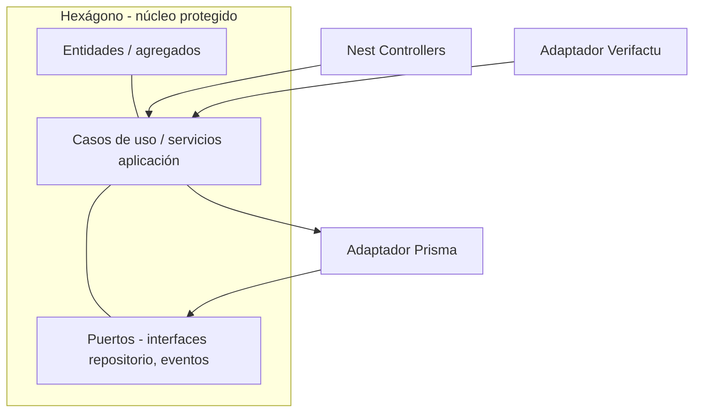

# Josanz ERP — Libro blanco de arquitectura y escalabilidad

**Versión del documento:** 1.0  
**Marco técnico:** Nx Monorepo, TypeScript, NestJS, Angular, Prisma, PostgreSQL  
**Ámbito:** Visión de sistema, decisiones estructurales, ventajas competitivas y evolución prevista.

Este libro blanco **complementa y actualiza** la visión general del producto frente a borradores anteriores: incorpora la estructura **real** del repositorio (`libs/isomorphic`, `libs/node`, `libs/browser`, `apps/*`), los mecanismos ya presentes (multi-tenant, Verifactu, outbox, plugins UI) y enlaza con planes operativos.

**Documentos relacionados**

| Documento | Relación |
|-----------|----------|
| [IMPLEMENTATION_PLAN.md](./IMPLEMENTATION_PLAN.md) | Estado funcional por módulo |
| [IMPLEMENTATION_PLAN_PHASE4.md](./IMPLEMENTATION_PLAN_PHASE4.md) | Persistencia y Fase 4 |
| [BACKLOG.md](./BACKLOG.md) | Deuda y mejoras continuas |
| [PLAN_UI_UX_THEMING_BROWSER.md](./PLAN_UI_UX_THEMING_BROWSER.md) | Estrategia front y theming |
| [USER_GUIDE.md](./USER_GUIDE.md) | Uso y entornos |
| [POR_QUE_ANGULAR_VS_OTROS_FRAMEWORKS.md](./POR_QUE_ANGULAR_VS_OTROS_FRAMEWORKS.md) | Elección de Angular vs otros frameworks (contexto ERP) |

---

## Tabla de contenidos

1. [Resumen ejecutivo](#1-resumen-ejecutivo)  
2. [Por qué un monorepo Nx](#2-por-qué-un-monorepo-nx)  
3. [El núcleo: arquitectura hexagonal en Josanz ERP](#3-el-núcleo-arquitectura-hexagonal-en-josanz-erp)  
4. [Backend: capas concretas en el código](#4-backend-capas-concretas-en-el-código)  
5. [Frontend: arquitectura component-driven](#5-frontend-arquitectura-component-driven)  
6. [Matriz de librerías, runtime y responsabilidades](#6-matriz-de-librerías-runtime-y-responsabilidades)  
7. [Multi-tenant, identidad e infraestructura compartida](#7-multi-tenant-identidad-e-infraestructura-compartida)  
8. [Integraciones y adaptadores](#8-integraciones-y-adaptadores)  
9. [Escalabilidad: del monolito modular a microservicios](#9-escalabilidad-del-monolito-modular-a-microservicios)  
10. [Eventos, outbox y camino event-driven](#10-eventos-outbox-y-camino-event-driven)  
11. [Modelo de negocio como plugin (UI)](#11-modelo-de-negocio-como-plugin-ui)  
12. [Calidad, límites y gobernanza del código](#12-calidad-límites-y-gobernanza-del-código)  
13. [Seguridad y despliegue (visión)](#13-seguridad-y-despliegue-visión)  
14. [Conclusión y mensaje clave](#14-conclusión-y-mensaje-clave)

---

## 1. Resumen ejecutivo

Josanz ERP se implementa como **monolito modular** dentro de un **monorepo Nx**: el código se organiza en **librerías con fronteras claras** (dominio isomórfico, API de contratos, backend Node, frontend Angular). La **lógica de negocio** vive en núcleos **agnósticos de framework** (`libs/isomorphic/core/*`), mientras que NestJS, Prisma y Angular actúan como **adaptadores** en el borde del sistema.

**Ventajas que este documento desarrolla:**

- **Longevidad técnica:** cambiar ORM, base de datos o capa HTTP es local; el dominio permanece estable.  
- **Coherencia:** DTOs y tipos compartidos entre front y back (`libs/isomorphic/api/*`).  
- **Velocidad de equipo:** Nx afecta builds/tests por grafo de dependencias; menos trabajo redundante.  
- **Escalabilidad:** escala horizontal del monolito hoy; extracción de servicios mañana sin reescribir el núcleo.  
- **Producto modular:** activación de funcionalidades por **plugins** en shell Angular alineada con go-to-market.

---

## 2. Por qué un monorepo Nx

### 2.1 Definición

Un **monorepo** alberga múltiples aplicaciones y librerías en un único repositorio con **herramientas unificadas** (TypeScript, ESLint, Jest/Playwright, build). **Nx** añade:

- **Grafo de dependencias** entre proyectos (`nx graph`).  
- **Caché de tareas** y **ejecución paralela** (`nx run-many`, `nx affected`).  
- **Generadores** alineados con el stack (Angular, Nest).  
- **Contratos de frontera** vía `tsconfig` paths (`@josanz-erp/*`).

### 2.2 Ventajas frente a multirepo o “monolito sin herramientas”

| Aspecto | Multirepo típico | Monorepo sin Nx | Monorepo Nx (Josanz) |
|---------|------------------|-----------------|----------------------|
| Sincronizar versión de TS / ESLint | Complejo (N versiones) | Manual | Centralizado |
| Cambio en DTO compartido | Publicar paquete + bump en N repos | Copiar/pegar riesgoso | Un commit, paths directos |
| CI “solo lo tocado” | Scripts frágiles | A menudo “build todo” | `nx affected` |
| Visibilidad de acoplamientos | Opaca | Opaca | Grafo explícito |
| Onboarding | N clones y convenciones | Una convención | Generators + docs |

### 2.3 Implicación estratégica

El monorepo **no es solo comodidad de carpetas**: es la **herramienta de alineación** entre dominio, API y UI. Cualquier decisión de “sacar un microservicio” puede hacerse **arrastrando librerías existentes** a una nueva `app` sin duplicar el núcleo.

---

## 3. El núcleo: arquitectura hexagonal en Josanz ERP

La **arquitectura hexagonal** (puertos y adaptadores) separa:

1. **Dominio** — reglas de negocio puras.  
2. **Aplicación** — casos de uso que orquestan el dominio.  
3. **Infraestructura** — HTTP, BD, colas, terceros.

El dominio **no importa** NestJS ni Prisma; solo **interfaces (puertos)** que la infraestructura **implementa (adaptadores)**.

### 3.1 Capa de dominio (core)

**Ubicación en repo:** `libs/isomorphic/core/<dominio>/core/` (por ejemplo `receipts`, `clients`, `budget`, `billing`).

**Características:**

- **TypeScript puro**, sin decoradores de Nest ni APIs de Angular.  
- **Entidades y agregados** con invariantes (p. ej. no marcar pagado un recibo en estado inválido).  
- **Value objects** donde aplica (`EntityId`, tipos en `libs/isomorphic/shared/model`).  
- **Puertos** como interfaces TypeScript (`*RepositoryPort`, tokens de inyección simbólica exportados desde el core o módulo de aplicación).

**Responsabilidades:**

| Elemento | Responsabilidad |
|----------|-----------------|
| Entidades | Estado coherente del negocio; transiciones válidas |
| Domain services | Reglas que no pertenecen a una sola entidad |
| Puertos | Contrato de persistencia, mensajería, reloj, etc. |

**Ventaja clave:** el dominio **ignora** si los datos vienen de PostgreSQL, un fichero CSV o una API externa; solo exige que el adaptador **cumpla el puerto**.

### 3.2 Capa de aplicación

**Ubicación típica:** servicios dentro de `libs/node/backend/<dominio>/backend` que coordinan repositorios, **outbox** y reglas del core (p. ej. `ReceiptsService`).

**Responsabilidades:**

- Recibir **DTOs** o primitivos desde la capa HTTP.  
- Instanciar o rehidratar **entidades** del core.  
- Ejecutar operaciones de dominio y **persistir** vía puertos.  
- Publicar **eventos de dominio** / outbox cuando corresponda.

**Ventaja clave:** un único lugar **orquesta** el flujo; los controladores Nest permanecen **delgados** (HTTP in/out).

### 3.3 Capa de infraestructura

**Ubicación:** `libs/node/backend/*/backend` (módulos Nest), `libs/node/shared-infrastructure` (Prisma, guards, outbox), `apps/backend` (composición, módulos transversales), `libs/node/adapters/*`.

**Componentes:**

| Componente | Rol |
|------------|-----|
| NestJS | Controllers, modules, guards, pipes, Swagger |
| Prisma + PostgreSQL | Persistencia relacional, migraciones |
| Adaptadores | Verifactu, email, almacenamiento (libs dedicadas) |

**Ventaja clave:** sustituir Prisma por otro driver **no obliga** a reescribir el caso de uso si el puerto se mantiene; solo el adaptador.

---

## 4. Backend: capas concretas en el código

### 4.1 Patrón por dominio (ejemplo conceptual: recibos)

| Capa | Ruta típica | Ejemplo |
|------|-------------|---------|
| Contratos / DTOs isomórficos | `libs/isomorphic/api/receipts/api` | Tipos `PaymentStatus`, DTOs compartidos con front |
| Dominio | `libs/isomorphic/core/receipts/core` | `Receipt` aggregate, `ReceiptsRepositoryPort` |
| Backend Nest | `libs/node/backend/receipts/backend` | `ReceiptsService`, `ReceiptsController`, `PrismaReceiptsRepository` |
| App | `apps/backend` | `ReceiptsBackendModule` importado en `AppModule` |

Este patrón se **replica** por dominio (clientes, presupuestos, facturación, etc.), con matices según madurez de cada módulo.

### 4.2 Infraestructura transversal

**`libs/node/shared-infrastructure`:**

- `PrismaService` y módulo Prisma.  
- `TenantGuard`, decoradores `@PublicTenant()`, middleware CLS para `tenantId`.  
- `OutboxService` para patrón **transactional outbox** (eventos fiables hacia procesamiento asíncrono).

**Ventajas:**

- **Consistencia** de acceso a datos y seguridad multi-tenant.  
- **Un solo lugar** para políticas transversales (validación, logging futuro).

### 4.3 Aplicación backend (`apps/backend`)

Actúa como **compositor**: registra módulos de dominio, analytics, health, integraciones Fase 3/4, CORS, Swagger, `ValidationPipe` global.

---

## 5. Frontend: arquitectura component-driven

### 5.1 Principio Smart / Dumb

- **Dumb (presentación):** `libs/browser/shared/ui-kit` — botones, inputs, tablas, cards, modales. Ideales: **entradas/salidas** claras, poca o nula lógica de negocio.  
- **Smart (contenedores):** `libs/browser/feature/<dominio>/feature` — inyectan servicios, **signals**, rutas, orquestan el ui-kit.  
- **Data access:** `libs/browser/data-access/*` y `shared-data-access` — HTTP, stores, interceptores.  
- **Shell:** `libs/browser/shell/*` — rutas lazy, barrera de plugins.

### 5.2 Ventajas

| Ventaja | Descripción |
|---------|-------------|
| Reutilización | Un cambio en `ui-kit` propaga diseño a todas las features |
| Testabilidad | Componentes smart probables con mocks de data-access |
| Onboarding | Nuevos desarrolladores ubican lógica en `feature`, no en estilos sueltos |
| Theming | Tokens y `ThemeService` pueden unificar apariencia (ver plan UI/UX) |

### 5.3 Angular en el stack

- **Standalone components**, lazy loading por rutas en shell.  
- **Signals** para estado local reactivo.  
- **Interceptores** (`auth`, `tenant`, `apiOrigin`) centralizan cabeceras y orígenes.

---

## 6. Matriz de librerías, runtime y responsabilidades

Tabla ampliada respecto al borrador original, alineada con **paths reales** (`tsconfig.base.json`).

| Prefijo / tipo | Runtime | Tecnología | Responsabilidad |
|----------------|---------|------------|-----------------|
| `libs/isomorphic/api/*` | Isomórfico (TS) | TypeScript | Contratos: DTOs, tipos, enums compartidos front/back |
| `libs/isomorphic/core/*` | Isomórfico | TypeScript | Dominio: entidades, puertos, reglas sin framework |
| `libs/isomorphic/shared/*` | Isomórfico | TS | Modelo compartido (`EntityId`), utils, config |
| `libs/node/backend/*` | Node | NestJS | Módulos de aplicación + adaptadores Prisma/controladores |
| `libs/node/shared-infrastructure` | Node | NestJS + Prisma | DB, guards, outbox, utilidades transversales |
| `libs/node/adapters/*` | Node | Nest / HTTP | Integraciones (p. ej. Verifactu) |
| `libs/browser/shared/ui-kit` | Browser | Angular | Componentes de presentación |
| `libs/browser/shared/ui-shell` | Browser | Angular | Layout, navegación global |
| `libs/browser/shared/data-access` | Browser | Angular | Servicios transversales (tema, plugins, APIs comunes) |
| `libs/browser/data-access/*` | Browser | Angular | HTTP y estado por dominio |
| `libs/browser/feature/*` | Browser | Angular | Pantallas smart, flujos de usuario |
| `libs/browser/shell/*` | Browser | Angular | Rutas, lazy loading, guards de plugin |
| `apps/backend` | Node | NestJS | Bootstrap, OpenAPI, composición de módulos |
| `apps/frontend` | Browser | Angular | Shell de aplicación, entorno, interceptores |
| `apps/verifactu-api`, workers | Node | Nest / workers | Desacople opcional de cargas Verifactu |

**Regla de dependencias (ideal):**

- `isomorphic` **no depende** de `node` ni `browser`.  
- `browser/feature` **depende** de `browser/data-access` y `ui-kit`, no de `node/backend` directamente.  
- `node/backend` **depende** de `isomorphic/core` y `api`, no de Angular.

---

## 7. Multi-tenant, identidad e infraestructura compartida

### 7.1 Modelo multi-tenant

- Cabecera **`x-tenant-id`** (UUID) en peticiones API.  
- `TenantGuard` global (con excepciones explícitas para rutas públicas).  
- Datos persistidos con columna `tenant_id` y **aislamiento lógico** en consultas.

**Ventajas:**

- Una sola despliegue sirve a **múltiples organizaciones**.  
- Escalado horizontal **stateless** detrás de balanceador.

### 7.2 Identidad

- Módulo **identity** (JWT, login) integrado en monorepo.  
- Front: `AuthStore`, persistencia de token y `tenant_id` alineada con interceptores.

---

## 8. Integraciones y adaptadores

### 8.1 Estado actual (referencia repo)

| Integración | Ubicación / patrón |
|-------------|-------------------|
| Verifactu | `libs/node/adapters/verifactu`, dominios `verifactu` en schema Prisma |
| Email / storage | Librerías bajo `libs/node/shared/integrations` (extensibles) |
| Webhooks / calendario | Endpoints en `apps/backend` (integraciones, persistencia Fase 4) |

### 8.2 Patrón recomendado para nuevas integraciones

1. Definir **puerto** en dominio o capa aplicación (interfaz).  
2. Implementar **adaptador** en `libs/node/adapters/<nombre>` o dentro del backend del dominio.  
3. Registrar provider en módulo Nest con token de inyección.  
4. **No** acoplar el adaptador a controladores sin pasar por el caso de uso.

**Ventaja:** pruebas con **dobles de prueba** del puerto; cambio de proveedor (p. ej. otro gateway de pago) acotado.

*(Stripe, AWS S3 u otros citados en borradores genéricos pueden seguir el mismo patrón cuando se prioricen en producto.)*

---

## 9. Escalabilidad: del monolito modular a microservicios

### 9.1 Fase 1 — Escalado horizontal (hoy)

- Instancias **stateless** del API Nest detrás de balanceador (Nginx, cloud LB, Cloudflare).  
- Sesión / tenant en **cabeceras y JWT**, no en memoria de instancia.  
- PostgreSQL como **fuente de verdad** central (con réplicas de lectura opcionales).

**Ventajas:** más throughput **sin** rediseño arquitectónico.

### 9.2 Fase 2 — Extracción por estrangulador (Strangler)

Cuando un dominio satura CPU, memoria o ciclo de despliegue:

1. **Crear** `apps/<servicio>` en Nx.  
2. **Mover** `libs/node/backend/<dominio>` y dependencias isomórficas al **grafo** del nuevo deployable.  
3. Exponer **API Gateway** o rutas en proxy (`/billing` → servicio billing).  
4. Base de datos: **compartida** inicialmente o **separada** si el acoplamiento lo exige.

**Ventaja:** el **core y los contratos** ya existen; la extracción es principalmente **empaquetado y red**, no reescritura del negocio.

### 9.3 Fase 3 — Comunicación asíncrona (event-driven)

- **Outbox** existente como puente hacia colas (RabbitMQ, Redis Streams, SQS).  
- **Domain events** persistidos (Fase 4) habilitan auditoría y notificaciones.  
- Consumidores idempotentes con **claves de deduplicación**.

**Ventajas:** desacoplamiento temporal, **resiliencia** ante picos, integración entre dominios sin llamadas síncronas en cadena.

---

## 10. Eventos, outbox y camino event-driven

| Mecanismo | Función |
|-----------|---------|
| `OutboxEvent` (Prisma) | Garantizar entrega eventual de side-effects tras commit |
| `domain_events` (Fase 4) | Auditoría y webhooks de integración |
| Eventos de dominio en agregados | `pullEvents()` pattern en entidades |

**Dirección:** reducir acoplamiento síncrono entre bounded contexts y preparar **sagas** o procesos batch donde el negocio lo requiera.

---

## 11. Modelo de negocio como plugin (UI)

El **`PluginStore`** (`shared-data-access`) y **`pluginGuard`** en rutas permiten:

- Activar/desactivar **módulos** de navegación por configuración o flags.  
- Aproximar **licencias por funcionalidad** sin ramas de código separadas.  
- Carga **lazy** de features vía shell → menor bundle inicial.

**Ventaja comercial:** time-to-market por módulo reutilizando **ui-kit + data-access + core** ya existentes.

---

## 12. Calidad, límites y gobernanza del código

| Práctica | Cómo se apoya en Nx / repo |
|----------|----------------------------|
| Límites entre capas | Tags `scope:*`, `type:*`, ESLint module boundaries (recomendado reforzar) |
| Builds incrementales | `nx affected -t build` |
| Tests | `nx affected -t test`, e2e Playwright en `apps/frontend-e2e` |
| Documentación API | Swagger en `/api/docs` |
| Skills / AGENTS.md | Convenciones Nx en el workspace |

---

## 13. Seguridad y despliegue (visión)

- **Helmet**, CORS configurable, validación global de DTOs.  
- **JWT** + **tenant** como ejes; endurecer política por entorno (ver [BACKLOG.md](./BACKLOG.md)).  
- Contenedores / orquestación (Docker, K8s) **fuera del alcance** de este libro pero **compatibles** con stateless API.

---

## 14. Conclusión y mensaje clave

Josanz ERP está diseñado para **reducir la obsolescencia técnica** y el coste de evolución:

- **Núcleo de negocio** en TypeScript puro, **reutilizable** y **testeable**.  
- **Backend** organizado como **hexágono práctico**: Nest y Prisma son **detalles**.  
- **Frontend** modular (**smart/dumb**) alineado con **Angular moderno** y theming.  
- **Monorepo Nx** como **palanca** de velocidad, visibilidad y extracción futura de servicios.

### Mensaje clave

> **Construimos un monolito modular hoy para poder desplegar mañana una constelación de servicios sin renunciar a un núcleo de negocio único, coherente y compartido.**

---

## Anexo A — Glosario rápido

| Término | Significado en Josanz |
|---------|------------------------|
| Puerto | Interfaz que el dominio exige al exterior |
| Adaptador | Implementación concreta del puerto (Prisma, HTTP, cola) |
| Isomórfico | Código TS ejecutable en Node y/o bundler sin APIs de framework de app |
| Shell | Capa de rutas y entrada lazy a features |
| Outbox | Tabla de eventos pendientes para publicación fiable post-transacción |

---

## Anexo B — Evolución documental

Al implementar cambios arquitectónicos relevantes:

1. Actualizar este libro blanco (versión y fecha).  
2. Reflejar estado en `IMPLEMENTATION_PLAN.md` / `BACKLOG.md`.  
3. Registrar ADRs puntuales si la decisión es irreversible o costosa de revertir.

---

*Fin del documento — Josanz ERP Libro Blanco de Arquitectura y Escalabilidad.*
