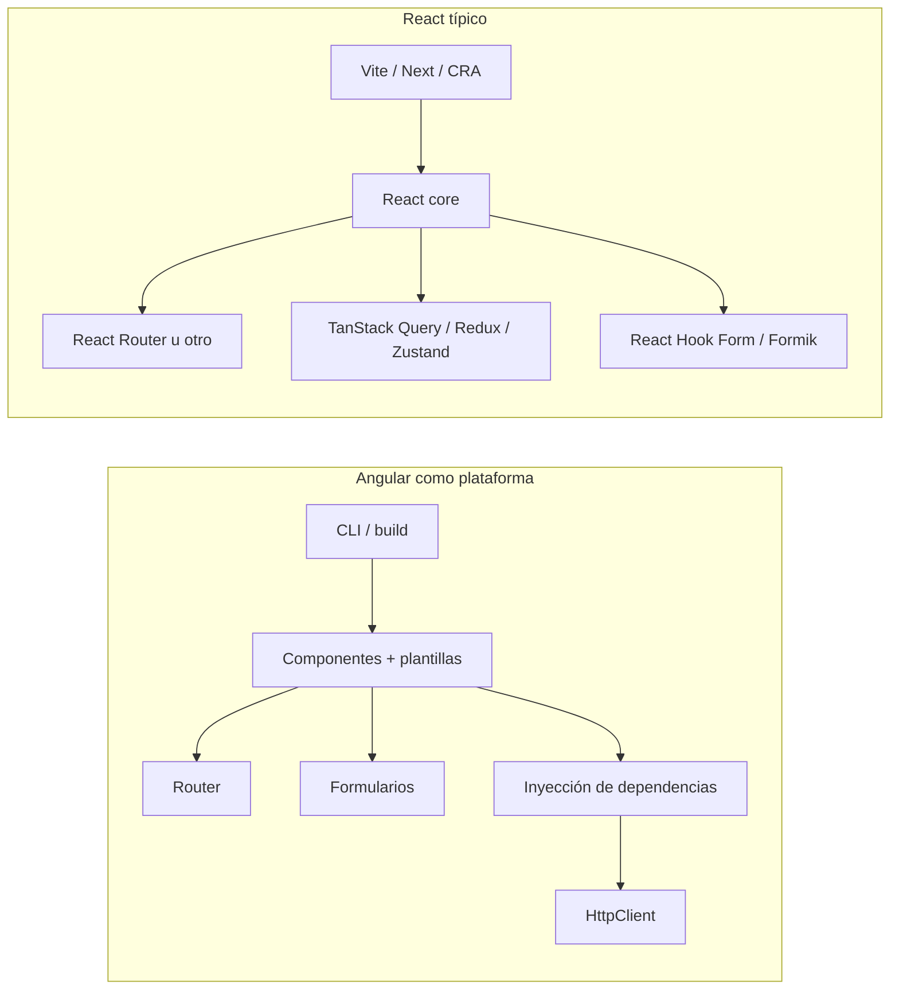

# Por qué Angular (y cuándo tendría sentido otra cosa) — Josanz ERP

**Versión del documento:** 2.0  
**Stack de referencia en el repo (orientativo):** Angular ~21, Nx ~22, builder `@angular/build:application`, `zone.js`, ESLint `angular-eslint`, E2E con Playwright, Storybook para Angular (ver `package.json` y `apps/frontend/project.json`).

**Ámbito:** Justificación **detallada** de la elección de **Angular** como framework del frontend frente a React, Vue y otros enfoques, con matices honestos, riesgos y cómo encaja con un **ERP multi-tenant** mantenido en **monorepo Nx**.

**Documentos relacionados**

| Documento | Relación |
|-----------|----------|
| [LIBRO_BLANCO_ARQUITECTURA_ESCALABILIDAD.md](./LIBRO_BLANCO_ARQUITECTURA_ESCALABILIDAD.md) | Arquitectura global, capas `feature` / `ui-kit` / `shell` |
| [PLAN_UI_UX_THEMING_BROWSER.md](./PLAN_UI_UX_THEMING_BROWSER.md) | Theming y evolución de la capa browser |
| [IMPLEMENTATION_PLAN.md](./IMPLEMENTATION_PLAN.md) | Estado funcional por módulo |

---

## Tabla de contenidos

1. [Contexto de la decisión](#1-contexto-de-la-decisión)  
2. [Perfil del producto: qué exige un ERP como Josanz](#2-perfil-del-producto-qué-exige-un-erp-como-josanz)  
3. [Mapa mental: Angular como “plataforma” frente a “biblioteca + ecosistema”](#3-mapa-mental-angular-como-plataforma-frente-a-biblioteca--ecosistema)  
4. [Comparativas ampliadas](#4-comparativas-ampliadas)  
5. [Reactividad, detección de cambios y rendimiento](#5-reactividad-detección-de-cambios-y-rendimiento)  
6. [Formularios: el corazón de un ERP](#6-formularios-el-corazón-de-un-erp)  
7. [Routing, navegación y carga diferida](#7-routing-navegación-y-carga-diferida)  
8. [Inyección de dependencias y testabilidad](#8-inyección-de-dependencias-y-testabilidad)  
9. [HTTP, interceptores y cortafuegos en el cliente](#9-http-interceptores-y-cortafuegos-en-el-cliente)  
10. [TypeScript, plantillas y calidad en refactor](#10-typescript-plantillas-y-calidad-en-refactor)  
11. [Pruebas: unitarias, componentes y E2E](#11-pruebas-unitarias-componentes-y-e2e)  
12. [SSR, SSG y SEO: qué importa en un ERP](#12-ssr-ssg-y-seo-qué-importa-en-un-erp)  
13. [i18n, accesibilidad y cumplimiento](#13-i18n-accesibilidad-y-cumplimiento)  
14. [Seguridad en el frontend](#14-seguridad-en-el-frontend)  
15. [Nx + Angular en monorepo](#15-nx--angular-en-monorepo)  
16. [React y Next.js: fortalezas y coste en gestión](#16-react-y-nextjs-fortalezas-y-coste-en-gestión)  
17. [Vue, Svelte, Solid y otros](#17-vue-svelte-solid-y-otros)  
18. [Riesgos y anti-patrones con Angular](#18-riesgos-y-anti-patrones-con-angular)  
19. [Evolución del framework (LTS, migraciones)](#19-evolución-del-framework-lts-migraciones)  
20. [Mercado laboral, onboarding y consistencia de equipo](#20-mercado-laboral-onboarding-y-consistencia-de-equipo)  
21. [Relación con la arquitectura hexagonal del repo](#21-relación-con-la-arquitectura-hexagonal-del-repo)  
22. [Conclusión](#22-conclusión)  
23. [Evolución de este documento](#23-evolución-de-este-documento)  
24. [Anexo: glosario breve](#24-anexo-glosario-breve)

---

## 1. Contexto de la decisión

Josanz ERP no es una landing ni un panel mínimo: es un **producto empresarial** con **muchos formularios**, **listados**, **flujos largos**, **autenticación**, **multi-tenant** (`x-tenant-id`, guards en backend) y **vida útil medida en años**. El framework del frontend debe optimizar:

- **Previsibilidad:** menos “sorpresas” al incorporar gente o abrir un módulo nuevo.  
- **Coste total de propiedad (TCO):** no solo el primer sprint, sino refactor, bugs en edge cases y regresiones.  
- **Alineación con el backend TypeScript:** contratos y tipos compartidos (`libs/isomorphic`) reducen desalineación front/back.

Angular se eligió como **plataforma completa y opinada**: estructura de proyecto, compilación, router, formularios, DI, pipes, directivas e i18n forman un **paquete coherente** mantenido por un único equipo (Google + comunidad). Eso sustituye buena parte del trabajo de “definir el stack React/Vue” en cada organización.

---

## 2. Perfil del producto: qué exige un ERP como Josanz

| Necesidad típica | Por qué pesa en la elección de framework |
|------------------|------------------------------------------|
| **Muchos CRUD y formularios anidados** | Validación, estado, errores, deshabilitar envíos, campos condicionales — sin un modelo sólido, el código explota en `useEffect` o callbacks encadenados. |
| **Listados con filtros, ordenación, paginación** | Estado local + remoto, cancelación de peticiones, coherencia con URL — beneficioso tener patrones estándar. |
| **Permisos por rol / feature flags** | Guards de ruta, directivas estructurales `*ngIf` con políticas, ocultar acciones — conviene que encajen con el router y la DI. |
| **Sesión, tenant, cabeceras HTTP** | Interceptores centralizados evitan repetir lógica en cada servicio. |
| **Equipos paralelos en el mismo repo** | Convenciones claras reducen conflictos de “estilo arquitectónico” entre features. |
| **Regresiones caras** | Tests de componente y contratos tipados amortizan el miedo a tocar pantallas antiguas. |

Este perfil **no maximiza** la misma función que un blog o una tienda pública: el SEO y el primer byte HTML suelen ser **secundarios** frente a **consistencia, formularios y mantenimiento** (véase [§12](#12-ssr-ssg-y-seo-qué-importa-en-un-erp)).

---

## 3. Mapa mental: Angular como “plataforma” frente a “biblioteca + ecosistema”

- **Angular:** piezas diseñadas para **encajar** (aunque el equipo aún debe disciplina).  
- **React:** máxima libertad; la **integración** entre piezas es responsabilidad del equipo (documentación interna, linters custom, plantillas de repo).

Para Josanz ERP, la primera figura reduce **superficie de decisión** repetida en cada feature.

---

## 4. Comparativas ampliadas

### 4.1. Tabla resumen (alto nivel)

| Criterio | Angular | React (ecosistema típico) | Vue 3 (ecosistema típico) |
|----------|---------|---------------------------|---------------------------|
| **Rol del framework** | Plataforma de aplicación | Librería de UI | Framework progresivo |
| **TypeScript** | Modelo y herramientas “oficiales” TS-first | TS omnipresente, estilos heterogéneos | Muy buen soporte TS |
| **Estado en UI** | Signals, inputs/outputs, servicios, RxJS donde encaja | useState, context, librerías externas | ref/reactive, Pinia |
| **Formularios complejos** | Reactive Forms, validadores, value accessors | Librerías de terceros o manual | Composables + libs |
| **Routing** | `@angular/router`, lazy loading, guards | React Router, Next routes, etc. | Vue Router |
| **DI** | Nativo, jerárquico, testeable | Patrones ad hoc (context, DI manual) | provide/inject |
| **Tooling** | Angular CLI, esbuild-based application builder | Vite, Next, CRA, Remix… | Vite habitualmente |
| **Opinión** | Alta | Baja | Media |

### 4.2. Tabla “operaciones de ingeniería” (lo que el equipo hace cada mes)

| Actividad | Angular | React / Vue típicos |
|-----------|---------|---------------------|
| **Nuevo módulo con rutas y lazy load** | Generadores + convención de carpetas; router integrado | Elegir convención; configurar rutas y splits |
| **Formulario de 30 campos con dependencias** | `FormGroup`, validadores, `valueChanges` | Elegir librería y patrones de validación |
| **Cabecera `Authorization` + `x-tenant-id`** | `HttpInterceptor` una vez | `axios` interceptors o wrapper propio |
| **Test de un servicio que llama API** | `TestBed` + mock de `HttpClient` | `msw`, `fetch` mock, o manual |
| **Refactor global de un campo del DTO** | Tipos + plantillas con chequeo | Depende de TS en `.tsx` y disciplina |

### 4.3. “Cuándo otra columna gana” (honestidad técnica)

- **React + Next** brilla cuando el producto es **contenido público**, **SEO agresivo**, **edge rendering** o **muchas rutas estáticas** — no es el núcleo de un ERP autenticado.  
- **Vue** brilla cuando se prioriza **curva suave** y equipos pequeños con fuerte gusto por SFC — sigue exigiendo decisiones de estado y formularios a escala.  
- **Svelte / Solid** brillan en **interactividad** con bundlers ligeros; la pregunta para ERP es **patrón de equipo + contratos + pruebas**, no solo KB iniciales.

---

## 5. Reactividad, detección de cambios y rendimiento

### 5.1. Zone.js y el modelo clásico

En muchas apps Angular, `zone.js` **parchea** APIs asíncronas para disparar **detección de cambios** tras eventos, timers o XHR. Ventajas:

- **Menos boilerplate** para “algo cambió, repinta” en equipos que empiezan.  
- Integración histórica con **RxJS** (`async` pipe) sin pensar en suscripciones manuales en plantilla.

Costes:

- **Depuración** de ciclos de CD en pantallas muy pesadas si todo es “default”.  
- **Overhead** en escenarios de alta frecuencia de eventos (p. ej. scroll + miles de nodos) si no se contiene con `OnPush`, `trackBy`, virtual scroll, etc.

En este repo, el build del frontend incluye **`polyfills: ["zone.js"]`** (`apps/frontend/project.json`): es el modelo clásico; la optimización fina es **responsabilidad del equipo** (OnPush, signals, async trackBy).

### 5.2. Signals (Angular moderno)

**Signals** aportan reactividad **explícita** y fina: lecturas/escrituras rastreadas, menos sorpresas que propagar estado opaco. Encajan bien con:

- Estado local de pantalla (filtros, paneles, toggles).  
- Composición con **inputs basados en signal** y **computed**.  
- Camino gradual desde componentes “clásicos” sin reescritura total.

Para un ERP, Signals ayudan a **reducir efectos colaterales** cuando el estado crece.

### 5.3. RxJS: cuando sigue siendo la herramienta correcta

RxJS no compite con Signals: **se complementan**. Flujos típicos en gestión:

- **Búsquedas con debounce** y cancelación (`switchMap`).  
- **Streams de eventos** (WebSocket, SSE) con composición de operadores.  
- **Coordinación** de varias fuentes asíncronas (catálogo + usuario + permisos).

Angular integra RxJS en `HttpClient`, `Router.events`, etc. La clave es **no RxJS en todas partes**: usarlo donde el flujo es verdaderamente reactivo; usar Signals o estado simple donde no aporte.

### 5.4. Estrategia `ChangeDetectionStrategy.OnPush`

En listados grandes y tablas, **OnPush** + inmutabilidad (o signals) es la diferencia entre UI fluida y jank. Es un **patrón de equipo** documentable, no una opción oculta del framework.

### 5.5. Comparación rápida con React

React **re-renderiza** según el modelo de hooks y memoización (`useMemo`, `useCallback`, `React.memo`). El rendimiento es excelente con disciplina; la **deuda típica** es olvidar dependencias en `useEffect` o estabilizar referencias. Angular con OnPush + signals converge conceptualmente a **actualizaciones acotadas**, con otro vocabulario.

---

## 6. Formularios: el corazón de un ERP

### 6.1. Reactive Forms (imprescindibles a escala)

**Reactive Forms** modelan el formulario como un grafo de `FormControl` / `FormGroup` / `FormArray` en TypeScript:

- **Validación sincrónica y asíncrona** (`Validators`, `AsyncValidatorFn`).  
- **Estados** `valid`, `invalid`, `pending`, `touched`, `dirty` — útiles para UX y mensajes de error.  
- **Composición**: formularios dinámicos (líneas de pedido, impuestos, contactos múltiples) con `FormArray`.  
- **Value accessors** para integrar componentes custom (date pickers, select enriquecido) manteniendo el modelo unificado.

En React, equivalentes maduros existen (**React Hook Form**, **Formik**), pero son **elecciones explícitas** del proyecto; en Angular son **el camino trillado**.

### 6.2. Template-driven forms

Útiles para prototipos o formularios triviales; en un ERP grande suelen quedar **marginales** frente a Reactive por testabilidad y composición.

### 6.3. Formularios tipados (Typed Forms)

Las APIs tipadas reducen errores al renombrar controles o al mezclar modelos. Para un monorepo con DTOs compartidos, acercar el **modelo del formulario** al **contrato API** (con mapeo explícito) reduce bugs de “envío con campo mal nombrado”.

### 6.4. Comparación con Vue

Vue 3 + composables permite formularios muy elegantes; al escalar, el equipo define **cómo** se valida, **cómo** se muestran errores globales y **cómo** se resetea el estado al cambiar de registro — de nuevo, gobierno interno.

---

## 7. Routing, navegación y carga diferida

### 7.1. Router de primera clase

- **Rutas anidadas** para layouts (shell con sidebar, breadcrumbs).  
- **Lazy loading** de features: alinea con `libs/browser/feature/*` y shells por dominio.  
- **Guards** (`canActivate`, `canMatch`, resolvers) para auth, roles, flags.  
- **Datos en ruta** (`data`, `resolve`) para títulos, breadcrumbs y precarga controlada.

### 7.2. Deep linking y estado

En ERPs, compartir URL con filtros puede ser un requisito. El router permite **sincronizar query params** con estado (con cuidado de no sobrecargar la URL). En React esto es viable igualmente; aquí el **patrón** viene en la caja de herramientas estándar.

### 7.3. Comparación con Next.js App Router

Next optimiza **rutas en servidor**, **layouts anidados** y **fetch en servidor** — ventaja en sitios públicos. Un ERP suele ser **SPA autenticada** detrás de CDN/API; el valor incremental de SSR es **menor** salvo requisitos específicos (véase [§12](#12-ssr-ssg-y-seo-qué-importa-en-un-erp)).

---

## 8. Inyección de dependencias y testabilidad

### 8.1. Qué aporta la DI nativa

- **Singletons por contexto** (root vs módulo vs componente) para servicios de sesión, tenant, cache.  
- **Sustitución en tests** sin monkey-patching global.  
- **Árbol de providers** claro frente a “importar un singleton desde `lib/api`”.

### 8.2. Patrones recomendados en monorepo

- **`libs/browser/shared/data-access`**: servicios HTTP delgados, reutilizables.  
- **Features**: orquestan casos de uso de UI; inyectan data-access + estado.  
- **UI kit**: componentes sin servicios de negocio (presentación).

### 8.3. Comparación con React

React resuelve composición con **hooks** y **context**. Funciona muy bien; el riesgo a escala es **context hell** o providers anidados sin límites claros. Angular fuerza un **mapa de dependencias** más explícito, lo que a algunos equipos les parece verboso y a otros **auditable**.

---

## 9. HTTP, interceptores y cortafuegos en el cliente

### 9.1. `HttpClient` + interceptores

Casos ERP habituales:

- Adjuntar **JWT** y **`x-tenant-id`** a todas las peticiones salvo lista blanca.  
- **Manejo centralizado de 401** (refresh token o logout).  
- **Errores** homogéneos para toasts y logging.  
- **Retry** selectivo en fallos transitorios.

Hacerlo **una vez** evita que cada feature repita cabeceras o manejo de error.

### 9.2. Cancelación y `HttpContext`

Para búsquedas y navegación rápida, cancelar peticiones obsoletas (`switchMap` + `HttpClient`) mejora percepción de calidad. Angular expone mecanismos alineados con RxJS.

---

## 10. TypeScript, plantillas y calidad en refactor

### 10.1. TypeScript como eje

El repo ya usa TypeScript en **frontend, backend e isomórfico**. Angular asume TS en **componentes, servicios y plantillas** (strict templates donde se configure). Beneficios:

- Renombrar campos de DTO en **cascada** con feedback en plantilla.  
- Menos “strings mágicos” en bindings.

### 10.2. Strictness

Subir el rigor (`strict`, plantillas estrictas) tiene coste inicial; en un ERP largo paga **intereses compuestos** en menos bugs de producción.

### 10.3. Comparación con React + TS

`tsx` tipa JSX bien; el límite suele ser **props drilling** sin disciplina o **tipos any** en hooks genéricos. Angular no elimina el mal uso de `any`, pero el **esqueleto** de proyecto empuja a servicios y modelos explícitos.

---

## 11. Pruebas: unitarias, componentes y E2E

### 11.1. Unitarias y de servicio

- **Jest** (vía Nx) + **TestBed** para instanciar servicios con mocks de dependencias.  
- Pruebas de pipes y utilidades puras sin DOM.

### 11.2. Componentes

- **TestBed** + **DOM** para interacción.  
- **Component Harnesses** (`@angular/cdk/testing`) para tests menos frágiles frente a cambios de plantilla (cuando se adoptan).

### 11.3. E2E

El workspace usa **Playwright** (`@nx/playwright`). E2E validan flujos críticos (login, navegación, regresiones visuales opcionales). Angular no “posee” Playwright, pero **Nx unifica** targets y proyectos.

### 11.4. Storybook

Storybook para Angular (`@storybook/angular` en dependencias) apoya **ui-kit** y regresión visual de componentes dumb — coherente con la arquitectura component-driven del libro blanco.

### 11.5. Comparación cultural con React

El ecosistema React tiene **Testing Library** muy fuerte; Angular también puede usarla. La diferencia no es “quién testea mejor”, sino **qué tan estándar** es el setup por feature en vuestro monorepo: Nx + Angular suele dar **plantillas homogéneas**.

---

## 12. SSR, SSG y SEO: qué importa en un ERP

### 12.1. Realidad del producto

La mayoría de pantallas de un ERP:

- Requieren **sesión**.  
- No tienen **necesidad SEO** (no se indexan en Google como landing).  
- Benefician de **SPA** con caché de assets estáticos y API rápida.

### 12.2. Angular SSR (Universal / SSR moderno)

Angular puede **renderizar en servidor** para primer pintado o metadatos; introduce **complejidad operativa** (Node en edge, hidratación, cuidado con `window`). Para Josanz ERP, SSR es **opcional** salvo:

- Portal **público** de clientes.  
- Requisitos legales de **primer contenido** sin JS (poco frecuente en backoffice).

### 12.3. Next.js como referencia

Next optimiza **SSG/SSR/RSC** — ventaja competitiva en **marketing y contenido**. No es el mismo problema que **formularios internos** y **tablas con permisos**. Elegir Next “por moda” sin necesidad SEO suele **subir complejidad** sin beneficio proporcional en un ERP.

---

## 13. i18n, accesibilidad y cumplimiento

### 13.1. i18n

Angular ofrece flujos de **extracción de cadenas** y compilación con **locales** (`$localize` y flujos asociados). Para ERP multi-país, definir **proceso** (catálogos, pluralización, fechas) es tan importante como la herramienta; aquí hay **camino oficial**.

### 13.2. Accesibilidad (a11y)

- Enlace de **etiquetas** y **ARIA** en plantillas.  
- CDK/A11y para patrones (focus trap en modales, live announcers según necesidad).  
- **Linting** de plantillas (`angular-eslint` en el repo) para reglas básicas.

Los clientes B2B cada vez piden **accesibilidad**; tener piezas estándar reduce el “inventario de hacks” por modal.

---

## 14. Seguridad en el frontend

Ningún framework sustituye **backend seguro**; el front debe **no empeorar** el modelo de amenazas.

- **XSS:** Angular **sanitiza** por defecto bindings; `bypassSecurityTrust*` solo con revisión explícita.  
- **CSRF:** cookies + SameSite / tokens según diseño API (Nest puede usar estrategias distintas).  
- **Almacenamiento de tokens:** preferencias del equipo (memoria, httpOnly cookies); el framework no lo resuelve solo.  
- **CSP:** políticas de contenido en despliegue; Angular genera bundles que deben alinearse con `nonce`/`hash` si se exige CSP estricta.

La superficie de **plantillas con menos `dangerouslySetInnerHTML`**-style por defecto es una ventaja sutil frente a patrones React mal vigilados.

---

## 15. Nx + Angular en monorepo

### 15.1. Ciudadano de primera clase

- **Generadores** `@nx/angular` alineados con librerías y tags.  
- **Grafo de dependencias** y **`affected`** para CI más corta.  
- **Lint por proyecto** y límites de módulo (cuando se refuercen reglas ESLint entre libs).

### 15.2. Alineación con Josanz ERP

El `frontend` declara **implicitDependencies** sobre shells y features (`apps/frontend/project.json`): el monorepo **modela** el producto como **composición de librerías**, no como un único bloque. Angular + Nx encajan con **features lazy-loaded** y **shared** bien acotados.

### 15.3. Documentación de componentes

Script `docs:frontend` con **Compodoc** (`package.json`) para **APIs de librerías** y navegación de código — útil cuando el número de componentes crece.

---

## 16. React y Next.js: fortalezas y coste en gestión

### 16.1. Fortalezas

- **Ecosistema** y bibliotecas para cualquier nicho.  
- **Composición** con hooks muy flexible.  
- **Next.js** para productos híbridos contenido + app, edge, imágenes optimizadas, etc.

### 16.2. Costes en un ERP

- **Decisiones recurrentes:** estado global, fetching, formularios, modales, tablas virtualizadas — cada equipo reinventa o copia la “arquitectura interna”.  
- **Consistencia:** sin gobierno fuerte, dos features pueden parecer **productos distintos** en patrones de error y loading.  
- **Contrato con backend:** sigue siendo viable y excelente; solo requiere **disciplina** equivalente a la de Angular.

### 16.3. Cuándo React sería razonable para Josanz

- Equipo **mayoritariamente React** con **estándares internos maduros** ya escritos.  
- Producto **fuerte en contenido público** + ERP como subconjunto en la misma base Next.  
- **Micro-frontends** con equipos autónomos (añade complejidad operativa).

---

## 17. Vue, Svelte, Solid y otros

- **Vue 3:** curva amable, excelente DX; a escala ERP, el factor decisivo suele ser **gobernanza** y **contratos**, no la reactividad del core.  
- **Svelte / SvelteKit:** menos boilerplate, bundles atractivos; menos masa crítica en consultoras enterprise en algunas regiones (impacto hiring).  
- **Solid:** rendimiento y modelo fino; ecosistema más pequeño para “todo el kit de gestión”.

Ninguno es “incorrecto”; Angular se elige aquí por **paquete integrado + ERP + Nx + años de mantenimiento**.

---

## 18. Riesgos y anti-patrones con Angular

Para ser justos, Angular **no elimina** la deuda técnica:

- **Componentes dios** de miles de líneas.  
- **Suscripciones RxJS** sin `takeUntilDestroyed` / `async` pipe → memory leaks.  
- **Default change detection** en todo el árbol con listas enormes → lentitud.  
- **Servicios globales** mal acotados → estado impredecible.  
- **Ignorar** límites entre `ui-kit` y `feature` → mismo desorden que en cualquier framework.

La arquitectura del repo (libro blanco) existe precisamente para **canalizar** esos riesgos.

---

## 19. Evolución del framework (LTS, migraciones)

Google publica **calendario de versiones** y **ventanas LTS**; cada major trae **guía de migración** y a veces **schematics** para automatizar cambios. Para un ERP:

- **Planificar** upgrades (no quedarse 4 años atrás).  
- **Automatizar** CI en monorepo para detectar roturas en `affected`.

Esto es comparable a mantener **Next major jumps** o **React concurrent** changes: todo framework evoluciona; Angular lo hace con **ritmo predecible** que algunos equipos valoran y otros critican como “velocidad de cambio”.

---

## 20. Mercado laboral, onboarding y consistencia de equipo

### 20.1. Hiring

- **React** suele tener **mayor volumen** de candidatos en muchos mercados.  
- **Angular** mantiene **nicho fuerte** en **enterprise**, banca, administración pública, consultoras — perfiles acostumbrados a **formularios, proyectos grandes, testing**.

### 20.2. Onboarding

Con convenciones claras, un desarrollador Angular experimentado **encuentra** rápido dónde están router, forms y HTTP. Con React, debe **aprender vuestro** stack concreto (no el de la charla de moda).

### 20.3. Consistencia

Para Josanz ERP, **consistencia entre features** es un activo: menos sorpresas en code review y menos “patrones B” en módulos viejos.

---

## 21. Relación con la arquitectura hexagonal del repo

Aunque Angular sea el framework de presentación:

- **Reglas de negocio** y **contratos** pueden vivir en **`libs/isomorphic`** (agnósticos de UI).  
- **Features smart** consumen **data-access** y componen **ui-kit dumb**.  
- Cambiar **librería de tablas** o **sistema de diseño** no debería reescribir **casos de uso** del servidor.

Esto es paralelo a la idea hexagonal: **Angular es un adaptador** en el borde; el “cerebro” del producto no debe estar solo en `@Component`.

---

## 22. Conclusión

**Angular es una apuesta por plataforma completa, TypeScript de extremo a extremo y convenciones que reducen la varianza entre módulos** — especialmente valiosa en **ERPs** con muchos formularios, rutas protegidas, interceptores HTTP y vida útil larga. Frente a React (libertad + ensamblaje) o Vue (progresividad excelente), Angular optimiza **predecibilidad y TCO** cuando el producto se parece a Josanz ERP.

**React/Next** siguen siendo superiores donde el negocio es **contenido público, SEO y renderizado en servidor** como ventaja principal — eje distinto al backoffice multi-tenant.

**Mensaje clave:** la elección no es una “batalla de modas”, sino **ajuste problema–herramienta**: para este monorepo y este tipo de producto, Angular + Nx + capas `feature` / `ui-kit` / `shell` es una combinación **coherente, defendible y escalable por equipos**.

---

## 23. Evolución de este documento

- Bump de **versión** cuando cambie Angular major, el builder por defecto, o la política de Zone.js vs zoneless.  
- Añadir sección **“SSR en producción”** si se despliega Universal/hidratación con requisitos concretos.  
- Enlazar **guías internas** (estado global, RxJS, reglas de `data-access`) cuando existan.

---

## 24. Anexo: glosario breve

| Término | Significado breve |
|---------|-------------------|
| **CD (Change Detection)** | Proceso que determina qué partes de la vista actualizar. |
| **OnPush** | Estrategia que limita CD a entradas inmutables/signals/eventos. |
| **Signal** | Primitiva reactiva con seguimiento de lecturas/escrituras. |
| **RxJS** | Librería de programación reactiva con observables y operadores. |
| **DI** | Inyección de dependencias: el framework resuelve e instancia servicios. |
| **Lazy loading** | Cargar código de rutas solo cuando se navega a ellas. |
| **SSR** | Renderizado en servidor antes de enviar HTML al cliente. |
| **TCO** | Coste total de propiedad (tiempo + riesgo + mantenimiento). |
