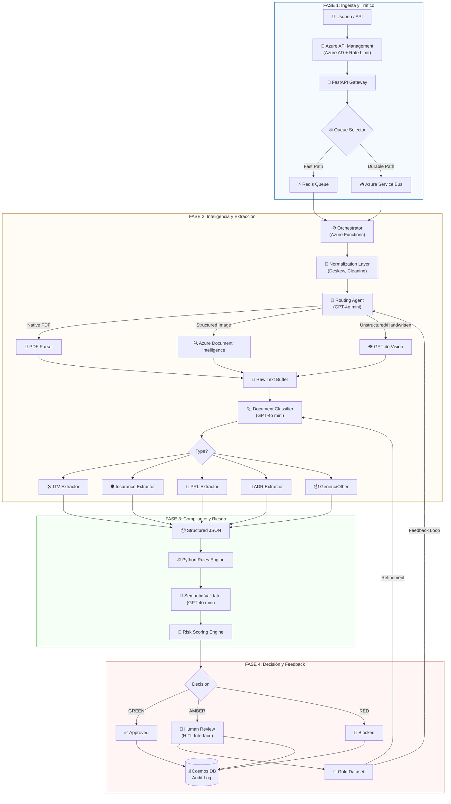

# 🏗️ Arquitectura de Procesamiento Inteligente de Documentos (IDP) - JOSANZ ERP

Esta arquitectura representa un sistema de vanguardia para la gestión automatizada y legal de documentación técnica (CAE, ITV, Seguros, PRL). No es simplemente un sistema de OCR; es un **motor de decisión legal asistido por IA** con trazabilidad completa y optimización de costes.

---

## 📊 Diagrama de Arquitectura de Alto Nivel

---

## 🛠️ Desglose Técnico de Fases

### 1. Ingesta y Gestión de Tráfico (Entrypoint)
El sistema utiliza una arquitectura de **Zero Trust** y **Asynchronous Processing**.

*   **Azure API Management + Azure AD**: No solo protege contra ataques, sino que garantiza que cada token consumido de IA sea imputable a un centro de costes o cliente específico.
*   **FastAPI Backend**: Actúa como un *Stateless Gateway*. Su única responsabilidad es validar el schema inicial, subir el archivo a **Azure Blob Storage** y emitir un `document_id`.
*   **Estrategia de Colas Híbrida**: 
    > [!TIP]
    > Usamos **Redis** para el "Fast Path" (usuarios en vivo esperando) y **Service Bus** para el "Durable Path" (procesamiento masivo de histórico), equilibrando velocidad y resiliencia.

### 2. Capa de Inteligencia y Extracción de Coste Optimizado
El "Routing Agent" es el cerebro que ahorra miles de dólares al mes.

| Método | Coste | Precisión en Texto | Caso de Uso |
| :--- | :--- | :--- | :--- |
| **PDF Parser** | ~$0.00 | 100% (Digital) | PDFs generados por ordenador. |
| **Document Intelligence**| Low | Alta | Formularios, tablas, documentos estándar. |
| **GPT-4o Vision** | High | Creativa/Contextual | Fotos movidas, manuscritos, bajas resoluciones. |

*   **Normalization Layer**: Aplica técnicas de vision computerizada para enderezar (deskew), eliminar ruido y ajustar DPIs. Esto aumenta la precisión del OCR en un ~25%.
*   **Extractores Especializados**: En lugar de un prompt gigante, usamos prompts pequeños y específicos por tipo de documento, reduciendo alucinaciones y latencia.

### 3. Compliance: El "Filtro de la Verdad"
Aquí es donde la IA se combina con la lógica de negocio inquebrantable.

*   **Rules Engine (Python)**: Lógica determinista. Si una ITV caducó ayer, se rechaza. No hay debate, no hay "creatividad" de IA.
*   **Semantic Validator**: La IA revisa si el contenido tiene sentido. Ejemplo: *"¿La matrícula en el texto coincide con la matrícula en la foto? ¿Hay signos de edición digital en las fechas?"*
*   **Risk Scoring**: Asigna un peso a cada fallo. Un error en la fecha es `RED`, un nombre mal escrito puede ser `AMBER`.

### 4. HITL (Human-In-The-Loop) y Mejora Continua
El sistema no es estático; se vuelve más inteligente con cada error.

*   **Interface HITL**: Permite a los validadores corregir el JSON extraído. Esta corrección se guarda como el **Gold Standard**.
*   **Feedback Loop**: Los datos corregidos por humanos se utilizan para:
    1.  Ajustar los **Prompts** del Routing Agent.
    2.  Entrenar versiones **Fine-tuned** de modelos más pequeños para alcanzar precisión de modelos grandes a 1/10 del coste.

---

## 📈 Pilares de Valor de la Arquitectura

1.  **Trazabilidad Total**: Cada decisión (IA o Humana) se guarda en **Cosmos DB** con el contexto completo (input, logs de reglas, score de confianza). Crucial para auditorías laborales.
2.  **Soberanía de Datos**: Los documentos nunca salen de tu entorno Azure, cumpliendo con RGPD y normativas de seguridad industrial.
3.  **Escalabilidad Elástica**: Al usar Azure Functions, el sistema puede procesar 1 documento o 10,000 en paralelo sin intervención manual.

---

> [!IMPORTANT]
> **Conclusión**: Esta arquitectura no "lee" documentos, los **entiende y valida** bajo un marco legal, optimizando el margen operativo mediante el uso inteligente y jerarquizado de modelos de LLM.
