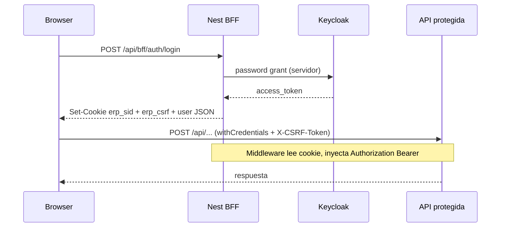

# Estándar enterprise de autenticación (Keycloak + BFF)

Documento de referencia para migrar cualquier proyecto Josanz al modelo **Keycloak + BFF + cookies HttpOnly**.

## Resumen ejecutivo

| Capa | Responsabilidad |
|------|-----------------|
| **Keycloak** | Identidad (IdP), emisión de tokens |
| **BFF (Backend for Frontend)** | Login, sesión, cookies, CSRF, refresh |
| **Frontend** | Sin JWT en `localStorage`; solo cookies + CSRF en memoria |
| **API NestJS** | Validación JWT inyectada por middleware BFF |

Este diseño cierra hallazgos tipo **J-4 (JWT en localStorage / XSS)** del ASVS. El auditor evalúa el **estado desplegado**: activar `auth.mode: 'bff'` en producción es lo que materializa la mitigación.

## Modos de operación

```typescript
// environment.ts
export const environment = {
  auth: { mode: 'bff' },  // recomendado producción
  // auth: { mode: 'legacy' },  // JWT en localStorage (solo transición)
};
```

- **`bff`**: cookies `erp_sid` / `saas_sid` (HttpOnly) + CSRF (`erp_csrf` / `saas_csrf`).
- **`legacy`**: Bearer desde `localStorage` (compatibilidad; no cumple J-4).

## Flujo BFF



## Paquetes del monorepo

| Paquete | Uso |
|---------|-----|
| `@josanz-erp/auth-keycloak` (Node) | Store sesión, cookies, middleware CSRF, cliente token Keycloak |
| `@josanz-erp/shared-auth-keycloak` (Browser) | `BffAuthClient`, `bffAuthInterceptor`, `provideEnterpriseAuth()` |
| `@josanz-erp/identity-data-access` | `AuthService` con soporte BFF/legacy |

## Integración en una app Angular

```typescript
// app.config.ts
import { provideHttpClient, withInterceptors } from '@angular/common/http';
import { bffAuthInterceptor, provideEnterpriseAuth } from '@josanz-erp/shared-auth-keycloak';
import { authInterceptor } from '@josanz-erp/identity-data-access';

providers: [
  provideEnterpriseAuth({
    mode: environment.auth.mode,
    apiPrefix: '/api',
    defaultTenantSlug: 'josanz',
  }),
  provideHttpClient(withInterceptors([
    apiOriginInterceptor,
    bffAuthInterceptor,   // cookies + CSRF
    authInterceptor,        // Bearer solo en legacy
  ])),
];
```

## Variables de entorno (backend)

```env
KEYCLOAK_ENABLED=true
KEYCLOAK_AUTH_SERVER_URL=http://localhost:8081
KEYCLOAK_SPA_CLIENT_SECRET=          # opcional, client confidencial
KEYCLOAK_PLATFORM_REALM=babooni-platform
KEYCLOAK_PLATFORM_CLIENT_ID=babooni-saas-platform
BFF_SESSION_MAX_AGE_HOURS=24
CORS_ORIGIN=http://localhost:4200,http://localhost:4210
```

Requisitos CORS: `credentials: true` (ya configurado en `apps/backend/src/main.ts`).

## CSRF en dev cross-origin

Con `apiOrigin: 'http://localhost:3000'` y frontend en `:4200`, la cookie CSRF no es legible vía `document.cookie`. El BFF devuelve `csrfToken` en login/session; el cliente lo guarda **en memoria** (`BffAuthClient`) y lo envía en `X-CSRF-Token`.

En producción (mismo dominio o reverse proxy `/api`), la cookie legible también funciona como respaldo.

## Endpoints BFF

| App | Login | Session | Logout |
|-----|-------|---------|--------|
| ERP | `POST /api/bff/auth/login` | `GET /api/bff/auth/session` | `POST /api/bff/auth/logout` |
| SaaS Platform | `POST /api/bff/platform/auth/login` | `GET /api/bff/platform/auth/session` | `POST /api/bff/platform/auth/logout` |

## Mapa ASVS / auditoría

| Hallazgo | Legacy | BFF |
|----------|--------|-----|
| J-4 JWT en localStorage | ❌ Presente | ✅ Mitigado |
| XSS roba token Bearer | ❌ Riesgo alto | ✅ Token no accesible a JS |
| CSRF con cookies | N/A | ✅ Double-submit (cookie + header) |
| Direct Grant en browser | ❌ SPA llama Keycloak | ✅ Solo servidor BFF |

**Riesgo residual en BFF**: XSS puede ejecutar acciones autenticadas mientras la sesión esté activa (CSRF no protege contra XSS same-origin). Mitigar con CSP, sanitización y dependencias actualizadas.

## Roadmap

1. ✅ BFF + cookies + CSRF (actual)
2. ⏳ Authorization Code + PKCE (sustituir password grant en BFF)
3. ⏳ Store Redis para sesiones multi-instancia
4. ⏳ RP-Initiated Logout Keycloak
5. ⏳ Migrar `document-generator` y `josanz-web-app`

## Apps integradas

- `apps/frontend` — ERP (`auth.mode: 'bff'`)
- `apps/saas-platform` — Panel Babooni (`auth.mode: 'bff'`)
- Pendiente: `apps/document-generator`, `apps/josanz-web-app`
