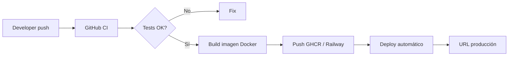
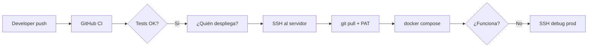

# Comparativa: despliegue SSH vs plataformas modernas (CI/CD)

**Documento para dirección y equipo técnico**  
**Proyecto:** Josanz ERP (`angelnietos/erp`)  
**Versión:** Abril 2026  
**Audiencia:** Responsables de producto, operaciones y desarrollo

---

## Resumen ejecutivo

Se nos ha planteado migrar el despliegue de aplicaciones desde **plataformas gestionadas** (Railway, Vercel, Azure App Service, Render, Fly.io, etc.) hacia un modelo basado en **acceso SSH a servidores propios**, `git pull` manual o semiautomático, Docker Compose y gestión de claves por desarrollador.

Desde el punto de vista de **ingeniería de producto y coste total (TCO)**, este cambio:

| Dimensión | Plataforma gestionada (PaaS) | Modelo SSH propuesto |
|-----------|------------------------------|----------------------|
| Tiempo hasta producción tras un merge | Minutos (automático) | Horas o días (depende de personas) |
| Entornos preview / staging | Nativos o triviales | Hay que montarlos y mantenerlos a mano |
| Rollback | Un clic / redeploy de imagen anterior | SSH, compose, posible `git pull` + dudas |
| Onboarding de un desarrollador | Invitar al proyecto en GitHub + Railway | Clave SSH, PAT, acceso servidor, `.env`, runbooks |
| Coste de infra visible | Factura mensual predecible | VPS más barato en factura |
| **Coste real (infra + horas)** | **Bajo–medio, predecible** | **Medio–alto, impredecible** |

**Conclusión:** el ahorro en la factura del servidor **no compensa** el tiempo que el equipo pierde en operaciones, incidencias y fricción en cada release. Es un retroceso operativo comparable a volver a desplegar “como en 2010”: el código avanza, pero la **cadena de entrega se frena**.

Este documento no discute si Docker o Git son malos (los usamos igual en PaaS). Discute **quién opera la cadena** y **cuánto cuesta que no esté automatizada de punta a punta**.

---

## Contexto: qué teníamos en Josanz ERP

El monorepo ya incluía un camino **moderno** de despliegue:

| Componente | Función |
|------------|---------|
| `nx-affected-ci.yml` | CI en cada PR/push: lint, test, build |
| `docker-images.yml` | Build y push de imágenes a GitHub Container Registry |
| `deploy-railway.yml` | Deploy por servicio a Railway (staging/producción) |
| `deploy-ssh.yml` | Alternativa SSH (añadida como compatibilidad con la nueva infra) |

Servicios que desplegábamos o podíamos desplegar en Railway:

- `backend` (API NestJS + Prisma)
- `josanz-web-app` / `frontend` (Angular)
- `saas-platform`
- `document-generator`
- `verifactu-api` / `verifactu-worker`
- Storybook (`josanz-ui-storybook`)

Flujo anterior (Railway / similar):

```text
git push → CI verde → build imagen → deploy automático → URL pública
```

Sin que ningún desarrollador entre por SSH a un servidor para “actualizar código”.

---

## Qué propone la guía SSH del equipo

La guía operativa describe, en esencia:

1. Cada desarrollador genera clave SSH y la envía a un administrador.
2. El administrador autoriza claves en servidores bajo `/var/deploys/<proyecto>/`.
3. En el servidor: `git pull` (con usuario GitHub + **Personal Access Token**).
4. Arranque con `docker compose` y ficheros `.env` locales.
5. Sin panel unificado, sin historial de deploys por commit, sin rollback estándar.

Es un modelo **IaaS + operación manual**, no un **CD (Continuous Delivery)** en el sentido que usa la industria.

---

## Comparativa detallada

### 1. Velocidad de entrega (time-to-market)

| Acción | PaaS (Railway / Vercel / Azure) | SSH + VPS |
|--------|----------------------------------|-----------|
| Subir un fix a producción | Push a `main` → deploy en ~3–10 min | Merge + esperar CI + que alguien ejecute deploy SSH o entre al servidor |
| Probar una rama en URL temporal | Preview deployment automático | No existe salvo montar otro servidor/compose |
| Hotfix urgente | Redeploy última imagen o revert commit | SSH, pull, compose, rezar que `.env` y migraciones cuadren |
| Deploy un viernes a las 18:00 | Automatizado con checks | Depende de quién tenga llaves y acceso |

**Impacto:** cada release “simple” pasa de ser **asíncrona y trazable** a **sincrónica y dependiente de personas**. Eso es deuda de calendario: features y fixes llegan tarde a negocio.

### 2. Fiabilidad y rollback

| Capacidad | PaaS | SSH |
|-----------|------|-----|
| Historial de releases por commit | Sí | No (salvo disciplina manual) |
| Rollback a versión N-1 | Redeploy tag/imagen anterior | Manual: retag, pull, compose, migraciones |
| Health checks post-deploy | Integrados | Hay que configurarlos |
| Logs centralizados | Dashboard del proveedor | `docker logs` por SSH o montar ELK/Loki |
| Alertas | Integrables | Montar aparte |

Un rollback mal hecho en SSH puede dejar la base de datos en un estado incompatible con el código (migraciones Prisma). En PaaS, al menos el **artefacto inmutable** (imagen) es el contrato de despliegue.

### 3. Seguridad y cumplimiento

| Tema | PaaS | SSH |
|------|------|-----|
| Superficie de acceso | API token del proveedor, RBAC en panel | **Shell root-like en producción** para quien tenga clave |
| Rotación de credenciales | Centralizada | Claves SSH por persona/dispositivo, PATs GitHub sueltos |
| Auditoría “quién desplegó qué” | Logs del proveedor | Difícil sin tooling extra |
| Separación dev/prod | Entornos aislados en proyecto | Misma máquina si no se duplica infra |

Dar SSH de producción a varios desarrolladores **aumenta el riesgo** frente a un pipeline donde solo GitHub Actions (o Railway) despliega con un rol de máquina.

### 4. Experiencia del desarrollador (y rotación)

Onboarding con PaaS:

- Acceso al repo GitHub.
- Invitación al proyecto Railway/Azure (opcional).
- Listo.

Onboarding con SSH:

- Generar clave SSH, enviar `.pub` al admin, esperar.
- Crear PAT GitHub con scope `repo`.
- Documentación de `/var/deploys/`, `.env`, perfiles Compose, migraciones.
- Primer deploy acompañado (si hay suerte).

**Coste estimado onboarding:** 2–4 horas por persona × cada rotación. En PaaS: **< 30 minutos**.

### 5. Coste económico real (TCO)

#### Infraestructura (factura mensual aproximada)

| Concepto | PaaS (ejemplo Railway / Render) | VPS propio (Hetzner/OVH) |
|----------|----------------------------------|---------------------------|
| API + front + worker + DB gestionada | 50–150 €/mes (según tráfico) | VPS 8–16 GB: 15–40 €/mes |
| **Ahorro bruto infra** | — | **~30–110 €/mes** |

#### Coste oculto: horas de ingeniería

| Tarea recurrente | Frecuencia | Horas/mes | Coste @ 45 €/h |
|------------------|------------|-----------|----------------|
| Deploy manual / incidencia SSH | 2–4 | 2–4 h | 90–180 € |
| Mantenimiento servidor (updates, disco, SSL) | 1 | 1–2 h | 45–90 € |
| Onboarding / soporte a compañeros | variable | 1–3 h | 45–135 € |
| Debug “en prod por SSH” | 1–2 | 1–3 h | 45–135 € |
| **Total operación** | | **5–12 h/mes** | **225–540 €/mes** |

**El ahorro de 30–110 € en VPS se come con creces en 225–540 € de tiempo técnico** — sin contar el coste de oportunidad (features no entregadas).

> Regla práctica: **si el ahorro infra es menor que un día de trabajo al mes, no merece la pena operar servidores a mano.**

### 6. Escalabilidad y picos

- **PaaS:** autoscaling horizontal/vertical según plan; CDN en front (Vercel/Azure) incluido.
- **SSH/VPS:** un solo nodo hasta que alguien monte balanceador, réplicas, backups off-site, etc.

Para un ERP con picos (eventos, facturación), el cuello de botella en un VPS mal dimensionado se paga en **horas extra de urgencia**, no en euros de factura.

---

## Diagrama: flujos comparados

### Flujo moderno (lo que teníamos / deberíamos mantener)



### Flujo propuesto SSH (regresión operativa)



---

## Qué hemos hecho en el repo para suavizar el golpe (sin igualar a PaaS)

Para no quedarnos totalmente desprotegidos, el repositorio incluye:

- **`docker-images.yml`** — imágenes versionadas en GHCR (artefactos inmutables).
- **`deploy-ssh.yml`** — deploy automático vía GitHub Actions tras el build (sin depender de que un dev entre por SSH).
- **`docs/deploy/ssh-servers.md`** — runbook si hay que usar la infra propuesta.
- **`deploy/scripts/bootstrap-server.sh`** — script de arranque en Ubuntu.

Esto acerca el modelo SSH a un **CD mínimo**, pero **sigue por debajo** de Railway/Azure/Vercel porque:

- No hay preview environments nativos.
- No hay panel de releases/rollback.
- Sigue haciendo falta operar el VPS (SSL, backups, parches, monitorización).
- El proveedor PaaS asumía parte de esa carga.

**Recomendación técnica:** si la empresa impone servidores propios, usar **solo** el pipeline GitHub → GHCR → `deploy-ssh.yml` y **prohibir** `git pull` manual en producción. Aun así, seguiríamos por debajo del nivel de servicio de un PaaS.

---

## Tabla resumen para dirección

| Pregunta de negocio | PaaS | SSH manual / híbrido |
|----------------------|------|---------------------|
| ¿Llegamos antes al mercado? | **Sí** | No |
| ¿Podemos demostrar quién desplegó qué? | **Sí** | Difícil |
| ¿El ahorro justifica el riesgo? | N/A | **No**, en la práctica |
| ¿Escala sin contratar DevOps? | **Razonablemente** | No |
| ¿Encaja con un ERP multi-tenant en crecimiento? | **Sí** | Con reservas |

---

## Recomendaciones

### Opción A — Mantener o recuperar PaaS (recomendada)

- **Railway** (ya integrado en el repo) para API + fronts + workers.
- **Vercel / Azure Static Web Apps** solo para frontends si se busca CDN global.
- CI actual de GitHub sin cambios.
- Coste predecible; equipo centrado en producto.

### Opción B — Híbrido (compromiso)

- VPS solo para datos sensibles o requisitos legales concretos.
- PaaS para aplicaciones y previews.
- Terraform/Ansible si hace falta reproducibilidad en VPS.

### Opción C — Solo SSH (la propuesta actual)

- Aceptar **menor velocidad de entrega**, **más incidencias** y **más dependencia de personas con llaves**.
- Asignar explícitamente **horas/mes de DevOps** (mín. 0,25 FTE) en planning.
- No presentarlo como “ahorro” sino como **decisión de control absoluto sobre el metal** con coste oculto asumido.

---

## Anexo: referencias en este repositorio

| Documento | Contenido |
|-----------|-----------|
| [deploy/README.md](../../deploy/README.md) | Despliegue Docker + perfiles Compose |
| [docs/deploy/ssh-servers.md](./ssh-servers.md) | Runbook SSH (guía operativa del proveedor) |
| [deploy/railway/README.md](../../deploy/railway/README.md) | Configuración Railway existente |
| `.github/workflows/deploy-railway.yml` | Pipeline Railway |
| `.github/workflows/deploy-ssh.yml` | Pipeline SSH automatizado |
| `.github/workflows/docker-images.yml` | Build imágenes GHCR |

---

## Cierre

Volver a un modelo centrado en **SSH, claves personales y `git pull` en servidores** no es “más profesional” ni “más barato” para una empresa de producto software: es **externalizar el ahorro de infra a costa del tiempo del equipo de desarrollo**.

Para Josanz ERP — monorepo Nx, múltiples apps, Prisma, multi-tenant — la opción alineada con **velocidad, trazabilidad y coste total** sigue siendo una **plataforma de despliegue gestionada** con CI/CD automático, no la “Edad Media” operativa del shell en producción.

---

*Documento redactado por el equipo técnico del proyecto Josanz ERP. Para dudas o revisión de cifras de coste internas, adaptar la sección TCO con la tarifa hora real de la empresa.*
