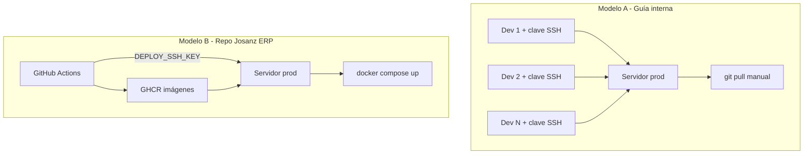

# Dos modelos de SSH: guía interna vs deploy por GitHub

**Para:** jefes, compañeros de desarrollo y administradores de sistemas  
**Proyecto:** Josanz ERP  
**Versión:** Abril 2026

---

## El problema que vemos en el equipo

Circula una **guía SSH interna** que pide a **cada desarrollador**:

- generar su clave SSH (`id_ed25519`);
- enviar la clave **pública** al administrador;
- conectarse al servidor con `ssh babooni@servidor`;
- hacer **`git pull`** con usuario GitHub + **Personal Access Token**;
- levantar servicios a mano.

En paralelo, en el repositorio **ya existe un deploy automatizado**:

```text
push main/dev  →  CI (tests/build)  →  imágenes Docker (GHCR)  →  deploy-ssh.yml
```

Ese workflow entra al servidor **sin intervención humana**, con **una sola clave privada** guardada en secretos de GitHub (`DEPLOY_SSH_KEY`), y ejecuta `docker compose pull/up` (+ migraciones).

**Pregunta legítima:** si el deploy ya lo hace GitHub, ¿para qué la guía pide una clave SSH por desarrollador?

**Respuesta corta:** la guía describe un **modelo distinto** (operación manual por personas). El repo implementa **CD automatizado** (operación por pipeline). Mezclar los dos genera confusión, riesgo de seguridad y la sensación de “volver atrás” sin necesidad.

---

## Los dos modelos en comparación

| | **Modelo A — Guía SSH interna** | **Modelo B — Deploy GitHub (este repo)** |
|---|--------------------------------|----------------------------------------|
| **Quién despliega** | Cada desarrollador (o quien tenga llave) | GitHub Actions |
| **Claves SSH** | Una **por persona/dispositivo** | **Una** clave de máquina (CI) |
| **Actualizar código en servidor** | `git pull` manual + PAT | El workflow hace `git fetch/checkout` + `docker compose` |
| **Artefacto desplegado** | Lo que haya en el branch tras pull | **Imagen Docker** versionada en GHCR |
| **Cuándo ocurre** | Cuando alguien se acuerda y tiene acceso | Tras merge a `main`/`dev` (automático) o botón manual en Actions |
| **Trazabilidad** | “Fulano entró por SSH” | Log del workflow + commit SHA en GHCR |
| **Riesgo en producción** | N devs con shell en el servidor | Solo el runner de GitHub (si se configura bien) |



---

## Por qué existe la guía interna (hipótesis razonables)

No es que la guía esté “mal” en abstracto: encaja con **otro** tipo de operación:

1. **Herencia / plantilla genérica** — muchas empresas tienen un runbook único “cómo acceder a servidores Linux”, sin distinguir deploy de day‑2 ops.
2. **Equipos sin CI/CD** — en proyectos pequeños, alguien entra por SSH y hace pull; la guía estandariza eso.
3. **Acceso para incidencias** — el admin asume que **todos** los devs necesitarán entrar al servidor (logs, reinicios, debug).
4. **Desconocimiento del pipeline** — quien redactó la guía puede no saber que `deploy-ssh.yml` ya automatiza el release.
5. **Servidores compartidos** — `/var/deploys/` con varios proyectos donde no todos tienen GitHub Actions configurado.

En Josanz ERP **no hace falta el Modelo A para el día a día del deploy** si el Modelo B está activo y los secretos de GitHub están configurados.

---

## Qué necesita cada rol (modelo recomendado)

### Desarrollador de aplicación (día a día)

| Necesita | ¿Para qué? |
|----------|------------|
| Acceso al **repo GitHub** | Push, PR, revisar Actions |
| **No** necesita SSH a producción | El deploy lo hace el pipeline |
| **No** necesita PAT en el servidor | El servidor no debería depender de pulls manuales por persona |
| Entorno **local** (`docker compose`, `.env` local) | Desarrollar y probar |

**Flujo normal:** merge a `main` → esperar CI + deploy verde en Actions → listo.

### Pipeline CI/CD (GitHub Actions)

| Secreto | Uso |
|---------|-----|
| `DEPLOY_HOST` | IP/hostname del VPS |
| `DEPLOY_USER` | Usuario Linux (ej. `babooni`) |
| `DEPLOY_SSH_KEY` | Clave **privada** solo del robot de deploy |
| `DEPLOY_PATH` | `/var/deploys/erp` |
| `GHCR_PULL_TOKEN` / `GHCR_PULL_USER` | Pull de imágenes en el servidor |

La clave pública correspondiente a `DEPLOY_SSH_KEY` va en `~/.ssh/authorized_keys` del servidor **una sola vez**, en la entrada del usuario de deploy — no hace falta añadir la de cada desarrollador.

### Administrador / DevOps

| Tarea | Frecuencia |
|-------|------------|
| Crear VPS, Docker, usuario de deploy | Una vez |
| Bootstrap (`deploy/scripts/bootstrap-server.sh`) | Una vez |
| Mantener `deploy/.env` en el servidor | Cuando cambien secretos |
| Parches OS, backups, certificados SSL | Recurrente |
| Añadir clave pública **del CI** | Una vez |
| **Opcional:** SSH de break-glass para 1–2 personas senior | Solo emergencias |

### ¿Cuándo sí tendría sentido SSH personal a un dev?

Solo en casos acotados, con política clara:

- **Debug puntual** en staging (no prod), con registro de quién entró.
- **Servidor de desarrollo compartido** distinto de producción.
- **Proyectos legacy** sin pipeline (no es el caso de Josanz ERP si usamos `deploy-ssh.yml`).

Dar SSH de **producción** a todo el equipo **no es necesario** para desplegar y **empeora** la postura de seguridad.

---

## Incoherencias si seguimos la guía al pie de la letra

| Práctica de la guía interna | Problema con el pipeline actual |
|-----------------------------|----------------------------------|
| Cada dev con clave en prod | Superficie de ataque multiplicada; sin auditoría clara |
| `git pull` manual en prod | Puede desincronizar **código en disco** vs **imagen GHCR** que usa Compose |
| PAT personal en el servidor | Credenciales personales en máquina compartida; rotación caótica |
| “Actualizar código” = pull | En nuestro flujo, **actualizar** = **nueva imagen** `:main` / `:dev` + `compose pull` |
| Deploy cuando alguien puede | Vuelve la dependencia de personas y horarios |

Ejemplo concreto de conflicto:

1. Dev A hace `git pull` en el servidor a una rama experimental.
2. GitHub Actions despliega la imagen de `main` desde GHCR.
3. El servidor queda en un estado híbrido (código vs contenedores) difícil de reproducir.

**Regla:** en producción/staging, **solo el pipeline** despliega; los humanos no hacen `git pull` salvo emergencia documentada.

---

## Qué debería decir la guía interna (propuesta de alineación)

Si la empresa mantiene servidores SSH, la guía debería **separar dos capítulos**:

### Capítulo 1 — Despliegue de aplicaciones (Josanz ERP)

- El release lo ejecuta **GitHub Actions** (`Deploy — SSH`).
- Los desarrolladores **no** solicitan clave SSH para desplegar.
- Documentación: [ssh-servers.md](./ssh-servers.md), [deploy/README.md](../../deploy/README.md).

### Capítulo 2 — Acceso administrativo (opcional)

- Cómo solicitar acceso **break-glass** (solo leads / DevOps).
- Cómo generar clave SSH **si** el admin lo aprueba.
- Prohibido: `git pull` en prod sin ticket; usar siempre redeploy desde Actions.

Así la guía deja de contradecir el CI/CD que ya pagamos en tiempo de configuración.

---

## Preguntas para alinear con dirección / admin

Puedes usar estas preguntas en una reunión:

1. **¿El deploy a producción lo hace GitHub Actions o cada desarrollador por SSH?**  
   - Si Actions → no hace falta clave SSH por dev para releases.

2. **¿Por qué necesitamos `git pull` en el servidor si las imágenes vienen de GHCR?**  
   - El pull en el workflow solo actualiza `docker-compose.prod.yml` y scripts; el binario va en la imagen.

3. **¿Quién tiene shell en producción hoy y con qué criterio?**  
   - Ideal: 0 devs, 1 usuario CI + 1–2 admins.

4. **¿Staging y producción tienen el mismo procedimiento?**  
   - `dev` → staging automático; `main` → production automático (ya definido en workflows).

5. **¿La guía SSH es obligatoria para todos los repos o solo para legacy sin CI?**  
   - Josanz ERP **no** debería estar en el bucket legacy.

---

## Resumen para compartir con compañeros

> **No necesitas generar clave SSH ni hacer `git pull` en el servidor para desplegar Josanz ERP.**  
> Eso es lo que describe la guía genérica de la empresa (Modelo A).  
> Nosotros usamos **Modelo B**: merge a `main`/`dev` → GitHub construye imágenes → Actions entra al servidor con **una** clave de CI y levanta Docker.  
> La guía por dev solo tendría sentido si el admin os pide acceso para **otra cosa** (incidencias, otros proyectos sin pipeline) — no para el flujo normal de release.

Para el argumento de negocio (coste, atraso vs Railway/PaaS), ver también: [comparativa-ssh-vs-paas.md](./comparativa-ssh-vs-paas.md).

---

## Referencias en el repositorio

| Recurso | Descripción |
|---------|-------------|
| [.github/workflows/deploy-ssh.yml](../../.github/workflows/deploy-ssh.yml) | Deploy automatizado |
| [.github/workflows/docker-images.yml](../../.github/workflows/docker-images.yml) | Build/push GHCR |
| [ssh-servers.md](./ssh-servers.md) | Runbook técnico (secretos, bootstrap) |
| [comparativa-ssh-vs-paas.md](./comparativa-ssh-vs-paas.md) | SSH vs PaaS — impacto en coste y velocidad |
| [deploy/README-DIRECCION.md](../../deploy/README-DIRECCION.md) | Enlaces para dirección |

---

*Si administración actualiza la guía interna, conviene que referencie explícitamente este documento para proyectos con CD en GitHub y deje de pedir claves SSH a todo el equipo de desarrollo.*
