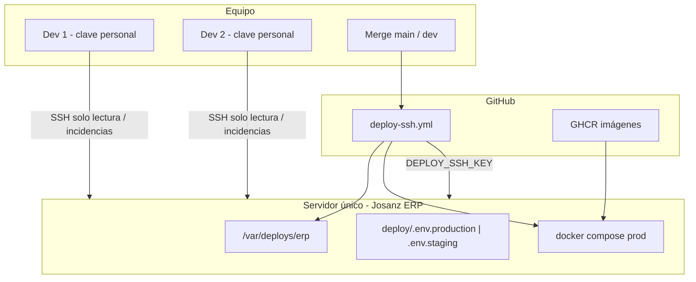

# Servidor único: SSH del equipo + deploy GitHub Actions

**Para:** administración, DevOps y equipo de desarrollo Josanz ERP  
**Objetivo:** **un solo VPS** donde confluyan el acceso SSH de los compañeros y el deploy automático de GitHub Actions — sin servidor “de la guía” y otro “del pipeline”.

**Versión:** Abril 2026

---

## Resumen en una frase

> **Un hostname, dos tipos de clave:** los compañeros entran por SSH para **ver logs e incidencias**; GitHub Actions entra con **su clave de CI** para **desplegar**. Mismo servidor, mismo `/var/deploys/erp`, **un solo release path** (merge → Actions).

---

## Situación actual (problema)

| Hoy | Consecuencia |
|-----|--------------|
| La guía interna apunta al **servidor A** | Devs hacen `git pull` / operaciones manuales allí |
| GitHub Actions usa `DEPLOY_HOST` = **servidor B** | Los merges despliegan en otro sitio |
| Opcional: Railway (**C**) | Tercera URL posible para usuarios |

Hasta que A = B, el equipo trabaja “bien” en GitHub y **no impacta** la URL que usan los usuarios (o impacta la máquina equivocada).

**Meta:** eliminar A≠B. Quedarse con **un servidor oficial** documentado para todo el mundo.

---

## Arquitectura objetivo



```text
                    ┌─────────────────────────────────────┐
                    │     SERVIDOR ÚNICO (prod / staging) │
                    │  /var/deploys/erp                   │
                    │  deploy/.env.production             │
                    │  docker-compose.prod.yml            │
                    └──────────────▲──────────────────────┘
                                   │
              ┌────────────────────┼────────────────────┐
              │                    │                    │
     claves personales      DEPLOY_SSH_KEY        DNS / URL pública
     (compañeros)           (GitHub Actions)      (usuarios finales)
     logs, docker ps         pull GHCR + up        misma máquina
     NO git pull en prod     tras merge main/dev
```

---

## Reglas del servidor único

| Quién | Puede | No debe |
|-------|--------|---------|
| **GitHub Actions** | `git fetch/checkout`, `docker compose pull/up`, migraciones Prisma | — |
| **Compañeros (SSH personal)** | `docker compose ps`, `logs`, reinicio puntual acordado, revisar disco | `git pull` en prod, editar `.env` sin ticket, desplegar “a mano” |
| **Admin** | Bootstrap, backups, SSL, rotación claves, cambios en `.env` | Mantener un segundo servidor “silencioso” para el mismo ERP |

**Release en producción = siempre** workflow **Deploy — SSH (Ubuntu)**.  
SSH humano es **day‑2 ops**, no sustituto del CI.

---

## Ficha del servidor (rellenar una vez alineados)

Copiar en wiki interna o canal privado del equipo. **No commitear IPs** si la política de la empresa lo prohíbe.

| Campo | Producción | Staging (opcional) |
|-------|------------|-------------------|
| **Hostname / IP** | _pendiente_ | _pendiente_ |
| **URL pública ERP** | _pendiente_ | _pendiente_ |
| **Usuario Linux SSH** | _ej. babooni_ | _mismo u otro_ |
| **Path deploy** | `/var/deploys/erp` | `/var/deploys/erp` |
| **Rama GitHub → entorno** | `main` → production | `dev` → staging |
| **Archivo env en servidor** | `deploy/.env.production` | `deploy/.env.staging` |
| **Secretos GitHub environment** | `production` | `staging` |
| **¿Servidor de guía antigua apagado?** | ☐ Sí ☐ N/A | ☐ Sí ☐ N/A |

**Criterio de éxito:** la IP/hostname de esta tabla = la de la guía interna actualizada = `DEPLOY_HOST` en GitHub = la URL que abren los usuarios (salvo proxy/CDN delante).

---

## Plan de consolidación (checklist)

### Fase 0 — Decisión (dirección + admin)

- [ ] Elegir **cuál servidor sobrevive** (el de la guía, el del CI, o uno nuevo).
- [ ] Declarar el otro como **deprecated** con fecha de apagado.
- [ ] Confirmar URL pública y certificado SSL en el servidor elegido.
- [ ] Si Railway sigue activo: fecha de corte y redirección DNS.

### Fase 1 — Preparar el servidor elegido (admin)

En el **servidor único**:

```bash
# Como root o con sudo
sudo bash /var/deploys/erp/deploy/scripts/bootstrap-server.sh
# o, si aún no hay clone:
sudo DEPLOY_ROOT=/var/deploys REPO_URL=git@github.com:angelnietos/erp.git \
  bash deploy/scripts/bootstrap-server.sh
```

- [ ] Docker + Compose v2 instalados.
- [ ] Clone del repo en `/var/deploys/erp`.
- [ ] `deploy/.env.production` (desde `deploy/.env.example`).
- [ ] `deploy/.env.staging` si hay entorno staging (desde `deploy/.env.staging.example`).
- [ ] Login GHCR en el servidor (`docker login ghcr.io`) para pull de imágenes.
- [ ] Migraciones Prisma ejecutadas una vez (`deploy/README.md`).

### Fase 2 — Clave de GitHub Actions (deploy automático)

- [ ] Generar par **dedicado al CI** (no reutilizar clave personal de un dev):

  ```bash
  ssh-keygen -t ed25519 -C "github-actions-josanz-erp-deploy" -f github-actions-deploy
  ```

- [ ] Añadir `github-actions-deploy.pub` a `~/.ssh/authorized_keys` del usuario de deploy en el **servidor único**.
- [ ] Guardar la privada en GitHub → **Settings → Environments → `production`** (y `staging` si aplica):

  | Secreto | Valor |
  |---------|--------|
  | `DEPLOY_HOST` | Hostname/IP del **servidor único** |
  | `DEPLOY_USER` | Usuario SSH (ej. `babooni`) |
  | `DEPLOY_SSH_KEY` | Contenido de `github-actions-deploy` (privada) |
  | `DEPLOY_PATH` | `/var/deploys/erp` |
  | `GHCR_PULL_TOKEN` | PAT con `read:packages` |
  | `GHCR_PULL_USER` | Usuario del PAT |

- [ ] Repetir secretos en environment **`staging`** si staging es **otro VPS**; si staging es el **mismo** servidor con otro `.env`, usar el mismo `DEPLOY_HOST` y distinto `DEPLOY_ENV_FILE` (ya lo resuelve `deploy-ssh.yml`).

- [ ] Probar: **Actions → Deploy — SSH (Ubuntu) → Run workflow → production**.

### Fase 3 — Claves SSH de los compañeros (mismo servidor)

Objetivo: que la guía interna apunte al **mismo** `DEPLOY_HOST`, no a otra máquina.

Por cada compañero (una clave por dispositivo):

1. Generar clave en su PC (`ssh-keygen -t ed25519`).
2. Enviar **solo la `.pub`** al admin.
3. Admin añade la clave pública al **mismo** `authorized_keys` del servidor único (mismo usuario o usuario restringido si se crea).

Conexión:

```powershell
ssh babooni@HOST_SERVIDOR_UNICO
cd /var/deploys/erp
docker compose -f docker-compose.prod.yml ps
docker compose -f docker-compose.prod.yml logs -f backend --tail=100
```

- [ ] Guía interna de la empresa **actualizada** con el hostname del servidor único.
- [ ] Guía aclara: **no desplegar con `git pull`** en Josanz ERP; usar GitHub Actions.
- [ ] (Recomendado) Limitar permisos: mismo usuario con política documentada, o usuario `deploy-readonly` solo para logs.

### Fase 4 — Apagar el servidor duplicado

- [ ] Backup final del servidor viejo (DB, `.env`, volúmenes Docker).
- [ ] Comprobar que el último deploy por Actions en el servidor único está verde.
- [ ] DNS apunta al servidor único.
- [ ] Apagar o reasignar el VPS antiguo.
- [ ] Quitar secretos obsoletos si apuntaban al host viejo.

### Fase 5 — Validación con el equipo

- [ ] Un dev entra por SSH al **servidor único** y ve los mismos contenedores que el log del último workflow.
- [ ] Merge de prueba a `dev` → staging actualizado.
- [ ] Merge a `main` → producción actualizada.
- [ ] URL pública muestra la versión esperada.

---

## Dos claves, un servidor (aclara la confusión)

No es “una clave vs muchas claves en servidores distintos”. En el modelo correcto:

| Clave | Titular | Servidor | Uso |
|-------|---------|----------|-----|
| `github-actions-deploy` (privada en GitHub) | Robot CI | **Único** | Deploy automático |
| `id_ed25519` de cada compañero (pública en `authorized_keys`) | Persona | **El mismo** | Debug, logs, incidencias |

Las claves personales **no sustituyen** a `DEPLOY_SSH_KEY`.  
Las claves personales **no van** a un segundo VPS.

---

## Qué cambia en la guía interna de la empresa

Sustituir el capítulo genérico “acceded al servidor X y haced git pull” por:

1. **Host:** el de la ficha “Servidor único” (mismo que `DEPLOY_HOST`).
2. **Path:** `/var/deploys/erp`.
3. **Despliegue Josanz ERP:** merge + GitHub Actions (enlace a este repo).
4. **SSH humano:** solo operación e incidencias; prohibido `git pull` en producción.
5. **Proyectos legacy** sin CI: capítulo aparte, otro path bajo `/var/deploys/`, otro host si aplica.

Documentación técnica del repo:

- [ssh-servers.md](./ssh-servers.md) — bootstrap y secretos
- [guia-interna-vs-deploy-github.md](./guia-interna-vs-deploy-github.md) — por qué había dos modelos/servidores
- [deploy/README.md](../../deploy/README.md) — perfiles Compose y apps

---

## Mensaje listo para admin / dirección

> Queremos **un solo servidor** para Josanz ERP: el que use GitHub Actions (`DEPLOY_HOST`) y el que documente la guía SSH para el equipo.  
> Los compañeros tendrán clave SSH **solo en esa máquina** para logs e incidencias; el **deploy seguirá siendo solo por GitHub Actions**.  
> Necesitamos: (1) confirmar hostname oficial, (2) alinear secretos `DEPLOY_*` y guía interna al mismo host, (3) apagar o relegar el VPS duplicado, (4) actualizar la guía para prohibir `git pull` manual en prod.

---

## Preguntas frecuentes

**¿Staging y producción en el mismo VPS?**  
Sí, es válido: mismo `DEPLOY_HOST`, distinto `deploy/.env.staging` vs `.env.production` y perfiles/puertos. El workflow ya elige el env file según rama (`dev` → staging, `main` → production).

**¿Hace falta PAT de GitHub en el servidor para cada dev?**  
No para el flujo normal. El workflow hace `git fetch` con la clave de CI; las imágenes vienen de GHCR. Los devs no deberían configurar PAT en el servidor para desplegar.

**¿Por qué dar SSH a los compañeros si despliega Actions?**  
Para incidencias fuera de horario, ver logs, comprobar disco/contenedores y reproducir lo que muestra el pipeline — **en el mismo sitio** donde despliega el CI.

**¿Qué servidor elegimos si A y B son distintos?**  
Prioridad: el que tenga la **URL pública** acordada con negocio y capacidad (Docker, disco, RAM). Luego mover secretos GitHub y claves del equipo a ese host.

---

## Referencias

| Recurso | Ruta |
|---------|------|
| Workflow deploy | [.github/workflows/deploy-ssh.yml](../../.github/workflows/deploy-ssh.yml) |
| Bootstrap servidor | [deploy/scripts/bootstrap-server.sh](../../deploy/scripts/bootstrap-server.sh) |
| Ejemplo env prod | [deploy/.env.example](../../deploy/.env.example) |
| Comparativa negocio SSH vs PaaS | [comparativa-ssh-vs-paas.md](./comparativa-ssh-vs-paas.md) |

---

*Cuando la ficha “Servidor único” esté rellena y el checklist en verde, archivar o marcar como obsoleto cualquier documento que cite otro hostname para Josanz ERP.*
