## Fase 0 — Leyenda y ámbito

**Qué es:** marco de lectura común para propuesta y revisiones técnicas. Deja claro qué se considera “ya hecho”, qué es **obligatorio** para reducir el riesgo legal/técnico, y qué es **complementario**.

**Alcance de la solución (texto):** plataforma que trata **datos personales y económicos** (CAE), con almacenamiento en **Azure SQL / SQL Server**, API **Express**, identidad **Microsoft Entra ID** y trazas en ecosistema **Azure**.

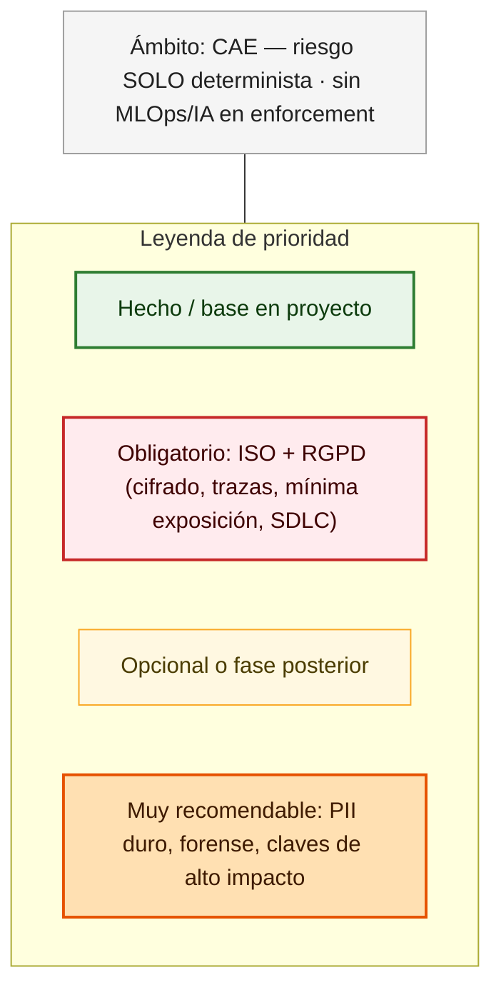

---

## Fase 1 — Usuarios y dispositivo

**Qué es:** quién accede (web, móvil, API) y qué **señal** aporta el dispositivo o el IdP (postura, cumplimiento) para alimentar **Conditional Access** y el **contexto** del *decision engine* (sin ML).

**Normativa:** mínimo privilegio; acceso condicionado al contexto (A.5 / A.8, según diseño).

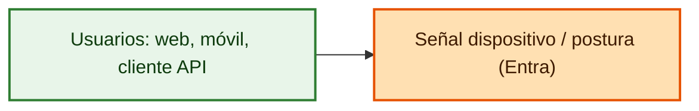

---

## Fase 2 — Perímetro (borde)

**Qué es:** tráfico Internet → aplicación. **TLS**, **Front Door**, **WAF** (OWASP), **DDoS**, y **protección de abusos/bots** si el riesgo lo justifica (opcional; no sustituye cifrado en datos ni A.8.15).

**Normativa:** refuerza **A.8** (canal de exposición).

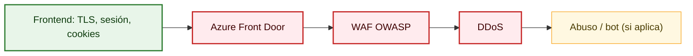

---

## Fase 3 — Identidad (Microsoft Entra ID)

**Qué es:** IdP, **MFA**, **Conditional Access**, riesgo de inicio de sesión, **PIM** o equivalente para administración, **tokens JWT** con parámetros acordados (issuer, aud, validez).

**Normativa:** A.5.15–A.5.18 (acceso) y A.8.2 / A.8.3 en la práctica.

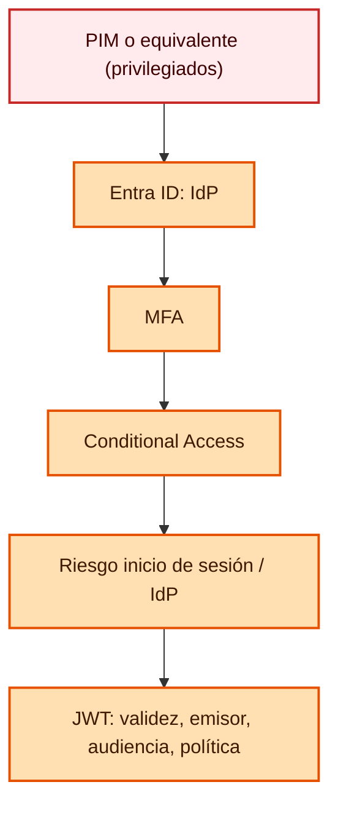

---

## Fase 4 — API (Express) — capa de política en el servicio

**Qué es:** **gateway** como punto único de **rate limit**, autenticación, **RBAC/ABAC** y **validación** (sin pasar a dominio con entrada dudosa).

**Normativa:** A.8.25 y apoyo a A.8.12 (abuso).

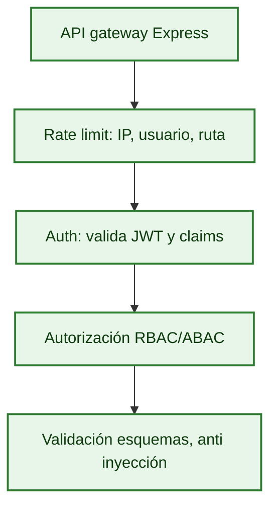

---

## Fase 5 — DLP en aplicación (A.8.12)

**Qué es:** listados con **paginación y topes**, **export** con aprobación y registro, entornos **sin PII reales** en pruebas, y **reglas** para picos o patrones (volumen, frecuencia) — *sin* modelo entrenable.

**Normativa:** A.8.12.

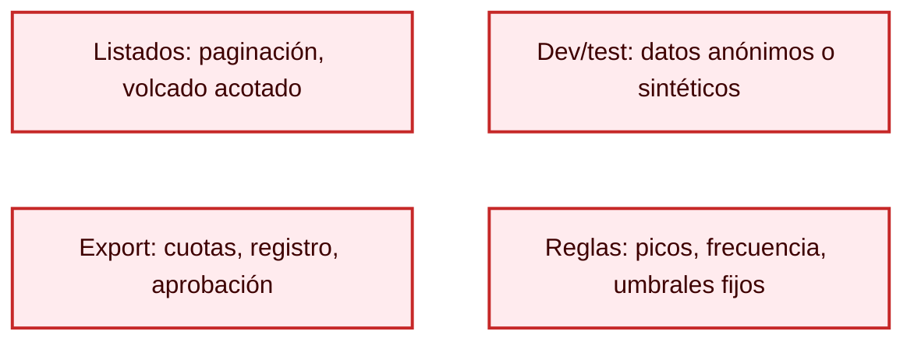

---

## Fase 6 — Decision engine (determinista; sin agente, sin ML)

**Qué es:** **Contexto** de señales → **reglas ponderadas / matriz** (versionadas) → **puntuación 0–100 opcional** (solo fórmula fija) → **umbrales** → **decisión** (allow, deny, mask, step-up, bloqueo de export) con **ruleId** y **policyVersion** hacia A.8.15.

**Normativa:** riesgo operativo y A.8.15 (no reemplaza A.8.24 cifrado).

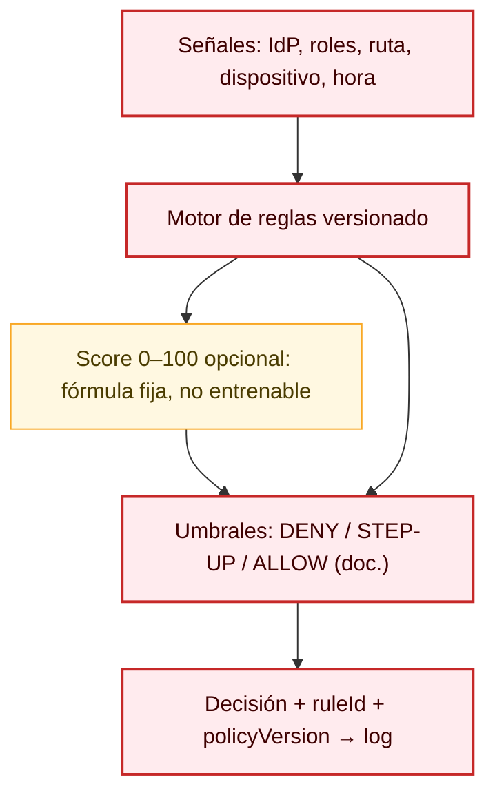

---

## Fase 7 — Dominio y A.8.11 (mínima exposición)

**Qué es:** lógica de **negocio** y enmascaramiento en DTOs/UI; solo datos en claro estrictamente necesarios.

**Normativa:** A.8.11 y minimización (RGPD).

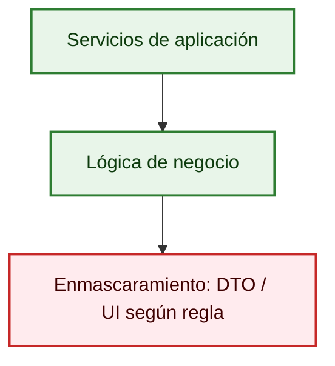

---

## Fase 8 — DAL y trazas de aplicación

**Qué es:** repositorio con **SQL parametrizado**; **logs estructurados** (request-id) sin PII de más en trazas.

**Normativa:** apoyo a A.8.15, A.8.3 a nivel de aplicación.

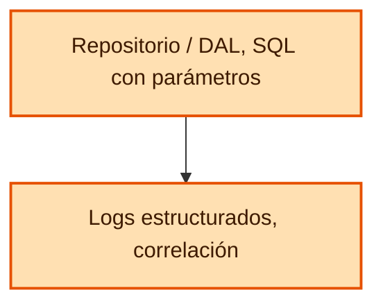

---

## Fase 9 — Base de datos (A.8.10, A.8.24, A.8.11 DDM, RLS)

**Qué es:** **TDE**, **TLS** hacia el motor, **RLS**, **DDM**, **backups cifrados**, **auditoría** de motor; **Always Encrypted** u cifrado columnal para columnas de alto riesgo (muy recomendable).

**Normativa:** A.8.10, A.8.24, A.8.11.

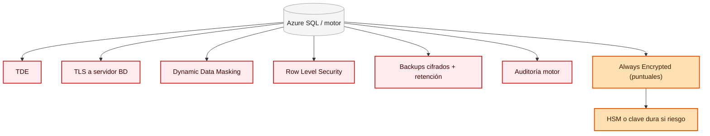

---

## Fase 10 — Claves y secretos (A.8.24)

**Qué es:** **Managed Identity**, **Key Vault** (rotación, acceso mínimo); **HSM** si riesgo o norma exige.

**Normativa:** A.8.24 (ciclo de vida de claves).

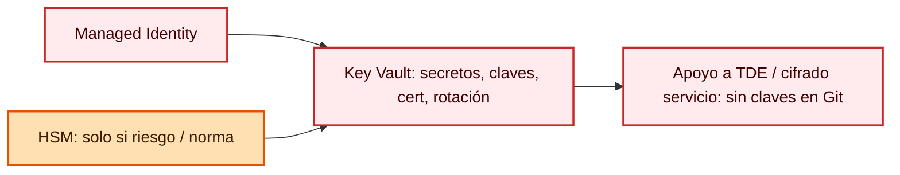

---

## Fase 11 — Registro, correlación y evidencia (A.8.15)

**Qué es:** canal de **eventos** (acceso, poliza, decisiones, export, DML/operaciones acordadas), **correlación** y almacenamiento a prueba de repudio o **append-only** cifrado. Evidencia para 33/34 o auditor.

**Normativa:** A.8.15; base de A.8.16.

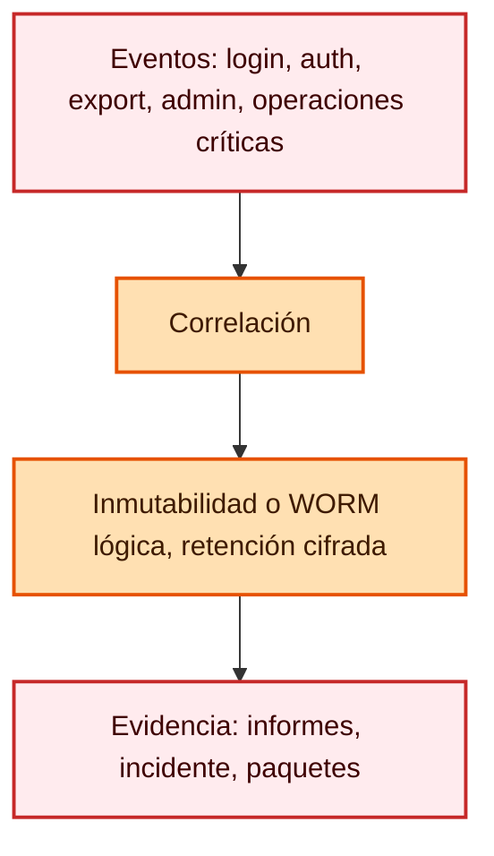

---

## Fase 12 — Monitorización, SIEM (A.8.16)

**Qué es:** **Application Insights** / **OpenTelemetry**, **Monitor**, **Log Analytics**, **Sentinel**; **UEBA** opcional; **SOAR** naranja (muy recomendable).

**Normativa:** A.8.16; la periodicidad y el alcance van en **política operativa**.

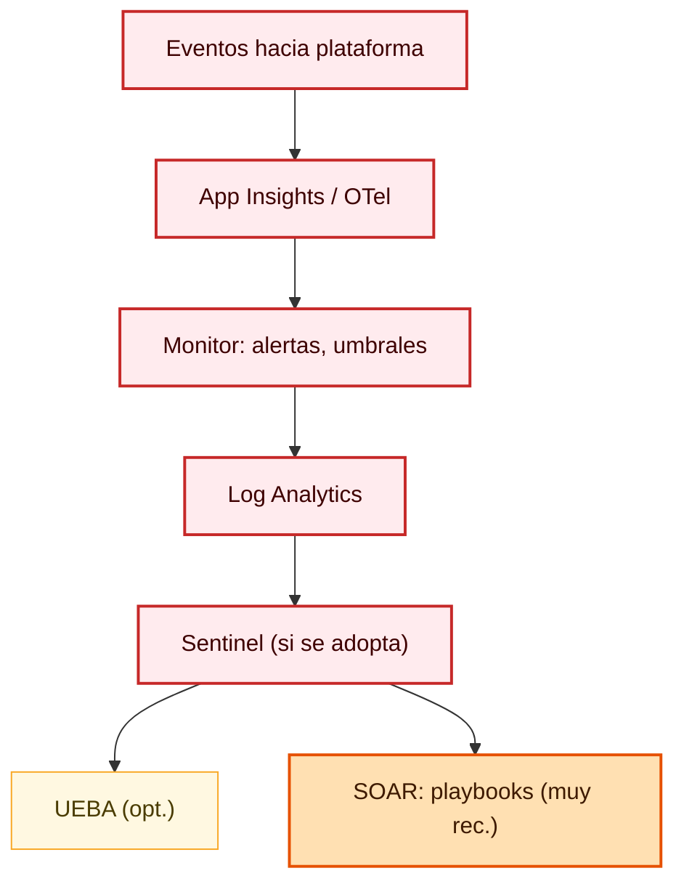

---

## Fase 13 — SDLC, contenedores y despliegue (A.8.25 + suministro)

**Qué es:** repositorio con **revisión**; **SAST** y búsqueda de **secretos** en PR; **SCA** (CVE) y **SBOM** según criterio; **IaC**; **canales** dev/pre/prod. Contenedores: imágenes mínimas, **escaneo de imagen** (naranja, muy recomendable). **Secretos** solo vía **pipeline a Key Vault**; runtime con **identidades** — nunca claves en Git.

**Normativa:** A.8.25; cadena de suministro 8.2x según acuerdo.

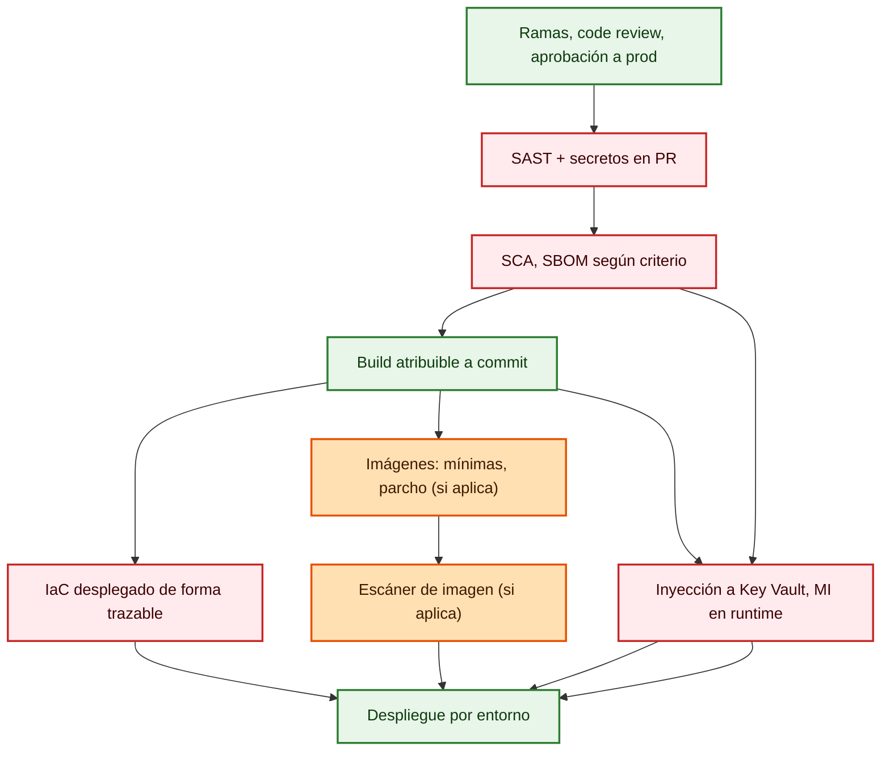

---
