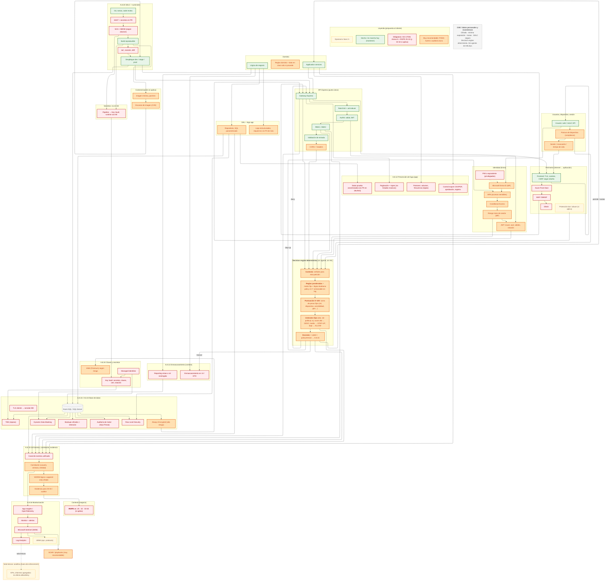

## Mermaid final — vista completa (sin agente, sin ML / MLOps)

Diagrama **único** alineado con la sección *Por qué la IA no es aceptable en el camino de enforcement*: el **decision engine** es **100 % determinista** (reglas ponderadas, puntuación 0–100 por suma fija, umbrales versionados, `ruleId` y `policyVersion` en auditoría). **No** hay *AI risk engine*, **no** hay MLOps, **no** hay agente. La caja *Analítica (solo lectura)* es **opcional** y **no** interviene en allow/deny.

