# Arquitectura CAE — fases 0–13 (diagrama unificado)

Documento con **un solo diagrama Mermaid** que agrupa leyenda, tráfico usuario→borde→identidad→API, DLP, motor de decisiones **determinista** (sin ML/agente), dominio, DAL, base de datos, claves, registro y evidencia (A.8.15), monitorización/SIEM (A.8.16) y SDLC (A.8.25 + cadena de suministro).

**Lectura:** el flujo principal va de arriba/abajo; las ramas muestran decisiones (`deny`/`step-up`/mascar), inyección de secretos, telemetría a evidencia, y despliegue hacia entornos.

```mermaid
---
config:
  layout: elk
---
flowchart TB
  %% ========== FASE 0 — LEYENDA Y ÁMBITO ==========
  subgraph F0["Fase 0 — Leyenda y ámbito · sin MLOps en enforcement"]
    L1["g1: Hecho / base en proyecto"]
    L2["g2: Obligatorio — ISO + RGPD · cifrado · trazas · mín. exposición · SDLC"]
    L3["g3: Opcional o fase posterior"]
    L4["g4: Muy recomend. — PII duro, forense, claves alto impacto"]
    T0["Plataforma CAE — Azure SQL/Express/Entra · trazas Azure · riesgo determinista"]
  end
  class L1 g1
  class L2 g2
  class L3 g3
  class L4 g4
  class T0 gn

  %% ========== FASE 1 — USUARIOS Y DISPOSITIVO (A.5 / A.8) ==========
  subgraph F1["Fase 1 — Usuarios y dispositivo — mín. privilegio · señal para CA"]
    U["Usuarios: web, móvil, cliente API"]
    DVC["Señal postura / cumplimiento (Entra) — Conditional Access / contexto"]
    SESS["Sesión: TTL, revocación, cookies seguras, CSRF según diseño"]
  end

  %% ========== FASE 2 — PERÍMETRO (A.8 canal exposición) ==========
  subgraph F2["Fase 2 — Perímetro: TLS, Front Door, WAF, DDoS, bot/abuso si aplica"]
    FE["Frontend: TLS, sesión, headers/CSP según diseño"]
    AFD["Azure Front Door"]
    WAF["WAF OWASP"]
    DD["Protección DDoS"]
    BT["Abuso / bot (opc. — no sustituye cifrado en datos ni A.8.15)"]
  end

  %% ========== FASE 3 — IDENTIDAD (A.5.15–18, A.8.2/3) ==========
  subgraph F3["Fase 3 — Microsoft Entra ID — MFA, CA, riesgo sesión, PIM, JWT"]
    EID["Entra ID: IdP"]
    MFA["MFA"]
    CA2["Conditional Access: riesgo, localización, política"]
    RSKS["Riesgo inicio de sesión / señales IdP"]
    PIM["PIM o equivalente — admin privilegiados"]
    JWT["JWT: issuer, aud, validez, parámetros acordados"]
  end

  %% ========== FASE 4 — API Express — CAPA DE POLÍTICA (A.8.25, A.8.12 apoyo) ==========
  subgraph F4["Fase 4 — API gateway Express: rate limit, authN, RBAC/ABAC, validación"]
    GWAY["Gateway Express — punto único de entrada"]
    RATE["Rate limit: IP, usuario, ruta + anti-abuse"]
    AUTHN["AuthN: valida JWT y claims"]
    AUTHR["Autorización RBAC/ABAC"]
    VALD["Validación esquemas, anti inyección"]
    CORS["CORS, headers, política CORS"]
  end

  %% ========== FASE 5 — DLP EN APLICACIÓN (A.8.12) ==========
  subgraph F5["Fase 5 — DLP app: listados, export, dev sin PII real, reglas fijas (sin ML)"]
    PAG["Listados: paginación, topes — no volcados masivos"]
    EXP["Export: cuotas, aprobación, registro (CSV/PDF)"]
    TDATA["Dev/test: datos anónimos o sintéticos"]
    BULK["Reglas: volumen, frecuencia, umbrales fijos (picos)"]
  end

  %% ========== FASE 6 — DECISION ENGINE (A.8.15, operativo) ==========
  subgraph F6["Fase 6 — Motor determinista: señales → reglas v. → score opc. → umbral → decisión + ruleId + policyVersion"]
    CTX["Contexto: IdP, ruta, rol, dispositivo, hora, riesgo sesión"]
    WRE["Reglas versionadas / matriz + lógica fija (policyVersion)"]
    RSC["Puntuación 0–100 opcional — fórmula fija, no entrenable"]
    THR["Umbrales documentados: DENY / STEP-UP / ALLOW / mask export"]
    DCN["Decisión hacia A.8.15 + trazas — ruleId + policyVersion en log"]
  end

  %% ========== FASE 7 — DOMINIO (A.8.11, RGPD minimización) ==========
  subgraph F7["Fase 7 — Dominio: negocio, DTO, solo dato estrictamente necesario"]
    APS["Servicios de aplicación"]
    BZ["Lógica de negocio"]
    DMR["Reglas de dominio — dato en claro solo si procede"]
  end

  %% ========== FASE 7b enmascaramiento ==========
  subgraph SENS["A.8.11 Enmascaramiento runtime"]
    MRUN["Máscara en DTO/UI según rol/regla"]
    MREP["Reporting o vistas restringidas"]
  end

  %% ========== FASE 8 — DAL Y TRAZAS DE APP (A.8.3 app, A.8.15 apoyo) ==========
  subgraph F8["Fase 8 — DAL: SQL parametrizado; logs estructurados con request-id, sin PII de más"]
    DALY["Repositorio / DAL — SQL con parámetros"]
    LLOG["Logs estructurados, correlación, sin fuga PII en trazas"]
  end

  %% ========== FASE 9 — BASE DE DATOS (A.8.10, A.8.24, A.8.11 DDM/RLS) ==========
  subgraph F9["Fase 9 — Azure SQL / motor: TDE, TLS, RLS, DDM, backups, auditoría, AE opc., HSM si riesgo"]
    SQL[("Azure SQL / SQL Server")]
    TDE["TDE (reposo)"]
    TTLS["TLS hacia motor BD"]
    DDM2["Dynamic Data Masking (DDM)"]
    RLS2["Row Level Security (RLS)"]
    BEN["Backups cifrados + retención"]
    QAUD2["Auditoría de motor / amenazas"]
    CLE2["Always Encrypted — columnas alto riesgo (muy rec.)"]
    HSM2["HSM o clave dura si riesgo/norma"]
  end

  %% ========== FASE 10 — CLAVES (A.8.24) ==========
  subgraph F10["Fase 10 — Managed Identity, Key Vault: rotación, cert, sin secretos en Git"]
    MI2["Managed Identity (runtime)"]
    AKV["Azure Key Vault — secretos, claves, certificados, rotación"]
  end

  %% ========== FASE 11 — EVIDENCIA (A.8.15, base 33/34) ==========
  subgraph F11["Fase 11 — Eventos: acceso, política, decisiones, export, DML acordada — correlación, inmutabilidad"]
    EVT["Canal de eventos unificado"]
    COR2["Correlación usuario, ventana, entidad, request-id"]
    IMM2["WORM lógico o almacenamiento append-only cifrado — retención"]
    EVD2["Evidencia para 33-34, incidente, paquetes auditor"]
  end

  subgraph LEGAL["Contexto normativo (referencia)"]
    RGPD["RGPD 25, 32, 33-34 si aplica — política operativa alinea periodicidad/alcance"]
  end
  class RGPD g2

  %% ========== FASE 12 — MONITORIZACIÓN (A.8.16) ==========
  subgraph F12["Fase 12 — App Insights/OTel, Monitor, Log Analytics, Sentinel, UEBA opt., SOAR rec."]
    AINS2["Application Insights / OpenTelemetry"]
    AMON2["Azure Monitor — alertas, umbrales, métricas"]
    LWA2["Log Analytics"]
    SEN2["Microsoft Sentinel (SIEM) — si se adopta"]
    UEBA2["UEBA (opcional)"]
    SOAR2["SOAR / playbooks (muy recomendable)"]
  end

  %% ========== ANALÍTICA (solo lectura, fuera enforcement) ==========
  subgraph ANLY["Lectura: analítica / informes agregados — no afecta allow/deny"]
    BI2["KPIs, informes: no alimenta motor de decisiones"]
  end
  class ANLY,BI2 g3

  %% ========== FASE 13 — SDLC + CONTENEDORES + DESPLIEGUE (A.8.25 + 8.2x suministro) ==========
  subgraph F13["Fase 13 — SDLC: PR, SAST+secretos, SCA+SBOM, build atribuible, IaC, canales, imágenes, escaneo, MI + pipeline→KV"]
    REPO2["Ramas, code review, aprobación a prod"]
    SAST2["SAST y búsqueda de secretos en PR"]
    SCA2["SCA (CVE) y SBOM según criterio"]
    BLD2["Build atribuible a commit, reproducible"]
    IAC2["IaC desplegado de forma trazable, drift controlado"]
    CIMG2["Contenedores: imágenes mínimas, parcho"]
    CSCN2["Escáner de imagen CVE (muy rec.)"]
    SINJ2["Inyección pipeline → Key Vault; runtime con MI — nunca claves en Git"]
    DEP2["Despliegue por entorno: dev / pre / prod"]
  end

  %% ---- Flujo principal: usuario → borde → API → contexto ----
  U --> DVC --> SESS
  U --> EID
  SESS --> FE
  FE --> AFD --> WAF --> DD
  DD --> BT
  WAF --> GWAY

  EID --> MFA --> CA2 --> RSKS --> JWT
  PIM -.->|elevación/roles admin| EID
  JWT --> AUTHN

  GWAY --> RATE --> AUTHN --> AUTHR --> VALD
  VALD --> CORS
  DVC --> CTX
  RSKS --> CTX
  JWT --> CTX
  AUTHR --> CTX
  RATE --> CTX
  GWAY --> CTX
  CORS --> CTX
  CTX --> WRE --> RSC --> THR --> DCN

  DCN -->|permitir / acotar| APS
  DCN -->|deny| GWAY
  DCN -->|step-up| MFA
  DCN -->|mascar| MRUN

  GWAY --> PAG
  APS --> EXP
  BZ --> BULK
  TDATA -.->|flujo de datos de prueba| DALY

  APS --> BZ --> DMR
  BZ --> MRUN
  BZ --> MREP
  BZ --> DALY
  BZ --> LLOG
  DALY --> LLOG

  MREP --> DDM2
  DALY --> RLS2
  DALY --> SQL
  SQL --> TDE
  SQL --> TTLS
  SQL --> DDM2
  SQL --> RLS2
  SQL --> BEN
  SQL --> QAUD2
  SQL --> CLE2
  CLE2 --> HSM2

  MI2 --> SQL
  MI2 --> AKV
  AKV --> TDE
  SINJ2 --> AKV
  CLE2 -.->|clave Column Master Key| HSM2

  GWAY --> EVT
  AUTHR --> EVT
  EXP --> EVT
  THR --> EVT
  DCN --> EVT
  DALY --> EVT
  SQL --> EVT
  BEN --> EVT
  EVT --> COR2 --> IMM2 --> EVD2
  EVD2 --> RGPD
  COR2 --> AINS2
  AINS2 --> AMON2 --> LWA2 --> SEN2
  SEN2 --> UEBA2
  SEN2 --> SOAR2
  LWA2 -.->|solo lectura, no enforcement| BI2

  REPO2 --> SAST2 --> SCA2 --> BLD2
  BLD2 --> IAC2
  BLD2 --> CIMG2 --> CSCN2
  SCA2 --> SINJ2
  BLD2 --> SINJ2
  IAC2 --> DEP2
  CSCN2 --> DEP2
  DEP2 --> FE
  DEP2 --> GWAY
  DEP2 --> SQL

  APS --> GWAY
  GWAY --> WAF
  AFD -.->|respuesta| FE
  FE -.->|UI| U

  classDef g1 fill:#e8f5e9,stroke:#2e7d32,color:#0d3b0d,stroke-width:2px
  classDef g2 fill:#ffebee,stroke:#c62828,color:#3e0000,stroke-width:2px
  classDef g3 fill:#fff8e1,stroke:#f9a825,color:#4a3c00,stroke-width:1px
  classDef g4 fill:#ffe0b2,stroke:#e65100,color:#3e1a00,stroke-width:2px
  classDef gn fill:#f5f5f5,stroke:#9e9e9e,color:#212121,stroke-width:1px

  class U,FE,GWAY,APS,BZ,REPO2,BLD2,DEP2 g1
  class PAG,EXP,MRUN,MREP,TDE,TTLS,DDM2,RLS2,BEN,QAUD2,EVT,EVD2,MI2,AKV,SCA2,SAST2,IAC2,SINJ2,THR,DCN,AFD,WAF,DD,RGPD g2
  class BT,BI2,UEBA2,ANLY g3
  class DVC,RSKS,CTX,WRE,RSC,COR2,IMM2,CLE2,HSM2,SOAR2,CSCN2,L4 g4
  class L1 g1
  class L2 g2
  class L3 g3
  class T0 gn
  class PIM g2
  class SQL gn
  class DALY,LLOG g4
  class CORS g1
  class TDATA g2
  class BULK g2
  class EID,MFA,CA2,SESS,AINS2,AMON2,LWA2,SEN2 g1
  class RATE,AUTHN,AUTHR,VALD g1
  class DMR g1
  class CIMG2 g4
```

## Notas de integración

- **F0** fija el **ámbito CAE** (datos personales y económicos) y la leyenda de colores: verde = base, rojo = obligatorio, amarillo = opcional, naranja = muy recomendable.
- El **motor de decisiones (F6)** no usa ML ni agentes: **reglas fijas, versiones en log**, score opcional con fórmula fija, alineado con A.8.15 en trazas.
- **F11 + F12** conectan **eventos → correlación → inmutabilidad** y, en paralelo, **telemetría operativa** hacia **Sentinel/Monitor**; la analítica (BI) queda **fuera del circuito** de allow/deny.
- **F13** alimenta despliegue a **F2/F4/F9** con **IaC**, **secretos hacia Key Vault (F10)** e **imágenes** con escaneo.

Si el visor Mermaid (GitHub, VS Code, o servicio con límite de nodos) trunca el diagrama, se puede abrir con [Mermaid Live Editor](https://mermaid.live) o exportar a SVG/PNG desde allí con el mismo código.

---
config:
  layout: elk
---
flowchart TB
  %% ========== FASE 0 — LEYENDA Y ÁMBITO ==========
  subgraph F0["Fase 0 — Leyenda y ámbito · sin MLOps en enforcement"]
    L1["g1: Hecho / base en proyecto"]
    L2["g2: Obligatorio — ISO + RGPD · cifrado · trazas · mín. exposición · SDLC"]
    L3["g3: Opcional o fase posterior"]
    L4["g4: Muy recomend. — PII duro, forense, claves alto impacto"]
    T0["Plataforma CAE — Azure SQL/Express/Entra · trazas Azure · riesgo determinista"]
  end
  class L1 g1
  class L2 g2
  class L3 g3
  class L4 g4
  class T0 gn

  %% ========== FASE 1 — USUARIOS Y DISPOSITIVO (A.5 / A.8) ==========
  subgraph F1["Fase 1 — Usuarios y dispositivo — mín. privilegio · señal para CA"]
    U["Usuarios: web, móvil, cliente API"]
    DVC["Señal postura / cumplimiento (Entra) — Conditional Access / contexto"]
    SESS["Sesión: TTL, revocación, cookies seguras, CSRF según diseño"]
  end

  %% ========== FASE 2 — PERÍMETRO (A.8 canal exposición) ==========
  subgraph F2["Fase 2 — Perímetro: TLS, Front Door, WAF, DDoS, bot/abuso si aplica"]
    FE["Frontend: TLS, sesión, headers/CSP según diseño"]
    AFD["Azure Front Door"]
    WAF["WAF OWASP"]
    DD["Protección DDoS"]
    BT["Abuso / bot (opc. — no sustituye cifrado en datos ni A.8.15)"]
  end

  %% ========== FASE 3 — IDENTIDAD (A.5.15–18, A.8.2/3) ==========
  subgraph F3["Fase 3 — Microsoft Entra ID — MFA, CA, riesgo sesión, PIM, JWT"]
    EID["Entra ID: IdP"]
    MFA["MFA"]
    CA2["Conditional Access: riesgo, localización, política"]
    RSKS["Riesgo inicio de sesión / señales IdP"]
    PIM["PIM o equivalente — admin privilegiados"]
    JWT["JWT: issuer, aud, validez, parámetros acordados"]
  end

  %% ========== FASE 4 — API Express — CAPA DE POLÍTICA (A.8.25, A.8.12 apoyo) ==========
  subgraph F4["Fase 4 — API gateway Express: rate limit, authN, RBAC/ABAC, validación"]
    GWAY["Gateway Express — punto único de entrada"]
    RATE["Rate limit: IP, usuario, ruta + anti-abuse"]
    AUTHN["AuthN: valida JWT y claims"]
    AUTHR["Autorización RBAC/ABAC"]
    VALD["Validación esquemas, anti inyección"]
    CORS["CORS, headers, política CORS"]
  end

  %% ========== FASE 5 — DLP EN APLICACIÓN (A.8.12) ==========
  subgraph F5["Fase 5 — DLP app: listados, export, dev sin PII real, reglas fijas (sin ML)"]
    PAG["Listados: paginación, topes — no volcados masivos"]
    EXP["Export: cuotas, aprobación, registro (CSV/PDF)"]
    TDATA["Dev/test: datos anónimos o sintéticos"]
    BULK["Reglas: volumen, frecuencia, umbrales fijos (picos)"]
  end

  %% ========== FASE 6 — DECISION ENGINE (A.8.15, operativo) ==========
  subgraph F6["Fase 6 — Motor determinista: señales → reglas v. → score opc. → umbral → decisión + ruleId + policyVersion"]
    CTX["Contexto: IdP, ruta, rol, dispositivo, hora, riesgo sesión"]
    WRE["Reglas versionadas / matriz + lógica fija (policyVersion)"]
    RSC["Puntuación 0–100 opcional — fórmula fija, no entrenable"]
    THR["Umbrales documentados: DENY / STEP-UP / ALLOW / mask export"]
    DCN["Decisión hacia A.8.15 + trazas — ruleId + policyVersion en log"]
  end

  %% ========== FASE 7 — DOMINIO (A.8.11, RGPD minimización) ==========
  subgraph F7["Fase 7 — Dominio: negocio, DTO, solo dato estrictamente necesario"]
    APS["Servicios de aplicación"]
    BZ["Lógica de negocio"]
    DMR["Reglas de dominio — dato en claro solo si procede"]
  end

  %% ========== FASE 7b enmascaramiento ==========
  subgraph SENS["A.8.11 Enmascaramiento runtime"]
    MRUN["Máscara en DTO/UI según rol/regla"]
    MREP["Reporting o vistas restringidas"]
  end

  %% ========== FASE 8 — DAL Y TRAZAS DE APP (A.8.3 app, A.8.15 apoyo) ==========
  subgraph F8["Fase 8 — DAL: SQL parametrizado; logs estructurados con request-id, sin PII de más"]
    DALY["Repositorio / DAL — SQL con parámetros"]
    LLOG["Logs estructurados, correlación, sin fuga PII en trazas"]
  end

  %% ========== FASE 9 — BASE DE DATOS (A.8.10, A.8.24, A.8.11 DDM/RLS) ==========
  subgraph F9["Fase 9 — Azure SQL / motor: TDE, TLS, RLS, DDM, backups, auditoría, AE opc., HSM si riesgo"]
    SQL[("Azure SQL / SQL Server")]
    TDE["TDE (reposo)"]
    TTLS["TLS hacia motor BD"]
    DDM2["Dynamic Data Masking (DDM)"]
    RLS2["Row Level Security (RLS)"]
    BEN["Backups cifrados + retención"]
    QAUD2["Auditoría de motor / amenazas"]
    CLE2["Always Encrypted — columnas alto riesgo (muy rec.)"]
    HSM2["HSM o clave dura si riesgo/norma"]
  end

  %% ========== FASE 10 — CLAVES (A.8.24) ==========
  subgraph F10["Fase 10 — Managed Identity, Key Vault: rotación, cert, sin secretos en Git"]
    MI2["Managed Identity (runtime)"]
    AKV["Azure Key Vault — secretos, claves, certificados, rotación"]
  end

  %% ========== FASE 11 — EVIDENCIA (A.8.15, base 33/34) ==========
  subgraph F11["Fase 11 — Eventos: acceso, política, decisiones, export, DML acordada — correlación, inmutabilidad"]
    EVT["Canal de eventos unificado"]
    COR2["Correlación usuario, ventana, entidad, request-id"]
    IMM2["WORM lógico o almacenamiento append-only cifrado — retención"]
    EVD2["Evidencia para 33-34, incidente, paquetes auditor"]
  end

  subgraph LEGAL["Contexto normativo (referencia)"]
    RGPD["RGPD 25, 32, 33-34 si aplica — política operativa alinea periodicidad/alcance"]
  end
  class RGPD g2

  %% ========== FASE 12 — MONITORIZACIÓN (A.8.16) ==========
  subgraph F12["Fase 12 — App Insights/OTel, Monitor, Log Analytics, Sentinel, UEBA opt., SOAR rec."]
    AINS2["Application Insights / OpenTelemetry"]
    AMON2["Azure Monitor — alertas, umbrales, métricas"]
    LWA2["Log Analytics"]
    SEN2["Microsoft Sentinel (SIEM) — si se adopta"]
    UEBA2["UEBA (opcional)"]
    SOAR2["SOAR / playbooks (muy recomendable)"]
  end

  %% ========== ANALÍTICA (solo lectura, fuera enforcement) ==========
  subgraph ANLY["Lectura: analítica / informes agregados — no afecta allow/deny"]
    BI2["KPIs, informes: no alimenta motor de decisiones"]
  end
  class ANLY,BI2 g3

  %% ========== FASE 13 — SDLC + CONTENEDORES + DESPLIEGUE (A.8.25 + 8.2x suministro) ==========
  subgraph F13["Fase 13 — SDLC: PR, SAST+secretos, SCA+SBOM, build atribuible, IaC, canales, imágenes, escaneo, MI + pipeline→KV"]
    REPO2["Ramas, code review, aprobación a prod"]
    SAST2["SAST y búsqueda de secretos en PR"]
    SCA2["SCA (CVE) y SBOM según criterio"]
    BLD2["Build atribuible a commit, reproducible"]
    IAC2["IaC desplegado de forma trazable, drift controlado"]
    CIMG2["Contenedores: imágenes mínimas, parcho"]
    CSCN2["Escáner de imagen CVE (muy rec.)"]
    SINJ2["Inyección pipeline → Key Vault; runtime con MI — nunca claves en Git"]
    DEP2["Despliegue por entorno: dev / pre / prod"]
  end

  %% ---- Flujo principal: usuario → borde → API → contexto ----
  U --> DVC --> SESS
  U --> EID
  SESS --> FE
  FE --> AFD --> WAF --> DD
  DD --> BT
  WAF --> GWAY

  EID --> MFA --> CA2 --> RSKS --> JWT
  PIM -.->|elevación/roles admin| EID
  JWT --> AUTHN

  GWAY --> RATE --> AUTHN --> AUTHR --> VALD
  VALD --> CORS
  DVC --> CTX
  RSKS --> CTX
  JWT --> CTX
  AUTHR --> CTX
  RATE --> CTX
  GWAY --> CTX
  CORS --> CTX
  CTX --> WRE --> RSC --> THR --> DCN

  DCN -->|permitir / acotar| APS
  DCN -->|deny| GWAY
  DCN -->|step-up| MFA
  DCN -->|mascar| MRUN

  GWAY --> PAG
  APS --> EXP
  BZ --> BULK
  TDATA -.->|flujo de datos de prueba| DALY

  APS --> BZ --> DMR
  BZ --> MRUN
  BZ --> MREP
  BZ --> DALY
  BZ --> LLOG
  DALY --> LLOG

  MREP --> DDM2
  DALY --> RLS2
  DALY --> SQL
  SQL --> TDE
  SQL --> TTLS
  SQL --> DDM2
  SQL --> RLS2
  SQL --> BEN
  SQL --> QAUD2
  SQL --> CLE2
  CLE2 --> HSM2

  MI2 --> SQL
  MI2 --> AKV
  AKV --> TDE
  SINJ2 --> AKV
  CLE2 -.->|clave Column Master Key| HSM2

  GWAY --> EVT
  AUTHR --> EVT
  EXP --> EVT
  THR --> EVT
  DCN --> EVT
  DALY --> EVT
  SQL --> EVT
  BEN --> EVT
  EVT --> COR2 --> IMM2 --> EVD2
  EVD2 --> RGPD
  COR2 --> AINS2
  AINS2 --> AMON2 --> LWA2 --> SEN2
  SEN2 --> UEBA2
  SEN2 --> SOAR2
  LWA2 -.->|solo lectura, no enforcement| BI2

  REPO2 --> SAST2 --> SCA2 --> BLD2
  BLD2 --> IAC2
  BLD2 --> CIMG2 --> CSCN2
  SCA2 --> SINJ2
  BLD2 --> SINJ2
  IAC2 --> DEP2
  CSCN2 --> DEP2
  DEP2 --> FE
  DEP2 --> GWAY
  DEP2 --> SQL

  APS --> GWAY
  GWAY --> WAF
  AFD -.->|respuesta| FE
  FE -.->|UI| U

  classDef g1 fill:#e8f5e9,stroke:#2e7d32,color:#0d3b0d,stroke-width:2px
  classDef g2 fill:#ffebee,stroke:#c62828,color:#3e0000,stroke-width:2px
  classDef g3 fill:#fff8e1,stroke:#f9a825,color:#4a3c00,stroke-width:1px
  classDef g4 fill:#ffe0b2,stroke:#e65100,color:#3e1a00,stroke-width:2px
  classDef gn fill:#f5f5f5,stroke:#9e9e9e,color:#212121,stroke-width:1px

  class U,FE,GWAY,APS,BZ,REPO2,BLD2,DEP2 g1
  class PAG,EXP,MRUN,MREP,TDE,TTLS,DDM2,RLS2,BEN,QAUD2,EVT,MI2,AKV,SCA2,SAST2,IAC2,SINJ2,THR,DCN,AFD,WAF,DD,RGPD g2
  class BT,BI2,UEBA2,ANLY g3
  class DVC,RSKS,CTX,WRE,RSC,COR2,IMM2,CLE2,HSM2,SOAR2,CSCN2,L4 g4
  class L1 g1
  class L2 g2
  class L3 g3
  class L4 g4
  class T0 gn
  class PIM g2
  class SQL gn
  class CTX,WRE g4
  class DALY,LLOG g4
  class CORS g1
  class TDATA g2
  class BULK g2

  ---
config:
  layout: elk
---
flowchart TB

%% ======================= ESTILOS =======================
classDef g1 fill:#e8f5e9,stroke:#2e7d32,color:#0d3b0d,stroke-width:2px
classDef g2 fill:#ffebee,stroke:#c62828,color:#3e0000,stroke-width:2px
classDef g3 fill:#fff8e1,stroke:#f9a825,color:#4a3c00,stroke-width:1px
classDef g4 fill:#ffe0b2,stroke:#ef6c00,color:#3e1a00,stroke-width:2px
classDef meta fill:#e3f2fd,stroke:#1565c0,color:#0d47a1

%% ======================= LEYENDA =======================
subgraph LEG["LEYENDA"]
L1["🟩 Core sistema (runtime: usuarios, API, negocio, datos activos)"]:::g1
L2["🟥 Seguridad obligatoria (ISO 27001 / RGPD / Zero Trust / controles críticos)"]:::g2
L3["🟨 Observabilidad y análisis (monitorización, SIEM, métricas)"]:::g3
L4["🟧 Controles avanzados (riesgo, forense, cifrado fuerte, decisiones complejas)"]:::g4
L5["🔵 Metadata (contexto, documentación, no forma parte del runtime)"]:::meta
end

%% ======================= F0 =======================
subgraph F0["F0 · ÁMBITO"]
T0["Plataforma CAE · Azure · Entra · SQL · Zero Trust"]:::meta
end

%% ======================= F1 =======================
subgraph F1["F1 · USUARIOS"]
U["Usuario"]:::g1 --> DVC["Dispositivo / postura"]:::g4 --> SESS["Sesión"]:::g1
end

%% ======================= F2 =======================
subgraph F2["F2 · PERÍMETRO"]
FE["Frontend"]:::g1 --> AFD["Front Door"]:::g1 --> WAF["WAF"]:::g2 --> DD["DDoS"]:::g2 --> BOT["Anti-bot"]:::g3
end

%% ======================= F3 =======================
subgraph F3["F3 · IDENTIDAD"]
ENTRA["Entra ID"]:::g2 --> MFA["MFA"]:::g2 --> CA["Conditional Access"]:::g2 --> RISK["Risk Engine"]:::g4 --> JWT["JWT"]:::g1
PIM["PIM"]:::g2 --> ENTRA
end

%% ======================= F4 =======================
subgraph F4["F4 · API GATEWAY"]
GW["Gateway API"]:::g1 --> RATE["Rate limit"]:::g2 --> AUTHN["AuthN"]:::g2 --> AUTHZ["RBAC/ABAC"]:::g2 --> VALID["Validación"]:::g2
end

%% ======================= F5 =======================
subgraph F5["F5 · DLP"]
PAG["Paginación"]:::g2
EXP["Export control"]:::g2
BULK["Control volumen"]:::g2
end

%% ======================= F6 =======================
subgraph F6["F6 · DECISION ENGINE"]
CTX["Contexto"]:::g4 --> RULES["Reglas"]:::g4 --> SCORE["Score"]:::g3 --> THR["Umbrales"]:::g4 --> DEC["Decisión"]:::g4
end

%% ======================= F7 =======================
subgraph F7["F7 · DOMINIO"]
BUS["Negocio"]:::g1 --> DAL["DAL"]:::g4 --> LOG["Logs"]:::g4
MASK["Masking runtime"]:::g4
end

%% ======================= F8 =======================
subgraph F8["F8 · BASE DE DATOS"]
SQL[("Azure SQL")]:::meta --> TDE["TDE"]:::g2 --> DDM["DDM"]:::g2 --> RLS["RLS"]:::g2 --> BKP["Backups"]:::g2 --> AUD["Audit"]:::g2
end

%% ======================= F9 =======================
subgraph F9["F9 · SECRETOS"]
MI["Managed Identity"]:::g2 --> KV["Key Vault"]:::g2
end

%% ======================= F10 =======================
subgraph F10["F10 · EVIDENCIA"]
EVT["Eventos"]:::g2 --> COR["Correlación"]:::g4 --> IMM["Inmutable"]:::g4 --> EVID["Evidencia"]:::g2
end

%% ======================= F11 =======================
subgraph F11["F11 · MONITORIZACIÓN"]
AI["App Insights"]:::g3 --> MON["Monitor"]:::g3 --> SENT["Sentinel"]:::g2 --> SOAR["SOAR"]:::g4
end

%% ======================= F12 =======================
subgraph F12["F12 · CI/CD DEVSECOPS"]
REPO["Git repo"]:::g1 --> BUILD["Build"]:::g1 --> TEST["Tests"]:::g1 --> SONAR["SonarQube"]:::g3

BUILD --> SAST["SAST"]:::g2 --> SNYK["Snyk"]:::g2 --> SECRETS["Secrets scan"]:::g2

SONAR --> ART["Artefactos"]:::g1 --> SBOM["SBOM"]:::g4 --> IMAGE["Imagen"]:::g1 --> SCAN["Scan CVE"]:::g4 --> SIGN["Firma"]:::g4

IAC["IaC"]:::g3 --> IACSCAN["Scan IaC"]:::g3

RELEASE["Release"]:::g1 --> DEPLOY["Deploy"]:::g1

BUILD --> IAC --> RELEASE
SIGN --> RELEASE
end

%% ======================= F13 =======================
subgraph F13["F13 · OPERACIÓN"]
U --> DVC --> FE
FE --> GW
JWT --> AUTHN
AUTHZ --> CTX
CTX --> RULES
DEC --> BUS
BUS --> SQL
BUS --> MI --> KV
SQL --> EVT
EVT --> AI
DEPLOY --> FE
DEPLOY --> GW
DEPLOY --> SQL
end