# Mermaid por fase — arquitectura de seguridad (CAE / Azure / Express)

Cada fase incluye **qué cubre**, **controles normativos** cuando aplica, y un **diagrama** autocontenido. Los colores se reutilizan en todos los diagramas:

| Clase | Color (referencia) | Significado |
|--------|--------------------|-------------|
| `g1` / `gDone` | Verde | Hecho o base ya en el proyecto. |
| `g2` / `gMust` | Rojo | Obligatorio (ISO 27001 Anexo A, RGPD 25·32; 33·34 si aplica). |
| `g3` / `gOpt` | Amarillo | Opcional o fase posterior. |
| `g4` / `gRec` | Naranja | Muy recomendable (casi obligatorio en PII/auditoría dura). |
| `gn` / `gNeutral` | Gris | Título o contenedor neutral. |

**Nota:** No hay *agente* de IA, MLOps ni puntuación de riesgo por **modelo entrenable** en el camino de *enforcement* (permitir / denegar / enmascarar / step-up). Sustituido por un **decision engine** determinista (reglas, umbrales, `ruleId`, `policyVersion` en A.8.15).

---

## Por qué la IA / ML no es aceptable en el camino de *enforcement* (ISO y auditoría real)

Un ISMS sólido y un auditor con criterio técnico pedirán **reproducibilidad**, **criterio versionado** y **explicación completa** de cada decisión que afecta a acceso, datos o export. En ese tramo, un motor basado en **IA/ML** plantea con frecuencia problemas que un **rule engine** o **suma de pesos fijados y documentados** no tiene:

| Problema frecuente (IA/ML en enforce) | Efecto frente a auditoría o incidente |
|--------------------------------------|----------------------------------------|
| Salida no rigurosamente *bit a bit* con la “misma entrada de negocio” (latencia, variación, umbral de modelo) | Difícil probar *exactamente* qué regla o valor se aplicó. |
| El “criterio” cambia con **reentrenamiento** o con versión de modelo | **No** equivale a *policy v2.3* en lenguaje de **A.8.15**. |
| Caja de decisión difícil de reconstituir (pesos, datos, sesgos) | *Why was this blocked?* a menudo no es 100% exigible sin diccionario de entrenamiento y *bias review*. |
| *Version* del producto = artefacto de **modelo** | No sustituye **versión de reglas de negocio** y **hilo a eventos** en un SIEM. |
| Forense bajo plazos (33/34) | Más riesgo de no cerrar con **hecho + criterio + traza** con la claridad de una **regla R12**. |

**Lo que sí conviene a ISO/forense / RGPD 32 “medidas técnicas” (sin renunciar a criterio de negocio):**

- **Misma versión de política + misma señal de contexto** → **misma decisión** (diseño determinista).
- **Versión** publicada: `policyVersion`, set de `ruleId` y, si aplica, **fórmula fija** del score 0–100 (p. ej. *40+30+20+10* = suma de términos aprobada por el responsable de riesgo).
- **Cada** denegación / step-up / límite de export: **id de regla y versión** en el **registro de eventos (A.8.15)**.

### Qué se elimina de la arquitectura “tipo agente / ML” y qué lo sustituye

| Eliminar (no en el *control path* de seguridad) | Sustituto |
|--------------------------------------------------|------------|
| *AI risk engine* / *agent* que decide *allow/deny* | **Decision engine determinista** (servicio de políticas) |
| **MLOps** (entrenar, desplegar y versionar *model* para riesgo) | **Nada** en riesgo operativo de acceso. Opcional: MLOps **fuera** del *enforcement* (p. ej. pronóstico de negocio). |
| *Risk score* por inferencia de modelo | **0–100** = **suma o matriz fija** acordada y trazable (misma entrada, misma salida). |
| Explicar bloqueo solo con “el modelo” | Cada acción: **código de regla + `policyVersion`** en log |

### Cómo queda la “inteligencia” aceptable (reglas avanzadas, no IA de caja negra)

**Sí a:** reglas **ponderadas**, **matriz de riesgo predefinida**, lógica **booleana** y **umbrales fijos** (todo versionado, revisable en comité y en *pull request* de política).  
**No a:** agente, modelo entrenable en línea, ni puntuación que el auditor no pueda replicar a mano con un Excel y la señal capturada.

**Ejemplo fijo (ilustrativo, no cifra de contrato):**  
`40` (desajuste rol) + `30` (dispositivo/MDM desconocido) + `20` (endpoint con datos de alta sensibilidad) + `10` (geo fuera de matriz) → *score*; política de *thresholds* documentada: p. ej. *score > 70* → *DENY*; *40–70* → *STEP-UP MFA*; *< 40* → *ALLOW* (además de RBAC/DLP, etc.).

Esto es **auditable**, **determinista** y alineable con exigencia de trazas **A.8.15** y con **gestión de riesgos (Anexo A)**, sin confundir “*machine learning*” con “*security policy*”.

### Conclusión operativa

- En **seguridad y datos** de CAE, **no** debe existir un **agente IA** que imponga *allow/deny* o enmascaramiento si se pretende un **cierre ISO/RGPD defendible**.
- Sí: **Decision engine** con reglas, umbrales y *policyVersion* en **registro inmutable o append-only cifrado según diseño (A.8.15 + A.8.16 y controles A.5.x de acceso, según diseño)**.
- **Cualquier uso de IA/ML** que el negocio quiera en el futuro debe quedar en **canales no bloqueantes** (analítica, *insights*, *copilot* sin *write* a políticas) y **nunca** como *last word* sobre *export*, *delete* o *access* sin mapeo a regla escrita y versionada.

---

## Fase 0 — Leyenda y ámbito

**Qué es:** marco de lectura común para propuesta y revisiones técnicas. Deja claro qué se considera “ya hecho”, qué es **obligatorio** para reducir el riesgo legal/técnico, y qué es **complementario**.

**Alcance de la solución (texto):** plataforma que trata **datos personales y económicos** (CAE), con almacenamiento en **Azure SQL / SQL Server**, API **Express**, identidad **Microsoft Entra ID** y trazas en ecosistema **Azure**.

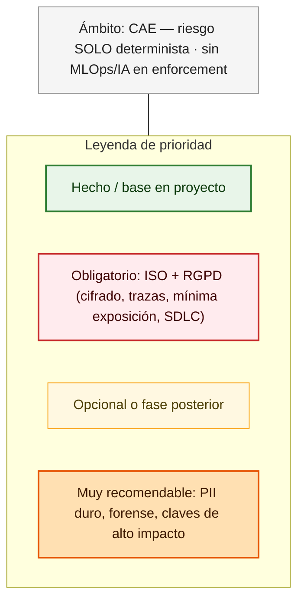

---

## Fase 1 — Usuarios y dispositivo

**Qué es:** quién accede (web, móvil, API) y qué **señal** aporta el dispositivo o el IdP (postura, cumplimiento) para alimentar **Conditional Access** y el **contexto** del *decision engine* (sin ML).

**Normativa:** mínimo privilegio; acceso condicionado al contexto (A.5 / A.8, según diseño).

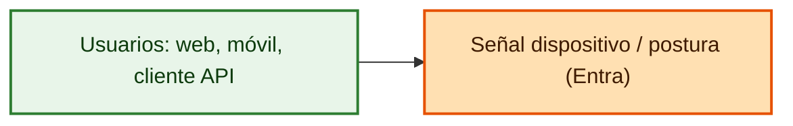

---

## Fase 2 — Perímetro (borde)

**Qué es:** tráfico Internet → aplicación. **TLS**, **Front Door**, **WAF** (OWASP), **DDoS**, y **protección de abusos/bots** si el riesgo lo justifica (opcional; no sustituye cifrado en datos ni A.8.15).

**Normativa:** refuerza **A.8** (canal de exposición).

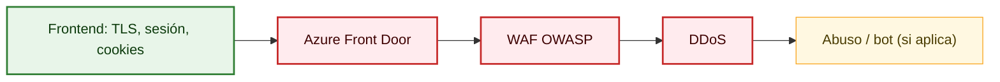

---

## Fase 3 — Identidad (Microsoft Entra ID)

**Qué es:** IdP, **MFA**, **Conditional Access**, riesgo de inicio de sesión, **PIM** o equivalente para administración, **tokens JWT** con parámetros acordados (issuer, aud, validez).

**Normativa:** A.5.15–A.5.18 (acceso) y A.8.2 / A.8.3 en la práctica.

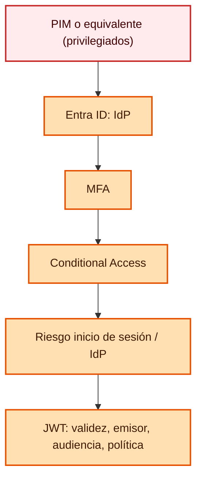

---

## Fase 4 — API (Express) — capa de política en el servicio

**Qué es:** **gateway** como punto único de **rate limit**, autenticación, **RBAC/ABAC** y **validación** (sin pasar a dominio con entrada dudosa).

**Normativa:** A.8.25 y apoyo a A.8.12 (abuso).

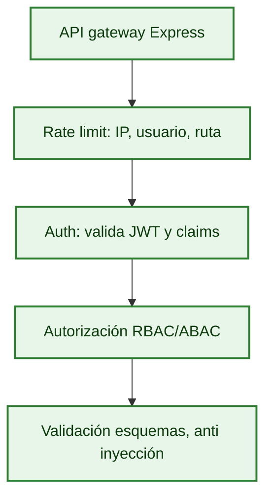

---

## Fase 5 — DLP en aplicación (A.8.12)

**Qué es:** listados con **paginación y topes**, **export** con aprobación y registro, entornos **sin PII reales** en pruebas, y **reglas** para picos o patrones (volumen, frecuencia) — *sin* modelo entrenable.

**Normativa:** A.8.12.

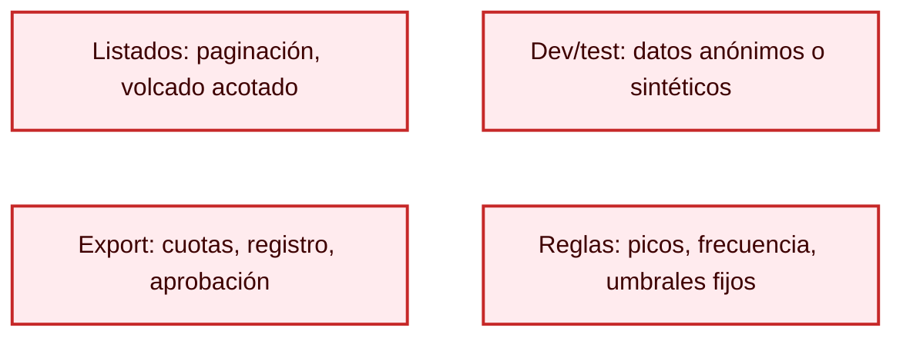

---

## Fase 6 — Decision engine (determinista; sin agente, sin ML)

**Qué es:** **Contexto** de señales → **reglas ponderadas / matriz** (versionadas) → **puntuación 0–100 opcional** (solo fórmula fija) → **umbrales** → **decisión** (allow, deny, mask, step-up, bloqueo de export) con **ruleId** y **policyVersion** hacia A.8.15.

**Normativa:** riesgo operativo y A.8.15 (no reemplaza A.8.24 cifrado).

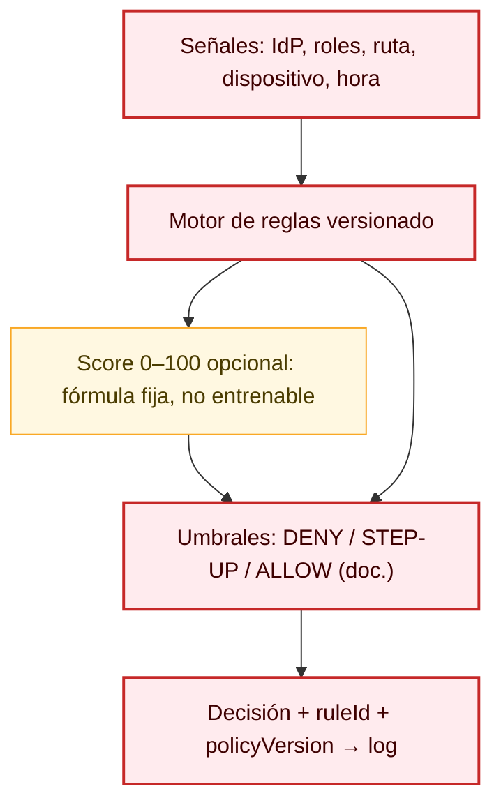

---

## Fase 7 — Dominio y A.8.11 (mínima exposición)

**Qué es:** lógica de **negocio** y enmascaramiento en DTOs/UI; solo datos en claro estrictamente necesarios.

**Normativa:** A.8.11 y minimización (RGPD).

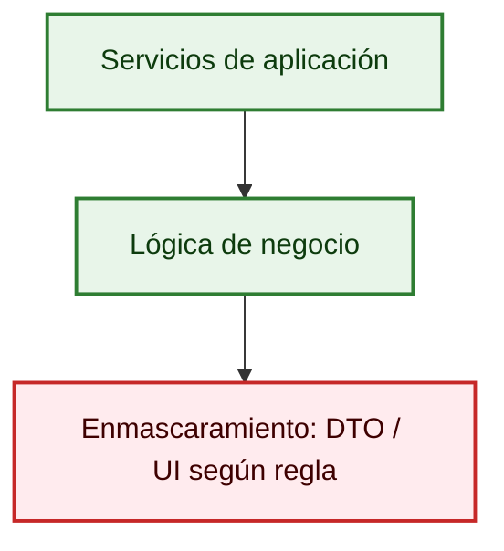

---

## Fase 8 — DAL y trazas de aplicación

**Qué es:** repositorio con **SQL parametrizado**; **logs estructurados** (request-id) sin PII de más en trazas.

**Normativa:** apoyo a A.8.15, A.8.3 a nivel de aplicación.

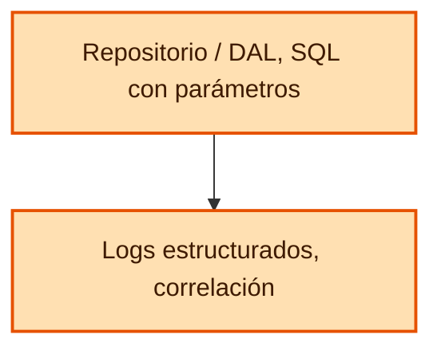

---

## Fase 9 — Base de datos (A.8.10, A.8.24, A.8.11 DDM, RLS)

**Qué es:** **TDE**, **TLS** hacia el motor, **RLS**, **DDM**, **backups cifrados**, **auditoría** de motor; **Always Encrypted** u cifrado columnal para columnas de alto riesgo (muy recomendable).

**Normativa:** A.8.10, A.8.24, A.8.11.

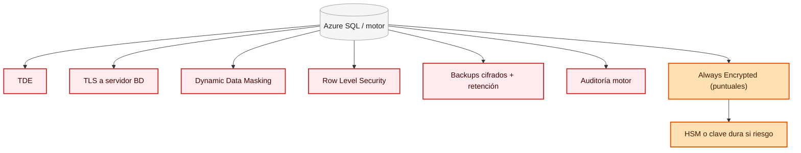

---

## Fase 10 — Claves y secretos (A.8.24)

**Qué es:** **Managed Identity**, **Key Vault** (rotación, acceso mínimo); **HSM** si riesgo o norma exige.

**Normativa:** A.8.24 (ciclo de vida de claves).

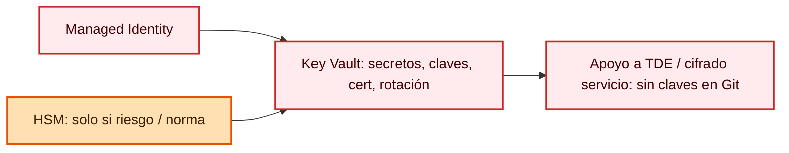

---

## Fase 11 — Registro, correlación y evidencia (A.8.15)

**Qué es:** canal de **eventos** (acceso, poliza, decisiones, export, DML/operaciones acordadas), **correlación** y almacenamiento a prueba de repudio o **append-only** cifrado. Evidencia para 33/34 o auditor.

**Normativa:** A.8.15; base de A.8.16.

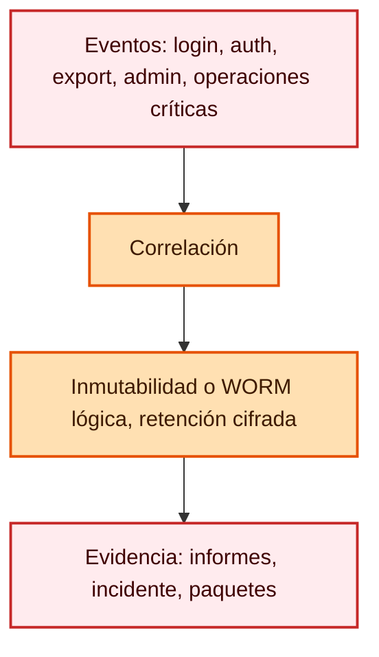

---

## Fase 12 — Monitorización, SIEM (A.8.16)

**Qué es:** **Application Insights** / **OpenTelemetry**, **Monitor**, **Log Analytics**, **Sentinel**; **UEBA** opcional; **SOAR** naranja (muy recomendable).

**Normativa:** A.8.16; la periodicidad y el alcance van en **política operativa**.

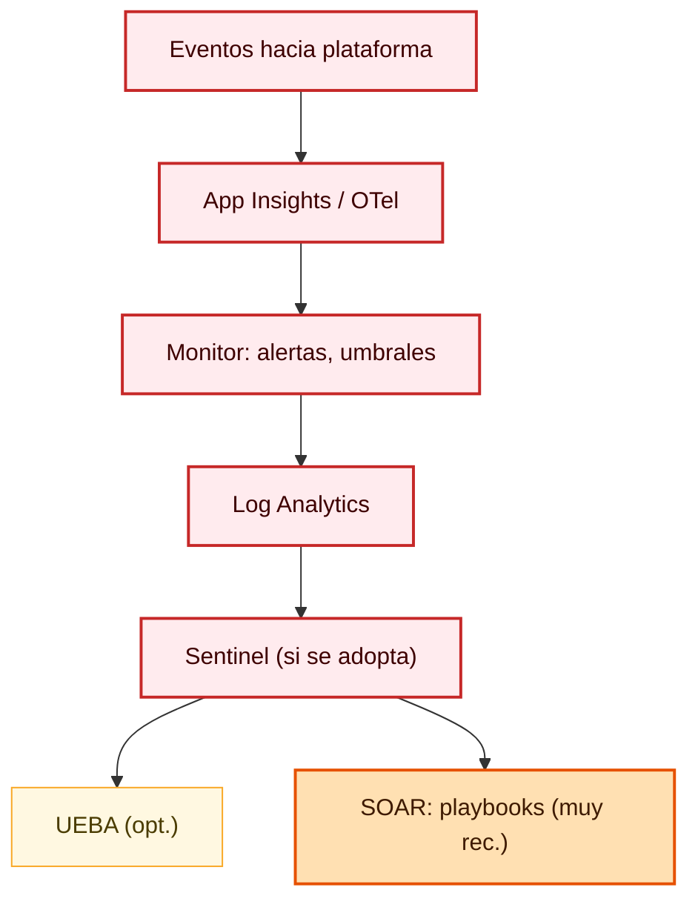

---

## Fase 13 — SDLC, contenedores y despliegue (A.8.25 + suministro)

**Qué es:** repositorio con **revisión**; **SAST** y búsqueda de **secretos** en PR; **SCA** (CVE) y **SBOM** según criterio; **IaC**; **canales** dev/pre/prod. Contenedores: imágenes mínimas, **escaneo de imagen** (naranja, muy recomendable). **Secretos** solo vía **pipeline a Key Vault**; runtime con **identidades** — nunca claves en Git.

**Normativa:** A.8.25; cadena de suministro 8.2x según acuerdo.

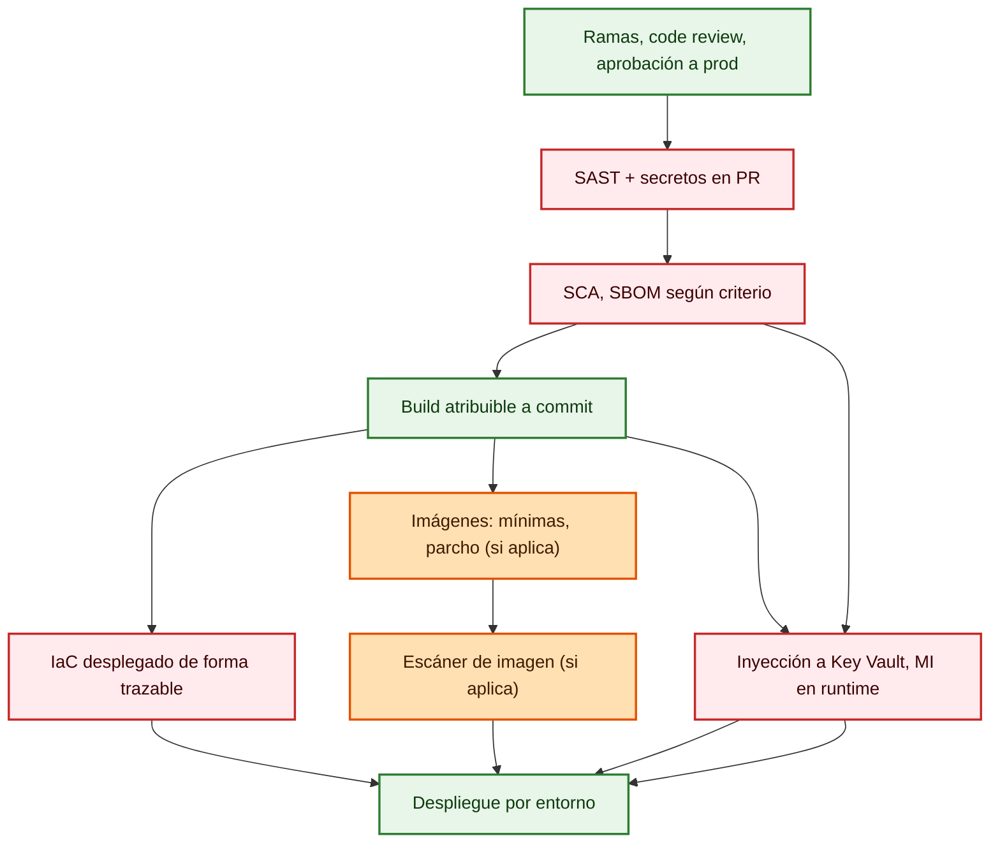

---

## Mermaid final — vista completa (sin agente, sin ML / MLOps)

Diagrama **único** alineado con la sección *Por qué la IA no es aceptable en el camino de enforcement*: el **decision engine** es **100 % determinista** (reglas ponderadas, puntuación 0–100 por suma fija, umbrales versionados, `ruleId` y `policyVersion` en auditoría). **No** hay *AI risk engine*, **no** hay MLOps, **no** hay agente. La caja *Analítica (solo lectura)* es **opcional** y **no** interviene en allow/deny.

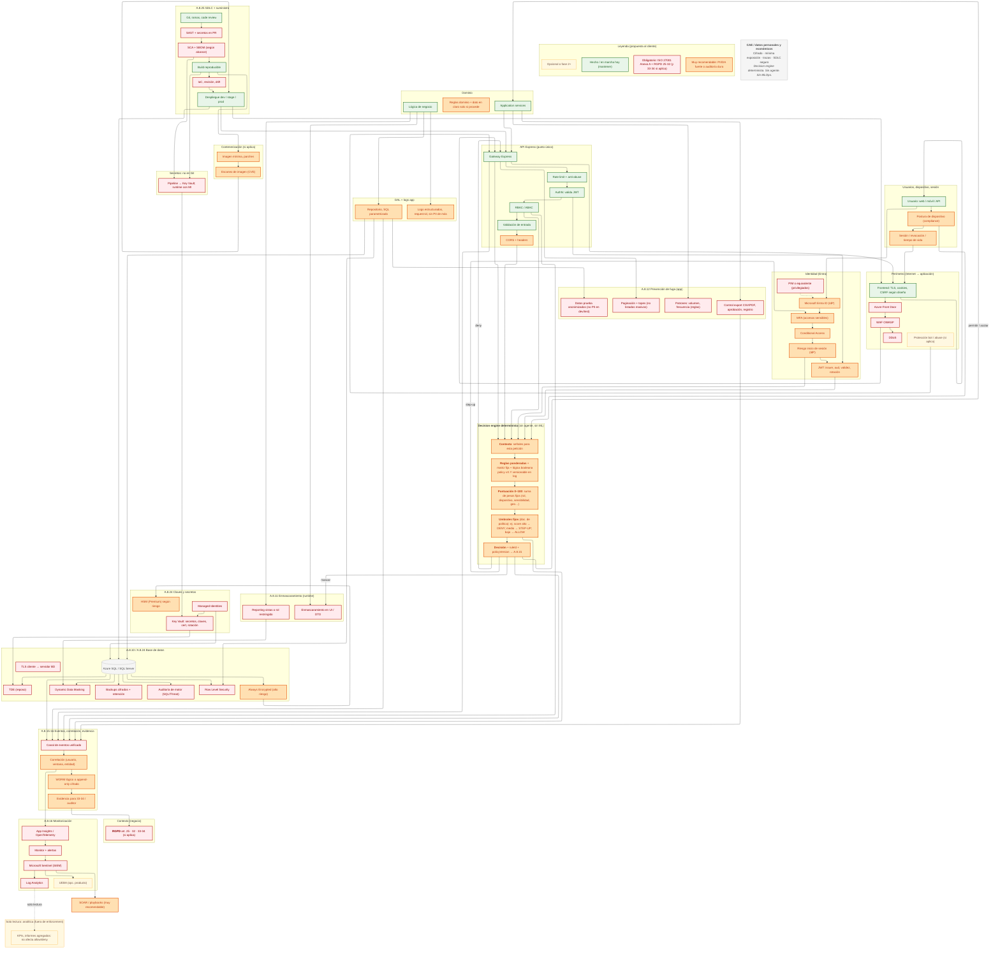
