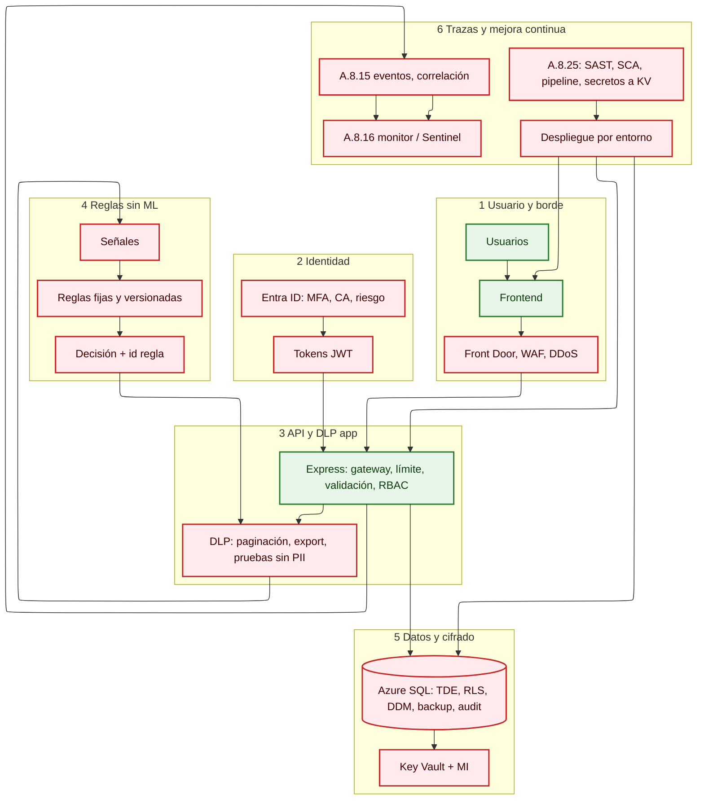

# Resumen de la solución — arquitectura, ISO 27001 y RGPD (CAE)

Documento de **síntesis** para propuesta o comité: qué se propone, por qué, y cómo se mapea a **ISO/IEC 27001:2022 (Anexo A)** y a las obligaciones del **RGPD** relevantes al caso (datos personales y sensibles, facturación, identificadores, etc.).

---

## 1. Situación y objetivo

- La plataforma **CAE** trata **datos personales y sensibles** (p. ej. facturas, contacto, identificadores, datos económicos). Un estado sin cifrado adecuado, sin control de exportaciones, sin trazas suficientes o sin SDLC con controles, implica **riesgo legal (RGPD)** y **riesgo de certificación / cumplimiento (ISO 27001)**.
- **Objetivo de la solución:** reducir el riesgo a un nivel **aceptable y demostrable**: cifrado (reposo y tránsito), mínima exposición (enmascaramiento, DLP lógica), **registro y revisión** de actividades, y **gestión de claves**; más **desarrollo y despliegue** alineados con buenas prácticas (A.8.25 y suministro).
- **No** se asume un motor de riesgo basado en **IA o MLOps**: la política y el “riesgo” operativo se implementan con **reglas deterministas** (señales de identidad, umbrales, listas, contexto) **versionadas y auditables**.

---

## 2. Principios de arquitectura (cómo se explica al cliente)

| Principio | Qué significa en la propuesta |
|-----------|------------------------------|
| **Defensa en profundidad** | Varios controles superpuestos: borde, identidad, API, datos, trazas, claves. |
| **Cifrado y claves (A.8.24, A.8.10)** | TDE (y tránsito TLS) como base; columnas puntuales con cifrado más fuerte **si** el riesgo lo exige; Key Vault + identidades administradas. |
| **Mínima exposición (A.8.11)** | Enmascaramiento en app y, donde aplique, DDM en motor; no PII de más en dev/test. |
| **Control de fuga lógica (A.8.12)** | Paginación, topes, export con registro y gobernanza, detección simple por reglas. |
| **Trazabilidad (A.8.15) y revisión (A.8.16)** | Eventos unificados, correlación, (opcional) SIEM; política de **qué** se revisa y **cada cuánto**. |
| **SDLC seguro (A.8.25)** | SAST, SCA, secretos fuera de Git, despliegue trazable, IaC revisado. |

---

## 3. Resumen de capas (stack de referencia)

- **Clientes:** web, móvil, integraciones API.
- **Borde:** Front Door, WAF, DDoS; abuso/bot según riesgo.
- **Identidad:** Microsoft Entra ID (MFA, Conditional Access, riesgo de inicio de sesión, PIM para privilegiados, JWT con política clara).
- **Aplicación:** API **Express** con gateway, rate limit, autenticación, RBAC/ABAC, validación, DLP de aplicación.
- **Riesgo / decisión:** motor de **reglas fijas**; salida con **motivo o id. de regla** para auditoría.
- **Datos:** DAL con SQL parametrizado; **Azure SQL** con TDE, RLS, DDM, backups cifrados, auditoría de motor; opcional **Always Encrypted** (o similar) en columnas críticas.
- **Claves:** Key Vault, Managed Identity, HSM **si** el riesgo o la norma lo requieren.
- **Operación:** App Insights / Monitor / Log Analytics; **Sentinel** (SIEM) y **SOAR** según madurez.
- **Ingeniería:** pipeline con SAST, SCA, (contenedor) escaneo de imagen, secretos a Key Vault, despliegue por entornos.

El detalle por fase, con Mermaid, está en [fases-mermaid.md](./fases-mermaid.md).

---

## 4. Alineación ISO 27001:2022 (Anexo A) — referencia usada con el cliente

La siguiente tabla relaciona **controles del Anexo A** citados en el análisis de brecha con **líneas de actuación** de la arquitectura. Los identificadores siguen el estándar **A.8.x** del anexo (organización del estándar 2022); el mapeo fino a la lista exacta del Anexo A lo valida el responsable de cumplimiento (ISMS) en el proyecto.

| Control (referencia) | Riesgo que cierra | Medidas en la arquitectura (resumen) |
|----------------------|-------------------|--------------------------------------|
| **A.8.10** Almacenamiento de la información | Copias y volúmenes de datos en claro, backups legibles | TDE, backups cifrados, retención, control de acceso a copias. |
| **A.8.11** Enmascaramiento de datos | DNI, teléfonos, datos económicos visibles de más | DTO/UI, DDM, roles de lectura; no PII en entornos no productivos. |
| **A.8.12** Prevención de fuga de información | Export masivo, consultas abusivas, copias | Paginación, topes, registro y flujo de export, alertas por reglas. |
| **A.8.15** Registro de eventos | Falta de prueba ante incidente o auditoría | Eventos de auth, policy, export, DAL crítico; correlación, retención. |
| **A.8.16** Monitorización de actividades | Nadie revisa o alerta | Alertas, Log Analytics, Sentinel; SOAR/UEBA según fase. |
| **A.8.24** Uso de criptografía | Algoritmos débiles, claves en código | TLS, TDE, Key Vault, rotación, AE/HSM según riesgo. |
| **A.8.25** Desarrollo seguro del software | Vulnerabilidades y secretos en repo | SAST, SCA, review, pipeline, IaC, sin secretos en Git. |

Controles de **acceso** (p. ej. A.5.15–A.5.18) y de **derechos** (A.8.2, A.8.3) se apoyan en **Entra ID** + **RBAC/ABAC** en la API y en **RLS** donde proceda; el texto legal concreto lo fija el **DPO** y el **ISMS**.

---

## 5. RGPD (enlace con la propuesta técnica)

| Artículo (idea) | Cómo lo respalda la solución (no es asesoramiento legal) |
|-------------------|--------------------------------------------------------|
| **25** Privacidad desde el diseño / por defecto | Minimización (máscaras, DLP, entornos sin PII reales), separación de entornos, cifrado en reposo y tránsito. |
| **32** Medidas técnicas y organizativas | TDE, TLS, Key Vault, logging, control de acceso, SDLC con análisis de dependencias y revisión. |
| **33 / 34** Notificación y comunicación (si procede) | Trazas, evidencia empaquetada, SIEM/alertas; el **procedimiento** de incidente es documentación aparte. |

---

## 6. Diagrama de flujo de alto nivel (vista única)

Sirve para **portada de propuesta** o anexo; el desglose por fase con colores está en [fases-mermaid.md](./fases-mermaid.md).

*Nota de diseño del diagrama anterior:* en un único resumen, **g1 (verde)** y **g2 (rojo)** se usan de forma agregada para no saturar la leyenda; en el documento de **fases**, verde = ya hecho, rojo = obligatorio, amarillo = opcional, naranja = muy recomendable, como se define en [fases-mermaid.md](./fases-mermaid.md).

---

## 7. TDE (mensaje al cliente)

**Transparent Data Encryption (TDE)** cifra **los archivos de datos a nivel de base de datos** con una clave de cifrado de base de datos (protegida, p. ej., vía clave de servicio en **Key Vault** o camino acordado). Es un pilar de **A.8.10** y **A.8.24**, y encaja con la continuidad del proyecto (referencia a otras plataformas con TDE) siempre que se **unifique criterio** (qué BDs, qué entornos, claves, rotación y prueba de restauración). No sustituye por sí solo: **enmascaramiento**, **control de export DLP**, **trazas** y **acceso condicionado** siguen siendo necesarios.

---

## 8. Documentos relacionados en este directorio

- [fases-mermaid.md](./fases-mermaid.md) — Mermaid **por fase** con explicación y colores.
- [README.md](./README.md) — índice breve.
