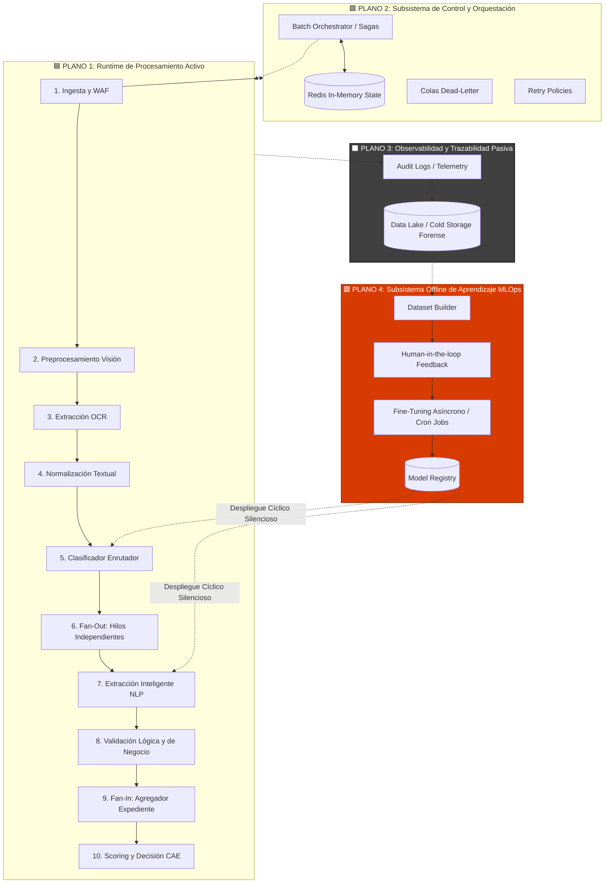

# 🏛️ Arquitectura Desacoplada de Alta Disponibilidad: Sistema de Procesamiento de Expedientes (CAE)

> **Core Insights de Ingeniería:**  
> "En sistemas de grado empresarial (Banca, Seguros, Administración Pública), el flujo _no es un pipeline lineal de 18 fases_. Es un ecosistema distribuido compuesto por un **Runtime Transaccional Activo** y tres sistemas satélites desacoplados: **Control/Orquestación**, **Observabilidad Operativa** y **Aprendizaje Continuo (MLOps)**."

Este documento define la arquitectura definitiva de producción, superando mentalidades de "pipeline secuencial simple" para establecer responsabilidades aisladas. Si una capa de aprendizaje falla, el usuario de negocio no se entera. Si un documento está corrupto, la orquestación prosigue asíncronamente con los anexos válidos blindando la operación.

---

## 🗺️ Mapa Topológico de los Subsistemas (Planos de Ejecución)

---

## 🏗️ Desglose Arquitectónico por Subsistemas

La evolución fundamental de este modelo arquitectónico es **aislar los componentes por propósito**. Los procesos de negocio han sido categorizados en su lugar de ejecución lógico: operaciones instantáneas (tiempo real) versus procesos formativos colaterales (background).

### 🟦 1. RUNTIME DE TIEMPO REAL (El Motor Céntrico Activo)

Este subsistema transaccional es "síncrono relativo" para el ciclo de vida de interacción del expediente. Se inicia con el payload del usuario y expira emitiendo el veredicto final. Debe operar estresantemente con baja latencia.

1. **Edge Security e Ingesta:** Autenticación estricta, WAF contra payload dañino, evaluación de integridad y pre-verificación de compleción documental (Ej. 9 PDFs requeridos) para no arrancar el cómputo en vano.
2. **Preprocesamiento Visión Sensorial (Computer Vision):** Enderezado, mejora de texturas (contraste local) y limpieza espacial. Los scans inútiles o ilegibles se descartan en early-fail, previniendo gastos de computo posterior.
3. **Core Óptico y Transducción Multimodal:** Inferencia primaria OCR Tesseract/Cloud. Ante márgenes de fiabilidad (_Confidence Scores_) de grado pobre sub-70%, escala en milisegundos hacia una Red Neuronal de alta capacidad (Ej: GPT-4o-Vision) capaz de leer de manera relacional texto manuscrito de alta degradación.
4. **Normalización Lingüística:** Restauración técnica de codificaciones crudas (UTF8), recomposición de tabulaciones y detección espacial de tablas orgánicas contenidas en la página.
5. **Clasificación Estocástica Enrutadora:** Agente que pondera determinista y estadísticamente el género técnico del archivo (Seguro, Factura Proforma, Identificación Oficial DNI).
6. **Orquestación Sub-Paralela (Fan-Out Pipeline):** Emisión simultánea de mensajería; no se iteran los 9 documentos en un vector, se computan los 9 a la par en arquitecturas Micro-Workers sin espera de cuellos de botella cruzados.
7. **Extracción Acoplada (IA) y Validación Mutua (Reglas Severas):**
   - _Inteligencia Artificial (NLP Generativo):_ Rastreo de magnitudes, entidades financieras (IBAN), firmantes y rúbricas.
   - _Engine Codificado (Lógica Pura):_ Validación dura criptográfica de Checksums en documentos ID, cruzamiento espacio temporal (No admitir Fechas vencidas), conteniendo permanentemente las posibles alucinaciones generadas probabilísticamente por el NLP.
8. **Agregación (Fan-In) y Motor de Decisión Ponderado (Scoring):** Empaquetado integral sumando incongruencias cruzadas. (Ej. Doc1 fecha es Válida, Doc2 indica que DNI Doc1 es inválido). Determinación final algorítmica:
   - **🟢 Vía Verde (> 0.90):** Aprobación expedita automática (Straight-Through Processing).
   - **🟡 Fricción Ambar (0.70 - 0.89):** Desvío y puesta a disposición en las colas asíncronas del Backoffice Operador manual de Riesgos.
   - **🔴 Bloqueo Letal (< 0.69):** Rechazo de falsificación o discrepancia irresoluble.

### 🟩 2. CONTROL SYSTEM (Transaccionalidad Distribuida de Nube)

Es el andamiaje que evita que todo penda de un hilo en memoria RAM volátil. Garantiza la atomicidad de la operación central sin intervenir el contenido.

- **Circuitos Batch / Sagas Orquestadas:** Engendra las extensiones computacionales y controla resiliencias basándose en Claves de Idempotencia garantizando la premisa "Exactly-Once", negando duplicidades monetarias en cobros o API.
- **Máquina de Estado Ultrarápida In-Memory (Redis):** Indexa cada micropaso (Ej. `11:42:01.002 - Doc2.OCR_COMPLETE`). Eje central para surtir eventos Server-Sent a los UX frontends permitiendo UI de estado confiable puro.
- **Dead Letter Queues (DLQ) & Retry Policies:** Resiliencia a fallas transitorias en la conectividad con proveedores de NLP encapsulando expedientes venenosos antes de saturar o colapsar de timeout cascada el resto de la base operante.

### ⬛ 3. OBSERVABILIDAD TRANSVERSAL (Pasivo Legal Data Lake)

Espectador fantasma invisible, no suma milisegundos de latencia.

- **Repositorios Forenses WORM:** _Write-Once-Read-Many._ Resguardo de los Logs, JSON crudos pre-decisiones, métricas de confianza, duración de rutinas.
- Todo el corpus operacional central es trazado por motivos contables, regulatorios (Ej. Cumplimiento RGPD o auditorías de Banco Central).

### 🟥 4. LEARNING LOOP (Feedback Asíncrono Continuo / MLOps)

Rutinas programadas temporales que construyen la evolución cognitiva por las madrugadas.

- **Human-in-the-Loop Dataset Captor:** Extracción programática retrospectiva. Cuando un analista corrige una clasificación o dato "Ámbar", el sistema capta esta corrección empírica humana y la inyecta al Data-Warehouse Formativo.
- **ML Training Ops (Fine Tuning):** Los modelos ligeros perimetrales se afilan o afinan reconociendo las matrices que más erraron.
- **Controles de Represión (Shadow Deployments):** Una versión V2 de IA nunca ingresa directamente a Runtime "Por defecto". Realiza cruces transparentes contra histórico comprobando analíticamente su mejora superior a V1 sin sacrificar precisiones previas probadas, para solo entonces pisar Model Registry como "Activo".

---

## 🏛️ Despliegue de Implementación: Nivel Banco (Banking-Grade) en Azure Stack

Para trascender de lo teórico a los cimientos físicos, el marco tecnológico Microsoft de aprovisionamientos es el siguiente:

| Dominio Arquitectónico               | Azure Native Stack Recomendado                  | Justificación Operativa (Patrón Adoptado)                                                                                                                               |
| ------------------------------------ | ----------------------------------------------- | ----------------------------------------------------------------------------------------------------------------------------------------------------------------------- |
| **Control System y Máquina Estados** | **Azure Durable Functions**                     | Evita colapsos en llamadas paralelas o latencia API prolongadas mediante puntos de suspensión semánticos robustos e _Idempotency Keys_.                                 |
| **Colas de Desacople Sagas**         | **Azure Service Bus Protocol**                  | Absorción pura de cargas masivas repentinas y persistencia garantizada transaccional por **Dead-Letter-Queues**.                                                        |
| **Runtime Procesamiento Vertical**   | **Azure API Management / Functions Serverless** | Punto único de gestión API. Escalada horizontal infinita asíncrona por demanda de Expedientes entrantes.                                                                |
| **Inteligencia Fuerte Privada**      | **Azure OpenAI Service / Cognitive Search**     | Modelos ubicados intrínsecamente dentro de Virtual Networks (VNets) privadas de la Organización, cortando filtración forzosa de datos Personales IP de OpenAI Abiertos. |
| **Semáforos de Transaccionalidad**   | **Azure Cache for Redis (Premium Tier)**        | Sincronización in-memory sub-milisegundo para subprocesamiento paralelo agresivo, liberando estrés de los motores relacionales.                                         |
| **Storage Legal Inmutable**          | **Azure Data Lake Storage Gen 2 / Deltalake**   | Tiering jerárquico ultra-económico de almacenamiento histórico forense pasivo ilimitado.                                                                                |

---

## 💰 Componente Crítico: Estrategia de Reducción Asintótica de Costes Opex (LLMs)

Un riesgo de incorporar Visión Cognitiva (Multimodal) a escala corporativa es la facturación por tokens masiva descontrolada. Esta arquitectura intercede aplicando tres optimizadores en plano:

1. **Semántica Caching (Identificación Vectorial Algorítmica):**
   Si se cursan sistemáticamente formularios corporativos "Nómina Plantilla A Versión 9", en vez de gastar en Inferencia Visual (LMM) por décima-milsima vez, la arquitectura efectúa un Hasheo visual de su diseño. Se procesa a nivel espacial y semántico leyendo coordenadas de extracción previamente guardadas, cayendo el costo de deducción a casi 0% local en un 80% de trámites genéricos.

2. **Modelo de "Cascada" (Escalada Responsable Inferencial):**
   Jamás arrancar pidiendo GPT-4o procesar todo el cuerpo.
   - _Nivel Básico (Gasto Minúsculo):_ Modelos Tesseract locales o BERT Ligero operan el filtrado inicial en documentos excelentes.
   - _Nivel Excepcional (Gasto Puntual):_ Solamente ante caídas lógicas estructurales reportadas, el flujo dirige ese PDF puntual estropeado al modelo LMM Multimodal avanzado absorbiendo únicamente el costo caro para el 5% de casos dañados o escritos a mano de mala caligrafía donde antes el proceso completo finalizaba rechazado al usuario.

3. **Inferencia Batch Priorizada:**
   El Batch Orchestrator acopla o aplaza procesos nocturnos lentos para enrutarse bajo tarifas masivas Cloud a lotes (Batching Provisioned Throughput Costing) minimizando su penalidad.

---

> 💡 _SÍNTESIS DEFINITIVA:_  
> _Esto no es un guión de extracción NLP empaquetable. Se ha consolidado un Cluster de Orquestación Computacional de Misión Crítica capaz de auditar, resistir y adaptar su razonamiento subyacente dinámicamente resguardando la operatividad, integridad de datos, y los márgenes de operación de la Compañía ante millones de ingestas volumétricas._

flowchart TD

%% =====================================================
%% 🧠 1. INGESTA Y SEGURIDAD
%% =====================================================
subgraph EDGE_LAYER ["1. Edge & Secure Ingress"]
A["Frontend: Upload Expediente (9 Docs)"] --> B{"API Gateway (WAF + Auth + Rate Limit)"}
B -- "Invalid/Threat" --> B1["Error 4xx/5xx UX"]
B -- "Authorized" --> ID["ID Generator (Idempotency Key)"]
ID --> SEC["Security Context (PII Masking + Key Vault)"]
end

%% =====================================================
%% 🧊 2. PERSISTENCIA Y DEDUPLICACIÓN
%% =====================================================
subgraph STORAGE_LAYER ["2. Raw Persistence & Deduplication"]
SEC --> S3[("Immutable Blob Storage (Original Documents)")]
S3 --> FP["Fingerprint Engine (Visual + Semantic + LSH)"]
FP --> DUP{"¿Duplicado?"}
DUP -- "Similitud > 98%" --> CACHE["Return Cached Result (Zero IA Cost)"]
end

%% =====================================================
%% ⚡ 3. ROUTING & ORCHESTRATION
%% =====================================================
subgraph CORE_ORCH ["3. Event Core & State Machine"]
DUP -- "New/Unique" --> ROUTER{"Event Router"}
ROUTER -- "Priority/VIP" --> RQ["Redis Stream / Queue"]
ROUTER -- "Standard/Batch" --> MQ["Service Bus / MQ"]

    RQ --> ORCH
    MQ --> ORCH

    ORCH["Orchestrator (Saga Pattern / State Machine)"] <--> STATE[(Redis State Store)]
    ORCH -- "Trace Data" --> OBS[("Observability Stack (OpenTelemetry)")]
    ORCH -- "On Failure" --> DLQ["Dead Letter Queue (Retry Logic)"]

end

%% =====================================================
%% 📦 4. FAN-OUT (PARALLEL PROCESSING)
%% =====================================================
subgraph FANOUT_LAYER ["4. Fan-Out & Scaling"]
ORCH --> FANOUT["Fan-Out Controller"]
subgraph WORKERS ["Parallel Document Workers"]
W1["Worker 1"] & W2["Worker 2"] & W3["Worker N..."]
end
FANOUT --> WORKERS
end

%% =====================================================
%% 🤖 5. IA PIPELINE (POR DOCUMENTO)
%% =====================================================
subgraph AI_PIPELINE ["5. Document AI Pipeline (Atomic)"]
WORKERS --> P0["PDF Parser / Layout Analysis"]
P0 --> P1{"¿Tiene Texto?"}

    P1 -- "No (Scanned)" --> P3["Vision Preprocessing (Denoise/Deskew)"]
    P3 --> P5["OCR Engine (Heavy)"]

    P1 -- "Yes (Digital)" --> P2["Native Text Extraction"]

    P2 & P5 --> CONF{"Confidence Score"}

    CONF -- "< 0.7" --> VLM["VLM Fallback (GPT-4o / Claude Vision)"]
    CONF -- "> 0.7" --> NLP["NLP Normalization"]
    VLM --> NLP

    NLP --> NER["NER + Entity Linking"]
    NER --> CLASS["Document Classifier"]

    CLASS --> TYPE{"Doc Router"}
    TYPE -- "DNI" --> A1["DNI Agent"]
    TYPE -- "Legal" --> A2["Legal Agent"]
    TYPE -- "Otros" --> A3["Generic Agent"]

    A1 & A2 & A3 --> DOC_JSON["Structured Doc JSON"]

end

%% =====================================================
%% 🧩 6. AGGREGATION & BUSINESS RULES
%% =====================================================
subgraph DECISION_LAYER ["6. Fan-In & Business Intelligence"]
DOC_JSON --> AGG["Fan-In Aggregator (Wait for all 9 docs)"]
AGG --> CAE["CAE Engine (Cross-Document Validation)"]
CAE --> SCORE["Scoring Engine (Risk & Consistency)"]

    SCORE --> DEC{"Final Decision"}
    DEC -- "Auto" --> OK["Approved"]
    DEC -- "Review" --> REV["Human-In-The-Loop (HITL)"]
    DEC -- "Critical" --> REJ["Rejected"]

end

%% =====================================================
%% 🔁 7. FEEDBACK & MLOPS
%% =====================================================
subgraph MLOPS_LAYER ["7. Continuous Learning (MLOps)"]
REV --> HUMAN_LABEL["Human Feedback / Correction"]
HUMAN_LABEL --> DS[("Golden Dataset")]
OK & REJ --> DS
DS --> TRAIN["Fine-Tuning / Retraining"]
TRAIN --> REG["Model Registry"]
REG -.-> |Update Weights| P5 & NER & SCORE
end

%% =====================================================
%% 🖥️ 8. DELIVERY
%% =====================================================
OK & REV & REJ & CACHE --> UX["Frontend Real-time Sync (WebSockets / SSE)"]
DLQ --> B1
OBS --> DASH["Ops Dashboard"]

%% Estilos
style EDGE_LAYER fill:#f5f5f5,stroke:#333,stroke-width:2px
style AI_PIPELINE fill:#e1f5fe,stroke:#01579b,stroke-width:2px
style CORE_ORCH fill:#fff3e0,stroke:#e65100,stroke-width:2px
style MLOPS_LAYER fill:#f3e5f5,stroke:#4a148c,stroke-dasharray: 5 5
style CACHE fill:#c8e6c9,stroke:#2e7d32
style VLM fill:#ffccbc,stroke:#d84315

flowchart LR

%% =====================================================
%% 🧠 1. EDGE + INGESTA (CONTROL DE ENTRADA)
%% =====================================================
subgraph EDGE["1. Edge Layer"]
A["Subida Expediente (9 Docs)"] --> B{"API Gateway Firewall"}
B -- Reject --> B1["Error UX"]
B -- OK --> ID["Idempotency & ID Generator"]
end

ID --> SEC["Security Context (Tenant & Encryption)"]

%% =====================================================
%% 🧊 2. RAW STORAGE & DEDUPLICACIÓN
%% =====================================================
subgraph STORAGE["2. Data Integrity"]
SEC --> S3[("Immutable Storage (Originals)")]
S3 --> FP["Fingerprint Engine (Visual/Semantic)"]
FP --> DUP{"Duplicate?"}
DUP -- YES --> CACHE["Cached Result"]
end

%% =====================================================
%% ⚡ 3. EVENT ROUTING & ORCHESTRATION
%% =====================================================
subgraph CORE["3. Orchestration & State"]
DUP -- NO --> ROUTER{"Event Router"}
ROUTER -- Fast Path --> RQ["Redis Stream"]
ROUTER -- Batch --> MQ["Service Bus"]

    RQ & MQ --> ORCH["Orchestrator (Saga Machine)"]
    ORCH <--> STATE[(Redis State)]

end

%% =====================================================
%% 📦 4. FAN-OUT (PARALELISMO)
%% =====================================================
subgraph FANOUT_LAYER["4. Scaling Layer"]
ORCH --> FANOUT["Fan-Out Controller"]
FANOUT --> W1["Worker 1"]
FANOUT --> W2["Worker 2"]
FANOUT --> WN["Worker N..."]
end

%% =====================================================
%% 🤖 5. DOCUMENT AI PIPELINE (EL NÚCLEO)
%% =====================================================
subgraph AI_PIPE["5. Document AI Pipeline (Atomic)"]
W1 & W2 & WN --> P0["Parser / Layout"]
P0 --> P1{"Type?"}

    P1 -- Scanned --> P3["Vision FX"] --> P5["OCR Engine"]
    P1 -- Digital --> P2["Text Extract"]

    P5 --> CONF{"Confidence"}
    CONF -- Low --> VLM["VLM Fallback"]
    CONF -- High --> TXT["Text"]
    P2 --> TXT
    VLM --> TXT

    TXT --> NER["NER & Normalization"]
    NER --> CLASS["Classifier"]

    CLASS --> TYPE{"Agent Router"}
    TYPE -- DNI --> A1["DNI Agent"]
    TYPE -- Legal --> A2["Legal Agent"]
    TYPE -- Otros --> A3["Generic"]

    A1 & A2 & A3 --> OUT["Doc JSON"]

end

%% =====================================================
%% 🧩 6. FAN-IN & DECISIÓN FINAL
%% =====================================================
subgraph DECISION["6. Consolidation & Scoring"]
OUT --> AGG["Fan-In Aggregator"]
AGG --> CONS["Unified Expediente"]
CONS --> CAE["Business Rules (CAE)"]
CAE --> SCORE["Scoring Engine"]

    SCORE --> DEC{"Final Decision"}
    DEC -- Auto --> OK["Approved"]
    DEC -- Review --> REV["Human Review"]
    DEC -- Reject --> REJ["Rejected"]

end

%% =====================================================
%% 🔁 7. FEEDBACK LOOPS (EL VALOR REAL)
%% =====================================================
subgraph LOOPS["7. Learning & Ops"]
OK & REV & REJ --> DS[("Training Data")]
REV --> HUMAN["Human Labels"]
HUMAN --> DS
DS --> TRAIN["MLOps Pipeline"]
TRAIN -.-> |Update| P5 & NER & SCORE

    HUMAN & REJ --> FPDB["Update Fingerprints"]
    FPDB -.-> |Optimize| FP

end

%% =====================================================
%% 🖥️ 8. UX DELIVERY
%% =====================================================
OK & REV & REJ & CACHE --> UX["Frontend Update (WS)"]
ORCH --> OBS[(Observability)]
OBS --> MON["Dashboard"]

%% Estilos para mejorar la legibilidad
style EDGE fill:#f9f9f9,stroke:#333
style AI_PIPE fill:#e1f5fe,stroke:#01579b
style CORE fill:#fff3e0,stroke:#e65100
style DECISION fill:#e8f5e9,stroke:#2e7d32
style LOOPS fill:#f3e5f5,stroke:#4a148c,stroke-dasharray: 5 5
style VLM fill:#ffebee,stroke:#c62828
