# 🏛️ Especificación Arquitectónica Definitiva: Plataforma de Inteligencia Documental Distribuida

> **Tesis Central de Ingeniería:**  
> _"Esto no es un pipeline secuencial de procesamiento. Constituye un **sistema de decisión distribuido sobre documentos**, orquestado por eventos, dotado de memoria transaccional inmutable, evaluación de estado y rutinas autónomas de aprendizaje continuo (MLOps)."_

Esta es la especificación técnica final de producción, trazada de manera exhaustiva de extremo a extremo, configurada para resolver las disrupciones típicas de redes integrando resiliencia, control de duplicados masivos y eficiencia en el gasto computacional (CAPEX/OPEX IA).

---

## 🗺️ Topología Maestra del Sistema (Arquitectura End-to-End)

El siguiente modelo ilustra la máquina de estados completa delineando los 14 vectores funcionales críticos:

```mermaid
flowchart LR

%% ===================== 1. FRONTEND =====================
subgraph L1["1. FRONTEND"]
    direction TB
    A["1.1 Upload Pack (9 Docs)"] --> B["1.2 API Gateway"]
end

%% ===================== 2. API =====================
subgraph L2["2. EDGE SECURE GATEWAY"]
    direction TB
    B --> B1["2.1 Auth (JWT) + Rate Limit"]
    B1 --> B2{"2.2 Valid Request?"}
    B2 -- No --> ERR["2.3 Reject + UX Error"]
    B2 -- Yes --> ID["2.4 Generate Expedition ID"]
end

%% ===================== 3. IDENTITY =====================
subgraph L3["3. CONTEXTO E IDEMPOTENCIA"]
    direction TB
    ID --> ID2["3.1 Idempotency Check"]
    ID2 --> ID3{"3.2 Already processed?"}
    ID3 -- Yes --> CACHED_RES["3.3 Return Cached Result"]
    ID3 -- No --> SEC["3.4 Security Context (Tenant/Enc)"]
end

%% ===================== 4. STORAGE =====================
subgraph L4["4. PERSISTENCIA INICIAL"]
    direction TB
    SEC --> RAW["4.1 Blob Storage RAW (Immutable PDFs)"]
    RAW --> FP0["4.2 Pre-Fingerprint (Hash/Embeddings)"]
    FP0 --> FP1{"4.3 Duplicate?"}
    FP1 -- Yes --> DUP["4.4 Stop (Duplicate Detected)"]
    FP1 -- No --> EVT["4.5 Event Router"]
end

%% ===================== 5. EVENT BACKBONE =====================
subgraph L5["5. EVENT BACKBONE"]
    direction TB
    EVT --> RQ["5.1 Redis Queue (Fast Path)"]
    EVT --> SB["5.2 Service Bus (Reliable Path)"]

    SB --> DLQ["5.3 Dead Letter Queue"]
    SB --> RETRY["5.4 Retry Manager"]

    RQ --> ORCH["5.5 Orchestrator"]
    SB --> ORCH
end

%% ===================== 6. ORCHESTRATION =====================
subgraph L6["6. MÁQUINA DE ESTADOS"]
    direction TB
    ORCH --> STATE[(6.1 Redis Live State)]
    ORCH --> CACHE2[(6.2 Read Model Cache)]
    ORCH --> AUDIT["6.3 Event Log / Firehose"]
    ORCH --> FSM["6.4 State Machine FSM"]
end

%% ===================== 7. WORKERS =====================
subgraph L7["7. FAN-OUT WORKER POOL"]
    direction TB
    ORCH --> W1["7.1 Doc Micro-Workers (x9)"]
    W1 --> PIPE["7.2 Sub-Runtime Trigger"]
end

%% ===================== 8. DOCUMENT PIPELINE =====================
subgraph L8["8. PIPELINE ATÓMICO (Por Documento)"]
    direction TB
    PIPE --> SPLIT["8.1 PDF Parser + Splitter"]
    SPLIT --> T{"8.2 Content Type"}

    T -- Text --> TXT["8.3 Text Extraction"]
    T -- Image --> IMG["8.4 Render Page"]

    IMG --> PRE["8.5 Vision Preprocessing"]
    PRE --> OCR["8.6 Core OCR Engine"]

    OCR --> CONF{"8.7 Confidence Score"}
    CONF -- Low --> VLM["8.8 Multimodal LLM Fallback"]
    CONF -- High --> TXT2["8.9 Text Fusion"]

    VLM --> TXT2
    TXT --> TXT2

    TXT2 --> NORM["8.10 Text Normalization"]
    NORM --> NER["8.11 NER + Semantic Entities"]
    NER --> CLASS{"8.12 Doc Classifier"}

    CLASS --> D1["8.13 DNI Agent"]
    CLASS --> D2["8.14 Invoice Agent"]
    CLASS --> D3["8.15 Contract Agent"]
    CLASS --> D4["8.16 Insurance Agent"]
    CLASS --> D5["8.17 Fiscal Agent"]
    CLASS --> D6["8.18 Legal Agent"]
    CLASS --> D7["8.19 Core Generic Agent"]

    D1 & D2 & D3 & D4 & D5 & D6 & D7 --> JOUT["8.20 Extracted JSON"]
end

%% ===================== 9. AGGREGATION =====================
subgraph L9["9. FAN-IN (AGREGADOR)"]
    direction TB
    JOUT --> AGG["9.1 Async Aggregator"]
    AGG --> UNIFIED["9.2 Unified Expedition JSON"]
end

%% ===================== 10. VALIDATION ENGINE =====================
subgraph L10["10. SCORING Y MOTOR CAE"]
    direction TB
    UNIFIED --> FP2["10.1 Global Semantic Fingerprint"]
    FP2 --> SIM{"10.2 Similarity Check"}

    SIM -- Duplicate --> DUP2["10.3 Blocked Duplicate"]
    SIM -- New --> RULES["10.4 Rules Engine (CAE)"]

    RULES --> SCORE["10.5 Scoring Engine"]
    SCORE --> DEC{"10.6 Final Decision"}

    DEC -- >0.90 --> OK["10.7 Fully Approved"]
    DEC -- 0.70-0.89 --> REV["10.8 Human Backoffice"]
    DEC -- <0.70 --> REJ["10.9 Rejected"]
end

%% ===================== 11. OUTPUT =====================
subgraph L11["11. DELIVERY UX"]
    direction TB
    OK & REV & REJ & DUP2 & CACHED_RES --> UX["11.1 Auto-fill Form / Feedback UI"]
end

%% ===================== 12. HUMAN LOOP =====================
subgraph L12["12. MLOPS Y REENTRENAMIENTO"]
    direction TB
    REV --> HUMAN["12.1 Supervisor UI"]
    HUMAN --> LABEL["12.2 Corrections Tagging"]

    LABEL --> DATASET["12.3 Golden Dataset Builder"]
    DATASET --> FINE["12.4 Fine-Tuning Pipeline"]
    FINE --> REG["12.5 Model Registry"]

    LABEL --> FPDB["12.6 Vectors DB Update"]
end

%% ===================== 13. OBSERVABILITY =====================
subgraph L13["13. OBSERVABILIDAD INTEGRAL"]
    direction TB
    AUDIT --> MON["13.1 App Insights / Tracing"]
    STATE --> MON
    DLQ --> MON
end

%% Estilos para legibilidad visual
style L1 fill:#f9f9f9,stroke:#333
style L2 fill:#f8eaef,stroke:#d81b60
style L3 fill:#e3f2fd,stroke:#1565c0
style L4 fill:#e8f5e9,stroke:#2e7d32
style L5 fill:#fff3e0,stroke:#e65100
style L6 fill:#c5cae9,stroke:#283593
style L7 fill:#b2ebf2,stroke:#00838f
style L8 fill:#e1f5fe,stroke:#0277bd,stroke-width:2px
style L9 fill:#f3e5f5,stroke:#4a148c
style L10 fill:#e8eaf6,stroke:#1a237e,stroke-width:2px
style L12 fill:#fffde7,stroke:#fbc02d,stroke-dasharray: 5 5
style L13 fill:#eceff1,stroke:#37474f
```

---

## ⚙️ FASE 1 — Frontend (Captura del expediente)

El usuario sube un expediente con múltiples documentos (PDFs, imágenes).

Función:
validación básica (formatos, tamaño, nº archivos)
UX de subida
Problema que resuelve:
evita basura en backend
reduce coste de procesamiento
🟦 FASE 2 — API Gateway (seguridad perimetral)

Azure API Management

Función:
autenticación (JWT/OAuth)
rate limiting
inspección básica de seguridad
Problema:
protección contra ataques y saturación
🟦 FASE 3 — Idempotencia + control de expediente
Función:
genera Expedition_ID
evita duplicados
asigna tenant
Problema:
evita doble procesamiento por retries del usuario
🟦 FASE 4 — Almacenamiento bruto (Raw Data Lake)
Función:
guarda documento original inmutable
Problema:
trazabilidad legal y auditoría RGPD
🟦 FASE 5 — Fingerprinting / deduplicación
Función:
hash o embedding del documento
detecta duplicados
Problema:
evita reprocesar documentos idénticos
🟦 FASE 6 — Event Router (colas de entrada)

Azure Service Bus

Función:
enruta eventos a colas o streams
Problema:
desacoplar sistema y absorber picos
🟦 FASE 7 — Orquestador (state machine)
Función:
controla estado del expediente
registra progreso
Problema:
resiliencia y reanudación de procesos
🟦 FASE 8 — Fan-out (paralelización)
Función:
divide expediente en documentos
ejecuta workers en paralelo
Problema:
escalabilidad y reducción de tiempo
🟦 FASE 9 — Preprocesado de documento
Función:
mejora imagen (rotación, contraste, ruido)
detecta tipo de entrada (imagen vs PDF)
Problema:
mejorar calidad antes de OCR/IA
🟦 FASE 10 — Clasificación de documento
Función:
identifica tipo documental:
factura
contrato
nómina
DNI
Problema:
enrutar procesamiento específico
🟦 FASE 11 — OCR (extracción de texto)
Función:
conversión imagen → texto
extracción directa si PDF digital
Problema:
digitalizar contenido no estructurado
🟦 FASE 12 — IA multimodal (fallback inteligente)

GPT-4o

Función:
interpreta documentos difíciles o degradados
reconstrucción semántica
Problema:
casos donde OCR falla
🟦 FASE 13 — Extracción semántica (NER)
Función:
extracción de entidades:
DNI
IBAN
importes
fechas
Problema:
estructurar texto en datos útiles
🟦 FASE 14 — Agentes especializados
Función:
agentes por dominio:
fiscal
legal
financiero
Problema:
análisis experto por tipo de información
🟦 FASE 15 — Normalización de datos
Función:
estandariza formatos:
fechas
monedas
textos
Problema:
evitar inconsistencias entre documentos
🟦 FASE 16 — Validación de esquema (schema enforcement)

JSON Schema

Función:
valida estructura del JSON final
Problema:
evitar datos corruptos o incompletos
🟦 FASE 17 — Motor de reglas de negocio (CAE)
Función:
aplica reglas legales y de negocio:
vigencia
coherencia documental
validación CAE
Problema:
IA no puede decidir cumplimiento legal
🟦 FASE 18 — Resolución de inconsistencias
Función:
detecta conflictos entre documentos:
fechas incompatibles
datos distintos
Problema:
coherencia global del expediente
🟦 FASE 19 — Scoring de riesgo
Función:
asigna nivel:
verde (OK)
amarillo (revisión)
rojo (bloqueo)
Problema:
priorización automática de expedientes
🟦 FASE 20 — Dead Letter Queue (gestión de fallos)

Azure Service Bus

Función:
almacena procesos fallidos
permite retry o análisis posterior
Problema:
evitar pérdida de datos o procesos corruptos
🟦 FASE 21 — Observabilidad + auditoría completa

Azure Monitor

Función:
logs completos
trazas distribuidas
métricas de IA y sistema
auditoría legal RGPD
Problema:
cumplimiento, trazabilidad y debugging forense
🧠 RESUMEN FINAL DEL SISTEMA

Este sistema es una combinación de:

⚙️ Arquitectura
microservicios
event-driven systems
procesamiento distribuido
🤖 IA
OCR
visión artificial
LLM multimodal
agentes especializados
📊 Negocio
CAE
reglas legales
scoring de riesgo
🔐 Enterprise
auditoría
DLQ
observabilidad
compliance RGPD / ISO
🔥 IDEA CLAVE

Las fases 1–14 procesan el documento
Las fases 15–21 lo convierten en un sistema empresarial robusto, auditable y confiable
