# 🏛️ Especificación Arquitectónica Definitiva: Plataforma de Inteligencia Documental Distribuida

> **Tesis Central de Ingeniería:**  
> *"Esto no es un pipeline secuencial de procesamiento. Constituye un **sistema de decisión distribuido sobre documentos**, orquestado por eventos, dotado de memoria transaccional inmutable, evaluación de estado y rutinas autónomas de aprendizaje continuo (MLOps)."*

Esta es la especificación técnica final de producción, trazada de manera exhaustiva de extremo a extremo, configurada para resolver las disrupciones típicas de redes integrando resiliencia, control de duplicados masivos y eficiencia en el gasto computacional (CAPEX/OPEX IA).

---

## 🗺️ Topología Maestra del Sistema (Arquitectura End-to-End)

El siguiente modelo ilustra la máquina de estados completa delineando los 14 vectores funcionales críticos:

```mermaid
flowchart LR

%% ===================== 1. FRONTEND =====================
subgraph L1["1. FRONTEND"]
    direction TB
    A["1.1 Upload Pack (9 Docs)"] --> B["1.2 API Gateway"]
end

%% ===================== 2. API =====================
subgraph L2["2. EDGE SECURE GATEWAY"]
    direction TB
    B --> B1["2.1 Auth (JWT) + Rate Limit"]
    B1 --> B2{"2.2 Valid Request?"}
    B2 -- No --> ERR["2.3 Reject + UX Error"]
    B2 -- Yes --> ID["2.4 Generate Expedition ID"]
end

%% ===================== 3. IDENTITY =====================
subgraph L3["3. CONTEXTO E IDEMPOTENCIA"]
    direction TB
    ID --> ID2["3.1 Idempotency Check"]
    ID2 --> ID3{"3.2 Already processed?"}
    ID3 -- Yes --> CACHED_RES["3.3 Return Cached Result"]
    ID3 -- No --> SEC["3.4 Security Context (Tenant/Enc)"]
end

%% ===================== 4. STORAGE =====================
subgraph L4["4. PERSISTENCIA INICIAL"]
    direction TB
    SEC --> RAW["4.1 Blob Storage RAW (Immutable PDFs)"]
    RAW --> FP0["4.2 Pre-Fingerprint (Hash/Embeddings)"]
    FP0 --> FP1{"4.3 Duplicate?"}
    FP1 -- Yes --> DUP["4.4 Stop (Duplicate Detected)"]
    FP1 -- No --> EVT["4.5 Event Router"]
end

%% ===================== 5. EVENT BACKBONE =====================
subgraph L5["5. EVENT BACKBONE"]
    direction TB
    EVT --> RQ["5.1 Redis Queue (Fast Path)"]
    EVT --> SB["5.2 Service Bus (Reliable Path)"]

    SB --> DLQ["5.3 Dead Letter Queue"]
    SB --> RETRY["5.4 Retry Manager"]

    RQ --> ORCH["5.5 Orchestrator"]
    SB --> ORCH
end

%% ===================== 6. ORCHESTRATION =====================
subgraph L6["6. MÁQUINA DE ESTADOS"]
    direction TB
    ORCH --> STATE[(6.1 Redis Live State)]
    ORCH --> CACHE2[(6.2 Read Model Cache)]
    ORCH --> AUDIT["6.3 Event Log / Firehose"]
    ORCH --> FSM["6.4 State Machine FSM"]
end

%% ===================== 7. WORKERS =====================
subgraph L7["7. FAN-OUT WORKER POOL"]
    direction TB
    ORCH --> W1["7.1 Doc Micro-Workers (x9)"]
    W1 --> PIPE["7.2 Sub-Runtime Trigger"]
end

%% ===================== 8. DOCUMENT PIPELINE =====================
subgraph L8["8. PIPELINE ATÓMICO (Por Documento)"]
    direction TB
    PIPE --> SPLIT["8.1 PDF Parser + Splitter"]
    SPLIT --> T{"8.2 Content Type"}

    T -- Text --> TXT["8.3 Text Extraction"]
    T -- Image --> IMG["8.4 Render Page"]

    IMG --> PRE["8.5 Vision Preprocessing"]
    PRE --> OCR["8.6 Core OCR Engine"]

    OCR --> CONF{"8.7 Confidence Score"}
    CONF -- Low --> VLM["8.8 Multimodal LLM Fallback"]
    CONF -- High --> TXT2["8.9 Text Fusion"]

    VLM --> TXT2
    TXT --> TXT2

    TXT2 --> NORM["8.10 Text Normalization"]
    NORM --> NER["8.11 NER + Semantic Entities"]
    NER --> CLASS{"8.12 Doc Classifier"}

    CLASS --> D1["8.13 DNI Agent"]
    CLASS --> D2["8.14 Invoice Agent"]
    CLASS --> D3["8.15 Contract Agent"]
    CLASS --> D4["8.16 Insurance Agent"]
    CLASS --> D5["8.17 Fiscal Agent"]
    CLASS --> D6["8.18 Legal Agent"]
    CLASS --> D7["8.19 Core Generic Agent"]

    D1 & D2 & D3 & D4 & D5 & D6 & D7 --> JOUT["8.20 Extracted JSON"]
end

%% ===================== 9. AGGREGATION =====================
subgraph L9["9. FAN-IN (AGREGADOR)"]
    direction TB
    JOUT --> AGG["9.1 Async Aggregator"]
    AGG --> UNIFIED["9.2 Unified Expedition JSON"]
end

%% ===================== 10. VALIDATION ENGINE =====================
subgraph L10["10. SCORING Y MOTOR CAE"]
    direction TB
    UNIFIED --> FP2["10.1 Global Semantic Fingerprint"]
    FP2 --> SIM{"10.2 Similarity Check"}

    SIM -- Duplicate --> DUP2["10.3 Blocked Duplicate"]
    SIM -- New --> RULES["10.4 Rules Engine (CAE)"]

    RULES --> SCORE["10.5 Scoring Engine"]
    SCORE --> DEC{"10.6 Final Decision"}

    DEC -- >0.90 --> OK["10.7 Fully Approved"]
    DEC -- 0.70-0.89 --> REV["10.8 Human Backoffice"]
    DEC -- <0.70 --> REJ["10.9 Rejected"]
end

%% ===================== 11. OUTPUT =====================
subgraph L11["11. DELIVERY UX"]
    direction TB
    OK & REV & REJ & DUP2 & CACHED_RES --> UX["11.1 Auto-fill Form / Feedback UI"]
end

%% ===================== 12. HUMAN LOOP =====================
subgraph L12["12. MLOPS Y REENTRENAMIENTO"]
    direction TB
    REV --> HUMAN["12.1 Supervisor UI"]
    HUMAN --> LABEL["12.2 Corrections Tagging"]

    LABEL --> DATASET["12.3 Golden Dataset Builder"]
    DATASET --> FINE["12.4 Fine-Tuning Pipeline"]
    FINE --> REG["12.5 Model Registry"]

    LABEL --> FPDB["12.6 Vectors DB Update"]
end

%% ===================== 13. OBSERVABILITY =====================
subgraph L13["13. OBSERVABILIDAD INTEGRAL"]
    direction TB
    AUDIT --> MON["13.1 App Insights / Tracing"]
    STATE --> MON
    DLQ --> MON
end

%% Estilos para legibilidad visual
style L1 fill:#f9f9f9,stroke:#333
style L2 fill:#f8eaef,stroke:#d81b60
style L3 fill:#e3f2fd,stroke:#1565c0
style L4 fill:#e8f5e9,stroke:#2e7d32
style L5 fill:#fff3e0,stroke:#e65100
style L6 fill:#c5cae9,stroke:#283593
style L7 fill:#b2ebf2,stroke:#00838f
style L8 fill:#e1f5fe,stroke:#0277bd,stroke-width:2px
style L9 fill:#f3e5f5,stroke:#4a148c
style L10 fill:#e8eaf6,stroke:#1a237e,stroke-width:2px
style L12 fill:#fffde7,stroke:#fbc02d,stroke-dasharray: 5 5
style L13 fill:#eceff1,stroke:#37474f
```

---

## ⚙️ Dinámica Operativa Detallada

### 1-4: Ingesta, Seguridad y Deduplicación Absoluta

*   **1 & 2: Edge Security:** El Front-end inyecta el paquete indivisible. El API Gateway efectúa el aislamiento, evalúa cuotas de red (Rate Limitation) y escanea *malware*. Si el payload está corrupto, reacciona con un *4xx/5xx*, omitiendo cargar procesos estresantes internos.
*   **3. Idempotencia:** Motor cardinal para arquitecturas distribuidas. Se inscribe un `Expedition_ID` único fundacional. Si por cortes inestables de fibra el usuario u otra CLI pulsa "Subir" 3 veces, la clave de Idempotencia atrapa el clon en la entrada, despachando el resultado anterior encachado (evitando invocar IA de nuevo).
*   **4. Storage y Fingerprint Inteligente:** El expediente se deposita en almacenamiento WORM perpetuo (Blob). El sistema extrae una *Vectorización Visual y Semántica*. Esto aniquila el mayor de los problemas en procesamiento masivo: si alguien somete un documento del que se varió un píxel pero su huella semántica es 99% idéntica, intercepta el procesamiento redundante, recortando costes asintóticamente.

### 5-7: Columna Vertebral de Orquestación y Concurrencia

*   **5. Event Router & Backbone:** Discriminador de estrés de tráfico. Envía expedientes "Fast-path" a memorias ultrarrápidas de *Redis Queues* (Respuesta Síncrona Relativa), pero desvía cargas monstruosas por *Service Bus* para garantizar la entrega frente a picos agudos de ingesta. **Gracias a este desacoplamiento total, el sistema soporta alta concurrencia**: miles de usuarios pueden inyectar expedientes en paralelo sin bloquear ni ralentizar la aplicación central.
*   **6. Orchestrator + FSM (State Machine):** El núcleo lógico (Cerebro Operativo) actualiza al milisegundo el estado del expediente en la memoria Redis (`RECIBIDO → EXTRAYENDO → EVALUANDO → FINALIZADO`). El objetivo primario arquitectónico de esto es que, al finalizar con éxito, el sistema **Autocompleta de inmediato el formulario (Auto-fill) de la Interfaz de Usuario** con los datos estructurados. Si el modelo arroja incertidumbres ("Amarillo"), levanta en pantalla un **Panel de Feedback** para que el humano valide o corrija el campo. Además, si el orquestador se resetea por caída, arranca consultando la *memoria Redis* y retoma su labor sin obligar al usuario a recargar ni re-subir la documentación.
*   **7. Worker Pool (Fan-Out):** Fragmentación instantánea asíncrona. Si el usuario sube 9 documentos, se alzan concurrentemente 9 clústers/hilos efímeros.

### 8: Pipeline Atómico Documental (El Subsistema IA Central)

Cada Micro-Worker atraviesa la siguiente fase por cada hoja del archivo:
*   **8.1 al 8.5:** Divide PDF en retículas. Si es hoja digital, ahorramos costes sustrayendo texto nativo; si es imagen celular, aplica visión artificial preventiva (Deskew, Denoise Lapping).
*   **8.6 al 8.9 (Fallback Resiliente Multimodal):** Invoca el OCR Tesseract/Azure puro. Aquí radica la revolución: El sistema evalúa el `Confidence Score` del OCR. Si la imagen era mala y el texto resultante está irreconocible (low confidence), se interrumpe y redirige el documento crítico a un Modelo Multimodal Fundacional (Ej: *GPT-4o Vision*). Salva escaneos borrosos sin sacrificar presupuestos infiriendo tokens caros sobre textos ya legibles.
*   **8.10 - 8.12 (Limpieza y Enrutamiento):** Normalizado léxico (encoding) y aplicación de modelos *NER (Named Entity Recognition)*. El Clasificador predice estocásticamente a qué familia pertenece el material que observa.
*   **8.13 - 8.20 (Extractores Agentes AI):** El identificador llama a un Pront/Modelo afinado exclusivo. El "Agente DNI" está calibrado férreamente contra pasaportes; el "Agente Fiscal" domina IBANs e impuestos. El producto de este ecosistema de agentes concurrentes es un JSON estructurado universal.

### 9 & 10: Agregación Fan-In y Motor de Decisión Integrada (CAE)

*   **9. Agregador (Saga Completa):** Reúne las respuestas aisladas de los 9 workers finalizados. Reensambla temporalidad y concordancia global.
*   **10. CAE & Scoring Machine:** Expone el JSON general a *reglamentación codificada determinista*. Combina validez temporal (`Fechas > Actuales`) e incongruencias relacionales entre distintos documentos adjuntos. Genera índices de Riesgo en tres franjas (Aprobado Inmediato, Revisión HitL, o Rechazo Total).

### 12 - 14: Capa Transversal Operativa (Loop Biológico y MLOps)

*   **13 & 14 (Observabilidad y Recuperación):** Red de Trazabilidad total de registros a Data Lakes contables por directrices de cumplimiento bancario. Las *Dead Letter Queues* evitan paros cardíacos del sistema al expulsar expedientes insalvables sin frenar el procesamiento central del clúster.
*   **12 (Human-in-the-Loop y Evolución Asíncrona Diaria):** Operación automatizada (*Feedback Loop*). Cuando los gestores revisan y corrigen los expedientes "Amarillos" dudosamente puntuados, esas correcciones (el fallo original de la IA vs la verdad digitada del gestor) fluyen como eventos paralelos a través del **Azure Service Bus**. Esta telemetría alimenta silenciosamente la base del Dataset. Así, ejecutando un Cron Job diario cada madrugada, la IA inicia rutinas automáticas de re-entrenamiento (*Fine-Tuning*). El sistema incorpora todo lo aprendido por los trabajadores del día, actualiza dinámicamente los Modelos (Registry), y paulatinamente resta la necesidad de revisión humana al volverse exponencialmente más inteligente.

---
> 💡 *En conclusión técnica, estática y financiera:*  
> *Esto deja de recaer bajo el paraguas experimental de la Inferencia simple para consolidarse como Infraestructura Cloud Definitiva y Autosustentable. El acoplamiento de Controladores Idempotentes (Tolerancia a fallas), Ruteros Caching y Escaladas en Cascada Híbrida (Control Financiero) dictaminan el nivel máximo de exigencia en arquitecturas modernas impulsadas por Inteligencia Artificial.*
