# 🏛️ Especificación Arquitectónica Definitiva: Plataforma de Inteligencia Documental Distribuida

> **Tesis Central de Ingeniería:**  
> *"Esto no es un pipeline secuencial de procesamiento. Constituye un **sistema de decisión distribuido sobre documentos**, orquestado por eventos, dotado de memoria transaccional inmutable, evaluación de estado y rutinas autónomas de aprendizaje continuo (MLOps)."*

Esta es la especificación técnica final de producción, trazada de manera exhaustiva de extremo a extremo, configurada para resolver las disrupciones típicas de redes integrando resiliencia, control de duplicados masivos y eficiencia en el gasto computacional (CAPEX/OPEX IA).

---

## 🗺️ Topología Maestra del Sistema (Arquitectura End-to-End)

El siguiente modelo ilustra la máquina de estados completa delineando los 14 vectores funcionales críticos:

```mermaid
flowchart LR

%% ===================== 1. FRONTEND =====================
subgraph L1["1. FRONTEND"]
    direction TB
    A["1.1 Upload Pack (9 Docs)"] --> B["1.2 API Gateway"]
end

%% ===================== 2. API =====================
subgraph L2["2. EDGE SECURE GATEWAY"]
    direction TB
    B --> B1["2.1 Auth (JWT) + Rate Limit"]
    B1 --> B2{"2.2 Valid Request?"}
    B2 -- No --> ERR["2.3 Reject + UX Error"]
    B2 -- Yes --> ID["2.4 Generate Expedition ID"]
end

%% ===================== 3. IDENTITY =====================
subgraph L3["3. CONTEXTO E IDEMPOTENCIA"]
    direction TB
    ID --> ID2["3.1 Idempotency Check"]
    ID2 --> ID3{"3.2 Already processed?"}
    ID3 -- Yes --> CACHED_RES["3.3 Return Cached Result"]
    ID3 -- No --> SEC["3.4 Security Context (Tenant/Enc)"]
end

%% ===================== 4. STORAGE =====================
subgraph L4["4. PERSISTENCIA INICIAL"]
    direction TB
    SEC --> RAW["4.1 Blob Storage RAW (Immutable PDFs)"]
    RAW --> FP0["4.2 Pre-Fingerprint (Hash/Embeddings)"]
    FP0 --> FP1{"4.3 Duplicate?"}
    FP1 -- Yes --> DUP["4.4 Stop (Duplicate Detected)"]
    FP1 -- No --> EVT["4.5 Event Router"]
end

%% ===================== 5. EVENT BACKBONE =====================
subgraph L5["5. EVENT BACKBONE"]
    direction TB
    EVT --> RQ["5.1 Redis Queue (Fast Path)"]
    EVT --> SB["5.2 Service Bus (Reliable Path)"]

    SB --> DLQ["5.3 Dead Letter Queue"]
    SB --> RETRY["5.4 Retry Manager"]

    RQ --> ORCH["5.5 Orchestrator"]
    SB --> ORCH
end

%% ===================== 6. ORCHESTRATION =====================
subgraph L6["6. MÁQUINA DE ESTADOS"]
    direction TB
    ORCH --> STATE[(6.1 Redis Live State)]
    ORCH --> CACHE2[(6.2 Read Model Cache)]
    ORCH --> AUDIT["6.3 Event Log / Firehose"]
    ORCH --> FSM["6.4 State Machine FSM"]
end

%% ===================== 7. WORKERS =====================
subgraph L7["7. FAN-OUT WORKER POOL"]
    direction TB
    ORCH --> W1["7.1 Doc Micro-Workers (x9)"]
    W1 --> PIPE["7.2 Sub-Runtime Trigger"]
end

%% ===================== 8. DOCUMENT PIPELINE =====================
subgraph L8["8. PIPELINE ATÓMICO (Por Documento)"]
    direction TB
    PIPE --> SPLIT["8.1 PDF Parser + Splitter"]
    SPLIT --> T{"8.2 Content Type"}

    T -- Text --> TXT["8.3 Text Extraction"]
    T -- Image --> IMG["8.4 Render Page"]

    IMG --> PRE["8.5 Vision Preprocessing"]
    PRE --> OCR["8.6 Core OCR Engine"]

    OCR --> CONF{"8.7 Confidence Score"}
    CONF -- Low --> VLM["8.8 Multimodal LLM Fallback"]
    CONF -- High --> TXT2["8.9 Text Fusion"]

    VLM --> TXT2
    TXT --> TXT2

    TXT2 --> NORM["8.10 Text Normalization"]
    NORM --> NER["8.11 NER + Semantic Entities"]
    NER --> CLASS{"8.12 Doc Classifier"}

    CLASS --> D1["8.13 DNI Agent"]
    CLASS --> D2["8.14 Invoice Agent"]
    CLASS --> D3["8.15 Contract Agent"]
    CLASS --> D4["8.16 Insurance Agent"]
    CLASS --> D5["8.17 Fiscal Agent"]
    CLASS --> D6["8.18 Legal Agent"]
    CLASS --> D7["8.19 Core Generic Agent"]

    D1 & D2 & D3 & D4 & D5 & D6 & D7 --> JOUT["8.20 Extracted JSON"]
end

%% ===================== 9. AGGREGATION =====================
subgraph L9["9. FAN-IN (AGREGADOR)"]
    direction TB
    JOUT --> AGG["9.1 Async Aggregator"]
    AGG --> UNIFIED["9.2 Unified Expedition JSON"]
end

%% ===================== 10. VALIDATION ENGINE =====================
subgraph L10["10. SCORING Y MOTOR CAE"]
    direction TB
    UNIFIED --> FP2["10.1 Global Semantic Fingerprint"]
    FP2 --> SIM{"10.2 Similarity Check"}

    SIM -- Duplicate --> DUP2["10.3 Blocked Duplicate"]
    SIM -- New --> RULES["10.4 Rules Engine (CAE)"]

    RULES --> SCORE["10.5 Scoring Engine"]
    SCORE --> DEC{"10.6 Final Decision"}

    DEC -- >0.90 --> OK["10.7 Fully Approved"]
    DEC -- 0.70-0.89 --> REV["10.8 Human Backoffice"]
    DEC -- <0.70 --> REJ["10.9 Rejected"]
end

%% ===================== 11. OUTPUT =====================
subgraph L11["11. DELIVERY UX"]
    direction TB
    OK & REV & REJ & DUP2 & CACHED_RES --> UX["11.1 Auto-fill Form / Feedback UI"]
end

%% ===================== 12. HUMAN LOOP =====================
subgraph L12["12. MLOPS Y REENTRENAMIENTO"]
    direction TB
    REV --> HUMAN["12.1 Supervisor UI"]
    HUMAN --> LABEL["12.2 Corrections Tagging"]

    LABEL --> DATASET["12.3 Golden Dataset Builder"]
    DATASET --> FINE["12.4 Fine-Tuning Pipeline"]
    FINE --> REG["12.5 Model Registry"]

    LABEL --> FPDB["12.6 Vectors DB Update"]
end

%% ===================== 13. OBSERVABILITY =====================
subgraph L13["13. OBSERVABILIDAD INTEGRAL"]
    direction TB
    AUDIT --> MON["13.1 App Insights / Tracing"]
    STATE --> MON
    DLQ --> MON
end

%% Estilos para legibilidad visual
style L1 fill:#f9f9f9,stroke:#333
style L2 fill:#f8eaef,stroke:#d81b60
style L3 fill:#e3f2fd,stroke:#1565c0
style L4 fill:#e8f5e9,stroke:#2e7d32
style L5 fill:#fff3e0,stroke:#e65100
style L6 fill:#c5cae9,stroke:#283593
style L7 fill:#b2ebf2,stroke:#00838f
style L8 fill:#e1f5fe,stroke:#0277bd,stroke-width:2px
style L9 fill:#f3e5f5,stroke:#4a148c
style L10 fill:#e8eaf6,stroke:#1a237e,stroke-width:2px
style L12 fill:#fffde7,stroke:#fbc02d,stroke-dasharray: 5 5
style L13 fill:#eceff1,stroke:#37474f
```

---

## ⚙️ Dinámica Operativa Detallada: Las 14 Fases Puestas Bajo Lupa

A continuación, se detalla qué hace cada fase y, lo más importante, **por qué existe y qué problema resuelve**:

### FASE 1: Frontend (Captura del Expediente)
El proceso comienza cuando el usuario interactúa de forma directa con la aplicación. Selecciona y sube un paquete o "expediente" que contiene típicamente múltiples documentos (ej. 9 PDFs o imágenes). En este punto el sistema no aplica ninguna inteligencia artificial. El único objetivo aquí es realizar validaciones elementales en el navegador del usuario (por ejemplo, comprobar que no suba archivos vacíos ni formatos no admitidos) para evitar enviar basura a la nube y generar gasto innecesario.

### FASE 2: API Gateway (Filtro Perimetral de Seguridad)
Antes de que los documentos toquen el núcleo de procesamiento, pasan por un guardia de seguridad estricto. El API Gateway verifica quién está enviando el archivo (Autenticación JWT), frena ataques si alguien intenta saturar el sistema subiendo miles de archivos por segundo (*Rate Limit*) y analiza en tiempo real que no existan virus ocultos en los archivos. Si esta puerta se cierra (se detecta una anomalía), el usuario recibe un bloqueo al instante y el sistema principal no gasta un céntimo en procesamiento.

### FASE 3: Identidad e Idempotencia (Prevención de Duplicados Humanos)
Una vez que el paquete pasa la seguridad, se le genera inmediatamente un "Carnet de Identidad" único (`Expedition_ID`). Esto activa el crucial mecanismo de *Idempotencia*. ¿Qué significa? Si el usuario, por la inestabilidad de su internet o por desesperación, pulsa el botón de enviar 3 veces seguidas sin darse cuenta, el sistema lo identifica como la misma acción exacta. Frenará los dos últimos intentos y retornará el mismo resultado que ya procesó o está procesando en el primer intento, evitando así gastar el triple de cómputo en la IA por un mero error de interfaz. Además, aquí se determina y encapsula la transacción para asegurar que los datos de una empresa (Tenant) jamás se crucen bajo ningún motivo con los de otra.

### FASE 4: Raw Storage & Fingerprint (El Cimiento Inmutable)
El documento original, tal cual fue subido, se incrusta profundamente en un "Storage de Crudos" (Data Lake) en formato *"solo escritura, nunca borrado"*. Esto es vital para protegerse penalmente ante futuras auditorías (es la verdad absoluta de lo que entregó el cliente). Simultáneamente, el sistema saca una huella matemática (*Fingerprint vectorial*) de cómo se "ve y se lee" este documento. En un sistema de altísimo volumen, si alguien sube exactamente el mismo archivo semanas o meses después, la huella digital coincidirá casi al 99%. Ante eso, el sistema cancela la IA y simplemente devuelve los datos extraídos que ya tenía en memoria, produciendo de inmediato cero coste en inferencia cognitiva adicional.

### FASE 5: Event Router & Backbone (Las Arterias de Tráfico)
En este punto necesitamos despachar la operación. Se toma una decisión vital sobre por qué carril de procesamiento enviar la carga. Para trámites ligeros el router inyecta los procesos por los carriles ultra-síncronos (*Redis Queues*). Sin embargo, si al negocio le ingresan repentinamente cientos de miles de expedientes pesados de un plumazo, la arquitectura los desvía al **Service Bus de Azure**, una tubería blindada capaz de soportar embotellamientos inmensos. Esto permite una enorme descongestión asíncrona: **miles de usuarios pueden operar simultáneamente en la interfaz de sus ordenadores con pasmosa fluidez**, sin percibir jamás que el centro de la aplicación web está recibiendo un ataque de tráfico u operando a capacidad máxima.

### FASE 6: Orquestador y Máquina de Estado (El Cerebro)
El orquestador no lee papeles ni extrae textos. Es el mánager del sistema. Coordina cada movimiento minucioso anotando el progreso absoluto en una libreta de memoria ultrarrápida llamada *Redis* (ej. "En progreso: recibiendo hoja 3", "Etapa 4 terminada"). El objetivo arquitectónico maestro de concentrar el estado general de este modo nos permite **autocompletar el formulario visual de cara al usuario final (Auto-Fill)** con certeza tan pronto culmine cada sección. Adicionalmente, si el servidor físico que opera el orquestador llegase a sufrir una desconexión o rotura, al despertar retomará su punto exacto consultando a su libreta *Redis*, impidiendo pedirle disculpas al cliente por correos obligándole a someter todo nuevamente.

### FASE 7: Fan-Out Worker Pool (Clonación y Concurrencia de Nube)
Cualquier computadora convencional leería los 9 documentos del expediente uno tras otro (secuencial), ahogándose y tardando muchísimos minutos. El orquestador moderno ejecuta en su defecto un *Fan-Out*. Si subiste 9 archivos juntos, la máquina crea instantáneamente 9 hilos temporales clonados en la nube operando en paralelo. Todos los documentos de un expediente inmenso se atacan y barren en el tiempo estándar e idéntico a lo que tardaría uno solo.

### FASE 8: Pipeline Atómico Documental (El Motor Central de Extracción)
Este es el grueso del trabajo pesado en MLOps e Inteligencia Artificial. Cada uno de los 9 "workers" anteriores ataca un documento bajo las siguientes sub-etapas internas:
*   **A.** El PDF se secciona a nivel atómico para buscar textos digitales limpios y obviar gastos OCR.
*   **B.** Si es una fotografía rota subida en mala iluminación se ejecutan filtros pre-visión por software reparando el contraste e inclinación para elevar la capacidad del modelo artificial posterior a captar sus letras.
*   **C. Modelo de "Cascada":** Arranca inferiendo de forma económica para extraer la semántica. El algoritmo dictamina el estado de pureza del OCR (Confianza Alta o Baja). Solo enviará de vuelta un *Fallback pesado y multimodal de LMM (GPT-4o Vision)* en extrema necesidad. Las inferencias costosas abordan únicamente fotos arrugadas incomprensibles. Esto es lo que vuelve el sistema rentable para un Banco.
*   **D. Limpieza e Identificación (NER):** El Clasificador reestructura el desorden del crudo y define categóricamente su tipología: Esto es un Contrato; Esto es una Nómina salarial.
*   **E. Los Agentes Sub-especializados:** El Clasificador despierta micro-programas especialistas para rematar la obra. El "Agente Fiscal" es experto únicamente devorando tramas de datos del IBAN, facturación e Impuestos, desechando cláusulas legales que a su vez caen presa del "Agente Legal". Todos terminan por vomitar variables ordenadas bajo un exquisito formato computacional que todos los programadores pueden usar fácilmente (`JSON`).

### FASE 9: Fan-In (Agregación Transaccional Sintetizada)
Como los 9 ficheros se despacharon paralelamente en la Fase 7 y terminaron a diferente ritmo (un DNI tarda 3 segundos; un informe 40 segundos), se genera la necesidad de reunificarlos en la historia del expediente. El orquestador ejecuta el *Fan-In*: espera impasible en la terminal a que los 9 trabajadores entreguen sus estructuras minúsculas sueltas, y al estar completadas, ensambla el rompecabezas colosal en un "Meta JSON" universal consolidado.

### FASE 10: Scoring Y Motor de Validación Interconectada (CAE)
Tener la extracción de datos de la IA cruda no basta; las inteligencias artificiales estadísticamente experimentan problemas de razonamiento e "alucinan" variables. Este bloque cruza información artificial con *lógica pura humana inquebrantable*. Se cruza lo abstraído en el documento A vs B (Ej. La identificación abstraída del Doc 1... ¿tiene temporalidad legal con respecto a las fechas de caducidad del Doc 2?). Acto seguido, dicta una sentencia numérica generando un "*Score* de Veracidad". Puede ser "Aprobado Instantáneo Verde", o bien "Bloqueado Rojo Total" ante falsificación detectable. Si arroja discrepancias moderadas es etiquetado como "Amarillo (HitL)".

### FASE 11: Auto-Fill y Feedback de la UX (La Interfaz del Humano)
El expediente finaliza y los resultados estocásticos le golpean el front-end del usuario. En lugar de ofrecerle el típico software tradicional soso con docenas de barras requeridas, **el sistema lo premia presentando el formulario inmenso completamente auto-rellenado (Auto-fill)** sin que tocara su teclado. Pero además, si la sentencia CAE determinó que un valor clave tenía una calificación "Amarilla" (Incertidumbre cognitiva), el front-end activa de inmediato su pantalla UI arrojando visualmente una caja y exigiendo un simple Clic para resolver o confirmar solo ese valor concreto dudoso al Humano.

### FASE 12 y 13: Loop de MLOps y el Aprendizaje Diario Asíncrono
¿Qué ocurre con la discrepancia que resolvió el operador humano en el paso once a la IA y la corrigió?. La belleza de arquitecturas vivas recae en el Loop Diario: Todo salto originado por la máquina que terminó diferentemente ingresado por el humano emite un evento silencioso por el "Canal Sensorial de Azure Service Bus" y se aloja en un repositorio ciego (Dataset). Así, cada medianoche al apagar las oficinas, la infraestructura despliega tareas estacionales (Crons). Toma toda la experiencia y correcciones acumuladas de sus trabajadores ese día iniciando entrenamientos desatendidos (*Fine-tuning*) para refinar autónomamente las ponderaciones matemáticas de su cerebro (Model Registry). Amanece siempre más sabia disminuyendo los semáforos amarillos.

### FASE 14: Observabilidad y Trazabilidad Compliance
Mientras absolutamente todas las 13 bases giran bajo millonésimas de segundo la estructura completa cuenta con un espectador omnipotente inamovible de registro contable. Toda telemetría críptica —duraciones de latencia de OCR, invocaciones a modelos OpenAi, rechazos, colapsos, caídas del sistema encarriladas por el canal colas de Muertos (*Dead-Letter Queues*)— se perenniza. Esta es la garantía penal suprema del CTO capaz de imprimir a cualquier auditor del Gobierno, Banco o Ciberseguridad por qué su automatismo denegó o cobró una transacción el 23 de septiembre de 2024.
