ARQUITECTURA COMPLETA REAL (SIN OMITIR NADA)

Tu sistema no es una pipeline lineal simple. Es esto:

🔥 Un sistema de ingestión + normalización + visión + OCR + IA + validación + decisión + aprendizaje

🚪 FASE 1 — INGESTA (SEGURIDAD + VALIDACIÓN)
🧠 1.1 API GATEWAY (entrada pura)
✔ Hace:
autenticación
autorización
rate limiting
control de tamaño
antivirus / malware scan
validación de tipo de archivo (PDF, JPG, PNG)
❌ NO hace:
no abre documentos
no analiza contenido
no usa IA
🧠 1.2 VALIDACIÓN DE EXPEDIENTE
deben ser 9 documentos
estructura completa
no archivos vacíos
integridad básica (checksum)
coherencia mínima del paquete
🖼️ FASE 2 — PREPROCESAMIENTO DE IMAGEN (ESTO TE FALTABA)

👉 ESTA ES CLAVE y casi siempre se olvida en diagramas simples

🧠 ¿Qué ocurre aquí?

Antes del OCR, las imágenes se “arreglan”.

✔ PROCESOS:
📸 2.1 normalización visual
rotar imagen
corregir inclinación
mejorar contraste
eliminar ruido
🔲 2.2 limpieza de fondo
quitar sombras
mejorar bordes
aumentar nitidez
🧾 2.3 segmentación (si aplica)
separar texto de sellos
separar tablas
separar firmas
🧠 2.4 detección de calidad
imagen borrosa → fallback
imagen ilegible → marcar error
📌 resultado

👉 imagen lista para OCR

📄 FASE 3 — OCR (EXTRACCIÓN DE TEXTO)
🧠 qué hace

Convierte:

📸 imagen → texto

⚠️ IMPORTANTE

Si OCR falla:

👉 entra fallback con modelo visión (GPT-4o / similar)

🧠 FASE 4 — NORMALIZACIÓN DE TEXTO

Aquí se limpia el texto bruto:

✔ hace:
corrige errores OCR
elimina caracteres raros
estructura párrafos
corrige encoding
detecta tablas simples
🧠 FASE 5 — ENRIQUECIMIENTO (NUEVA CAPA IMPORTANTE)

👉 esto faltaba en versiones anteriores

✔ hace:
detección de idioma
detección de entidades (nombres, empresas)
detección de campos estructurados
pre-etiquetado semántico
🧠 FASE 6 — CLASIFICACIÓN DE DOCUMENTO (IA)

👉 decide tipo de documento

DNI
contrato
seguro
factura
ITV
fiscal
etc.
🧱 FASE 7 — PIPELINE POR DOCUMENTO (PARALELO)

Aquí se ejecuta por cada uno de los 9 docs.

⚙️ IMPORTANTE

👉 los 9 documentos corren en paralelo
👉 pero cada uno sigue este flujo interno

📄 FASE 8 — EXTRACCIÓN IA (POR TIPO DE DOCUMENTO)

Aquí entra GPT o modelos especializados:

🧠 ejemplos:
DNI:
nombre
número
fecha nacimiento
contrato:
partes
fechas
cláusulas
seguro:
cobertura
póliza
vigencia
🧪 FASE 9 — VALIDACIÓN SEMÁNTICA

Aquí se comprueba lógica:

✔ ejemplos:
fecha inicio < fecha fin
DNI válido
importes coherentes
campos obligatorios presentes
⚡ FASE 10 — REDIS (TRACKING GLOBAL)
🧠 qué guarda

estado de cada documento:

doc_1: OCR_DONE
doc_2: CLASSIFIED
doc_3: FAILED_OCR
doc_4: EXTRACTED
🎯 para qué sirve
saber progreso
coordinar pipeline
activar agregador
alimentar frontend
🧩 FASE 11 — AGREGACIÓN EXPEDIENTE
🧠 qué hace

une los 9 documentos ya procesados

analiza:
coherencia global
duplicados
contradicciones
faltas de información
🎯 FASE 12 — MOTOR DE DECISIÓN (SCORING CAE)
🧠 qué hace

convierte todo en decisión final

📊 scoring:
0.0 → malo
1.0 → perfecto
decisiones:
🟢 aprobado
🟡 revisión humana
🔴 rechazado
🖥️ FASE 13 — FRONTEND
muestra:
estado del expediente
errores
documentos faltantes
resultado IA
📚 FASE 14 — AUDITORÍA TOTAL
guarda TODO:
inputs
outputs
decisiones IA
decisiones humanas
tiempos
errores
🧠 FASE 15 — DATASET

convierte todo en datos de entrenamiento

incluye:
errores reales
aciertos
revisiones humanas
edge cases
⚙️ FASE 16 — FINE TUNING

mejora:

OCR
clasificación
extracción
scoring
🔁 FASE 17 — RE-EJECUCIÓN

reprocesa expedientes antiguos con modelos nuevos

🧠 RESUMEN REAL (SIN OMISIONES)

Tu sistema completo real es:

🚪 1. INGESTA

seguridad + validación expediente

🖼️ 2. PREPROCESAMIENTO IMAGEN

limpieza visual

📄 3. OCR

imagen → texto

🧹 4. NORMALIZACIÓN TEXTO

limpieza

🧠 5. ENRIQUECIMIENTO

entidades + estructura

🏷️ 6. CLASIFICACIÓN DOC
🧱 7. PIPELINE POR DOC (PARALELO)
🧪 8. EXTRACCIÓN IA
🔬 9. VALIDACIÓN SEMÁNTICA
⚡ 10. REDIS (TRACKING)
🧩 11. AGREGACIÓN EXPEDIENTE
🎯 12. SCORING DECISIÓN
🖥️ 13. FRONTEND
📚 14. AUDITORÍA
🧠 15. DATASET
⚙️ 16. FINE TUNING
🔁 17. RE-EJECUCIÓN
🧠 FRASE FINAL REAL

“Un sistema de documentos real no es OCR + IA, es una cadena completa de visión, normalización, semántica, control de estado, agregación y aprendizaje continuo”

Perfecto, aquí ya lo vamos a hacer **bien de ingeniería real**, no simplificado.

Te voy a dar:

1. 🧩 Mermaid de cada fase (separadas y limpias)
2. 🌐 Mermaid completo del sistema entero (end-to-end)
3. 🧠 Todo consistente (sin omisiones ni duplicados)

---

# 🚪 FASE 1 — INGESTA (SEGURIDAD + VALIDACIÓN)

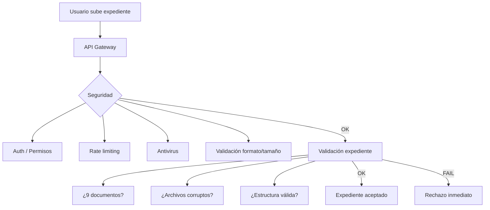

---

# 🖼️ FASE 2 — PREPROCESAMIENTO DE IMAGEN

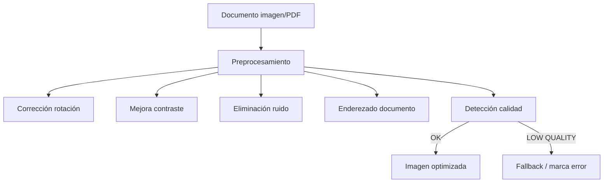

---

# 📄 FASE 3 — OCR

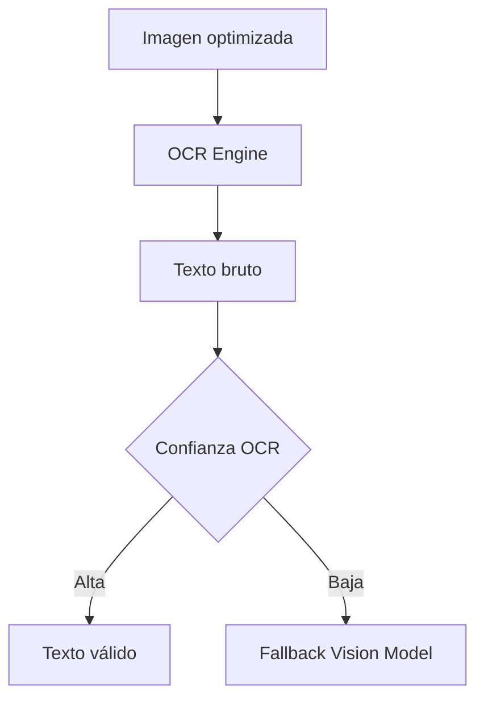

---

# 🧹 FASE 4 — NORMALIZACIÓN DE TEXTO

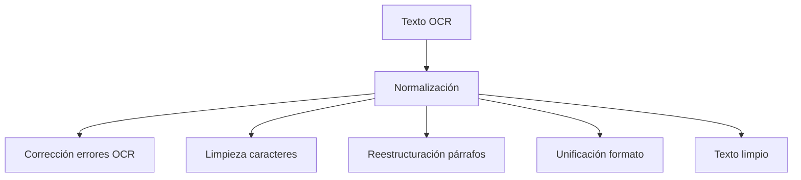

---

# 🧠 FASE 5 — ENRIQUECIMIENTO SEMÁNTICO

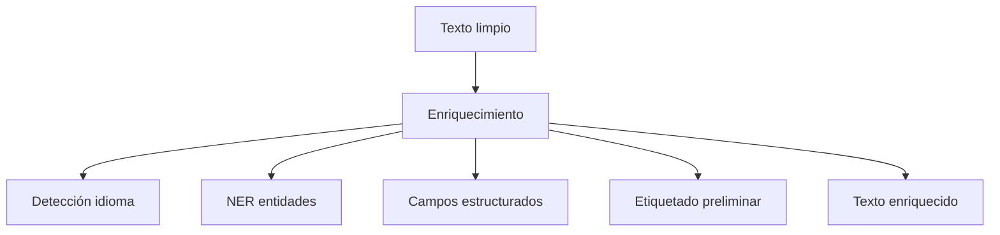

---

# 🏷️ FASE 6 — CLASIFICACIÓN DOCUMENTO

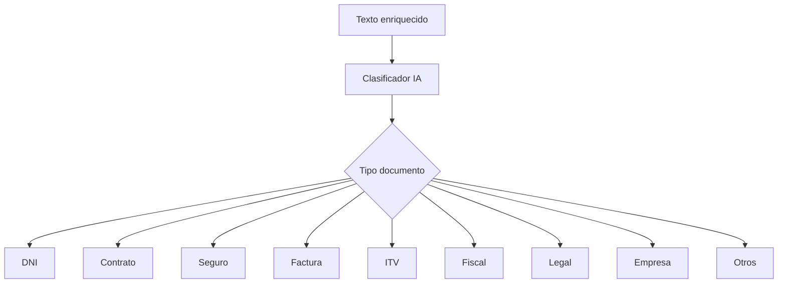

---

# 🧱 FASE 7 — PIPELINE PARALELO POR DOCUMENTO

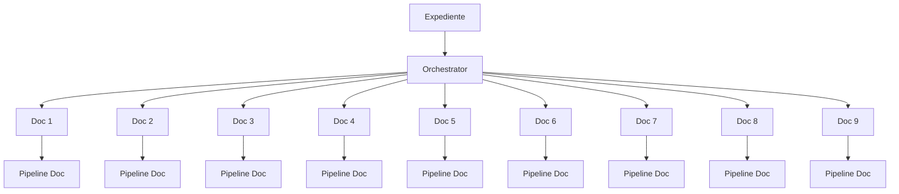

---

# 🧪 FASE 8 — EXTRACCIÓN IA

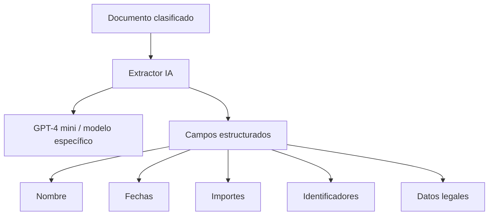

---

# 🔬 FASE 9 — VALIDACIÓN SEMÁNTICA

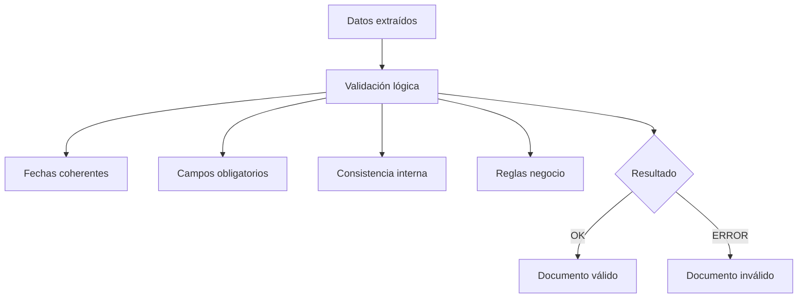

---

# ⚡ FASE 10 — REDIS TRACKING

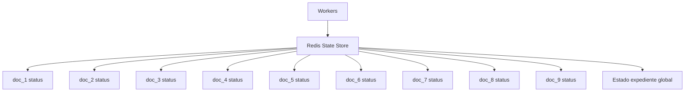

---

# 🧩 FASE 11 — AGREGACIÓN EXPEDIENTE

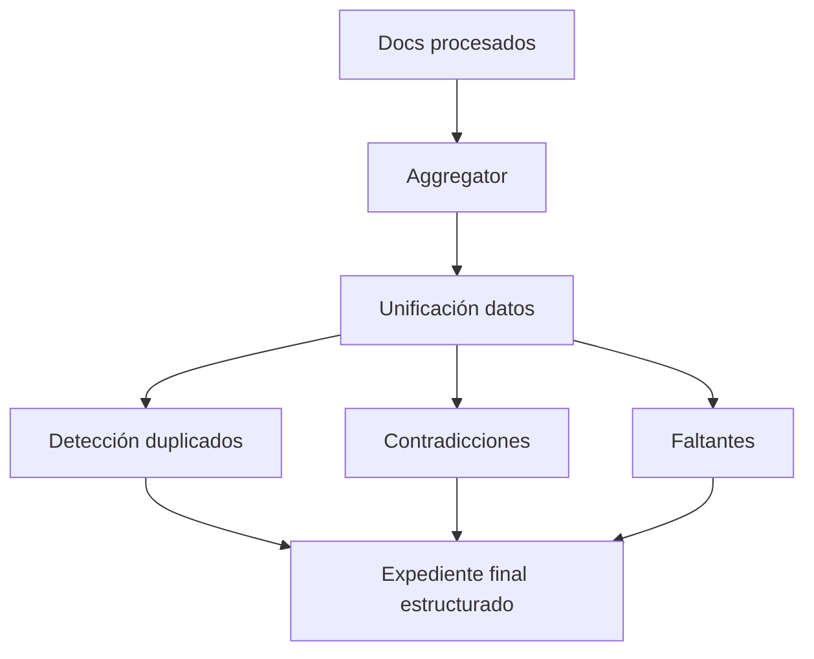

---

# 🎯 FASE 12 — SCORING CAE

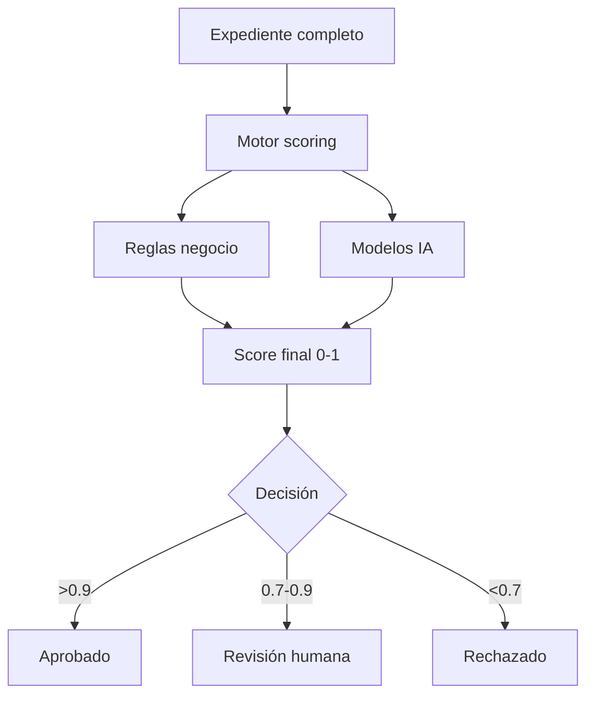

---

# 🖥️ FASE 13 — FRONTEND

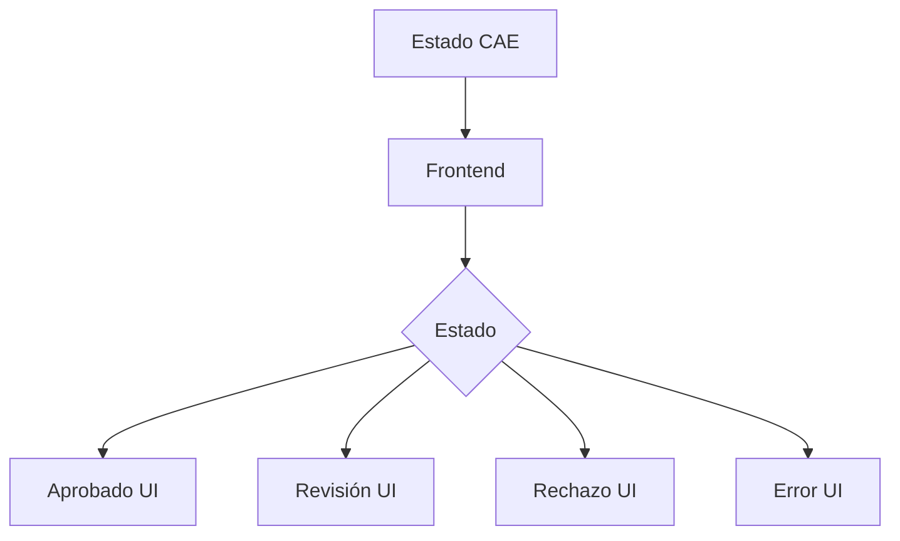

---

# 📚 FASE 14 — AUDITORÍA

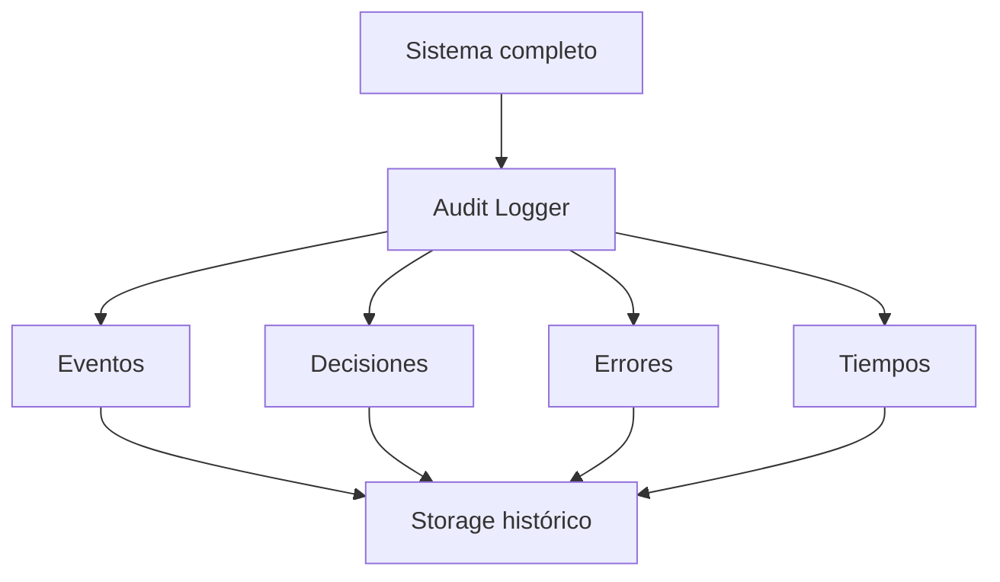

---

# 🧠 FASE 15 — DATASET

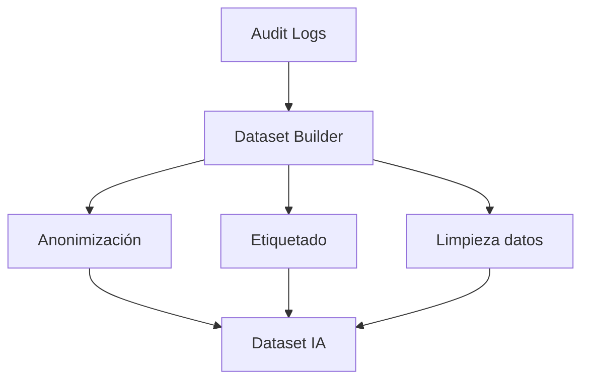

---

# ⚙️ FASE 16 — FINE TUNING

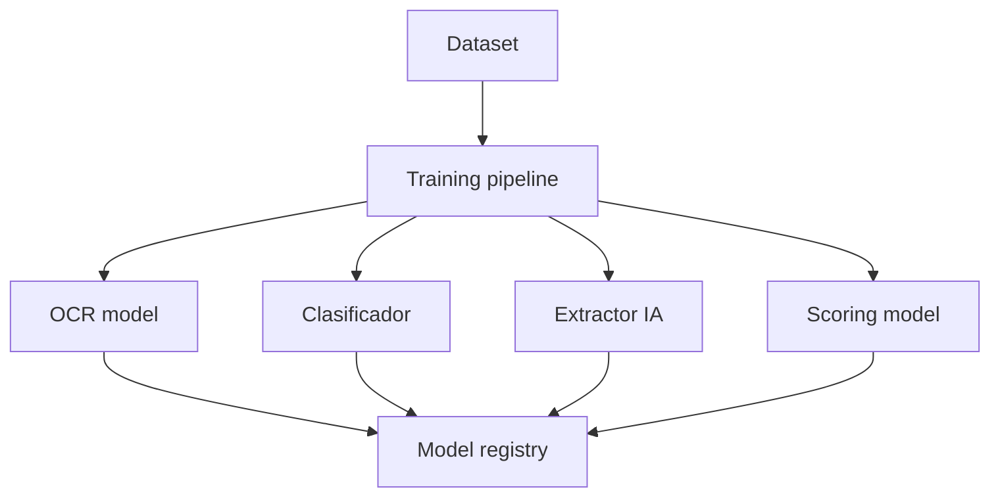

---

# 🔁 FASE 17 — RE-EJECUCIÓN

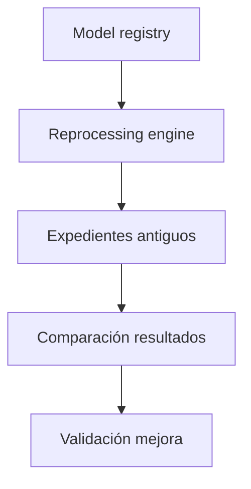

---

# 🌐 MERMAID COMPLETO (END-TO-END SISTEMA)

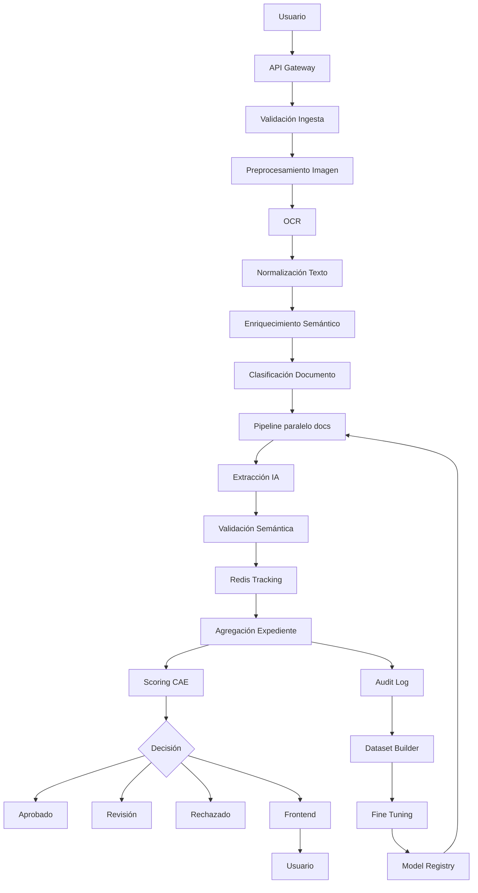

---

# 🧠 FRASE FINAL REAL

> “Este sistema no es un pipeline, es una máquina de estados distribuida con visión artificial, NLP, orquestación paralela y aprendizaje continuo”

---

Si quieres el siguiente nivel, puedo ayudarte a:

👉 convertir esto en arquitectura Azure real (con servicios exactos)
👉 diseñarlo como state machine tipo banco (Durable Functions / Temporal)
👉 o optimizarlo para coste real (muy importante en GPT-4/visión)

Solo dime.

Perfecto — aquí tienes **TODO el sistema completo en un único Mermaid**, bien estructurado, sin omitir fases (incluyendo preprocesamiento de imagen, OCR, Redis, scoring, auditoría, dataset, fine-tuning y re-ejecución).

Es un diagrama grande, pero está diseñado para que puedas verlo como **una arquitectura real end-to-end**.

---

# 🌐 🧠 MERMAID COMPLETO DEL SISTEMA (END-TO-END)

```mermaid
flowchart TD

%% =========================
%% FASE 1 - INGESTA
%% =========================

A[Usuario sube expediente (9 docs)] --> B[API Gateway]

B --> B1[Auth / Permisos]
B --> B2[Rate limiting]
B --> B3[Antivirus / malware scan]
B --> B4[Validación formato / tamaño]

B --> C{Expediente válido?}

C -->|NO| X[Rechazo inmediato]

C -->|SÍ| D[Validación estructura expediente]

D --> D1[¿9 documentos?]
D --> D2[¿Archivos corruptos?]
D --> D3[¿Estructura completa?]

D -->|FAIL| X

D -->|OK| E[Expediente aceptado]

%% =========================
%% FASE 2 - ORQUESTACIÓN
%% =========================

E --> F[Batch Orchestrator]

F --> D1W[Doc 1 Worker]
F --> D2W[Doc 2 Worker]
F --> D3W[Doc 3 Worker]
F --> D4W[Doc 4 Worker]
F --> D5W[Doc 5 Worker]
F --> D6W[Doc 6 Worker]
F --> D7W[Doc 7 Worker]
F --> D8W[Doc 8 Worker]
F --> D9W[Doc 9 Worker]

%% =========================
%% FASE 3 - PREPROCESAMIENTO IMAGEN
%% =========================

D1W --> P1[Preprocesamiento imagen]
D2W --> P2
D3W --> P3
D4W --> P4
D5W --> P5
D6W --> P6
D7W --> P7
D8W --> P8
D9W --> P9

P1 --> P1a[Rotación / alineación]
P1 --> P1b[Mejora contraste]
P1 --> P1c[Reducción ruido]

P1 --> O1
P2 --> O2
P3 --> O3
P4 --> O4
P5 --> O5
P6 --> O6
P7 --> O7
P8 --> O8
P9 --> O9

%% =========================
%% FASE 4 - OCR
%% =========================

O1[OCR] --> T1[Texto bruto]
O2[OCR] --> T2
O3[OCR] --> T3
O4[OCR] --> T4
O5[OCR] --> T5
O6[OCR] --> T6
O7[OCR] --> T7
O8[OCR] --> T8
O9[OCR] --> T9

%% fallback visión
T1 --> N1
T2 --> N2
T3 --> N3
T4 --> N4
T5 --> N5
T6 --> N6
T7 --> N7
T8 --> N8
T9 --> N9

%% =========================
%% FASE 5 - NORMALIZACIÓN + ENRIQUECIMIENTO
%% =========================

N1[Normalización + Enriquecimiento]
N2
N3
N4
N5
N6
N7
N8
N9

%% =========================
%% FASE 6 - CLASIFICACIÓN DOCUMENTO
%% =========================

N1 --> C1[Clasificador IA]
N2 --> C2
N3 --> C3
N4 --> C4
N5 --> C5
N6 --> C6
N7 --> C7
N8 --> C8
N9 --> C9

%% =========================
%% FASE 7 - EXTRACCIÓN IA
%% =========================

C1 --> E1[Extractor IA]
C2 --> E2
C3 --> E3
C4 --> E4
C5 --> E5
C6 --> E6
C7 --> E7
C8 --> E8
C9 --> E9

%% =========================
%% FASE 8 - VALIDACIÓN SEMÁNTICA
%% =========================

E1 --> V1[Validación semántica]
E2 --> V2
E3 --> V3
E4 --> V4
E5 --> V5
E6 --> V6
E7 --> V7
E8 --> V8
E9 --> V9

%% =========================
%% FASE 9 - REDIS TRACKING
%% =========================

V1 --> R[Redis State Store]
V2 --> R
V3 --> R
V4 --> R
V5 --> R
V6 --> R
V7 --> R
V8 --> R
V9 --> R

R --> R1[Estado docs + progreso expediente]

%% =========================
%% FASE 10 - AGREGACIÓN
%% =========================

R1 --> AG[Aggregator]

AG --> AG1[Unificación datos]
AG --> AG2[Detección contradicciones]
AG --> AG3[Validación global]

AG --> EXP[Expediente estructurado final]

%% =========================
%% FASE 11 - SCORING / DECISIÓN
%% =========================

EXP --> S[Motor Scoring CAE]

S --> S1[Reglas negocio]
S --> S2[Modelos IA]

S --> SCORE[Score 0-1]

SCORE --> DEC{Decisión}

DEC -->|>0.9| OK[Aprobado automático]
DEC -->|0.7-0.9| REV[Revisión humana]
DEC -->|<0.7| REJ[Rechazado]

%% =========================
%% FASE 12 - FRONTEND
%% =========================

OK --> UI[Frontend]
REV --> UI
REJ --> UI

UI --> USER[Usuario]

%% =========================
%% FASE 13 - AUDITORÍA
%% =========================

SCORE --> LOG[Audit Log]
DEC --> LOG
V1 --> LOG
E1 --> LOG

LOG --> HIST[Storage histórico]

%% =========================
%% FASE 14 - DATASET
%% =========================

HIST --> DS[Dataset Builder]

DS --> DS1[Anonimización]
DS --> DS2[Labeling humano + IA]
DS --> DS3[Limpieza]

DS1 --> FINALDS[Dataset IA]
DS2 --> FINALDS
DS3 --> FINALDS

%% =========================
%% FASE 15 - FINE TUNING
%% =========================

FINALDS --> FT[Fine Tuning Pipeline]

FT --> M1[OCR Model]
FT --> M2[Clasificador]
FT --> M3[Extractor IA]
FT --> M4[Scoring Model]

M1 --> MR[Model Registry]
M2 --> MR
M3 --> MR
M4 --> MR

%% =========================
%% FASE 16 - RE-EJECUCIÓN
%% =========================

MR --> RE[Reprocessing Engine]

RE --> OLD[Expedientes antiguos]
OLD --> COMP[Comparación resultados]
COMP --> IMP[Mejora validada]

%% =========================
%% LOOP DE MEJORA
%% =========================

MR --> F
```

---

# 🧠 FRASE FINAL (IMPORTANTE)

> “Este sistema no es un pipeline de IA, es una máquina de estados distribuida con visión artificial, NLP, orquestación paralela, trazabilidad total y aprendizaje continuo.”

---

Si quieres el siguiente nivel, puedo ayudarte a:

🔥 convertir este diagrama en arquitectura Azure real (servicios concretos)
🔥 o diseñarlo como sistema bancario con garantías ACID (Durable Functions / Temporal)
🔥 o optimizarlo para coste real (muy importante en producción con GPT + OCR)

Solo dime.
