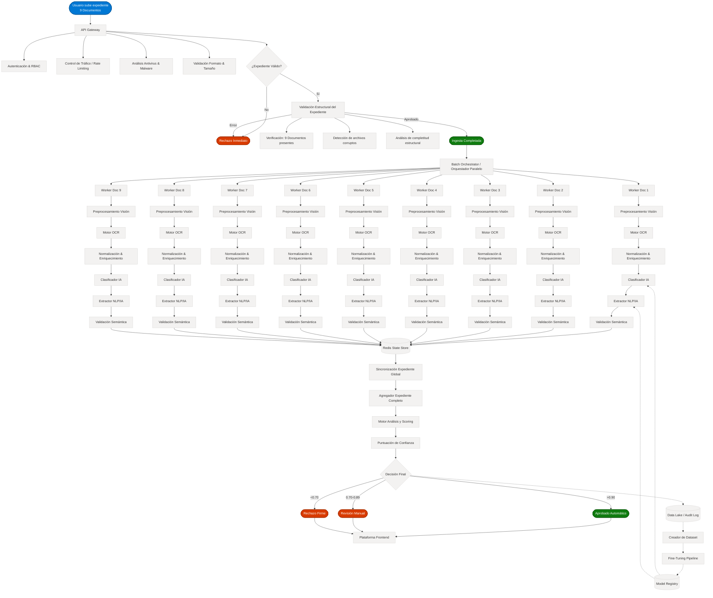

# Arquitectura Técnica End-to-End: Plataforma de Procesamiento Automatizado de Expedientes con IA

> **Principio Arquitectónico Fundamental:**  
> *"Este sistema no es una canalización de datos (pipeline) lineal simple. Constituye una **máquina de estados distribuida**, sustentada en visión artificial, procesamiento de lenguaje natural (NLP), orquestación paralela, trazabilidad completa y un ciclo constante de aprendizaje continuo."*

Este documento presenta, con riguroso detalle técnico, el diseño integral del sistema de procesamiento documental. Detalla las 17 fases críticas, garantizando seguridad, eficiencia, escalabilidad y la más alta precisión en la toma de decisiones automatizada.

---

## 🗺️ Mapa de Arquitectura Completo (End-to-End)

El siguiente modelo ilustra la totalidad del ecosistema, desde la interacción inicial del usuario hasta las etapas de entrenamiento recursivo de IA (Fine-Tuning e Inteligencia Continua).

---

## 📖 Desglose Detallado por Fases

A continuación, se describen los componentes y responsabilidades exactas de cada proceso para dotar al sistema de resiliencia y precisión.

---

### 🚪 FASE 1: Ingesta Insegura y Perimetral

Esta fase garantiza que nada ingrese a la red interna o al pipeline de análisis de costes sin haber sido autenticado e higienizado correctamente. Actúa como el portero transaccional del sistema.

**Responsabilidades Clave:**
- **Autenticación y Autorización:** Validación de tokens JWT y permisos granulares a nivel de usuario y tenant origen.
- **Defensa contra Amenazas:** Limitación de concurrencia y abusos (*Rate Limiting*), cuota de tamaño, e integraciones con escaneo preventivo antimalware in-memory.
- **Aceptación de Payload Restringido:** Verificación biométrica de extensiones permitidas, rechazando inmediatamente formatos inválidos.
- **Validación Lógica Preliminar (Térmica):** Asegura desde el borde que el requerimiento inicial consta estructuralmente de la cantidad de documentos estipulada (p. ej., 9 archivos para abrir un expediente real) previo a encender computación de alto nivel.

---

### 🖼️ FASE 2: Preprocesamiento de Visión Espacial (Fundacional)

Uno de los eslabones arquitectónicos y habilitadores críticos de rentabilidad en OCR. Una captura directa de dispositivo móvil carece del estandar óptico necesario sin una limpieza computarizada.

**Procesos Implementados (Pipeline de Imagen):**
- **Transformación Afín y Geometría:** Auto-rotación y enderezamiento de documentos con ángulo desviado.
- **Limpieza de Ruido Activo (Denoising):** Remoción paramétrica de sombras duras, aberraciones cromáticas y ruidos de fondo.
- **Binarización Inteligente y Relieves:** Exaltación exclusiva del contraste local que resalta los caracteres tipográficos perdiendo lo innecesario de imagen que degrada al OCR.
- **Control de Calidad Optima Funcional (Laplaciano):** Función perimétrica que bloquea rápidamente imágenes desenfocadas o manchadas levantando advertencias (*Early Warnings*) sin invertir procesamiento adicional fallido.

---

### 📄 FASE 3: Reconocimiento Óptico de Caracteres (OCR Engine)

El transductor que convierte el documento espacial bidimensional en elementos textuales programáticos y legibles por la lógica algorítmica.

**Flujo Estratégico:**
1. Ejecución del Core Engine de OCR primario (Tesseract Avanzado/Cloud Native Vision).
2. Cuantificación algorítmica de fiabilidad (*Confidence Index*).
3. **Mecanismo Fallback de Inteligencia Reactiva:** Cuando el nivel de certidumbre del OCR colapsa bajo un umbral métrico por daños estructurales del papel real, se transfiere automáticamente el mismo input visual a un Motor Inteligente Multimodal superior (p.ej., Modelos Visión Avanzados GPT-4o-V) a fin de extraer a fuerza cognitiva la información vital sin invalidar instantáneamente el flujo de aprobación.

---

### 🧹 FASE 4: Normalización Estructural del Texto Crudo

El vertido del flujo óptico suele llegar desorganizado. La fase de normalización preconfigura y pule la sintaxis recolectada.

**Operaciones Aplicadas:**
- Limpieza agresiva de caracteres invisibles, artefactos heredados, reconstrucción natural del encoding UTF-8.
- Reparación inferencial sobre saltos irregulares de párrafo.
- Interpolación tabular: Identificación espacial de líneas delimitadoras que insinúan la existencia de una "Tabla" (columnas clave-valor) para tabularlas sintéticamente.

---

### 🧠 FASE 5: Enriquecimiento Semántico y Desambiguación Global

El corpus lingüístico estandarizado demanda inteligencia paralela antes de su comprensión y filtrado.

**Operaciones Cognitivas Clave:**
- **Inferencia Múltiple de Reconocimiento de Entidades Nombradas (NER):** Rastreo preciso de huellas in-text: Detección formal de Personas, Corporaciones, Metadatos de Cuantía Económica, Ubicaciones precisas y Referencias Cronológicas.
- **Predetección Lingüística Autónoma:** Activación de flujos condicionales de traslación si el expediente proviene incrustado en lengua externa limitante para la base de control lógico del cliente.

---

### 🏷️ FASE 6: Clasificación Documental Estática y Enrutamiento

Antes de aplicar la inteligencia de extracción que es muy cara según el tamaño del documento, hay que clasificar su propósito para enviarlo a la subrutina correspondiente.

**Componente Decisivo:**
Clasificador de Inferencia que decide determinísticamente en qué categoría cae el input del pipeline singular basándose en el extracto semántico de la fase 5.
* Ejemplos de Enrutamiento: Nómina, DNI Pasaporte, Historial ITV, Diagnóstico Médico, Contrato o Facturas.

---

### 🧱 FASE 7: Orquestación Concurrente Distribuida (Pipeline Paralelo Documental)

Una vez ingresados los múltiples documentos de un caso o expediente, el orquestador no funciona en *serial*. 
Utiliza un modelo distributivo (*Fan-Out*), ramificando hasta en *n* micro-procesos asíncronos y paralelos.
Esta matriz arquitectónica salvaguarda los índices temporales de latencia, disminuyendo el tiempo procesal por expediente y limitando el daño. Si un anexo corrompe su procesamiento, esto no penaliza la capacidad o el tiempo de los demás.

---

### 🧪 FASE 8: Extracción Cognitiva Determinística (Modelos NLP e IA)

Cada trabajador paralelo recurre al modelo o flujo cognitivo exacto diseñado funcionalmente para la clase del documento estipulado (utilizando prompting semántico y encuadre especializado).

**Capacidades Específicas de la Clase:**
- **Contratos:** Substraer Fechas base, Renuncias, Nombres de Signatarios, Reglas de Cobertura y penalidad.
- **Fiscal y Nóminas:** Identificación paramétrica de Importe Bruto/Neto, Cuenta bancaria IBAN asociada, retenciones e identificativos corporativos.
- **DNI Oficiales:** Extracción quirúrgica de Cadenas de Texto Oficiales, Caducidad Matemática, Nacionalidad de los Partícipes.

---

### 🔬 FASE 9: Validación Semántica Contextual Fuerte

El modelo de extracción a través de inteligencia artificial (LLM) está supeditado, por su peso estocástico, a ciertas "alucinaciones lógicas". Para impedirlo, se ejecuta un motor inmutable de contrastación matemática y codificada pura.

**Restricciones Puras (Ejemplos):**
- Validaciones estándar sobre Checksums del número de identificación (NIF/NIE).
- Control Temporo-Matemático: `Fecha Vigencia` siempre debe computar obligatoriamente menor que `Fecha Límite/Caducidad`.
- Restricción de Integridad Total: Los valores categorizados como *críticos y obligatorios* deben haber sido extraídos correctamente; su ausencia o nulidad detonan automáticamente la validación al estado rojo.

---

### ⚡ FASE 10: State Store In-Memory y Trazabilidad Central (Redis)

Supervisar 9 procesos concurrentes disociados exige el uso vitalicio de un motor rápido transaccional In-Memory y tolerante a fallos para rastrear en tiempo real cómo interactúa la matriz documental interna.

**Aplicación Técnica de Redis:**
- Bitácoras sub-milisegundo.
- Proveedor directo transaccional para reportes a las interfaces (WS/Sockets/SSE - "Server Sent Events"), proporcionando barras de estados proactivas visualmente informativas de lo que sucede por debajo y no un falso indicador circular de espera.
- Semáforos de sincronización global para indicar la transición inminente a FASE 11 (Cierre Transaccional) al ser recibidos todos los hilos del *Fan-Out*.

---

### 🧩 FASE 11: Agregación Sintética Global del Expediente (Fan-In)

Cuando el State Store dicta que la ramificación paralela y transacciones del clúster de ingesta concurrente han acabado por completo, es momento de compactar las entidades resolutivas.

**Cruce Trazable de Verdad:**
- Contradicciones globales entre entidades. *Ejemplo Práctico:* Si un hilo que extraía el DNI reporta fecha expirada del usuario pero paralelamente el Contrato anexo invoca al mismo usuario y asume su fecha como vigente y fáctica; el Agregador marca esta discrepancia contextual general impensable en canales simples.
- Generación de estructura universal del expediente final consolidado listo para auditorías programáticas.

---

### 🎯 FASE 12: Motor Maestro de Decisión y Scoring Integrador (CAE Core)

Teniendo a la vista el panorama absoluto validado por la fase antecesora, la heurística definitiva entra en operación, infiriendo o determinando la evaluación analítica que sella el proceder resolutivo de toda esta plataforma.

| Categorización Analítica | Umbral Puntuación | Flujo de Resolución Determinada | Perfil de Adopción |
|:---:|:---:|:---|:---|
| 🟢 **Aceptación Firme** | **> 0.90** | Procesamiento Completo. Generación del *Acuse Recibo Positivo*. Todo avanza sin interactividad ajena. | Vía Rápida - Fast Lane - (100% Cero-Fricciones Auto) |
| 🟡 **Precaucion - Discrepancia** | **0.70 a 0.89** | Derivación preventiva. Salto y Alerta escalante automática en panel de Gestores del Equipo de Revisores Manual (Humanos). Intervención precisa sin frenar el flujo subyacente total. | Verificación Backoffice Operadores |
| 🔴 **Rechazo Concluyente** | **< 0.69** | Freno instantáneo transaccional. Expediente no superó las pruebas por falta severa de documentos, caducidades gravísimas detectadas o falsificados lógicos absolutos detectados por contraste en las fuentes | Bloqueo Cortafuego Seguro |

---

### 🖥️ FASE 13: Interfaz Cognitiva Operacional y Capa UX

Portal Frontend con una usabilidad avanzada optimizada en Reactividad para el equipo de revisión humana. Mostrará a los revisores Backoffice de forma concisa cada falla detectada que derivara a su bandeja un expediente amarillo "Revisión". Este UI incrusta la renderización in-situ visualizando la sección específica dentro de los documentos físicos, acortando su tiempo de lectura radicalmente en el trabajo manual cotidiano.

---

### 📚 FASE 14: Data Lake Institucional (Storage Forense y Cumplimiento Normativo)

Acaparación sin latencia inyectiva sobre almacenes "Cold". Todas las variables, cargas originales (payload original completo), las deducciones, iteradores y la decisión binaria total adoptada son trazadas históricamente y resguardadas perpetuamente no solo con fines operativos, sino también jurídicos frente argumentaciones ante auditorias de conformidad empresarial. 

---

### 🧠 FASE 15: Autogenerador Recurrente de Dataset (Retroalimentación al Loop)

En el marco operativo, si un gestor entra para certificar un nivel `0.8` (Ambigüedad Amarilla), y dictamina con corrección manual enmiendas o ajustes lógicos correctivos ante una extracción o decisión errática, dicha corrección —que es la métrica más valiosa para enmarcar experiencia— es succionada pasivamente y clasificada sistemáticamente como un activo al formarse los Datasets Críticos Organizacionales de Inteligencia de Mercado para este equipo.

---

### ⚙️ FASE 16: Refinamiento de Cimientos Inteligentes (Model Fine-Tuning Cíclico)

Fase clave de ingeniería real de ML. Regularmente, modelos subyacentes se alimentan de los datos recolectados y depurados sin interrupción (Fine-Tuning Loop). Esto conlleva a modelos menos ambiguos, más experimentales con tipografías reales de la corporación que optimizan exponencialmente la robustez en la [Extracción IA], [Clasificación], el [OCR] y minimizan gradualmente la necesidad global de intervenciones a humanos (Incremento KPI automatizable general).

---

### 🔁 FASE 17: Retrospectiva Analítica Operacional y Reprocesamientos Core

Una arquitectura puramente defensiva no asume la validación "Nueva=Positiva". Durante los depliegues de nuevos modelos superdotados sobre la infraestructura a través del MLOps, corre la retroalimentación procesando *en vacío a espaldas* un histórico denso de expedientes corporativos previos analizando correlaciones y garantizando firmemente contra resultados analíticos previos, que la máquina nunca presentará decaimiento porcentual general estadístico con nuevas subidas o pesos, sellando la estabilidad definitiva al sistema en producción real a alta escala.

---

> ✨ **Reflexión Estratégica Tecnológica Corporativa:**  
> Este documento demuestra palpablemente cómo el pináculo real de una solución contemporánea escalonada contra problemas analíticos englobados no recae unilateralmente sobre *"usar IA"* aisladamente. Consolidarla de facto y de forma segura corporativamente radica inquebrantablemente dentro de su ecosistema de contingencia defensivo robusto y sus capacidades modulares e interactuantes dentro de esta inmensa y segura matriz operativa diseñada enteramente para perdurar de cara a los clientes a nivel empresarial.
