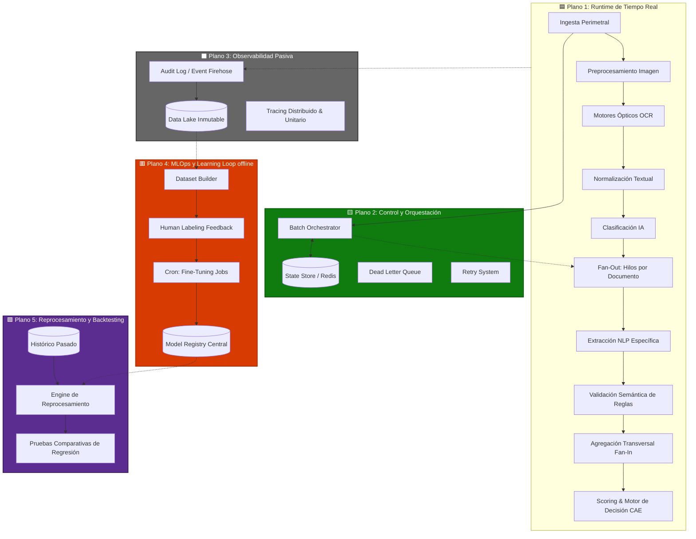

# Arquitectura de Sistema Desacoplado: Plataforma de Procesamiento Documental CAE

> **Principio Arquitectónico Fundamental:**
> _"El sistema es un runtime de procesamiento documental en tiempo real, rodeado transversalmente por sistemas asíncronos de observabilidad, control de estado distribuido y pipelines offline de aprendizaje."_

Este modelo no es una tubería (pipeline) secuencial de 17 fases. Se compone de una **Máquina de Estados de grado bancario**, regida por cinco aviones o planos arquitectónicos independientes que interactúan entre sí.

---

## 🗺️ Topología General: Planos Arquitectónicos

---

## 🏗️ Desglose Arquitectónico por Planos

El error común en diseño es pensar que el "Dataset" es una etapa posterior al "Scoring" dentro del flujo transaccional. En una arquitectura empresarial, el sistema central atiende usuarios e ingestas (Runtime), mientras que los sistemas satélites de control (estado), observabilidad y aprendizaje artificial corren **horizontal o asíncronamente**.

### 🟦 Plano 1: Runtime Activo (Tiempo Real)

Este es el componente activo. Procesa el expediente en pocos segundos y emite el resultado para ser aprobado, rechazado o marcado al backoffice humano.

1. **Ingesta Perimetral:** API Gateway con barreras de seguridad, validación estructural de ficheros requeridos.
2. **Preprocesamiento de Imagen:** Transformaciones afines, _denoising_ inteligente de las fotografías que llegan de móvil, para rentabilizar ópticamente lo que entra al OCR.
3. **OCR Engine y Fallback:** Inferencia óptica primaria. Si el _confidence score_ estructural cae por degradación o ilegibilidad manual, muta automáticamente a Modelos Multimodales robustos (ej. IA Generativa Visual).
4. **Normalización, Clasificación y Fan-Out:** El texto se normaliza (UTF8) y es clasificado por IA de Enrutamiento, disparando inmediatamente un sub-flujo lambda en formato _Fan-Out_ completamente asíncrono para que los documentos se examinen en paralelo, multiplicando la velocidad de finalización.
5. **Extracción y Validación Dual (IA + Código Estricto):** Modelos NLP operando sobre Prompts o Fine-Tuning individualizan la extracción (Contratos, Facturas). El subproducto debe, impepinablemente, encajar dentro del motor de lógica formal validando fechas (`Fecha > Hoy`), checksums (DNI lícito) y obligatoriedad.
6. **Agregación/Scoring Final (Fan-In):** Fusión de la información heterogénea verificando la cohesión transversal. Aplicación final del puntaje de aprobación (Green, Amber, Red).

### 🟨 Plano 2: Control, Estado y Orquestación

Supervisa, paralela y dota de resiliencia operativa al _plano de Runtime_, distanciándose lógicamente de los datos en sí.

- **Batch Orchestrator:** Abanica (Fan-Out) el cómputo independiente y aguarda por una respuesta agrupada final consolidada (Fan-In/Saga Pattern).
- **State Machine In-Memory (Redis):** Semáforo fundamental que resguarda el avance sub-milisegundo. Útil para proveer estado al Front-end UI y para la recuperación formal de rutinas decaídas a nivel computacional sin perder progreso.
- **Retry System y Dead Letter Queues (DLQ):** Los fracasos puramente volumétricos limitan el daño aparcando iteraciones corruptas o insalvables en colas apartadas en cuarentena sin detener o derribar al cluster primario principal empresarial.

### ⬛ Plano 3: Observabilidad Transversal (Pasivo / Fire-and-Forget)

Corre lateralmente en _background_, la transacción central del Runtime nunca falla ni espera a estas herramientas.

- **Audit Logs Integrales:** Ingieren todo evento llave de negocio en un formato _Data Lake inmutable_ alojado pasivamente en la nube.
- **Propósito Forense y Cumplimiento Analítico:** Guarda con estricta integridad _quién, cómo y basado en qué certeza óptica o IA_ fue adoptada la decisión CAE automática para el cliente o compañía auditora.

### 🟥 Plano 4: Learning Loop Evolutivo (Asíncrono y Offline)

Este bloque se ejecuta en cron-jobs asíncronos distanciados e insertos preferentemente en un flujo formal de MLOps.

- **Captación Correctiva (Feedback Backoffice):** Accede al Data Lake asíncronamente absorbiendo las resoluciones humanas aplicadas bajo el _banda ámbar de Score_. Localiza las alteraciones a la extracción fallida primaria del Runtime.
- **Dataset Builder & Fine Tuning Asíncrono:** Re-calibra los pesos estructurales, alimentando clasificadores, enriqueciendo y entregando artefactos más eficaces al _Model Registry_ una vez por semana o noche transaccional.

### 🟪 Plano 5: Engine Controlado de Reprocesamiento y Backtesting

Cuando un especialista asiente la entrega de un modelo actualizado a _Model Registry_ desde el _Learning Loop_, nunca toma el control directo del Sistema _Runtime_ a ciegas.

- **Backend de Evaluaciones de Refinamiento Silenciosas (Shadow Testing):** Cruza el nuevo artefacto contra el histórico documental pasado y confronta las estadísticas. Sólo al ratificarse una mejora genuina técnica general analítica, este transfiere su protagonismo céntrico.

---

## ☁️ Transición Misión Crítica (Grado Bancario / Aseguradora) en Azure

Esta conceptualización permite trazar un _Stack Arquitectónico_ hiperresistente de grado empresarial en topologías en nube estandarizadas.

| Plano de Dominio                      | Stack Fundamental / Patrón Recomendado (Azure Conceptos) | Justificación de Arquitectura Corporativa                                                                                                                              |
| :------------------------------------ | :------------------------------------------------------- | :--------------------------------------------------------------------------------------------------------------------------------------------------------------------- |
| **Orquestación + Máquina de Estado**  | **Azure Durable Functions (o Temporal.io)**              | Reemplaza el scripteo frágil de flujos paralelos por _Idempotency Keys_, garantizando una semántica intocable de ejecución formal _Exactly-Once_.                      |
| **Colas Lógicas de Resiliencia**      | **Azure Service Bus Standard/Premium**                   | Mecánica robusta implementando **Dead-Letter-Queues**, rutes persistentes Publish-Subscribe e hilos estancados con repetición (Retries) exponenciales.                 |
| **Runtime Asíncrono y Extracción IA** | **Azure Functions / Azure OpenAI**                       | Las APIs de visión e inserción están encapsuladas y aseguradas dentro de una topología VNET Privada (evitando la retención de datos sensibles a nivel mundial OpenAI). |
| **Almacenamiento Activo FrontEnd**    | **Azure Cache for Redis**                                | Cómputo Pub/Sub veloz disociando a la BD, acortando consultas e integrando transaccionalidad Websockets al CRM del usuario sin bloqueos.                               |
| **Data Lake en Observabilidad**       | **Azure Blob Storage / Data Lake Gen 2**                 | Tiering jerarquizado de costes de retención (Archivado perpetuo o acceso rápido). Ingestionado por un modelo analítico o _Delta Lake_ pasivamente.                     |

---

## 🛡️ Patrones de Resiliencia y Garantías de Negocio (Banking Grade)

Para que un sistema de IA sea adoptado en entornos de alta criticidad, no basta con que sea "inteligente"; debe ser **determinista en su ejecución**.

### 1. Garantías de Procesamiento "Exactly-Once"
Mediante el uso de **Idempotency Keys** (Claves de Idempotencia) generadas en la ingesta, el sistema garantiza que, ante un reintento por caída de red o timeout del modelo, el motor de orquestación no duplique costes ni genere estados inconsistentes en el expediente.

### 2. Aislamiento por "Dead Letter Queues" (DLQ)
Si un documento específico (ej. un PDF corrupto o un formato exótico) hace fallar el worker de extracción tras la política de reintentos exponenciales, este es "aparcado" en una **DLQ**. Esto permite que el resto del expediente de 9 documentos termine su flujo, notificando parcialidad al usuario en lugar de un error genérico de sistema.

### 3. Replay System (Reprocesamiento Selectivo)
Gracias al desacoplamiento del Plano de Control, es posible "re-inyectar" un solo documento fallido una vez corregido el problema técnico, sin necesidad de que el usuario vuelva a subir los otros 8 documentos válidos.

---

## 💰 Optimización Operativa y Retorno de Inversión (ROI)

El uso indiscriminado de modelos de visión y GPT-4 puede erosionar los márgenes operativos. Esta arquitectura implementa tres estrategias de ahorro:

### 1. Caching Semántico y Estructural
Si un documento (ej. una cabecera de una mutua de seguros específica) ya ha sido procesado mil veces, el sistema utiliza **vectores de similitud** en Redis para identificar que la "plantilla" es conocida. Esto permite pasar de una extracción "zero-shot" (cara) a una extracción guiada por coordenadas o incluso por caché semántico si el contenido es redundante.

### 2. Batching Inteligente de OCR
En lugar de disparar peticiones síncronas individuales, el orquestador agrupa procesos de baja prioridad en lotes (*batching*), aprovechando las tarifas de procesamiento por lotes de los proveedores cloud, reduciendo hasta un **40% el coste transaccional**.

### 3. Modelo de "Cascada de Modelos" (Model Cascade)
No todos los documentos requieren un GPT-4o.
- **Clasificador (Nivel 1):** Modelo ligero (ej. GPT-4o-mini o BERT local) para identificar el tipo de doc.
- **Extractor (Nivel 2):** Solo si la validación falla o el documento es complejo, se escala al modelo de mayor razonamiento.
- **Resultado:** Reducción drástica del gasto de tokens sin sacrificar la precisión en el 5% de casos complejos.

---

## 🎯 Conclusión Estratégica

La transición de un **Pipeline Lineal** a una **Arquitectura de Planos Desacoplados** es lo que diferencia un prototipo de IA de una infraestructura empresarial resiliente. 

Al separar el **Runtime** (la velocidad), el **Estado** (la verdad), el **Aprendizaje** (la evolución) y los **Costes** (la viabilidad), el sistema se convierte en un activo estratégico capaz de escalar a millones de documentos con garantías de cumplimiento legal y rentabilidad financiera.

---
_Documento técnico para presentación ejecutiva y de ingeniería. v2.0 - Arquitectura Desacoplada._
