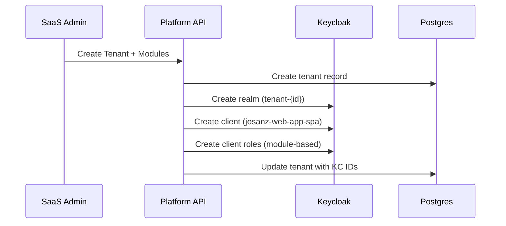

# SaaS Platform - Keycloak Integration Plan

## Overview
Multi-realm Keycloak architecture for SaaS platform administration with automatic tenant realm synchronization based on enabled modules.

## Architecture

### Keycloak Realms

```
Keycloak Instance
├── babooni-platform (SaaS Platform Realm)
│   ├── Users: platform@babooni.com (PlatformOwner/PlatformAdmin)
│   ├── Client: babooni-saas-platform (confidential)
│   └── Purpose: SaaS admin authentication
│
└── josanz-web-app-realm (Tenant Realm)
    ├── Users: admin@josanz.com (ERP users)
    ├── Client: josanz-web-app-spa
    └── Purpose: Tenant ERP user authentication
```

### Backend Services Integration

| Service | Realm | Purpose |
|---------|-------|---------|
| PlatformJwtStrategy | babooni-platform | SaaS admin authentication |
| HybridJwtStrategy | josanz-web-app-realm | Tenant ERP user authentication |
| TenantRealmSyncService | Both | Sync module permissions to tenant realms |

## Module Sync Flow: babooni-platform → josanz-web-app-realm

### Overview
When modules are enabled/disabled in the SaaS platform, the `TenantRealmSyncService` automatically updates the corresponding tenant realm in Keycloak to sync client roles and permissions.

### Flow Diagram
```
SaaS Platform UI
    ↓ (PUT /api/platform/tenants/:tenantId/modules)
TenantModulesController
    ↓
TenantModulesService.updateEnabledModuleIds()
    ↓
TenantRealmSyncService.syncTenantModules()
    ↓ (Keycloak Admin REST API)
josanz-web-app-realm client roles updated
```

### TenantRealmSyncService Implementation

```typescript
// libs/node/backend/identity/backend/src/lib/application/services/tenant-realm-sync.service.ts

@Injectable()
export class TenantRealmSyncService {
  constructor(
    private readonly prisma: PrismaService,
    private readonly http: HttpService,
    private readonly config: ConfigService,
  ) {}

  async syncTenantModules(
    tenantId: string,
    enabledModuleIds: string[],
  ): Promise<void> {
    const tenant = await this.prisma.tenant.findUnique({
      where: { id: tenantId },
      select: { keycloakRealm: true, name: true },
    });

    if (!tenant?.keycloakRealm) {
      throw new BadRequestException('Tenant has no Keycloak realm configured');
    }

    // Map module IDs to client roles
    const clientRoles = this.mapModulesToClientRoles(enabledModuleIds);

    // Update Keycloak realm client roles
    await this.updateKeycloakClientRoles(tenant.keycloakRealm, clientRoles);
  }

  private mapModulesToClientRoles(moduleIds: string[]): string[] {
    const moduleRoleMap: Record<string, string> = {
      inventory: 'inventory.view',
      rentals: 'rentals.view',
      projects: 'projects.view',
      fleet: 'fleet.view',
      clients: 'clients.view',
      products: 'products.view',
      // ... more mappings
    };

    return moduleIds
      .map((id) => moduleRoleMap[id])
      .filter((role): role is string => !!role);
  }

  private async updateKeycloakClientRoles(
    realm: string,
    roles: string[],
  ): Promise<void> {
    const kcAdminUrl = this.config.get<string>('KEYCLOAK_ADMIN_URL');
    const kcAdminToken = await this.getAdminToken();

    // Get existing client
    const clients = await this.http.axiosRef.get(
      `${kcAdminUrl}/admin/realms/${realm}/clients?clientId=josanz-web-app-spa`,
      { headers: { Authorization: `Bearer ${kcAdminToken}` } },
    );

    const clientId = clients.data[0]?.id;
    if (!clientId) {
      throw new Error('Client not found in Keycloak');
    }

    // Create or update client roles for enabled modules
    await this.http.axiosRef.post(
      `${kcAdminUrl}/admin/realms/${realm}/clients/${clientId}/roles`,
      roles.map((name) => ({ name, description: `Module: ${name}` })),
      { headers: { Authorization: `Bearer ${kcAdminToken}` } },
    );
  }
}
```

## Updated Tenant-Modules Controller Flow

### Enhanced tenant-modules.controller.ts

```typescript
// libs/node/backend/identity/backend/src/lib/presentation/controllers/platform-tenants.controller.ts

@Controller('platform/tenants')
@UseGuards(JwtAuthGuard, PlatformGuard)
export class PlatformTenantsController {
  constructor(
    private readonly tenantModulesService: TenantModulesService,
    private readonly tenantRealmSyncService: TenantRealmSyncService,
    private readonly cls: ClsService<PlatformContext>,
  ) {}
  

  @Put(':tenantId/modules')
  async updateTenantModules(
    @Param('tenantId') tenantId: string,
    @Body() body: UpdateTenantModulesDto,
  ) {
    // 1. Update modules in database
    const result = await this.tenantModulesService.updateEnabledModuleIds(
      tenantId,
      body,
    );

    // 2. Sync changes to Keycloak tenant realm
    await this.tenantRealmSyncService.syncTenantModules(
      tenantId,
      result.enabledModuleIds,
    );

    return result;
  }
}
```

### Integration with Identity Module

```typescript
// libs/node/backend/identity/backend/src/lib/identity.module.ts

@Module({
  imports: [SharedInfrastructureModule],
  providers: [
    TenantModulesService,
    TenantModulesNotifierService,
    TenantRealmSyncService,
    PlatformTenantsController,
  ],
  exports: [TenantModulesService, TenantRealmSyncService],
})
export class IdentityModule {}
```

## Tenant Realm Management

### Tenant-Kc Realm Mapping Table

```prisma
// Tenant model extension
model Tenant {
  id            String    @id @default(uuid())
  name          String
  enabledModuleIds String[]
  keycloakRealm String?   // Points to KC realm name
  keycloakClientId String? // Points to KC client ID
}
```

### Realm Creation Workflow



## Testing Scenarios

### Unit Tests

| Test File | Scenario |
|-----------|----------|
| `tenant-realm-sync.service.spec.ts` | Module to role mapping |
| `tenant-realm-sync.service.spec.ts` | Keycloak API error handling |
| `platform-tenants.controller.spec.ts` | Module update with sync |
| `hybrid-jwt.strategy.spec.ts` | Platform realm token validation |

### E2E Tests

```typescript
// test/scenarios/module-sync.e2e-spec.ts

describe('Module Sync to Keycloak', () => {
  it('creates client roles when modules enabled', async () => {
    const tenantId = await createTestTenant();
    
    await request(app.getHttpServer())
      .put(`/api/platform/tenants/${tenantId}/modules`)
      .send({ enabledModuleIds: ['inventory', 'rentals'] })
      .expect(200);

    // Verify Keycloak client roles
    const kcRoles = await getKeycloakClientRoles('test-tenant-realm');
    expect(kcRoles).toContain('inventory.view');
    expect(kcRoles).toContain('rentals.view');
  });

  it('removes client roles when modules disabled', async () => {
    const tenantId = await createTestTenant();
    
    // First enable modules
    await request(app.getHttpServer())
      .put(`/api/platform/tenants/${tenantId}/modules`)
      .send({ enabledModuleIds: ['inventory', 'rentals'] });

    // Then disable one
    await request(app.getHttpServer())
      .put(`/api/platform/tenants/${tenantId}/modules`)
      .send({ enabledModuleIds: ['inventory'] })
      .expect(200);

    const kcRoles = await getKeycloakClientRoles('test-tenant-realm');
    expect(kcRoles).toContain('inventory.view');
    expect(kcRoles).not.toContain('rentals.view');
  });
});
```

### Integration Test Checklist

- [ ] SaaS admin can login via `babooni-platform` realm
- [ ] Module changes trigger Keycloak sync
- [ ] Tenant realm client roles reflect enabled modules
- [ ] Users in tenant realm receive correct module permissions
- [ ] Platform admin cannot modify modules they don't own
- [ ] SuperAdmin can override module restrictions

## File References

| Component | File |
|-----------|------|
| TenantRealmSyncService | `libs/node/backend/identity/backend/src/lib/application/services/tenant-realm-sync.service.ts` |
| TenantRealmSyncModule | `libs/node/backend/identity/backend/src/lib/tenant-realm-sync.module.ts` |
| PlatformTenantsController | `libs/node/backend/identity/backend/src/lib/presentation/controllers/platform-tenants.controller.ts` |
| PlatformGuard | `libs/node/backend/identity/backend/src/lib/infrastructure/auth/platform.guard.ts` |
| Platform JwtStrategy | `libs/node/backend/identity/backend/src/lib/infrastructure/auth/platform-jwt.strategy.ts` |
| Keycloak Realm (babooni-platform) | `docker/keycloak/realms/babooni-platform-realm.json` |
| Keycloak Realm (tenant template) | `docker/keycloak/realms/tenant-template.json` |

## Implementation Phases

### Phase 1: Keycloak Configuration
- [ ] Create `babooni-platform` realm JSON
- [ ] Add `platform@babooni.com` user with PlatformOwner role
- [ ] Configure `babooni-saas-platform` confidential client

### Phase 2: Backend Services
- [ ] Implement `TenantRealmSyncService`
- [ ] Create `PlatformJwtStrategy` for babooni-platform realm
- [ ] Update `PlatformTenantsController` with sync logic

### Phase 3: Frontend Integration
- [ ] Update SaaS platform login to use babooni-platform realm
- [ ] Add module management UI for platform admins

### Phase 4: Testing
- [ ] Unit tests for module-role mapping
- [ ] E2E tests for sync flow
- [ ] Manual verification in docker-compose