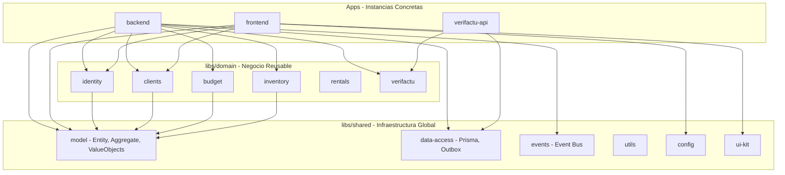

# Plan de Mejoras para Modularidad y Reutilización

## Análisis de la Arquitectura Actual

### Estructura Actual

```
josanz-erp/
├── apps/
│   ├── backend/           # NestJS ERP principal
│   ├── frontend/          # Angular frontend
│   ├── verifactu-api/     # API específica de factura electrónica
│   └── frontend-e2e/
└── libs/
    ├── billing/           # ⚠️ Solo configuración
    ├── budget/            # libs parciales (data-access, feature, shell)
    ├── clients/           # libs completas (api, core, data-access, feature, shell)
    ├── delivery/          # ⚠️ Vacío
    ├── fleet/             # ⚠️ Vacío
    ├── identity/          # ⚠️ Sin libs (código en apps)
    ├── inventory/         # libs parciales (api, feature, shell)
    ├── rentals/           # libs parciales (api, core, data-access, feature, shell)
    ├── shared/            # Solo model y ui-kit
    └── verifactu/          # libs completas (adapters, api, core, data-access, feature, legacy)
```

### Problemas Identificados

#### 1. **Infraestructura Duplicada en Apps**
- [`PrismaService`](apps/backend/src/shared/infrastructure/prisma/prisma.service.ts) debería estar en una lib
- [`OutboxService`](apps/backend/src/shared/infrastructure/outbox/outbox.service.ts) es reusable
- [`EmailPort`](apps/backend/src/shared/infrastructure/email/email.port.ts) debería ser un puerto reutilizable

#### 2. **Módulos en Apps que Deberían Estar en Libs**
- [`IdentityModule`](apps/backend/src/modules/identity/identity.module.ts) - lógica de auth no está reusable
- [`BudgetModule`](apps/backend/src/modules/budget/budget.module.ts) - lógica en apps
- [`ClientsModule`](apps/backend/src/modules/clients/clients.module.ts) - lógica en apps
- [`InventoryModule`](apps/backend/src/modules/inventory/inventory.module.ts) - lógica en apps

#### 3. **Verifactu: Código Duplicado y Legado**
- [`verifactu/legacy/`](libs/verifactu/legacy/) - código antiguo que debería migrarse o eliminarse
- [`apps/verifactu-api/`](apps/verifactu-api/) - lógica que podría estar en libs
- [`apps/backend/src/modules/billing/`](apps/backend/src/modules/billing/) - usa libs de verifactu

#### 4. **Dominio Compartido Incompleto**
- [`EntityId`](libs/shared/model/src/lib/entity-id.ts) existe pero no se usa consistentemente
- [`AggregateRoot`](libs/shared/model/src/lib/aggregate-root.ts) existe pero no hay eventos de dominio
- Falta: Value Objects, Events, errores comunes

#### 5. **Librerías Faltantes**
- `shared/utils` - funciones utilitarias
- `shared/types` - tipos globales
- `shared/config` - configuración centralizada

---

## Plan de Migración y Mejoras

### Fase 1: Extraer Infraestructura Compartida

#### 1.1 Crear `libs/shared/data-access`
Extraer servicios de acceso a datos que son comunes.

```
libs/shared/data-access/
├── src/
│   ├── prisma/
│   │   ├── prisma.service.ts      # Mover desde apps/backend
│   │   ├── prisma.module.ts
│   │   └── prisma-client.factory.ts
│   └── outbox/
│       ├── outbox.service.ts       # Mover desde apps/backend
│       └── outbox.module.ts
└── project.json
```

**Acciones:**
- [ ] Crear `libs/shared/data-access`
- [ ] Mover [`PrismaService`](apps/backend/src/shared/infrastructure/prisma/prisma.service.ts) y [`PrismaModule`](apps/backend/src/shared/infrastructure/prisma/prisma.module.ts)
- [ ] Mover [`OutboxService`](apps/backend/src/shared/infrastructure/outbox/outbox.service.ts)
- [ ] Actualizar imports en apps/backend
- [ ] Exportar desde [`libs/shared/data-access/src/index.ts`](libs/shared/model/src/index.ts)

#### 1.2 Crear `libs/shared/events`
Sistema de eventos de dominio reusable.

```
libs/shared/events/
├── src/
│   ├── interfaces/
│   │   ├── domain-event.interface.ts
│   │   └── event-handler.interface.ts
│   ├── services/
│   │   ├── event-bus.service.ts
│   │   └── event-store.service.ts
│   └── index.ts
└── project.json
```

**Acciones:**
- [ ] Crear `libs/shared/events`
- [ ] Implementar Event Bus simple
- [ ] Integrar con AggregateRoot existente

---

### Fase 2: Completar Dominio Compartido

#### 2.1 Expandir `libs/shared/model`

```
libs/shared/model/src/
├── entity/
│   ├── entity.ts                  # Base entity con ID
│   ├── entity-id.ts               # Ya existe - mejorar uso
│   └── aggregate-root.ts          # Ya existe - mejorar uso
├── value-objects/
│   ├── money.vo.ts
│   ├── email.vo.ts
│   └── date-range.vo.ts
├── errors/
│   ├── domain-error.ts
│   └── validation-error.ts
└── index.ts
```

**Acciones:**
- [ ] Crear [`libs/shared/model/src/lib/entity/entity.ts`](libs/shared/model/src/lib/entity-id.ts)
- [ ] Crear value objects reutilizables
- [ ] Crear errores base
- [ ] Actualizar entidades existentes para usar EntityId

#### 2.2 Mover Puertos de Dominio a Libs

```
libs/shared/core/
├── ports/
│   ├── repository.port.ts
│   ├── unit-of-work.port.ts
│   └── cache.port.ts
└── index.ts
```

**Acciones:**
- [ ] Crear `libs/shared/core`
- [ ] Definir [`RepositoryPort`](libs/clients/core/src/lib/domain/ports/clients.repository.port.ts) genérico
- [ ] Mover puertos existentes desde dominios específicos

---

### Fase 3: Completar Librerías de Dominio

#### 3.1 Completar `libs/identity`

```
libs/identity/
├── core/                          # PUERTOS y servicios de dominio
│   ├── ports/
│   │   ├── user.repository.port.ts
│   │   └── auth.service.port.ts
│   ├── services/
│   │   └── password-hash.service.ts
│   └── entities/
│       └── user.entity.ts
├── application/                   # Casos de uso
│   ├── use-cases/
│   │   ├── login.use-case.ts
│   │   └── register-user.use-case.ts
│   └── dtos/
│       ├── login.dto.ts
│       └── create-user.dto.ts
├── data-access/                   # Implementaciones de repositorio
│   └── prisma/
│       └── prisma-user.repository.ts
└── shell/                         # Componentes UI si aplica
```

**Acciones:**
- [ ] Crear estructura completa de `libs/identity`
- [ ] Mover lógica desde [`apps/backend/src/modules/identity/`](apps/backend/src/modules/identity/)
- [ ] Crear [`IdentityModule`](apps/backend/src/modules/identity/identity.module.ts) wrapper que use las libs

#### 3.2 Completar `libs/budget`, `libs/clients`, `libs/inventory`

Seguir el patrón de identity para completar las libs existentes:

**Acciones:**
- [ ] Completar `libs/budget` con estructura full-stack
- [ ] Completar `libs/clients` - ya tiene buen avance
- [ ] Completar `libs/inventory` con estructura full-stack

#### 3.3 Crear `libs/delivery` y `libs/fleet`

```bash
# Generar libs vacías
npx nx g @nx/angular:library delivery/core --directory=libs/delivery/core
npx nx g @nx/angular:library delivery/data-access --directory=libs/delivery/data-access
npx nx g @nx/angular:library fleet/core --directory=libs/fleet/core
npx nx g @nx/angular:library fleet/data-access --directory=libs/fleet/data-access
```

---

### Fase 4: Utilities y Configuración

#### 4.1 Crear `libs/shared/utils`

```
libs/shared/utils/
├── src/
│   ├── crypto/
│   │   ├── uuid.ts
│   │   └── hash.ts
│   ├── date/
│   │   ├── date-utils.ts
│   │   └── date-formatter.ts
│   ├── string/
│   │   └── string-utils.ts
│   ├── validation/
│   │   └── validators.ts
│   └── index.ts
└── project.json
```

**Acciones:**
- [ ] Crear `libs/shared/utils`
- [ ] Mover lógica de [`EntityId`](libs/shared/model/src/lib/entity-id.ts) (crypto.randomUUID)
- [ ] Agregar utilidades comunes

#### 4.2 Crear `libs/shared/config`

```
libs/shared/config/
├── src/
│   ├── environments/
│   │   └── environment.ts
│   ├── validators/
│   │   └── env.validator.ts
│   └── index.ts
└── project.json
```

**Acciones:**
- [ ] Crear `libs/shared/config`
- [ ] Centralizar validación de variables de entorno

---

### Fase 5: Limpieza de Verifactu

#### 5.1 Eliminar o Migrar `verifactu/legacy`

**Acciones:**
- [ ] Revisar [`MIGRATION_STATUS.md`](libs/verifactu/legacy/MIGRATION_STATUS.md)
- [ ] Migrar código remaining a libs/verifactu
- [ ] Eliminar directorio legacy una vez migrado

#### 5.2 Consolidar `apps/verifactu-api`

La app verifactu-api podría usar más las libs:

**Acciones:**
- [ ] Refactorizar para importar desde `libs/verifactu/*`
- [ ] Eliminar lógica duplicada

---

### Fase 6: Organización de APIs HTTP

#### 6.1 Crear `libs/shared/api-client`

Pattern para consumir APIs externas:

```
libs/shared/api-client/
├── src/
│   ├── base/
│   │   ├── api-client.base.ts
│   │   └── api-client.config.ts
│   ├── interceptors/
│   │   ├── error.interceptor.ts
│   │   └── auth.interceptor.ts
│   └── index.ts
└── project.json
```

**Acciones:**
- [ ] Crear `libs/shared/api-client`
- [ ] Implementar cliente base reutilizable

#### 6.2 Mover Controllers a Estructura Consistente

**Acciones:**
- [ ] Estandarizar estructura de controllers en apps
- [ ] Mantener controllers en apps (no en libs) ya que son específicos de cada app

---

## Diagrama de Arquitectura Objetivo



---

## Recomendaciones de Naming

| Tipo | Prefijo | Ejemplo |
|------|---------|---------|
| Libs Core | `@josanz-erp/{domain}-core` | `@josanz-erp/identity-core` |
| Libs Data Access | `@josanz-erp/{domain}-data-access` | `@josanz-erp/clients-data-access` |
| Libs Feature | `@josanz-erp/{domain}-feature` | `@josanz-erp/inventory-feature` |
| Libs API | `@josanz-erp/{domain}-api` | `@josanz-erp/rentals-api` |
| Shared | `@josanz-erp/shared-{type}` | `@josanz-erp/shared-model` |

---

## Próximos Pasos Inmediatos

1. **Crear** `libs/shared/data-access` y mover PrismaService
2. **Completar** `libs/shared/model` con más entidades base
3. **Iniciar** estructura de `libs/identity/core`
4. **Revisar** y eliminar código duplicado en verifactu

---

*Documento creado en modo Architect*
*Fecha: 2026-03-27*
